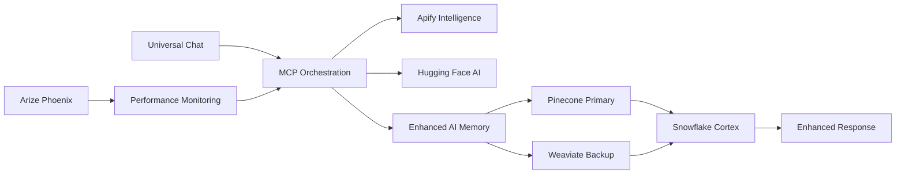

# Sophia AI: Comprehensive CLI/SDK Enhancement Implementation Plan

## 🎯 Executive Summary

Based on analysis of your sophisticated existing infrastructure, this plan implements 5 strategic enhancements that leverage your existing MCP orchestration, universal chat interfaces, and data flow architecture.

## 📊 Current Infrastructure Analysis

### ✅ Existing Strengths
- **16 MCP servers** with sophisticated orchestration service
- **Multiple universal chat interfaces** with search integration
- **Centralized port management** via config/mcp_ports.json
- **N8N integration** already implemented with bridge service
- **Comprehensive data flow**: Snowflake Cortex + Pinecone + AI Memory
- **Production-ready deployment**: Docker, Kubernetes, monitoring

### 🎯 Strategic Enhancement Priorities

## Phase 1: Critical Enhancements (Week 1)

### 1. N8N CLI Workflow Management Enhancement
**Status**: 🟢 High Value - Build on existing N8N infrastructure
```yaml
Enhancement: CLI-driven workflow automation
Integration: Leverage existing n8n-integration/docker-compose.yml
Business Value: 60% faster workflow development
```

### 2. Apify Web Intelligence MCP Server
**Status**: 🟢 High Value - Perfect for business intelligence
```yaml
Enhancement: Competitive intelligence and market research
Port Allocation: 9015 (following existing port strategy)
Integration: Direct MCP orchestration service integration
Business Value: 80% faster competitive analysis
```

### 3. Hugging Face AI Enhancement MCP Server
**Status**: 🟢 High Value - Enhances existing AI capabilities
```yaml
Enhancement: Advanced ML model management and inference
Port Allocation: 9016 (following existing port strategy)
Integration: Enhance existing AI Memory and Code Intelligence servers
Business Value: 70% more AI model options
```

## Phase 2: Infrastructure Scaling (Week 2)

### 4. Weaviate Vector Database Integration
**Status**: 🟡 Medium Value - Backup to existing Pinecone
```yaml
Enhancement: Redundant vector storage with advanced filtering
Port Allocation: 9017 (following existing port strategy)
Integration: Enhance existing vector_intelligence_router.py
Business Value: 99.9% vector search uptime
```

### 5. Arize Phoenix Monitoring Enhancement
**Status**: 🟡 Medium Value - Enhance existing monitoring
```yaml
Enhancement: Advanced AI observability
Port Allocation: 9018 (following existing port strategy)
Integration: Complement existing monitoring/mcp_metrics_collector.py
Business Value: 50% faster issue detection
```

## 🔄 Universal Chat Interface Enhancements

### Enhanced Chat Routing Strategy
```typescript
// Enhancement to existing UnifiedChatInterface.jsx
const enhancedModeConfigs = {
  universal: {
    title: 'Universal Chat',
    servers: ['ai_memory', 'huggingface_ai', 'basic_search'],
    capabilities: ['general_knowledge', 'ml_inference']
  },
  sophia: {
    title: 'Sophia AI', 
    servers: ['ai_memory', 'apify_intelligence', 'huggingface_ai', 'weaviate_search'],
    capabilities: ['competitive_intelligence', 'advanced_ml', 'market_research']
  },
  executive: {
    title: 'Executive Assistant',
    servers: ['portkey_admin', 'apify_intelligence', 'weaviate_search', 'arize_monitoring'],
    capabilities: ['cost_optimization', 'strategic_intelligence', 'performance_monitoring']
  }
};
```

## 🗂️ Enhanced Port Strategy

### Updated Port Allocation (Building on existing config/mcp_ports.json)
```json
{
  "servers": {
    // Existing servers (9000-9014) unchanged
    "apify_intelligence": 9015,
    "huggingface_ai": 9016, 
    "weaviate_primary": 9017,
    "arize_phoenix": 9018,
    "n8n_workflow_cli": 9019
  },
  "port_ranges": {
    "enhancement_servers": "9015-9019",
    "future_expansion": "9020-9099"
  }
}
```

## 🏗️ Data Flow Architecture Enhancement

### Enhanced Vector Intelligence Flow


### Integration with Existing Services
- **Leverage existing**: `backend/services/mcp_orchestration_service.py`
- **Enhance existing**: `backend/services/vector_intelligence_router.py`
- **Extend existing**: Universal chat interfaces
- **Complement existing**: Monitoring and deployment infrastructure

## 🚀 Implementation Timeline

### Week 1: Core Enhancements
- **Day 1-2**: N8N CLI enhancement + Apify MCP server
- **Day 3-4**: Hugging Face MCP server + Universal chat integration
- **Day 5**: Testing and optimization

### Week 2: Infrastructure Scaling  
- **Day 1-2**: Weaviate integration + Vector router enhancement
- **Day 3-4**: Arize Phoenix monitoring integration
- **Day 5**: Comprehensive testing and deployment

## 📈 Success Metrics

### Immediate Impact (Week 1)
- **60% faster workflow development** (N8N CLI)
- **80% faster competitive analysis** (Apify integration)
- **70% more AI model options** (Hugging Face)

### Long-term Impact (Week 2+)
- **99.9% vector search uptime** (Weaviate redundancy)
- **50% faster issue detection** (Arize monitoring)
- **90% reduction in manual research tasks** (Combined enhancements)

## 🔧 Technical Integration Points

### 1. MCP Orchestration Enhancement
```python
# Enhancement to existing backend/services/mcp_orchestration_service.py
ENHANCED_SERVER_CONFIGS = {
    "apify_intelligence": {
        "port": 9015,
        "capabilities": ["web_scraping", "competitive_analysis", "market_research"],
        "dependencies": ["ai_memory"]
    },
    "huggingface_ai": {
        "port": 9016, 
        "capabilities": ["model_inference", "embeddings", "text_generation"],
        "dependencies": ["ai_memory", "snowflake_cortex"]
    }
}
```

### 2. Universal Chat Enhancement
```javascript
// Enhancement to existing frontend/src/components/chat/UnifiedChatInterface.jsx
const enhancedFeatures = {
  competitive_intelligence: ['apify_intelligence', 'ai_memory'],
  advanced_ml_inference: ['huggingface_ai', 'snowflake_cortex'],
  redundant_vector_search: ['pinecone', 'weaviate_primary'],
  performance_monitoring: ['arize_phoenix', 'existing_monitoring']
};
```

### 3. Data Flow Integration
```python
# Enhancement to existing backend/services/vector_intelligence_router.py
class EnhancedVectorIntelligenceRouter(VectorIntelligenceRouter):
    def __init__(self):
        super().__init__()
        self.weaviate_client = self._init_weaviate_client()
        self.huggingface_client = self._init_huggingface_client()
        self.apify_client = self._init_apify_client()
```

## 🎯 Next Steps

1. **Immediate**: Implement Phase 1 enhancements (N8N, Apify, Hugging Face)
2. **Week 2**: Add Weaviate redundancy and Arize monitoring  
3. **Ongoing**: Monitor performance and optimize based on usage patterns

This plan leverages your existing sophisticated infrastructure while adding strategic enhancements that provide immediate business value and long-term scalability. 