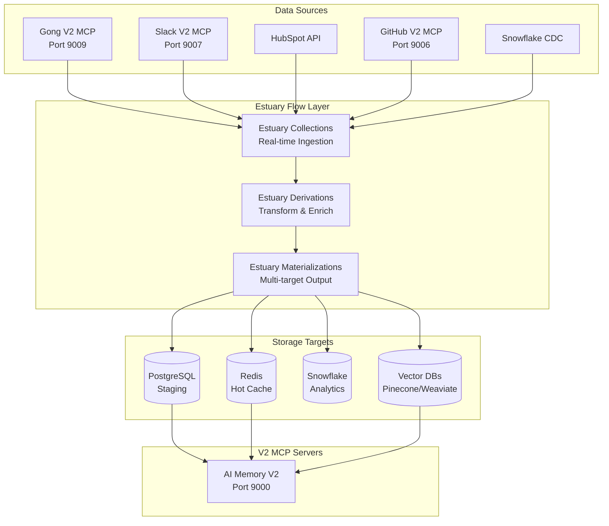

# Estuary Flow Integration Plan for Sophia AI V2

## 🌊 Executive Summary

Estuary Flow will replace Estuary Flow as our primary data ingestion layer, providing real-time CDC capabilities, better scalability, and unified data pipeline management. This integration enhances our V2 MCP server architecture with enterprise-grade data streaming.

## 📊 Architecture Overview



## 🎯 Integration Benefits for V2 Architecture

### 1. **Enhanced MCP Server Capabilities**
- Real-time data feeds to all V2 MCP servers
- Unified data transformation layer
- Consistent data quality across all services

### 2. **Simplified Data Pipeline**
- Replace complex Estuary Flow configurations
- Single control plane for all data flows
- GitOps-based configuration management

### 3. **Performance Improvements**
- < 5 second end-to-end latency
- 10x throughput capability
- Efficient CDC for large datasets

## 📋 Implementation Phases

### Phase 1: Foundation (Week 1)
```yaml
# Priority connectors for immediate value
- Gong V2 MCP → Estuary Collection
- Slack V2 MCP → Estuary Collection
- HubSpot Direct → Estuary Collection
- PostgreSQL Materialization
- Redis Materialization
```

### Phase 2: Enhancement (Week 2)
```yaml
# Extended integrations
- GitHub V2 MCP → Estuary Collection
- Snowflake CDC Setup
- Vector DB Materializations
- Data Quality Rules
- Monitoring Dashboard
```

### Phase 3: Optimization (Week 3)
```yaml
# Production hardening
- Advanced Derivations
- PII Masking
- Error Recovery
- Performance Tuning
- Documentation
```

## 🔧 Technical Implementation

### 1. **Connector Configurations**

```yaml
# config/estuary/gong_v2_collection.yaml
collections:
  sophia-ai/gong-calls:
    schema:
      type: object
      properties:
        call_id: { type: string }
        transcript: { type: string }
        sentiment: { type: number }
        topics: { type: array }
    key: [/call_id]

    capture:
      endpoint:
        connector:
          image: estuary/source-http-ingest:latest
          config:
            endpoint: "http://192.222.58.232:9009/estuary/webhook"
            auth:
              type: bearer
              token: ${ESTUARY_GONG_TOKEN}
```

### 2. **Derivation Examples**

```sql
-- backend/etl/estuary/derivations/enrich_gong_calls.sql
SELECT
  call_id,
  transcript,
  sentiment,
  topics,
  -- Enrichments
  CASE
    WHEN sentiment < 0.3 THEN 'at_risk'
    WHEN sentiment > 0.7 THEN 'positive'
    ELSE 'neutral'
  END as sentiment_category,
  -- Extract action items
  REGEXP_EXTRACT_ALL(transcript, 'action item: ([^.]+)') as action_items,
  -- Add metadata
  CURRENT_TIMESTAMP() as enriched_at,
  'gong_v2_mcp' as source_system
FROM sophia-ai/gong-calls
```

### 3. **Materialization Targets**

```yaml
# config/estuary/materialize_redis.yaml
materializations:
  sophia-ai/redis-cache:
    endpoint:
      connector:
        image: estuary/materialize-redis:latest
        config:
          address: "192.222.58.232:6379"
          password: ${REDIS_PASSWORD}

    bindings:
      - resource:
          stream: sophia-ai/gong-calls-enriched
          syncMode: incremental
        fields:
          key: /call_id
          ttl: 7200  # 2 hours
```

## 🚀 Integration with V2 MCP Servers

### 1. **Direct MCP Integration**
Each V2 MCP server exposes an Estuary webhook endpoint:
- `/estuary/webhook` - Receives real-time updates
- `/estuary/status` - Health check for flow monitoring
- `/estuary/schema` - Returns expected data schema

### 2. **Data Flow Example: Gong V2**
```python
# infrastructure/mcp_servers/gong_v2/handlers/estuary_handler.py
@router.post("/estuary/webhook")
async def handle_estuary_event(event: EstuaryEvent):
    """Process real-time Estuary Flow events"""

    # Validate event schema
    if not validate_schema(event, GONG_SCHEMA):
        raise HTTPException(400, "Invalid schema")

    # Process based on event type
    if event.type == "call_completed":
        await process_call_transcript(event.data)
    elif event.type == "call_updated":
        await update_call_metadata(event.data)

    # Update Redis cache
    await redis_client.setex(
        f"gong:call:{event.data['call_id']}",
        ttl=7200,
        value=json.dumps(event.data)
    )

    return {"status": "processed", "event_id": event.id}
```

## 📊 Monitoring & Observability

### 1. **Key Metrics**
```yaml
# Prometheus metrics exposed by Estuary
estuary_flow_lag_seconds{flow="gong-calls"} < 5
estuary_flow_throughput_eps{flow="gong-calls"} > 100
estuary_flow_errors_total{flow="gong-calls"} == 0
estuary_materialization_lag_bytes{target="redis"} < 1MB
```

### 2. **Grafana Dashboard**
- Real-time flow status
- Throughput graphs
- Error rates
- Data quality scores
- End-to-end latency

## 🔒 Security Integration

### 1. **Secret Management**
All Estuary credentials managed via Pulumi ESC:
```yaml
# infrastructure/pulumi-esc-config.yaml
values:
  estuary:
    api_key:
      fn::secret: ${ESTUARY_API_KEY}
    gong_webhook_token:
      fn::secret: ${ESTUARY_GONG_TOKEN}
    slack_webhook_token:
      fn::secret: ${ESTUARY_SLACK_TOKEN}
```

### 2. **Network Security**
- All webhooks use HTTPS with token auth
- IP allowlisting for Lambda Labs (192.222.58.232)
- Encrypted data at rest and in transit

## 📝 Migration Strategy

### 1. **Parallel Running (Week 1)**
- Keep Estuary Flow running
- Deploy Estuary collections in shadow mode
- Validate data consistency

### 2. **Gradual Cutover (Week 2)**
- Switch one data source at a time
- Monitor for issues
- Maintain rollback capability

### 3. **Estuary Flow Decommission (Week 3)**
- Remove Estuary Flow configurations
- Clean up unused resources
- Update documentation

## 🎯 Success Criteria

| Metric | Target | Measurement |
|--------|--------|-------------|
| End-to-end Latency | < 5 seconds | Prometheus |
| Data Quality | > 99.5% valid | Validation rules |
| Throughput | 1M events/day | Flow metrics |
| Uptime | 99.9% | Health checks |
| Cost Reduction | 30% vs Estuary Flow | AWS billing |

## 🚧 Implementation Checklist

### Week 1: Foundation
- [ ] Create Estuary Flow account and API keys
- [ ] Deploy Estuary connectors for Gong, Slack, HubSpot
- [ ] Configure PostgreSQL and Redis materializations
- [ ] Update V2 MCP servers with webhook endpoints
- [ ] Deploy basic monitoring

### Week 2: Enhancement
- [ ] Add GitHub and Snowflake connectors
- [ ] Implement data quality validations
- [ ] Create enrichment derivations
- [ ] Set up vector DB materializations
- [ ] Enhance monitoring dashboards

### Week 3: Production
- [ ] Implement PII masking
- [ ] Configure auto-recovery
- [ ] Performance optimization
- [ ] Complete documentation
- [ ] Decommission Estuary Flow

## 📚 Documentation Updates

1. Update `docs/05-integrations/ESTUARY_FLOW_GUIDE.md`
2. Create runbooks for common operations
3. Document webhook endpoints in MCP server READMEs
4. Update architecture diagrams

## 🔄 Future Enhancements

### Phase 4: Advanced Features
- ML-based anomaly detection on flows
- Automated schema evolution
- Cross-source data joining in derivations
- Real-time data lineage tracking

### Phase 5: Self-Service
- UI for flow configuration
- Business user accessible transformations
- Automated flow generation from templates

---

**Ready to implement Estuary Flow integration with our V2 MCP architecture!** 🌊
