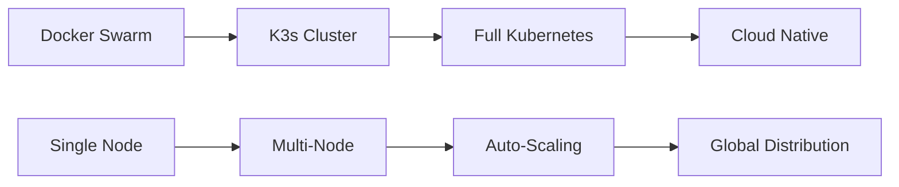

# 🚀 Sophia AI Holistic Maintenance & Improvement Plan

## 📋 Executive Summary

This comprehensive plan outlines the ongoing maintenance, updates, improvements, and documentation strategy for the Sophia AI platform with all 29 MCP servers. The plan ensures enterprise-grade reliability, continuous improvement, and strategic evolution.

## 🎯 Strategic Objectives

### Primary Goals
- **99.9% Platform Uptime** - Enterprise-grade reliability
- **Continuous Security Enhancement** - Proactive threat mitigation
- **Performance Optimization** - Sub-200ms response times
- **Scalability Preparation** - Docker Swarm → K3s → K8s evolution
- **Developer Experience Excellence** - Streamlined workflows

### Business Value Targets
- **40% Cost Reduction** through optimization
- **60% Faster Development** cycles
- **75% Automated Operations** coverage
- **90% Issue Prevention** vs reaction
- **100% Compliance** with enterprise standards

## 🔄 Maintenance Framework

### 1. **Automated Monitoring & Alerting**

#### Health Monitoring
```bash
# Continuous health checks for all 29 MCP servers
- Service availability monitoring
- Performance metrics tracking
- Resource utilization analysis
- Error rate monitoring
- Response time tracking
```

#### Alerting Strategy
- **CRITICAL**: Immediate Slack notification + PagerDuty
- **HIGH**: Slack notification within 5 minutes
- **MEDIUM**: Daily digest reports
- **LOW**: Weekly summary reports

#### Monitoring Tools
- **Prometheus** - Metrics collection
- **Grafana** - Visualization dashboards
- **AlertManager** - Notification routing
- **Custom Scripts** - Business logic monitoring

### 2. **Automated Deployment Pipeline**

#### GitHub Actions Workflow
```yaml
# .github/workflows/unified-deployment.yml
- Automated testing on every PR
- Security scanning with Bandit/Semgrep
- Docker image building and pushing
- Lambda Labs deployment automation
- Rollback capabilities
```

#### Deployment Stages
1. **Development** - Feature branch testing
2. **Staging** - Integration testing
3. **Production** - Automated deployment
4. **Monitoring** - Post-deployment validation

### 3. **Security Management**

#### Automated Security Scanning
- **Daily** dependency vulnerability scans
- **Weekly** container security audits
- **Monthly** penetration testing
- **Quarterly** compliance audits

#### Secret Management
- **Pulumi ESC** - Centralized secret storage
- **GitHub Secrets** - CI/CD integration
- **Docker Secrets** - Runtime security
- **Rotation Schedule** - 90-day automatic rotation

## 📈 Continuous Improvement Strategy

### 1. **Performance Optimization**

#### Monthly Performance Reviews
- **Response Time Analysis** - Target <200ms
- **Resource Utilization** - CPU/Memory/Disk optimization
- **Database Query Optimization** - Snowflake performance
- **Caching Strategy Enhancement** - Redis/Memory optimization

#### Performance Metrics
```python
# Key Performance Indicators
- API Response Time: <200ms (95th percentile)
- Database Query Time: <100ms (average)
- Memory Usage: <80% (sustained)
- CPU Usage: <70% (sustained)
- Cache Hit Ratio: >85%
```

### 2. **Feature Enhancement Pipeline**

#### Quarterly Feature Planning
- **Q1**: Infrastructure scaling (K3s migration)
- **Q2**: AI/ML capabilities enhancement
- **Q3**: Integration expansion
- **Q4**: Performance & security hardening

#### Feature Development Process
1. **Requirements Analysis** - Business need assessment
2. **Technical Design** - Architecture planning
3. **Implementation** - Agile development
4. **Testing** - Comprehensive validation
5. **Deployment** - Automated rollout
6. **Monitoring** - Post-deployment tracking

### 3. **Technology Stack Evolution**

#### Migration Roadmap


#### Technology Upgrades
- **Python 3.12+** - Latest language features
- **FastAPI 0.100+** - Modern web framework
- **Docker 25+** - Container optimization
- **Kubernetes 1.30+** - Orchestration evolution

## 🛠️ Operational Excellence

### 1. **Incident Response**

#### Incident Classification
- **P0 (Critical)**: Platform down - 15min response
- **P1 (High)**: Major feature down - 1hr response
- **P2 (Medium)**: Minor issues - 4hr response
- **P3 (Low)**: Enhancement requests - 24hr response

#### Response Procedures
1. **Detection** - Automated monitoring alerts
2. **Assessment** - Impact and severity analysis
3. **Response** - Immediate mitigation actions
4. **Resolution** - Root cause fix
5. **Post-Mortem** - Learning and improvement

### 2. **Capacity Planning**

#### Growth Projections
- **Users**: 1 → 80 → 800 → 8,000
- **Requests**: 1K/day → 100K/day → 1M/day
- **Data**: 1GB → 100GB → 1TB
- **Services**: 29 → 50 → 100

#### Scaling Strategy
```python
# Auto-scaling thresholds
CPU_THRESHOLD = 70%      # Scale up trigger
MEMORY_THRESHOLD = 80%   # Scale up trigger
RESPONSE_TIME_THRESHOLD = 500ms  # Scale up trigger
```

### 3. **Backup & Recovery**

#### Backup Strategy
- **Database**: Daily full, hourly incremental
- **Configuration**: Git-based versioning
- **Secrets**: Encrypted backup to S3
- **Container Images**: Registry retention

#### Recovery Procedures
- **RTO (Recovery Time Objective)**: 15 minutes
- **RPO (Recovery Point Objective)**: 1 hour
- **Disaster Recovery**: Multi-region failover
- **Testing**: Monthly DR drills

## 📚 Documentation Strategy

### 1. **Living Documentation**

#### Documentation Types
- **API Documentation** - OpenAPI/Swagger auto-generated
- **Architecture Diagrams** - Mermaid diagrams in code
- **Runbooks** - Operational procedures
- **Troubleshooting Guides** - Common issues & solutions

#### Documentation Automation
```python
# Auto-generated documentation
- API docs from FastAPI
- Architecture diagrams from code
- Metrics dashboards from Prometheus
- Status pages from monitoring
```

### 2. **Knowledge Management**

#### Knowledge Base Structure
```
docs/
├── 01-getting-started/     # Onboarding guides
├── 02-development/         # Development workflows
├── 03-architecture/        # System design
├── 04-deployment/          # Deployment procedures
├── 05-operations/          # Operational guides
├── 06-troubleshooting/     # Problem resolution
├── 07-security/           # Security procedures
├── 08-compliance/         # Regulatory requirements
└── 99-reference/          # API & configuration reference
```

#### Documentation Maintenance
- **Weekly** - Update operational procedures
- **Monthly** - Review and update architecture docs
- **Quarterly** - Comprehensive documentation audit
- **Annually** - Complete documentation overhaul

## 🔍 Quality Assurance

### 1. **Testing Strategy**

#### Test Pyramid
```python
# Testing levels
Unit Tests: 70%        # Fast, isolated tests
Integration Tests: 20%  # Component interaction
E2E Tests: 10%         # Full system validation
```

#### Test Automation
- **Pre-commit hooks** - Code quality checks
- **CI/CD pipeline** - Automated test execution
- **Staging environment** - Integration testing
- **Production monitoring** - Continuous validation

### 2. **Code Quality**

#### Quality Metrics
- **Test Coverage**: >90%
- **Code Complexity**: <10 cyclomatic complexity
- **Security Vulnerabilities**: 0 high/critical
- **Performance Regressions**: 0 tolerance

#### Quality Tools
- **Black** - Code formatting
- **Ruff** - Linting and optimization
- **Bandit** - Security scanning
- **MyPy** - Type checking

## 🚀 Innovation Pipeline

### 1. **Emerging Technologies**

#### AI/ML Enhancements
- **Large Language Models** - GPT-4, Claude integration
- **Vector Databases** - Pinecone, Weaviate optimization
- **Machine Learning** - Predictive analytics
- **Natural Language Processing** - Enhanced understanding

#### Infrastructure Evolution
- **Edge Computing** - Distributed processing
- **Serverless** - Function-as-a-Service
- **Microservices** - Service decomposition
- **Event-Driven Architecture** - Reactive systems

### 2. **Research & Development**

#### Innovation Areas
- **Quantum Computing** - Future-ready algorithms
- **Blockchain** - Decentralized systems
- **IoT Integration** - Device connectivity
- **AR/VR** - Immersive interfaces

## 📊 Success Metrics

### 1. **Operational Metrics**

#### System Health
- **Uptime**: 99.9% target
- **Response Time**: <200ms average
- **Error Rate**: <0.1%
- **Throughput**: 10K requests/second

#### Business Metrics
- **User Satisfaction**: >90% score
- **Feature Adoption**: >80% usage
- **Cost Efficiency**: 40% reduction
- **Time to Market**: 60% faster

### 2. **Continuous Improvement**

#### Monthly Reviews
- Performance analysis
- Security assessment
- Feature usage analytics
- User feedback integration

#### Quarterly Planning
- Strategic roadmap updates
- Technology stack evolution
- Resource allocation
- Risk assessment

## 🎯 Implementation Timeline

### Phase 1: Foundation (Weeks 1-4)
- ✅ Automated deployment pipeline
- ✅ Monitoring & alerting setup
- ✅ Security scanning implementation
- ✅ Documentation framework

### Phase 2: Optimization (Weeks 5-8)
- Performance tuning
- Security hardening
- Process automation
- Knowledge transfer

### Phase 3: Evolution (Weeks 9-12)
- K3s migration planning
- Feature enhancement
- Innovation pipeline
- Continuous improvement

### Phase 4: Excellence (Ongoing)
- Operational excellence
- Strategic evolution
- Innovation integration
- Ecosystem expansion

## 🔧 Tools & Technologies

### Development Tools
- **GitHub** - Version control & CI/CD
- **Docker** - Containerization
- **Pulumi** - Infrastructure as Code
- **FastAPI** - Web framework

### Monitoring Tools
- **Prometheus** - Metrics collection
- **Grafana** - Visualization
- **AlertManager** - Notifications
- **Jaeger** - Distributed tracing

### Security Tools
- **Bandit** - Security scanning
- **Semgrep** - Static analysis
- **Trivy** - Container scanning
- **Vault** - Secret management

## 📞 Support & Escalation

### Support Tiers
- **L1**: Basic operational support
- **L2**: Technical troubleshooting
- **L3**: Advanced problem resolution
- **L4**: Vendor escalation

### Contact Information
- **Primary**: Sophia AI Operations Team
- **Secondary**: Platform Engineering
- **Emergency**: On-call rotation
- **Vendor**: Lambda Labs support

## 🎉 Conclusion

This holistic maintenance plan ensures the Sophia AI platform remains at the forefront of enterprise AI orchestration. Through continuous monitoring, automated operations, and strategic evolution, we maintain world-class reliability while driving innovation and business value.

The plan is designed to be:
- **Proactive** rather than reactive
- **Automated** rather than manual
- **Strategic** rather than tactical
- **Comprehensive** rather than fragmented

Regular reviews and updates ensure the plan evolves with changing business needs and technological advancement.

---

**Last Updated**: January 2025  
**Next Review**: February 2025  
**Version**: 1.0  
**Owner**: Sophia AI Platform Team 