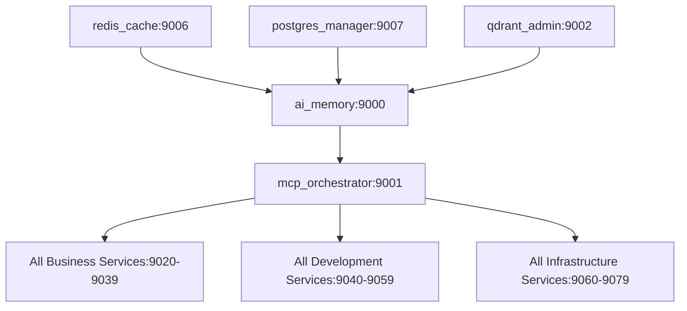

# 🚀 MCP COMPREHENSIVE PORT STRATEGY
**Strategic Port Allocation for Sophia AI MCP Server Ecosystem**

## 📋 CURRENT STATE ANALYSIS

### **Critical Port Conflicts Identified:**
- **ai_memory**: Registry shows 9000, Kubernetes shows 9001 ❌
- **Inconsistent Assignments**: Same server assigned different ports across files
- **No Logical Grouping**: Core services mixed with optional services
- **Range Overlaps**: Production and development ranges conflict
- **Hardcoded Ports**: Many servers ignore central registry

---

## 🎯 **STRATEGIC PORT ARCHITECTURE**

### **Design Principles:**
1. **Logical Service Grouping** - Related services in adjacent port ranges
2. **Tier-Based Allocation** - Core services get priority ranges
3. **Environment Separation** - Clear production vs development boundaries
4. **Scalability Planning** - Room for growth within each category
5. **Kubernetes Integration** - Consistent with K8s service discovery

---

## 🏗️ **UNIFIED PORT ALLOCATION STRATEGY**

### **TIER 1: CORE AI SERVICES (9000-9019)**
**Mission-Critical Services - Always Running**

| Service | Port | Purpose | Replicas | GPU |
|---------|------|---------|----------|-----|
| **ai_memory** | 9000 | Core AI memory & vector storage | 3 | ✅ |
| **mcp_orchestrator** | 9001 | Central MCP routing & load balancing | 2 | ❌ |
| **qdrant_admin** | 9002 | Vector database management | 2 | ❌ |
| **lambda_inference** | 9003 | GPU inference endpoint | 2 | ✅ |
| **unified_chat** | 9004 | Primary chat interface | 3 | ❌ |
| **portkey_gateway** | 9005 | LLM routing & optimization | 2 | ❌ |
| **redis_cache** | 9006 | High-speed caching layer | 2 | ❌ |
| **postgres_manager** | 9007 | Database operations | 2 | ❌ |
| *Reserved* | 9008-9019 | Future core services | - | - |

### **TIER 2: BUSINESS INTELLIGENCE (9020-9039)**
**Business-Focused MCP Servers**

| Service | Port | Purpose | Replicas | GPU |
|---------|------|---------|----------|-----|
| **hubspot** | 9020 | CRM data & customer insights | 2 | ❌ |
| **gong** | 9021 | Sales call analysis & coaching | 2 | ✅ |
| **slack** | 9022 | Team communication intelligence | 2 | ❌ |
| **linear** | 9023 | Project management & tracking | 1 | ❌ |
| **asana** | 9024 | Task & workflow management | 1 | ❌ |
| **notion** | 9025 | Knowledge base & documentation | 1 | ❌ |
| **payready_intel** | 9026 | Company-specific intelligence | 2 | ✅ |
| **competitor_analysis** | 9027 | Market intelligence & monitoring | 1 | ✅ |
| *Reserved* | 9028-9039 | Future business services | - | - |

### **TIER 3: DEVELOPMENT TOOLS (9040-9059)**
**Development & Code Quality Services**

| Service | Port | Purpose | Replicas | GPU |
|---------|------|---------|----------|-----|
| **github** | 9040 | Code repository management | 1 | ❌ |
| **codacy** | 9041 | Code quality & security analysis | 1 | ❌ |
| **figma** | 9042 | Design system integration | 1 | ❌ |
| **ui_ux_agent** | 9043 | UI/UX design assistance | 1 | ✅ |
| **v0dev** | 9044 | AI-powered component generation | 1 | ✅ |
| **prisma** | 9045 | Database schema management | 1 | ❌ |
| **openrouter_search** | 9046 | AI model discovery & comparison | 1 | ❌ |
| *Reserved* | 9047-9059 | Future development tools | - | - |

### **TIER 4: INFRASTRUCTURE (9060-9079)**
**Cloud & Infrastructure Management**

| Service | Port | Purpose | Replicas | GPU |
|---------|------|---------|----------|-----|
| **lambda_labs_cli** | 9060 | GPU instance management | 1 | ❌ |
| **estuary_flow** | 9061 | Data pipeline orchestration | 1 | ❌ |
| **pulumi** | 9062 | Infrastructure as code | 1 | ❌ |
| **docker_manager** | 9063 | Container orchestration | 1 | ❌ |
| **kubernetes_ops** | 9064 | K8s cluster operations | 1 | ❌ |
| **monitoring** | 9065 | System health & metrics | 1 | ❌ |
| **security_scanner** | 9066 | Security vulnerability scanning | 1 | ❌ |
| *Reserved* | 9067-9079 | Future infrastructure services | - | - |

### **TIER 5: EXPERIMENTAL (9080-9099)**
**Development & Testing Services**

| Service | Port | Purpose | Replicas | GPU |
|---------|------|---------|----------|-----|
| **experimental_ai** | 9080 | AI model testing & validation | 1 | ✅ |
| **data_science** | 9081 | Analytics & data exploration | 1 | ✅ |
| **integration_testing** | 9082 | MCP server integration tests | 1 | ❌ |
| **performance_testing** | 9083 | Load testing & benchmarking | 1 | ❌ |
| **prototype_server** | 9084 | Feature prototyping | 1 | ❌ |
| *Reserved* | 9085-9099 | Future experimental services | - | - |

---

## 🌟 **ENVIRONMENT-SPECIFIC ALLOCATION**

### **Production Environment (Primary)**
- **Range**: 9000-9099
- **High Availability**: 2-3 replicas for critical services
- **GPU Priority**: Core AI services get GPU allocation preference
- **LoadBalancer**: Round-robin across replicas

### **Staging Environment**
- **Range**: 9100-9199 (Production + 100)
- **Reduced Replicas**: 1-2 replicas for testing
- **GPU Sharing**: Limited GPU allocation for cost optimization
- **Mirror Production**: Same service layout for accurate testing

### **Development Environment**
- **Range**: 9200-9299 (Production + 200)
- **Single Replicas**: 1 replica per service
- **Local GPU**: Development on local machines when possible
- **Rapid Iteration**: Quick deployment for feature development

### **Integration Testing**
- **Range**: 9300-9399 (Production + 300)
- **Ephemeral**: Services created/destroyed per test run
- **Isolated**: No external dependencies
- **Automated**: CI/CD pipeline controlled

---

## 🔧 **KUBERNETES CONFIGURATION STRATEGY**

### **Service Discovery Pattern**
```yaml
# Standard MCP Service Template
apiVersion: v1
kind: Service
metadata:
  name: ${SERVICE_NAME}-mcp
  namespace: mcp-servers
  labels:
    tier: ${TIER}  # core, business, development, infrastructure
    gpu-required: ${GPU_BOOL}
    priority: ${PRIORITY}  # high, medium, low
spec:
  selector:
    app: ${SERVICE_NAME}-mcp
  ports:
  - port: ${PORT}
    targetPort: ${PORT}
    name: mcp-protocol
  - port: ${PORT + 100}  # Health check port
    targetPort: ${PORT + 100}
    name: health-metrics
  type: ClusterIP
```

### **Port Range Management**
```yaml
# ConfigMap for Port Registry
apiVersion: v1
kind: ConfigMap
metadata:
  name: mcp-port-registry
  namespace: mcp-servers
data:
  production_range: "9000-9099"
  staging_range: "9100-9199"
  development_range: "9200-9299"
  testing_range: "9300-9399"
  # Tier allocations
  core_ai_range: "9000-9019"
  business_intel_range: "9020-9039"
  development_tools_range: "9040-9059"
  infrastructure_range: "9060-9079"
  experimental_range: "9080-9099"
```

---

## 📊 **SERVICE DEPENDENCIES & STARTUP ORDER**

### **Dependency Hierarchy**


### **Startup Sequence**
1. **Phase 1 (Infrastructure)**: redis_cache, postgres_manager, qdrant_admin
2. **Phase 2 (Core AI)**: ai_memory, lambda_inference
3. **Phase 3 (Orchestration)**: mcp_orchestrator, portkey_gateway
4. **Phase 4 (Business Services)**: hubspot, gong, slack, linear, etc.
5. **Phase 5 (Development Tools)**: github, codacy, figma, etc.

---

## 🛡️ **SECURITY & NETWORK POLICIES**

### **NetworkPolicy Strategy**
```yaml
# Tier-based network isolation
apiVersion: networking.k8s.io/v1
kind: NetworkPolicy
metadata:
  name: mcp-tier-isolation
  namespace: mcp-servers
spec:
  podSelector:
    matchLabels:
      tier: core
  policyTypes:
  - Ingress
  - Egress
  ingress:
  - from:
    - podSelector:
        matchLabels:
          tier: business
    - podSelector:
        matchLabels:
          tier: development
  egress:
  - to:
    - podSelector:
        matchLabels:
          tier: core
```

### **Port Security Rules**
- **Internal Only**: All MCP ports (9000-9399) are ClusterIP only
- **No External Exposure**: MCP services never use LoadBalancer or NodePort
- **Gateway Pattern**: Only mcp_orchestrator (9001) accepts external traffic via ingress
- **Health Monitoring**: Health check ports (+100 offset) for Prometheus scraping

---

## ⚡ **PERFORMANCE OPTIMIZATION**

### **Load Balancing Strategy**
```yaml
# HorizontalPodAutoscaler for Core Services
apiVersion: autoscaling/v2
kind: HorizontalPodAutoscaler
metadata:
  name: ai-memory-hpa
  namespace: mcp-servers
spec:
  scaleTargetRef:
    apiVersion: apps/v1
    kind: Deployment
    name: ai-memory-mcp
  minReplicas: 2
  maxReplicas: 5
  metrics:
  - type: Resource
    resource:
      name: cpu
      target:
        type: Utilization
        averageUtilization: 70
  - type: Resource
    resource:
      name: memory
      target:
        type: Utilization
        averageUtilization: 80
```

### **GPU Resource Allocation**
- **High Priority**: ai_memory, lambda_inference, gong, payready_intel
- **Medium Priority**: ui_ux_agent, v0dev, competitor_analysis
- **Low Priority**: experimental_ai, data_science
- **No GPU**: All infrastructure and integration services

---

## 🎯 **IMPLEMENTATION ROADMAP**

### **Phase 1: Port Standardization (2 hours)**
1. Update `config/unified_mcp_port_registry.json` with new allocation
2. Fix all Kubernetes manifests to use consistent ports
3. Update all MCP server configurations
4. Validate no port conflicts exist

### **Phase 2: Service Reorganization (3 hours)**
1. Group services by tier in Kubernetes namespaces
2. Implement dependency-aware startup ordering
3. Add service discovery via DNS
4. Test inter-service communication

### **Phase 3: Environment Separation (2 hours)**
1. Create staging environment with +100 port offset
2. Implement development environment with +200 offset
3. Configure CI/CD for environment-specific deployments
4. Validate environment isolation

### **Phase 4: Monitoring & Observability (2 hours)**
1. Deploy Prometheus ServiceMonitors for each tier
2. Create Grafana dashboards per service tier
3. Implement health check endpoints (+100 port offset)
4. Setup alerting for service failures

### **Phase 5: Security Hardening (1 hour)**
1. Implement NetworkPolicies for tier isolation
2. Configure service mesh (Istio) for advanced traffic management
3. Add mutual TLS between services
4. Implement rate limiting and circuit breakers

---

## 📝 **CONFIGURATION UPDATES REQUIRED**

### **Files to Update:**
```bash
# Primary configuration
config/unified_mcp_port_registry.json

# Kubernetes manifests
k8s/mcp-servers/*.yaml
k8s/base/configmap.yaml
k8s/overlays/production/kustomization.yaml

# Application configurations
backend/core/service_configs.py
infrastructure/services/mcp_orchestration_service.py
scripts/start_all_mcp_servers.py

# Docker configurations
docker-compose.lambda.yml
Dockerfile.mcp-base
```

### **Environment Variables:**
```bash
# Standard MCP environment variables
MCP_PORT=${SERVICE_PORT}
MCP_HEALTH_PORT=${SERVICE_PORT + 100}
MCP_TIER=${SERVICE_TIER}
MCP_GPU_ENABLED=${GPU_REQUIREMENT}
MCP_PRIORITY=${SERVICE_PRIORITY}
```

---

## 🏆 **SUCCESS METRICS**

### **Technical Validation:**
- [ ] Zero port conflicts across all environments
- [ ] All services discoverable via DNS
- [ ] Health checks responding on +100 offset ports
- [ ] Prometheus metrics collected from all services
- [ ] GPU resources properly allocated to AI services
- [ ] Network policies enforcing tier isolation

### **Operational Validation:**
- [ ] Services start in correct dependency order
- [ ] Load balancing working across replicas
- [ ] Autoscaling responding to resource pressure
- [ ] Failover working when services are unhealthy
- [ ] Rolling updates with zero downtime
- [ ] Environment promotion (dev → staging → prod) working

### **Performance Targets:**
- **Service Discovery**: < 10ms DNS resolution
- **Inter-Service Communication**: < 50ms P95 latency
- **Health Check Response**: < 100ms response time
- **Service Startup**: < 30 seconds to ready state
- **Resource Utilization**: > 70% CPU, < 80% memory

---

## 🚀 **DEPLOYMENT COMMANDS**

### **Apply New Port Strategy:**
```bash
# 1. Update port registry
kubectl apply -f config/mcp-port-registry-configmap.yaml

# 2. Deploy services in dependency order
kubectl apply -f k8s/mcp-servers/tier-1-core/
kubectl wait --for=condition=ready pod -l tier=core -n mcp-servers --timeout=300s

kubectl apply -f k8s/mcp-servers/tier-2-business/
kubectl wait --for=condition=ready pod -l tier=business -n mcp-servers --timeout=300s

kubectl apply -f k8s/mcp-servers/tier-3-development/
kubectl apply -f k8s/mcp-servers/tier-4-infrastructure/

# 3. Verify deployment
kubectl get pods -n mcp-servers -o wide
kubectl get services -n mcp-servers
```

### **Validation Commands:**
```bash
# Test service discovery
kubectl run test-pod --image=busybox --rm -it -- nslookup ai-memory-mcp.mcp-servers.svc.cluster.local

# Check health endpoints
kubectl port-forward svc/ai-memory-mcp 9100:9100 -n mcp-servers &
curl http://localhost:9100/health

# Verify GPU allocation
kubectl describe pods -n mcp-servers | grep nvidia.com/gpu
```

---

**STRATEGIC OUTCOME:** A unified, scalable, and maintainable MCP server port strategy that eliminates conflicts, enables efficient service discovery, and supports the growth of the Sophia AI platform to 50+ microservices.
