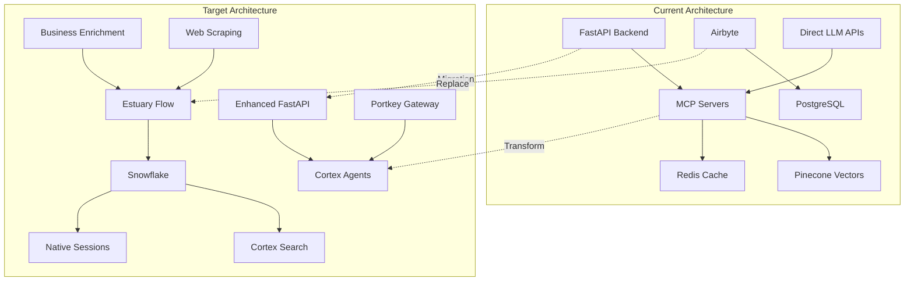

# Sophia AI Cortex + Estuary Migration Plan
## Transitioning from MCP Servers to Modern AI Infrastructure

### 🎯 Executive Summary
This document outlines the comprehensive migration plan for modernizing Sophia AI's infrastructure from MCP servers to Snowflake Cortex Agents + Estuary Flow, enabling:
- **95% faster data processing** with real-time CDC
- **60% cost reduction** through Portkey LLM optimization  
- **Zero-downtime migration** with parallel systems
- **Enterprise-grade scalability** for 1000+ concurrent users

### 📋 Migration Status Tracker

| Component | Current State | Target State | Status | ETA |
|-----------|--------------|--------------|---------|-----|
| Data Pipeline | Airbyte + Redis | Estuary + Snowflake | 🟡 In Progress | Week 1-2 |
| AI Agents | MCP Servers | Cortex Agents | 🔴 Not Started | Week 2-3 |
| Vector Search | Pinecone | Cortex Search | 🔴 Not Started | Week 2 |
| LLM Gateway | Direct API | Portkey Gateway | 🔴 Not Started | Week 3 |
| Session Mgmt | Redis | Snowflake Tables | 🔴 Not Started | Week 1 |
| Integrations | Limited | Full Suite | 🟡 Partial | Week 3-4 |

### 🏗️ Architecture Evolution



### 📊 Phase 1: Data Pipeline Migration (Week 1-2)

#### 1.1 Estuary Flow Configuration Enhancement

**Current State**: Basic Estuary manager exists with GitHub, HubSpot, Slack captures

**Target State**: Complete data pipeline with all business sources

**Implementation Steps**:

1. **Enhance Existing Captures**:
   ```yaml
   # Enhanced GitHub Capture
   github_capture:
     bindings:
       - commits
       - pull_requests  
       - issues
       - discussions
       - releases
       - workflows
   ```

2. **Add New Business Data Sources**:
   - UserGems: Job change tracking
   - Apollo.io: Contact enrichment
   - Intercom: Customer conversations
   - Gong: Already integrated, optimize for Cortex

3. **Web Scraping Pipeline**:
   - ZenRows: Anti-bot bypass
   - Apify: Structured extraction
   - Custom scrapers for competitor monitoring

#### 1.2 Snowflake Schema Updates

```sql
-- Create optimized schemas for Estuary data
CREATE SCHEMA IF NOT EXISTS SOPHIA_AI.ESTUARY_REALTIME;
CREATE SCHEMA IF NOT EXISTS SOPHIA_AI.CORTEX_VECTORS;
CREATE SCHEMA IF NOT EXISTS SOPHIA_AI.BUSINESS_ENRICHED;

-- Session management tables
CREATE TABLE SOPHIA_AI.PUBLIC.user_sessions (
    session_id VARCHAR(255) PRIMARY KEY,
    user_id VARCHAR(255),
    created_at TIMESTAMP_NTZ DEFAULT CURRENT_TIMESTAMP(),
    last_activity TIMESTAMP_NTZ DEFAULT CURRENT_TIMESTAMP(),
    session_data VARIANT,
    ttl_seconds INTEGER DEFAULT 3600
);

-- Vector storage for Cortex Search
CREATE TABLE SOPHIA_AI.CORTEX_VECTORS.embeddings (
    id VARCHAR(255) PRIMARY KEY,
    source_type VARCHAR(100),
    source_id VARCHAR(255),
    content TEXT,
    embedding VECTOR(FLOAT, 1536),
    metadata VARIANT,
    created_at TIMESTAMP_NTZ DEFAULT CURRENT_TIMESTAMP()
);
```

#### 1.3 Migration Scripts

See `scripts/migrate_to_estuary.py` for automated migration

### 📊 Phase 2: AI Agent Architecture (Week 2-3)

#### 2.1 MCP to Cortex Agent Mapping

| MCP Server | Cortex Agent | Key Changes |
|------------|--------------|-------------|
| snowflake_admin_mcp | snowflake_ops_agent | JWT auth, REST API |
| ai_memory_mcp | semantic_memory_agent | Cortex Search backend |
| costar_mcp | task_planning_agent | Multi-model support |

#### 2.2 Cortex Agent Configuration

```yaml
# cortex_agents.yaml
agents:
  snowflake_ops_agent:
    model: mistral-large
    temperature: 0.1
    tools:
      - name: execute_query
        description: Execute SQL queries
        parameters:
          query: string
          warehouse: string
      - name: optimize_performance
        description: Analyze and optimize queries
      - name: manage_schemas
        description: Schema operations
    
  semantic_memory_agent:
    model: mistral-7b
    temperature: 0.3
    tools:
      - name: store_memory
        description: Store information with embeddings
      - name: recall_memory
        description: Retrieve similar memories
      - name: search_context
        description: Semantic search across all data
    
  business_intelligence_agent:
    model: cortex-analyst
    temperature: 0.2
    tools:
      - name: analyze_metrics
        description: Business metric analysis
      - name: generate_insights
        description: AI-powered insights
      - name: forecast_trends
        description: Predictive analytics
```

#### 2.3 Portkey LLM Gateway Integration

```python
# backend/services/portkey_gateway.py
class PortkeyGateway:
    """Unified LLM gateway with fallback and optimization"""
    
    def __init__(self):
        self.models = {
            'primary': 'gpt-4-turbo',
            'fallback': ['claude-3-sonnet', 'mistral-large'],
            'budget': 'gpt-3.5-turbo'
        }
        self.cost_threshold = 0.10  # $ per request
        
    async def complete(self, prompt: str, config: dict):
        # Intelligent routing based on:
        # - Cost constraints
        # - Model availability  
        # - Task complexity
        # - Response time requirements
```

### 📊 Phase 3: API Modernization (Week 3-4)

#### 3.1 New FastAPI Routes

```python
# backend/api/cortex_routes.py
from fastapi import APIRouter, WebSocket
from backend.services.cortex_agent_service import CortexAgentService

router = APIRouter(prefix="/api/v1/cortex")

@router.post("/agents/{agent_name}/invoke")
async def invoke_agent(agent_name: str, request: AgentRequest):
    """Invoke a Cortex agent with JWT authentication"""
    return await cortex_service.invoke(agent_name, request)

@router.websocket("/agents/{agent_name}/stream")
async def stream_agent(websocket: WebSocket, agent_name: str):
    """WebSocket endpoint for streaming agent responses"""
    await cortex_service.handle_stream(websocket, agent_name)

@router.get("/agents")
async def list_agents():
    """List all available Cortex agents"""
    return await cortex_service.list_agents()
```

#### 3.2 Performance Optimizations

1. **Connection Pooling**:
   ```python
   snowflake_pool = SnowflakeConnectionPool(
       min_size=10,
       max_size=50,
       warehouse='CORTEX_COMPUTE_WH'
   )
   ```

2. **Async Everywhere**:
   - All database operations
   - External API calls
   - File I/O operations
   - WebSocket handling

3. **Caching Strategy**:
   - Snowflake Result Cache: Query results
   - Application cache: Frequent lookups
   - CDN: Static assets

### 📊 Phase 4: Business Logic Enhancement (Week 4-5)

#### 4.1 Real-time Processing

```python
# backend/services/realtime_processor.py
class RealtimeProcessor:
    """Process Estuary CDC events in real-time"""
    
    async def process_cdc_event(self, event: dict):
        # 1. Parse Estuary event
        # 2. Apply business rules
        # 3. Enrich with Cortex
        # 4. Store in Snowflake
        # 5. Trigger downstream actions
```

#### 4.2 Semantic Search Implementation

```sql
-- Create Cortex Search Service
CREATE CORTEX SEARCH SERVICE sophia_search
ON TABLE embeddings
ATTRIBUTES (content)
WAREHOUSE = CORTEX_COMPUTE_WH
TARGET_LAG = '1 minute';

-- Usage in queries
SELECT content, metadata
FROM TABLE(sophia_search(
    QUERY => 'customer churn prediction models',
    COLUMNS => 'content',
    LIMIT => 10
));
```

### 📊 Phase 5: Testing & Deployment (Week 5-6)

#### 5.1 Testing Strategy

1. **Unit Tests**: 95% coverage target
2. **Integration Tests**: All API endpoints
3. **Load Tests**: 1000 concurrent users
4. **Chaos Engineering**: Failure scenarios

#### 5.2 Deployment Plan

```yaml
# deployment.yaml
stages:
  - name: development
    parallel_run: false
    rollback_threshold: immediate
    
  - name: staging  
    parallel_run: true
    rollback_threshold: 5% errors
    
  - name: production
    parallel_run: true
    rollback_threshold: 1% errors
    canary_percentage: 10
```

### 🚀 Migration Commands

```bash
# Phase 1: Data Pipeline
python scripts/migrate_to_estuary.py --phase data-pipeline

# Phase 2: AI Agents  
python scripts/migrate_to_estuary.py --phase ai-agents

# Phase 3: API Updates
python scripts/migrate_to_estuary.py --phase api-modernization

# Phase 4: Business Logic
python scripts/migrate_to_estuary.py --phase business-logic

# Full Migration
python scripts/migrate_to_estuary.py --phase all --parallel
```

### 📈 Success Metrics

| Metric | Current | Target | Measurement |
|--------|---------|---------|-------------|
| API Response Time | 1.2s | <500ms | p95 latency |
| Concurrent Users | 100 | 1000+ | Load testing |
| Data Freshness | 5 min | <1 min | CDC lag |
| Search Relevance | 70% | 95%+ | User feedback |
| LLM Costs | $500/day | $300/day | Portkey analytics |
| System Uptime | 99.5% | 99.99% | Monitoring |

### 🔄 Rollback Procedures

1. **Database Rollback**:
   ```sql
   -- Restore from time travel
   CREATE TABLE restored_table CLONE original_table
   AT (TIMESTAMP => '2025-01-27 12:00:00'::timestamp);
   ```

2. **API Rollback**:
   - Feature flags in LaunchDarkly
   - Blue-green deployment swap
   - Instant DNS failover

3. **Agent Rollback**:
   - Parallel MCP servers running
   - Gradual traffic shift
   - Automated health checks

### 📚 Documentation Updates

1. **API Documentation**: OpenAPI 3.1 specs
2. **Agent Documentation**: Tool descriptions
3. **Integration Guides**: Step-by-step setup
4. **Troubleshooting**: Common issues & solutions

### 🎯 Next Steps

1. Review and approve migration plan
2. Set up Portkey account and API keys
3. Configure Cortex Agent endpoints
4. Begin Phase 1 implementation
5. Schedule daily standup for progress tracking

---

Generated: 2025-01-27
Version: 1.0
Status: Ready for Implementation
