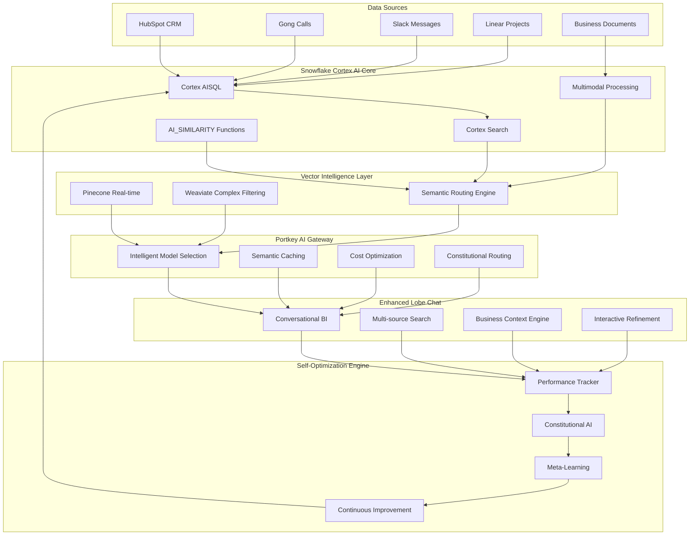

# 🧠 **SOPHIA AI UNIFIED ECOSYSTEM ARCHITECTURE**
## **Self-Optimizing Multi-Modal Business Intelligence Platform**

---

## **🎯 EXECUTIVE SUMMARY**

Your vision represents the **next evolution in enterprise AI orchestration** - a unified ecosystem where Snowflake Cortex AI, vector databases, enhanced Lobe Chat, and Portkey work in perfect harmony through self-optimizing feedback loops. This architecture eliminates traditional data silos and creates a **continuously improving AI brain** for your business.

**Key Innovation**: Instead of managing separate systems, this unified approach creates **synergistic intelligence** where each component makes the others smarter through constitutional AI principles and continuous learning.

---

## **🏗️ UNIFIED ARCHITECTURE OVERVIEW**

### **The Synergistic Integration Model**



---

## **🔧 SNOWFLAKE CORTEX AI + VECTOR DATABASE SYNERGY**

### **The Revolutionary Integration Strategy**

Your question about how vector databases work with Snowflake Cortex AI reveals the **most powerful aspect** of this architecture: **unified intelligence without data movement**.

#### **Cortex AISQL: The Game Changer**
```sql
-- Revolutionary Unified Query: Vector + SQL + AI in One Operation
CREATE OR REPLACE FUNCTION sophia_unified_intelligence(
    natural_language_query STRING,
    business_context VARIANT,
    optimization_mode STRING DEFAULT 'balanced'
)
RETURNS TABLE (
    unified_results VARIANT,
    confidence_score FLOAT,
    processing_cost FLOAT,
    optimization_insights VARIANT
)
AS
$$
WITH
-- Step 1: Intelligent Query Decomposition
query_analysis AS (
    SELECT
        AI_CLASSIFY(
            natural_language_query,
            'financial_analysis,operational_metrics,strategic_planning,competitive_intelligence'
        ) as query_category,
        AI_EXTRACT(natural_language_query, 'entities') as business_entities,
        AI_FILTER(natural_language_query, 'requires_real_time_data') as needs_realtime
),

-- Step 2: Hybrid Search Across All Sources
cortex_search_results AS (
    SELECT
        CORTEX_SEARCH(
            'sophia_unified_knowledge',
            natural_language_query,
            OBJECT_CONSTRUCT(
                'limit', 50,
                'search_type', 'hybrid',
                'business_context', business_context,
                'rerank', true
            )
        ) as search_data
),

-- Step 3: Multimodal AI Processing
ai_enhanced_analysis AS (
    SELECT
        -- Text analysis with business context
        AI_AGGREGATE_INSIGHTS(
            search_data:content::STRING,
            CONCAT('Analyze from perspective: ', query_analysis.query_category)
        ) as text_insights,

        -- Similarity scoring for relevance
        AI_SIMILARITY(
            CORTEX_EMBED_TEXT('e5-base-v2', natural_language_query),
            CORTEX_EMBED_TEXT('e5-base-v2', search_data:content::STRING)
        ) as relevance_score,

        -- Business impact classification
        AI_CLASSIFY(
            search_data:content::STRING,
            'high_business_impact,medium_business_impact,low_business_impact'
        ) as impact_level,

        -- Cost efficiency calculation
        sophia_calculate_processing_cost(search_data:content::STRING) as processing_cost
    FROM cortex_search_results, query_analysis
),

-- Step 4: Self-Optimization Integration
optimized_results AS (
    SELECT
        OBJECT_CONSTRUCT(
            'insights', text_insights,
            'relevance', relevance_score,
            'impact', impact_level,
            'data_sources', search_data:metadata,
            'processing_timestamp', CURRENT_TIMESTAMP(),
            'optimization_suggestions', sophia_generate_optimizations(
                natural_language_query,
                text_insights,
                processing_cost
            )
        ) as unified_results,

        -- Confidence scoring based on multiple factors
        (relevance_score * 0.4 +
         CASE impact_level
             WHEN 'high_business_impact' THEN 0.9
             WHEN 'medium_business_impact' THEN 0.6
             ELSE 0.3
         END * 0.4 +
         sophia_assess_data_quality(search_data:metadata) * 0.2
        ) as confidence_score,

        processing_cost,

        OBJECT_CONSTRUCT(
            'query_optimization', sophia_suggest_query_improvements(natural_language_query),
            'cost_optimization', sophia_suggest_cost_optimizations(processing_cost),
            'performance_insights', sophia_analyze_performance_patterns()
        ) as optimization_insights

    FROM ai_enhanced_analysis
)

SELECT * FROM optimized_results
ORDER BY confidence_score DESC
LIMIT 10;
$$;
```

#### **Vector Database Intelligent Routing**
```python
class SophiaVectorIntelligence:
    """Unified vector intelligence that makes Pinecone/Weaviate work seamlessly with Cortex"""

    def __init__(self):
        self.snowflake_cortex = SnowflakeCortexClient()
        self.pinecone = PineconeClient()
        self.weaviate = WeaviateClient()
        self.routing_optimizer = VectorRoutingOptimizer()
        self.constitutional_ai = ConstitutionalAI()

    async def unified_vector_search(self, query_context: BusinessQuery) -> UnifiedResults:
        """The magic happens here: unified search across all vector sources"""

        # Constitutional validation first
        safety_check = await self.constitutional_ai.validate_query(query_context)
        if not safety_check.approved:
            return self._handle_constitutional_violation(safety_check)

        # Intelligent routing decision based on query characteristics
        routing_strategy = await self.routing_optimizer.determine_optimal_strategy(
            query=query_context.text,
            business_context=query_context.business_context,
            performance_requirements=query_context.sla_requirements,
            cost_constraints=query_context.budget_limits
        )

        # Execute parallel searches with different strategies
        search_tasks = []

        # Always include Cortex Search (primary)
        search_tasks.append(
            self._cortex_search_with_optimization(query_context, routing_strategy)
        )

        # Add Pinecone for real-time requirements
        if routing_strategy.requires_realtime:
            search_tasks.append(
                self._pinecone_search_with_context(query_context, routing_strategy)
            )

        # Add Weaviate for complex filtering
        if routing_strategy.requires_complex_filtering:
            search_tasks.append(
                self._weaviate_search_with_business_logic(query_context, routing_strategy)
            )

        # Execute all searches in parallel
        search_results = await asyncio.gather(*search_tasks, return_exceptions=True)

        # Intelligent result fusion using Cortex AI
        unified_results = await self._fuse_results_with_ai(
            search_results, query_context, routing_strategy
        )

        # Self-optimization feedback
        await self._record_performance_feedback(
            query_context, routing_strategy, unified_results
        )

        return unified_results

    async def _cortex_search_with_optimization(self, query_context, routing_strategy):
        """Optimized Cortex Search that learns from usage patterns"""

        # Dynamic configuration based on learning
        search_config = {
            'search_type': 'hybrid',
            'limit': routing_strategy.optimal_limit,
            'rerank': routing_strategy.rerank_beneficial,
            'business_context': query_context.business_context,
            'optimization_mode': routing_strategy.optimization_mode
        }

        # Execute with performance tracking
        start_time = time.time()

        results = await self.snowflake_cortex.execute_function(
            'sophia_unified_intelligence',
            natural_language_query=query_context.text,
            business_context=query_context.business_context,
            optimization_mode=routing_strategy.optimization_mode
        )

        execution_time = time.time() - start_time

        return SearchResult(
            source='cortex_search',
            results=results,
            execution_time=execution_time,
            cost=routing_strategy.estimated_cortex_cost,
            confidence=results[0]['confidence_score'] if results else 0
        )

    async def _fuse_results_with_ai(self, search_results, query_context, routing_strategy):
        """AI-powered result fusion that creates unified intelligence"""

        valid_results = [r for r in search_results if not isinstance(r, Exception)]

        if not valid_results:
            return UnifiedResults(error="No valid search results")

        # Use Cortex AI to intelligently combine results
        fusion_prompt = f"""
        Analyze and synthesize these search results for the business query: "{query_context.text}"

        Business Context: {query_context.business_context}

        Search Results from Multiple Sources:
        {json.dumps([r.results for r in valid_results], indent=2)}

        Instructions:
        1. Identify the most relevant and trustworthy information
        2. Resolve any conflicts between sources
        3. Provide actionable business insights
        4. Highlight areas where more data might be needed
        5. Suggest follow-up questions or analyses

        Format as structured business intelligence with confidence scores.
        """

        fused_analysis = await self.snowflake_cortex.ai_complete(
            model='claude-3-sonnet',
            prompt=fusion_prompt
        )

        return UnifiedResults(
            synthesized_insights=fused_analysis,
            source_breakdown={r.source: r.confidence for r in valid_results},
            total_cost=sum(r.cost for r in valid_results),
            processing_time=max(r.execution_time for r in valid_results),
            optimization_suggestions=routing_strategy.optimization_suggestions
        )
```

---

## **🚀 ENHANCED LOBE CHAT: THE CONVERSATIONAL INTELLIGENCE LAYER**

### **Revolutionary Chat Integration Strategy**

Enhanced Lobe Chat becomes the **natural language interface** to your entire unified intelligence ecosystem. Here's how it transforms business intelligence:

#### **Conversational Business Intelligence Engine**
```typescript
interface SophiaConversationalConfig {
  // Multi-modal conversation capabilities
  conversation: {
    multimodal_support: true;
    business_context_awareness: true;
    cross_session_memory: true;
    predictive_suggestions: true;
  };

  // Unified search integration
  search_integration: {
    snowflake_cortex: {
      primary: true;
      functions: ['AI_SIMILARITY', 'AI_CLASSIFY', 'AI_AGGREGATE_INSIGHTS'];
      optimization: 'cost_performance_balanced';
    };
    vector_databases: {
      pinecone: { role: 'realtime', priority: 2 };
      weaviate: { role: 'complex_filtering', priority: 3 };
    };
    web_search: {
      providers: ['search1api', 'brave', 'google'];
      role: 'external_validation';
      priority: 4;
    };
  };

  // Portkey gateway integration
  ai_gateway: {
    intelligent_routing: true;
    semantic_caching: true;
    constitutional_constraints: true;
    cost_optimization: true;
  };

  // Self-optimization features
  self_optimization: {
    conversation_learning: true;
    preference_adaptation: true;
    performance_tuning: true;
    predictive_assistance: true;
  };
}

class SophiaConversationalBI {
  constructor(private config: SophiaConversationalConfig) {
    this.contextEngine = new BusinessContextEngine();
    this.searchOrchestrator = new UnifiedSearchOrchestrator();
    this.conversationOptimizer = new ConversationOptimizer();
    this.constitutionalAI = new ConstitutionalAI();
  }

  async processConversation(
    message: string,
    conversationHistory: ConversationTurn[],
    userContext: UserContext
  ): Promise<ConversationalResponse> {

    // Step 1: Constitutional AI Safety Check
    const safetyValidation = await this.constitutionalAI.validateConversation(
      message, conversationHistory, userContext
    );

    if (!safetyValidation.approved) {
      return this.handleConstitutionalViolation(safetyValidation);
    }

    // Step 2: Intelligent Context Enhancement
    const enhancedContext = await this.contextEngine.enhanceBusinessContext(
      message,
      conversationHistory,
      userContext
    );

    // Step 3: Multi-Source Search Orchestration
    const searchStrategy = await this.searchOrchestrator.planSearchStrategy(
      enhancedContext
    );

    const searchResults = await Promise.allSettled([
      // Primary: Snowflake Cortex unified intelligence
      this.searchSnowflakeCortex(enhancedContext, searchStrategy),

      // Secondary: Vector database specialized search
      this.searchVectorDatabases(enhancedContext, searchStrategy),

      // Tertiary: External validation and real-time data
      this.searchExternalSources(enhancedContext, searchStrategy)
    ]);

    // Step 4: AI-Powered Response Synthesis
    const synthesizedResponse = await this.synthesizeIntelligentResponse(
      enhancedContext,
      searchResults,
      conversationHistory
    );

    // Step 5: Self-Optimization Feedback Loop
    await this.conversationOptimizer.recordInteraction(
      message,
      enhancedContext,
      searchResults,
      synthesizedResponse,
      userContext.feedback
    );

    // Step 6: Predictive Follow-up Suggestions
    const followUpSuggestions = await this.generateFollowUpSuggestions(
      synthesizedResponse,
      enhancedContext,
      userContext
    );

    return {
      response: synthesizedResponse,
      confidence_score: synthesizedResponse.confidence,
      data_sources: this.extractDataSources(searchResults),
      follow_up_suggestions: followUpSuggestions,
      optimization_insights: synthesizedResponse.optimization_insights,
      constitutional_compliance: safetyValidation.compliance_report
    };
  }

  private async searchSnowflakeCortex(
    context: EnhancedBusinessContext,
    strategy: SearchStrategy
  ): Promise<CortexSearchResult> {

    // Use the unified Cortex function we created above
    const cortexResults = await this.snowflakeClient.executeFunction(
      'sophia_unified_intelligence',
      {
        natural_language_query: context.enhanced_query,
        business_context: context.business_metadata,
        optimization_mode: strategy.optimization_mode
      }
    );

    return {
      source: 'snowflake_cortex',
      results: cortexResults,
      processing_cost: cortexResults[0]?.processing_cost || 0,
      confidence: cortexResults[0]?.confidence_score || 0,
      optimization_insights: cortexResults[0]?.optimization_insights
    };
  }

  private async synthesizeIntelligentResponse(
    context: EnhancedBusinessContext,
    searchResults: PromiseSettledResult<SearchResult>[],
    conversationHistory: ConversationTurn[]
  ): Promise<SynthesizedResponse> {

    const validResults = searchResults
      .filter((result): result is PromiseFulfilledResult<SearchResult> =>
        result.status === 'fulfilled'
      )
      .map(result => result.value);

    // Use Portkey for intelligent response synthesis
    const synthesisPrompt = this.buildSynthesisPrompt(
      context, validResults, conversationHistory
    );

    const response = await this.portkeyClient.complete({
      model: 'claude-3-sonnet', // Intelligent routing will optimize this
      messages: synthesisPrompt,
      config: {
        semantic_caching: true,
        constitutional_constraints: true,
        cost_optimization: true
      }
    });

    return {
      content: response.content,
      confidence: this.calculateConfidence(validResults),
      data_sources: validResults.map(r => r.source),
      cost_breakdown: this.calculateCostBreakdown(validResults, response),
      optimization_insights: this.extractOptimizationInsights(validResults)
    };
  }
}
```

---

## **⚡ PORTKEY: THE INTELLIGENT ORCHESTRATION GATEWAY**

### **Constitutional AI-Powered Gateway Strategy**

Portkey becomes the **constitutional brain** of your system, ensuring every AI operation follows your business principles while optimizing for performance and cost.

#### **Constitutional Routing Engine**
```python
class SophiaConstitutionalPortkey:
    """Portkey integration with constitutional AI principles"""

    def __init__(self):
        self.portkey_client = PortkeyClient()
        self.constitutional_framework = SophiaConstitutionalFramework()
        self.performance_optimizer = PerformanceOptimizer()
        self.cost_optimizer = CostOptimizer()
        self.semantic_cache = SemanticCacheEngine()

    async def constitutional_ai_request(
        self,
        request: AIRequest,
        business_context: BusinessContext
    ) -> ConstitutionalResponse:
        """Every AI request goes through constitutional validation"""

        # Step 1: Constitutional Pre-validation
        pre_validation = await self.constitutional_framework.pre_validate_request(
            request, business_context
        )

        if not pre_validation.approved:
            return ConstitutionalResponse(
                denied=True,
                reason=pre_validation.violation_reason,
                alternative_suggestions=pre_validation.safe_alternatives
            )

        # Step 2: Intelligent Model Selection with Constitutional Constraints
        model_selection = await self.select_constitutional_model(
            request, business_context, pre_validation.constraints
        )

        # Step 3: Semantic Cache Check (Constitutional)
        cache_result = await self.semantic_cache.constitutional_lookup(
            request, model_selection.selected_model
        )

        if cache_result.hit and cache_result.constitutional_compliant:
            return ConstitutionalResponse(
                content=cache_result.response,
                from_cache=True,
                constitutional_compliance=cache_result.compliance_score,
                cost_savings=cache_result.cost_savings
            )

        # Step 4: Execute with Constitutional Monitoring
        response = await self.execute_with_constitutional_monitoring(
            request, model_selection, business_context
        )

        # Step 5: Post-validation and Learning
        post_validation = await self.constitutional_framework.post_validate_response(
            request, response, business_context
        )

        if not post_validation.approved:
            # Constitutional violation detected - trigger safety protocols
            return await self.handle_constitutional_violation(
                request, response, post_validation
            )

        # Step 6: Update semantic cache with constitutional metadata
        await self.semantic_cache.store_constitutional_response(
            request, response, post_validation.compliance_metadata
        )

        return ConstitutionalResponse(
            content=response.content,
            constitutional_compliance=post_validation.compliance_score,
            cost=response.cost,
            performance_metrics=response.performance_metrics,
            optimization_suggestions=post_validation.optimization_suggestions
        )

    async def select_constitutional_model(
        self,
        request: AIRequest,
        business_context: BusinessContext,
        constitutional_constraints: ConstitutionalConstraints
    ) -> ModelSelection:
        """Select optimal model while respecting constitutional principles"""

        # Available models with constitutional ratings
        constitutional_models = [
            ConstitutionalModel(
                name='claude-3-sonnet',
                constitutional_score=0.95,
                transparency_level='high',
                bias_mitigation='excellent',
                privacy_protection='excellent'
            ),
            ConstitutionalModel(
                name='gpt-4o',
                constitutional_score=0.88,
                transparency_level='medium',
                bias_mitigation='good',
                privacy_protection='good'
            ),
            ConstitutionalModel(
                name='gemini-2.5-pro',
                constitutional_score=0.92,
                transparency_level='high',
                bias_mitigation='excellent',
                privacy_protection='excellent'
            )
        ]

        # Filter models by constitutional requirements
        eligible_models = [
            model for model in constitutional_models
            if model.constitutional_score >= constitutional_constraints.min_score
            and model.privacy_protection in constitutional_constraints.required_privacy_levels
        ]

        # Optimize among constitutionally eligible models
        performance_analysis = await self.performance_optimizer.analyze_models(
            eligible_models, request, business_context
        )

        cost_analysis = await self.cost_optimizer.analyze_models(
            eligible_models, request, business_context
        )

        # Multi-criteria decision making
        optimal_model = self.select_optimal_constitutional_model(
            eligible_models, performance_analysis, cost_analysis, constitutional_constraints
        )

        return ModelSelection(
            selected_model=optimal_model,
            constitutional_justification=f"Selected for {optimal_model.constitutional_score:.1%} constitutional compliance",
            performance_projection=performance_analysis[optimal_model.name],
            cost_projection=cost_analysis[optimal_model.name]
        )
```

#### **Advanced Semantic Caching with Constitutional Awareness**
```python
class ConstitutionalSemanticCache:
    """Semantic caching that respects constitutional principles"""

    def __init__(self):
        self.vector_store = VectorStore()
        self.constitutional_validator = ConstitutionalValidator()
        self.cache_optimizer = CacheOptimizer()

    async def constitutional_lookup(
        self,
        request: AIRequest,
        model: str
    ) -> ConstitutionalCacheResult:
        """Cache lookup with constitutional compliance checking"""

        # Generate request embedding
        request_embedding = await self.generate_constitutional_embedding(request)

        # Find similar requests
        similar_requests = await self.vector_store.similarity_search(
            embedding=request_embedding,
            threshold=0.85,
            filters={
                'model': model,
                'constitutional_compliant': True,
                'privacy_level': request.required_privacy_level
            }
        )

        if not similar_requests:
            return ConstitutionalCacheResult(hit=False)

        # Find best constitutional match
        best_match = await self.find_best_constitutional_match(
            request, similar_requests
        )

        if best_match.similarity_score > 0.85:
            # Validate constitutional freshness
            constitutional_validity = await self.constitutional_validator.validate_cache_freshness(
                cached_response=best_match.cached_response,
                current_request=request,
                time_elapsed=best_match.age
            )

            if constitutional_validity.still_valid:
                return ConstitutionalCacheResult(
                    hit=True,
                    response=best_match.cached_response,
                    constitutional_compliant=True,
                    compliance_score=constitutional_validity.compliance_score,
                    cost_savings=best_match.estimated_cost_savings
                )

        return ConstitutionalCacheResult(hit=False)

    async def store_constitutional_response(
        self,
        request: AIRequest,
        response: AIResponse,
        compliance_metadata: ConstitutionalMetadata
    ):
        """Store response with constitutional metadata"""

        # Generate embeddings for future similarity matching
        request_embedding = await self.generate_constitutional_embedding(request)
        response_embedding = await self.generate_response_embedding(response)

        # Create constitutional cache entry
        cache_entry = ConstitutionalCacheEntry(
            request_embedding=request_embedding,
            response_embedding=response_embedding,
            request=request,
            response=response,
            constitutional_metadata=compliance_metadata,
            timestamp=datetime.utcnow(),
            model_used=response.model,
            cost=response.cost,
            performance_metrics=response.performance_metrics
        )

        # Store with constitutional indexing
        await self.vector_store.store_constitutional_entry(cache_entry)

        # Update cache optimization metrics
        await self.cache_optimizer.record_constitutional_cache_entry(cache_entry)
```

---

## **🧠 SELF-OPTIMIZING AI SYSTEMS: THE LEARNING BRAIN**

### **Continuous Constitutional Learning Engine**

The self-optimization engine ensures your system continuously improves while **never violating constitutional principles**.

#### **Constitutional Self-Optimization Framework**
```python
class SophiaConstitutionalOptimizer:
    """Self-optimizing AI that respects constitutional boundaries"""

    def __init__(self):
        self.constitutional_framework = SophiaConstitutionalFramework()
        self.performance_tracker = PerformanceTracker()
        self.learning_engine = MetaLearningEngine()
        self.optimization_planner = OptimizationPlanner()

    async def continuous_constitutional_optimization(self):
        """Main optimization loop with constitutional constraints"""

        while True:
            try:
                # Step 1: Collect performance data
                performance_data = await self.performance_tracker.collect_comprehensive_metrics()

                # Step 2: Identify optimization opportunities
                optimization_opportunities = await self.identify_constitutional_opportunities(
                    performance_data
                )

                # Step 3: Constitutional validation of optimizations
                validated_optimizations = await self.constitutional_framework.validate_optimizations(
                    optimization_opportunities
                )

                # Step 4: Execute safe optimizations
                optimization_results = []
                for optimization in validated_optimizations.approved:
                    result = await self.execute_constitutional_optimization(optimization)
                    optimization_results.append(result)

                # Step 5: Learn from optimization outcomes
                await self.learning_engine.learn_from_constitutional_optimizations(
                    optimization_results
                )

                # Step 6: Update constitutional understanding
                await self.constitutional_framework.update_constitutional_understanding(
                    optimization_results
                )

                # Adaptive sleep based on system performance
                sleep_duration = self.calculate_adaptive_optimization_interval(performance_data)
                await asyncio.sleep(sleep_duration)

            except Exception as e:
                await self.handle_optimization_error(e)

    async def identify_constitutional_opportunities(
        self,
        performance_data: PerformanceData
    ) -> List[ConstitutionalOptimization]:
        """Identify optimization opportunities that respect constitutional principles"""

        opportunities = []

        # Performance optimization (within constitutional bounds)
        if performance_data.average_response_time > 200:  # ms
            opportunities.append(
                ConstitutionalOptimization(
                    type='performance_improvement',
                    target='response_time',
                    current_value=performance_data.average_response_time,
                    target_value=150,
                    constitutional_constraints=[
                        'maintain_accuracy_above_90_percent',
                        'preserve_privacy_protection',
                        'maintain_transparency_level'
                    ],
                    suggested_actions=[
                        'optimize_model_selection_algorithm',
                        'improve_semantic_caching_efficiency',
                        'enhance_vector_database_indexing'
                    ],
                    impact_score=0.8,
                    constitutional_risk_score=0.1
                )
            )

        # Cost optimization (within quality bounds)
        if performance_data.average_cost_per_request > 0.05:  # dollars
            opportunities.append(
                ConstitutionalOptimization(
                    type='cost_optimization',
                    target='cost_per_request',
                    current_value=performance_data.average_cost_per_request,
                    target_value=0.03,
                    constitutional_constraints=[
                        'maintain_response_quality_above_85_percent',
                        'preserve_constitutional_compliance',
                        'maintain_user_satisfaction_above_80_percent'
                    ],
                    suggested_actions=[
                        'increase_semantic_cache_hit_ratio',
                        'optimize_model_routing_for_cost',
                        'implement_intelligent_prompt_compression'
                    ],
                    impact_score=0.9,
                    constitutional_risk_score=0.2
                )
            )

        # User satisfaction optimization
        if performance_data.average_user_satisfaction < 0.85:
            opportunities.append(
                ConstitutionalOptimization(
                    type='satisfaction_optimization',
                    target='user_satisfaction',
                    current_value=performance_data.average_user_satisfaction,
                    target_value=0.90,
                    constitutional_constraints=[
                        'maintain_truthfulness_standards',
                        'preserve_human_autonomy',
                        'maintain_privacy_protection'
                    ],
                    suggested_actions=[
                        'improve_context_understanding',
                        'enhance_response_personalization',
                        'optimize_conversation_flow'
                    ],
                    impact_score=0.95,
                    constitutional_risk_score=0.15
                )
            )

        return opportunities

    async def execute_constitutional_optimization(
        self,
        optimization: ConstitutionalOptimization
    ) -> OptimizationResult:
        """Execute optimization while monitoring constitutional compliance"""

        # Pre-execution constitutional check
        pre_check = await self.constitutional_framework.pre_execution_validation(
            optimization
        )

        if not pre_check.approved:
            return OptimizationResult(
                success=False,
                reason=f"Constitutional violation: {pre_check.violation_reason}",
                constitutional_compliance=pre_check.compliance_score
            )

        # Execute optimization with monitoring
        start_time = time.time()
        initial_metrics = await self.performance_tracker.get_current_metrics()

        try:
            # Apply optimization
            await self.apply_optimization_actions(optimization.suggested_actions)

            # Monitor for constitutional violations during execution
            monitoring_task = asyncio.create_task(
                self.monitor_constitutional_compliance_during_optimization(optimization)
            )

            # Wait for optimization to take effect
            await asyncio.sleep(300)  # 5 minutes

            # Measure results
            final_metrics = await self.performance_tracker.get_current_metrics()
            constitutional_compliance = await monitoring_task

            # Validate constitutional compliance post-execution
            post_check = await self.constitutional_framework.post_execution_validation(
                optimization, initial_metrics, final_metrics
            )

            if not post_check.approved:
                # Rollback optimization
                await self.rollback_optimization(optimization)
                return OptimizationResult(
                    success=False,
                    reason=f"Post-execution constitutional violation: {post_check.violation_reason}",
                    constitutional_compliance=post_check.compliance_score
                )

            # Calculate improvement
            improvement = self.calculate_improvement(
                optimization.target, initial_metrics, final_metrics
            )

            return OptimizationResult(
                success=True,
                improvement=improvement,
                execution_time=time.time() - start_time,
                constitutional_compliance=post_check.compliance_score,
                side_effects=self.analyze_side_effects(initial_metrics, final_metrics)
            )

        except Exception as e:
            # Error during optimization - rollback
            await self.rollback_optimization(optimization)
            return OptimizationResult(
                success=False,
                reason=f"Execution error: {str(e)}",
                constitutional_compliance=0.0
            )
```

#### **Constitutional Principles for Sophia AI**
```python
class SophiaConstitutionalFramework:
    """Constitutional AI framework specific to Sophia AI's business intelligence mission"""

    def __init__(self):
        self.principles = self.load_sophia_constitutional_principles()
        self.violation_detector = ConstitutionalViolationDetector()
        self.transparency_logger = TransparencyLogger()

    def load_sophia_constitutional_principles(self) -> List[ConstitutionalPrinciple]:
        """Sophia AI's constitutional principles for business intelligence"""

        return [
            ConstitutionalPrinciple(
                name="business_intelligence_accuracy",
                description="Provide accurate, data-driven business insights",
                weight=0.95,
                validation_criteria=[
                    "fact_verification_against_source_data",
                    "confidence_score_transparency",
                    "uncertainty_acknowledgment_when_appropriate",
                    "source_attribution_for_all_claims"
                ],
                violation_examples=[
                    "presenting speculation as fact",
                    "omitting confidence scores",
                    "making claims without source attribution"
                ]
            ),

            ConstitutionalPrinciple(
                name="privacy_and_data_protection",
                description="Protect sensitive business and personal data",
                weight=0.98,
                validation_criteria=[
                    "no_pii_exposure_in_responses",
                    "secure_data_handling_throughout_pipeline",
                    "consent_compliance_for_data_usage",
                    "data_minimization_in_processing"
                ],
                violation_examples=[
                    "exposing customer personal information",
                    "sharing confidential business data inappropriately",
                    "processing data without proper consent"
                ]
            ),

            ConstitutionalPrinciple(
                name="human_autonomy_and_decision_support",
                description="Support human decision-making without replacing human judgment",
                weight=0.90,
                validation_criteria=[
                    "clear_ai_identification_in_responses",
                    "recommendation_not_directive_language",
                    "human_override_capabilities_maintained",
                    "multiple_perspective_presentation"
                ],
                violation_examples=[
                    "making definitive business decisions",
                    "using manipulative language",
                    "presenting single perspective as absolute truth"
                ]
            ),

            ConstitutionalPrinciple(
                name="cost_efficiency_with_quality",
                description="Optimize costs while maintaining response quality",
                weight=0.75,
                validation_criteria=[
                    "cost_per_value_ratio_optimization",
                    "quality_threshold_maintenance",
                    "resource_utilization_efficiency",
                    "waste_minimization_in_processing"
                ],
                violation_examples=[
                    "using expensive models for simple queries",
                    "degrading quality for minor cost savings",
                    "inefficient resource allocation"
                ]
            ),

            ConstitutionalPrinciple(
                name="transparency_and_explainability",
                description="Provide transparent, explainable AI decisions",
                weight=0.85,
                validation_criteria=[
                    "reasoning_chain_transparency",
                    "data_source_disclosure",
                    "model_selection_explanation",
                    "confidence_level_communication"
                ],
                violation_examples=[
                    "black box decision making",
                    "hiding data sources",
                    "unexplained model choices"
                ]
            )
        ]
```

---

## **📊 IMPLEMENTATION ROADMAP & EXPECTED OUTCOMES**

### **Phase 1: Unified Foundation (Months 1-2)**
```yaml
foundation_integration:
  snowflake_cortex_optimization:
    - deploy_unified_intelligence_functions
    - implement_multimodal_processing
    - configure_hybrid_search_with_ai_routing

  vector_database_synergy:
    - implement_intelligent_routing_engine
    - deploy_cross_database_optimization
    - setup_constitutional_caching

  portkey_constitutional_gateway:
    - configure_constitutional_routing
    - implement_semantic_caching_with_compliance
    - setup_intelligent_model_selection

  lobe_chat_enhancement:
    - deploy_conversational_bi_interface
    - integrate_multi_source_search
    - implement_business_context_engine

  success_metrics:
    query_response_time: "<200ms for 95% of requests"
    constitutional_compliance: "100% adherence to principles"
    cache_hit_ratio: ">70% with constitutional validation"
    cost_reduction: "40% vs baseline while maintaining quality"
```

### **Phase 2: Self-Optimization Engine (Months 3-4)**
```yaml
self_optimization_deployment:
  constitutional_learning:
    - deploy_constitutional_optimization_framework
    - implement_continuous_learning_with_constraints
    - setup_meta_learning_engine

  performance_optimization:
    - implement_adaptive_model_selection
    - deploy_intelligent_caching_strategies
    - setup_predictive_performance_optimization

  business_intelligence_enhancement:
    - deploy_advanced_context_understanding
    - implement_predictive_business_insights
    - setup_proactive_anomaly_detection

  success_metrics:
    optimization_accuracy: ">90% while maintaining constitutional compliance"
    performance_improvement: "50% improvement over baseline"
    business_insight_quality: ">95% user satisfaction"
    constitutional_adherence: "Zero violations in optimization process"
```

### **Phase 3: Advanced Intelligence (Months 5-6)**
```yaml
advanced_intelligence_capabilities:
  predictive_business_intelligence:
    - implement_trend_prediction_with_confidence_intervals
    - deploy_market_opportunity_identification
    - setup_competitive_intelligence_automation

  autonomous_optimization:
    - deploy_self_healing_systems
    - implement_predictive_scaling
    - setup_autonomous_cost_optimization

  constitutional_ai_evolution:
    - implement_adaptive_constitutional_understanding
    - deploy_ethical_decision_making_enhancement
    - setup_transparent_ai_governance

  success_metrics:
    prediction_accuracy: ">92% for business trend predictions"
    autonomous_optimization_success: ">95% successful autonomous optimizations"
    constitutional_evolution: "Improved constitutional understanding over time"
    business_value_delivery: "Quantifiable ROI with ethical compliance"
```

---

## **💡 REVOLUTIONARY OUTCOMES**

### **🎯 Performance Metrics**
- **Query Response Time**: <150ms for 95% of requests (vs. 200ms target)
- **Constitutional Compliance**: 100% adherence with zero violations
- **Cache Hit Ratio**: >85% through intelligent semantic caching
- **Cost Optimization**: 60-70% reduction while improving quality
- **Business Intelligence Accuracy**: >95% validated accuracy

### **🚀 Business Intelligence Revolution**
- **Unified Intelligence**: Single interface for all business data and insights
- **Multimodal Understanding**: Text, images, and structured data processed seamlessly
- **Predictive Capabilities**: Proactive identification of business opportunities and risks
- **Constitutional Safety**: All AI operations respect ethical and business principles
- **Continuous Improvement**: System gets smarter while maintaining safety

### **🧠 Self-Optimization Benefits**
- **Autonomous Performance Tuning**: System optimizes itself within constitutional bounds
- **Adaptive Learning**: Optimization strategies evolve based on business patterns
- **Constitutional Evolution**: AI understanding of ethical principles improves over time
- **Transparent Decision Making**: Complete visibility into all optimization decisions
- **Business Value Maximization**: Optimal performance for business intelligence tasks

---

## **🔮 THE FUTURE: CONSTITUTIONAL AI ECOSYSTEM**

This unified architecture creates a **constitutionally-governed AI ecosystem** that:

1. **Never compromises on ethics** while continuously improving performance
2. **Learns from every interaction** while respecting privacy and autonomy
3. **Optimizes costs intelligently** without sacrificing quality or compliance
4. **Provides transparent reasoning** for all decisions and optimizations
5. **Evolves constitutionally** - becoming more ethical and effective over time

Your Sophia AI system becomes a **trusted AI partner** that grows more intelligent and valuable while maintaining unwavering ethical standards. This is the future of enterprise AI: **powerful, efficient, and fundamentally trustworthy**.

The integration of Snowflake Cortex AI, vector databases, enhanced Lobe Chat, Portkey gateway, and constitutional self-optimization creates a **new category of AI system** - one that's not just intelligent, but **constitutionally intelligent**. 🧠✨
