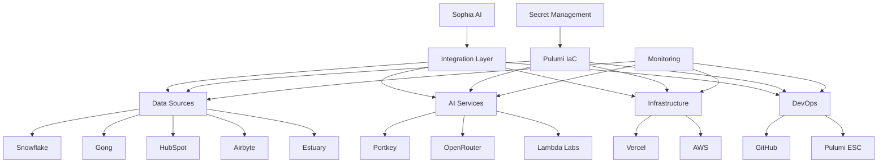

# Sophia AI - API Connection Infrastructure as Code Strategy

This document outlines the comprehensive strategy for managing API connections and integrations for the Sophia AI platform using Infrastructure as Code (IaC) with Pulumi.

## Table of Contents

1. [Overview](#overview)
2. [Architecture](#architecture)
3. [Integration Management](#integration-management)
4. [Secret Management](#secret-management)
5. [Deployment Strategy](#deployment-strategy)
6. [Testing Strategy](#testing-strategy)
7. [Monitoring and Alerting](#monitoring-and-alerting)
8. [Disaster Recovery](#disaster-recovery)
9. [Security Considerations](#security-considerations)
10. [Integration-Specific Strategies](#integration-specific-strategies)

## Overview

Sophia AI integrates with multiple external services to provide a comprehensive business intelligence and automation platform for Pay Ready. These integrations are managed using Infrastructure as Code (IaC) with Pulumi, ensuring consistent and reliable deployments across environments.

## Architecture

The integration architecture follows these principles:

1. **Separation of Concerns**: Each integration is implemented as a separate module
2. **Configuration Management**: All configuration is managed through Pulumi ESC
3. **Secret Management**: Secrets are managed securely using Pulumi ESC
4. **Testing**: All integrations have comprehensive tests
5. **Monitoring**: All integrations are monitored for availability and performance

The integration architecture is implemented as follows:



## Integration Management

### Integration Lifecycle

Each integration follows a lifecycle:

1. **Planning**: Define requirements and architecture
2. **Implementation**: Implement the integration using Pulumi IaC
3. **Testing**: Test the integration using the unified testing framework
4. **Deployment**: Deploy the integration using CI/CD
5. **Monitoring**: Monitor the integration for availability and performance
6. **Maintenance**: Update the integration as needed

### Integration Modules

Each integration is implemented as a separate Pulumi module:

- `snowflake.py`: Snowflake data warehouse integration
- `gong.py`: Gong call analysis integration
- `vercel.py`: Vercel frontend deployment integration
- `estuary.py`: Estuary data flow integration
- `portkey.py`: Portkey API gateway integration
- `openrouter.py`: OpenRouter LLM routing integration
- `lambda_labs.py`: Lambda Labs GPU infrastructure integration
- `airbyte.py`: Airbyte data integration platform
- `github.py`: GitHub repository and CI/CD integration
- `pulumi_esc.py`: Pulumi ESC secret management integration

### Integration Configuration

Each integration is configured using Pulumi configuration:

```yaml
# Pulumi.yaml
name: sophia-ai
runtime: python
description: Sophia AI - Pay Ready's AI Assistant Orchestrator

# Pulumi.<stack>.yaml
config:
  sophia-ai:environment: development
  sophia-ai:snowflake_account:
    secure: <encrypted>
  sophia-ai:snowflake_user:
    secure: <encrypted>
  # ... other configuration
```

## Secret Management

Secrets are managed using Pulumi ESC, which provides a secure way to manage sensitive information across different environments.

### Secret Rotation

Secrets are rotated automatically every 90 days using GitHub Actions. The rotation process is as follows:

1. Generate new credentials in the service (e.g., Snowflake, Gong, Vercel, Estuary)
2. Update the secrets in Pulumi ESC
3. Update the secrets in GitHub Actions
4. Deploy the updated infrastructure

### Secret Access

Secrets are accessed using the Pulumi ESC API:

```python
from pulumi import Config

config = Config()
secret = config.require_secret("secret_name")
```

## Deployment Strategy

### Environments

The infrastructure is deployed to three environments:

- **Development**: Used for development and testing
- **Staging**: Used for pre-production testing
- **Production**: Used for production

### CI/CD

The infrastructure is deployed using GitHub Actions:

- **Pull Request**: Deploy to development environment for testing
- **Merge to Main**: Deploy to staging environment
- **Release**: Deploy to production environment

### Deployment Process

The deployment process is as follows:

1. **Validate**: Validate the infrastructure changes
2. **Preview**: Preview the infrastructure changes
3. **Deploy**: Deploy the infrastructure changes
4. **Test**: Test the deployed infrastructure
5. **Monitor**: Monitor the deployed infrastructure

## Testing Strategy

### Integration Tests

Integration tests are implemented using the unified testing framework:

```python
class IntegrationTest:
    """Base class for integration tests"""
    
    def __init__(self, name: str):
        self.name = name
        self.results = {
            "name": name,
            "status": "not_run",
            "tests": [],
            "start_time": None,
            "end_time": None,
            "duration": None
        }
    
    async def run(self) -> Dict[str, Any]:
        """Run the integration test"""
        self.results["start_time"] = datetime.now().isoformat()
        try:
            await self._run_tests()
            self.results["status"] = "success"
        except Exception as e:
            logger.error(f"Error in {self.name} integration test: {str(e)}", exc_info=True)
            self.results["status"] = "failure"
            self.results["error"] = str(e)
        finally:
            self.results["end_time"] = datetime.now().isoformat()
            self.results["duration"] = (
                datetime.fromisoformat(self.results["end_time"]) - 
                datetime.fromisoformat(self.results["start_time"])
            ).total_seconds()
        return self.results
    
    async def _run_tests(self):
        """Implement this method in subclasses"""
        raise NotImplementedError("Subclasses must implement _run_tests")
```

### Test Automation

Tests are automated using GitHub Actions:

```yaml
name: Test Integrations

on:
  schedule:
    # Run every 6 hours
    - cron: '0 */6 * * *'
  push:
    branches:
      - main
    paths:
      - 'unified_integration_test.py'
      - 'integration_requirements.txt'
  pull_request:
    branches:
      - main
    paths:
      - 'unified_integration_test.py'
      - 'integration_requirements.txt'
  workflow_dispatch:
    inputs:
      environment:
        description: 'Environment to test'
        required: true
        default: 'development'
        type: choice
        options:
          - development
          - staging
          - production
```

## Monitoring and Alerting

### Monitoring

Integrations are monitored using a combination of:

- **API Health Checks**: Regular checks of API availability
- **Performance Monitoring**: Monitoring of API performance
- **Error Monitoring**: Monitoring of API errors
- **Usage Monitoring**: Monitoring of API usage

### Alerting

Alerts are sent to Slack when issues are detected:

```yaml
name: Notify on Failure
runs-on: ubuntu-latest
needs: test
if: failure()
steps:
  - name: Send Slack notification
    uses: slackapi/slack-github-action@v1.23.0
    with:
      payload: |
        {
          "text": "❌ Integration tests failed!",
          "blocks": [
            {
              "type": "section",
              "text": {
                "type": "mrkdwn",
                "text": "❌ *Integration tests failed!*"
              }
            },
            {
              "type": "section",
              "text": {
                "type": "mrkdwn",
                "text": "Environment: ${{ env.ENVIRONMENT }}\nWorkflow: ${{ github.workflow }}\nRun: ${{ github.run_id }}"
              }
            },
            {
              "type": "actions",
              "elements": [
                {
                  "type": "button",
                  "text": {
                    "type": "plain_text",
                    "text": "View Workflow Run"
                  },
                  "url": "https://github.com/${{ github.repository }}/actions/runs/${{ github.run_id }}"
                }
              ]
            }
          ]
        }
    env:
      SLACK_WEBHOOK_URL: ${{ secrets.SLACK_WEBHOOK_URL }}
      SLACK_WEBHOOK_TYPE: INCOMING_WEBHOOK
```

## Disaster Recovery

### Backup and Restore

Critical data is backed up regularly:

- **Snowflake**: Daily backups
- **GitHub**: Repository backups
- **Pulumi ESC**: Secret backups

### Recovery Process

The recovery process is as follows:

1. **Identify**: Identify the issue
2. **Isolate**: Isolate the affected components
3. **Restore**: Restore from backups
4. **Validate**: Validate the restored components
5. **Resume**: Resume normal operations

## Security Considerations

### Authentication and Authorization

All integrations use secure authentication methods:

- **API Keys**: Used for most integrations
- **OAuth**: Used for GitHub and other integrations that support it
- **IAM Roles**: Used for AWS integrations

### Data Protection

Sensitive data is protected:

- **Encryption at Rest**: All data is encrypted at rest
- **Encryption in Transit**: All data is encrypted in transit
- **Access Control**: Access is restricted based on the principle of least privilege

### Compliance

The infrastructure is designed to comply with:

- **SOC 2**: Security, availability, processing integrity, confidentiality, and privacy
- **GDPR**: Data protection and privacy
- **HIPAA**: Health information privacy

## Integration-Specific Strategies

### Snowflake

- **Connection Pooling**: Use connection pooling for efficient resource usage
- **Query Optimization**: Optimize queries for performance
- **Access Control**: Implement proper access controls

### Gong

- **Rate Limiting**: Respect API rate limits
- **Webhook Validation**: Validate webhook requests
- **Data Processing**: Process call data efficiently

### Vercel

- **Deployment Strategy**: Use a consistent deployment strategy
- **Environment Variables**: Manage environment variables securely
- **Domain Management**: Manage domains properly

### Estuary

- **Data Validation**: Validate data before sending to Estuary
- **Flow Management**: Manage data flows efficiently
- **Error Handling**: Implement comprehensive error handling

### Portkey

- **Virtual Keys**: Use virtual keys for API access
- **Routing Strategy**: Implement efficient routing strategies
- **Caching**: Use caching for improved performance

### OpenRouter

- **Model Selection**: Select appropriate models for different tasks
- **Cost Optimization**: Optimize costs by selecting the most cost-effective models
- **Fallback Strategy**: Implement fallback strategies for model unavailability

### Lambda Labs

- **Resource Management**: Manage GPU resources efficiently
- **Data Transfer**: Optimize data transfer to and from GPU instances
- **Cost Optimization**: Optimize costs by selecting the most cost-effective instance types

### Airbyte

- **Source Management**: Manage data sources efficiently
- **Destination Management**: Manage data destinations efficiently
- **Sync Management**: Manage data synchronization efficiently

### GitHub

- **Repository Management**: Manage repositories efficiently
- **CI/CD Management**: Manage CI/CD workflows efficiently
- **Secret Management**: Manage secrets securely

### Pulumi ESC

- **Environment Management**: Manage environments efficiently
- **Secret Management**: Manage secrets securely
- **Stack Management**: Manage stacks efficiently
