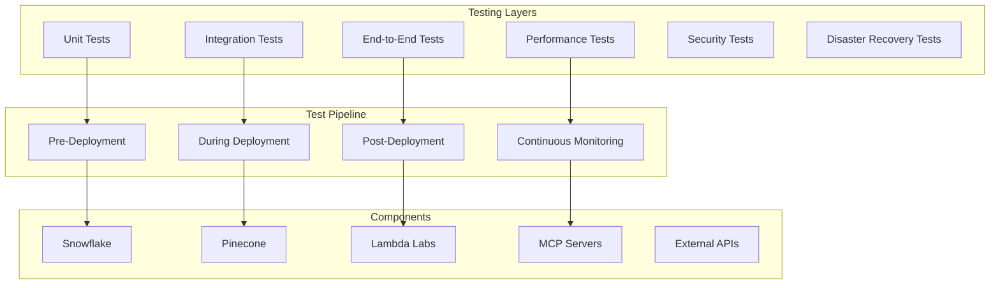

# Sophia AI Infrastructure Testing Framework 🧪

## Overview

The Sophia AI Infrastructure Testing Framework provides comprehensive validation and monitoring for our Infrastructure as Code (IaC) deployment. This framework ensures operational reliability through multi-layer testing, automated pipelines, and continuous monitoring.

## Architecture



## Test Structure

### 1. Unit Tests (`tests/infrastructure/unit/`)

Test individual infrastructure components in isolation:

```python
# test_snowflake_component.py
class TestSnowflakeComponent:
    def test_database_creation(self):
        """Verify database and schema creation"""
        
    def test_table_structure(self):
        """Validate table schemas and constraints"""
        
    def test_connection_parameters(self):
        """Test connection configuration"""
```

### 2. Integration Tests (`tests/infrastructure/integration/`)

Test service interconnections and data flow:

```python
# test_snowflake_gong_integration.py
class TestSnowflakeGongIntegration:
    def test_data_pipeline_flow(self):
        """Test Gong → Snowflake data sync"""
        
    def test_data_transformation(self):
        """Validate data quality and completeness"""
```

### 3. End-to-End Tests (`tests/infrastructure/e2e/`)

Test complete infrastructure deployment:

```python
# test_complete_infrastructure.py
class TestCompleteInfrastructure:
    def test_full_stack_deployment(self):
        """Deploy and validate entire infrastructure"""
        
    def test_ai_agent_functionality(self):
        """Test all AI agents with infrastructure"""
```

### 4. Performance Tests (`tests/infrastructure/performance/`)

Validate system performance and scalability:

```python
# test_performance.py
class TestPerformance:
    def test_query_performance(self):
        """Benchmark database query times"""
        
    def test_api_response_times(self):
        """Validate API latency requirements"""
        
    def test_concurrent_load(self):
        """Test system under concurrent load"""
```

## Running Tests

### Local Testing

```bash
# Run all infrastructure tests
python tests/infrastructure/run_all_tests.py

# Run specific test category
pytest tests/infrastructure/unit/
pytest tests/infrastructure/integration/
pytest tests/infrastructure/e2e/
pytest tests/infrastructure/performance/

# Run with coverage
pytest tests/infrastructure/ --cov=infrastructure --cov-report=html
```

### CI/CD Pipeline

Tests automatically run on:
- Every push to main branch
- Pull request creation/update
- Scheduled daily runs
- Manual trigger

### Test Environment Management

```python
# Create isolated test environment
python tests/infrastructure/conftest.py create-test-env --name test-feature-x

# Run tests in isolated environment
python tests/infrastructure/run_all_tests.py --env test-feature-x

# Cleanup test environment
python tests/infrastructure/conftest.py cleanup-test-env --name test-feature-x
```

## Component Testing

### Snowflake Component

```python
# Key test scenarios
- Database and schema creation
- Table structure validation
- User and role permissions
- Connection pooling
- Query performance
- Data retention policies
```

### Pinecone Component

```python
# Key test scenarios
- Index creation and configuration
- Vector insertion and retrieval
- Metadata filtering
- Performance benchmarks
- Scaling behavior
- Backup and recovery
```

### Lambda Labs Component

```python
# Key test scenarios
- Server provisioning
- GPU availability
- Network connectivity
- Storage mounting
- Performance metrics
- Cost optimization
```

### MCP Servers

```python
# Key test scenarios
- Container deployment
- Health check endpoints
- API connectivity
- Tool functionality
- Resource limits
- Auto-restart behavior
```

## Health Monitoring

### Real-time Monitoring

```python
# Monitor all infrastructure components
python scripts/monitor_infrastructure.py

# Check specific component health
python scripts/check_health.py --component snowflake
python scripts/check_health.py --component pinecone
python scripts/check_health.py --component mcp-servers
```

### Automated Alerts

Configure alerts for:
- Service failures
- Performance degradation
- Resource exhaustion
- Security violations
- Cost anomalies

### Health Check Endpoints

```
GET /health/snowflake     - Snowflake connectivity and query performance
GET /health/pinecone      - Pinecone index status and vector operations
GET /health/mcp-servers   - MCP server status and tool availability
GET /health/lambda-labs   - Lambda Labs server status and GPU metrics
GET /health/complete      - Complete infrastructure health summary
```

## Security Testing

### Access Control Tests

```python
# Test authentication and authorization
- API key validation
- Role-based access control
- Network security groups
- Encryption in transit
- Encryption at rest
```

### Compliance Validation

```python
# Verify security best practices
- Secret management through Pulumi ESC
- No hardcoded credentials
- Audit logging enabled
- Data privacy compliance
- Regular security scans
```

## Disaster Recovery Testing

### Backup and Restore

```python
# Test backup procedures
- Snowflake database backups
- Pinecone index snapshots
- Configuration backups
- Secret rotation
```

### Failover Testing

```python
# Test system resilience
- Service failure recovery
- Data consistency after recovery
- Automatic failover mechanisms
- Business continuity procedures
```

## Performance Benchmarks

### Target Metrics

```yaml
Database Queries:
  - Simple queries: < 100ms
  - Complex aggregations: < 1s
  - Bulk operations: < 5s

API Response Times:
  - Health checks: < 50ms
  - Data retrieval: < 200ms
  - AI operations: < 2s

Vector Operations:
  - Single vector search: < 50ms
  - Batch operations: < 500ms
  - Index updates: < 1s

System Resources:
  - CPU utilization: < 70%
  - Memory usage: < 80%
  - Network latency: < 10ms
```

## Test Reporting

### Automated Reports

```bash
# Generate test report
python tests/infrastructure/generate_report.py

# View test results dashboard
open http://localhost:8080/test-dashboard
```

### Report Contents

- Test execution summary
- Pass/fail statistics
- Performance metrics
- Coverage analysis
- Failure details
- Recommendations

## Best Practices

### 1. Test Isolation

- Each test should be independent
- Use fixtures for setup/teardown
- Clean up resources after tests
- Avoid test interdependencies

### 2. Test Data Management

- Use realistic test data
- Implement data generators
- Clean sensitive data
- Version control test datasets

### 3. Continuous Improvement

- Regular test review
- Performance baseline updates
- New scenario addition
- Test optimization

### 4. Documentation

- Clear test descriptions
- Expected vs actual results
- Troubleshooting guides
- Test maintenance logs

## Troubleshooting

### Common Issues

1. **Test Environment Setup Failures**
   ```bash
   # Reset test environment
   python tests/infrastructure/conftest.py reset-env
   ```

2. **Flaky Tests**
   ```bash
   # Run with retry logic
   pytest tests/infrastructure/ --reruns 3
   ```

3. **Performance Test Variations**
   ```bash
   # Run with extended timeout
   pytest tests/infrastructure/performance/ --timeout=300
   ```

## Integration with CI/CD

### GitHub Actions Workflow

```yaml
name: Infrastructure Tests
on: [push, pull_request]
jobs:
  test:
    runs-on: ubuntu-latest
    steps:
      - uses: actions/checkout@v3
      - name: Setup Python
        uses: actions/setup-python@v4
      - name: Install dependencies
        run: pip install -r requirements-dev.txt
      - name: Run infrastructure tests
        run: python tests/infrastructure/run_all_tests.py
      - name: Upload test results
        uses: actions/upload-artifact@v3
```

## Future Enhancements

1. **Chaos Engineering**
   - Random failure injection
   - Network partition testing
   - Resource exhaustion scenarios

2. **Advanced Monitoring**
   - ML-based anomaly detection
   - Predictive failure analysis
   - Cost optimization recommendations

3. **Test Automation**
   - Self-healing tests
   - Automatic test generation
   - AI-powered test optimization

## Conclusion

The Infrastructure Testing Framework ensures that Sophia AI's infrastructure remains reliable, performant, and secure. By implementing comprehensive testing at multiple layers, we can confidently deploy and scale our infrastructure while maintaining operational excellence.

For questions or contributions, please refer to the [Contributing Guide](CONTRIBUTING.md) or contact the infrastructure team.
