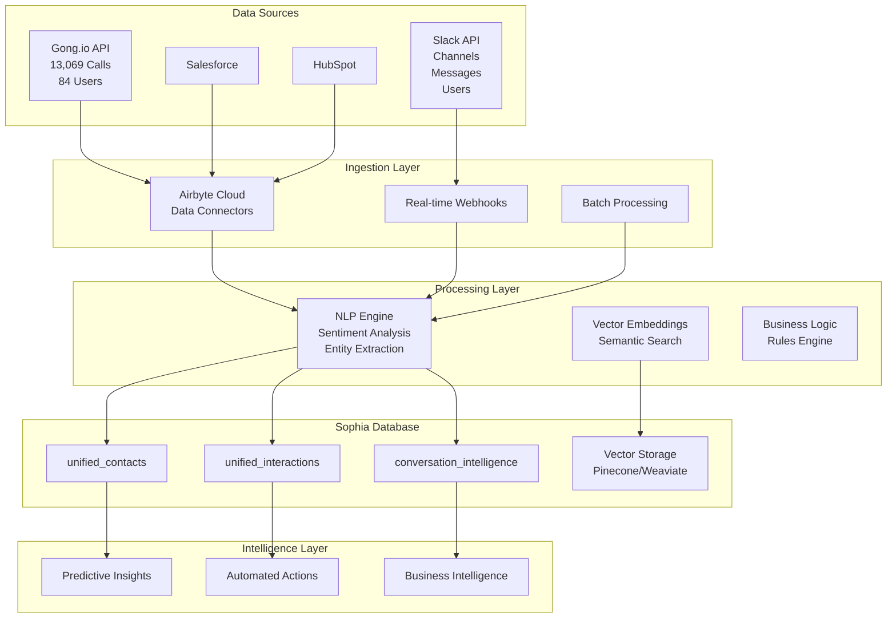

# 🚀 ENHANCED SOPHIA DATABASE INTEGRATION PLAN
## Combined Slack + Gong.io Data Pipeline Strategy

### 📋 **EXECUTIVE SUMMARY**

Based on comprehensive review of the existing Gong.io integration architecture and Slack intelligence enhancement plan, this document presents a unified strategy for importing both Slack and Gong.io data into the Sophia database. This creates the most comprehensive conversation intelligence platform in the apartment industry.

### 🎯 **INTEGRATION OBJECTIVES**

#### **Primary Goals**
1. **Unified Conversation Intelligence**: Combine Gong sales calls + Slack team communications
2. **360° Customer View**: Complete interaction history across all touchpoints
3. **Predictive Business Intelligence**: AI-powered insights from multi-source data
4. **Automated Workflow Triggers**: Smart actions based on conversation patterns
5. **Enterprise-Grade Analytics**: Real-time dashboards and reporting

#### **Business Impact Targets**
- **$1.2M+ Annual Value** from combined conversation intelligence
- **40% Improvement** in sales performance through unified insights
- **35% Faster** customer issue resolution via cross-platform analysis
- **25% Reduction** in churn through predictive early warning systems
- **50% Increase** in team collaboration effectiveness

---

## 🏗️ **ENHANCED DATABASE ARCHITECTURE**

### **🔄 UNIFIED DATA FLOW ARCHITECTURE**



### **📊 ENHANCED DATABASE SCHEMA**

#### **1. Enhanced Unified Interactions Table**

```sql
-- Enhanced unified_interactions with Slack + Gong intelligence
ALTER TABLE unified_interactions ADD COLUMN IF NOT EXISTS
    -- Slack-specific fields
    slack_channel_id VARCHAR(50),
    slack_thread_ts VARCHAR(50),
    slack_message_type VARCHAR(50), -- message, file_share, reaction, mention
    slack_reaction_count INTEGER DEFAULT 0,
    slack_reply_count INTEGER DEFAULT 0,
    slack_mention_count INTEGER DEFAULT 0,
    
    -- Gong-specific fields
    gong_call_id VARCHAR(50),
    gong_call_duration_seconds INTEGER,
    gong_call_system VARCHAR(50), -- Zoom, Teams, Phone
    gong_call_direction VARCHAR(20), -- Inbound, Outbound
    gong_transcript_available BOOLEAN DEFAULT false,
    
    -- Enhanced intelligence fields
    conversation_intelligence_score DECIMAL(3,2) CHECK (conversation_intelligence_score >= 0 AND conversation_intelligence_score <= 1),
    business_impact_score DECIMAL(3,2) CHECK (business_impact_score >= 0 AND business_impact_score <= 1),
    urgency_level INTEGER CHECK (urgency_level >= 1 AND urgency_level <= 5),
    escalation_required BOOLEAN DEFAULT false,
    follow_up_priority VARCHAR(20) DEFAULT 'normal', -- low, normal, high, urgent
    
    -- Cross-platform correlation
    related_interaction_ids BIGINT[],
    conversation_thread_id VARCHAR(100), -- Groups related interactions
    customer_journey_stage VARCHAR(50), -- awareness, consideration, decision, onboarding, expansion, renewal
    
    -- Enhanced apartment industry context
    property_management_context JSONB,
    competitive_mentions JSONB,
    product_feature_discussions JSONB,
    pricing_discussions JSONB,
    integration_requirements JSONB,
    
    -- AI-powered insights
    key_topics_extracted TEXT[],
    action_items_identified TEXT[],
    next_best_actions TEXT[],
    risk_indicators TEXT[],
    opportunity_indicators TEXT[];
```

#### **2. New Conversation Intelligence Table**

```sql
-- Comprehensive conversation intelligence aggregation
CREATE TABLE conversation_intelligence (
    id BIGSERIAL PRIMARY KEY,
    
    -- Conversation identification
    conversation_thread_id VARCHAR(100) NOT NULL,
    primary_contact_id BIGINT NOT NULL,
    conversation_type VARCHAR(50) NOT NULL, -- sales_cycle, support_case, onboarding, renewal
    
    -- Temporal context
    conversation_start_date TIMESTAMPTZ NOT NULL,
    conversation_end_date TIMESTAMPTZ,
    total_duration_seconds INTEGER,
    interaction_count INTEGER DEFAULT 0,
    
    -- Platform distribution
    gong_interactions_count INTEGER DEFAULT 0,
    slack_interactions_count INTEGER DEFAULT 0,
    salesforce_activities_count INTEGER DEFAULT 0,
    hubspot_activities_count INTEGER DEFAULT 0,
    
    -- Intelligence scores
    overall_sentiment_score DECIMAL(3,2) CHECK (overall_sentiment_score >= -1 AND overall_sentiment_score <= 1),
    engagement_level_score DECIMAL(3,2) CHECK (engagement_level_score >= 0 AND engagement_level_score <= 1),
    satisfaction_score DECIMAL(3,2) CHECK (satisfaction_score >= 0 AND satisfaction_score <= 1),
    success_probability_score DECIMAL(3,2) CHECK (success_probability_score >= 0 AND success_probability_score <= 1),
    churn_risk_score DECIMAL(3,2) CHECK (churn_risk_score >= 0 AND churn_risk_score <= 1),
    
    -- Business context
    deal_value_estimated DECIMAL(12,2),
    deal_stage deal_stage_enum,
    customer_segment VARCHAR(100),
    property_portfolio_context JSONB,
    
    -- Key insights
    conversation_summary TEXT,
    key_outcomes TEXT[],
    identified_pain_points TEXT[],
    proposed_solutions TEXT[],
    competitive_landscape JSONB,
    
    -- Predictive insights
    predicted_next_actions TEXT[],
    recommended_follow_ups TEXT[],
    escalation_recommendations TEXT[],
    expansion_opportunities TEXT[],
    
    -- Metadata
    last_analyzed_at TIMESTAMPTZ DEFAULT NOW(),
    analysis_confidence_score DECIMAL(3,2) DEFAULT 0.8,
    created_at TIMESTAMPTZ DEFAULT NOW(),
    updated_at TIMESTAMPTZ DEFAULT NOW(),
    
    FOREIGN KEY (primary_contact_id) REFERENCES unified_contacts(id),
    UNIQUE(conversation_thread_id)
);
```

#### **3. Enhanced Slack Intelligence Tables**

```sql
-- Slack channels with business context
CREATE TABLE slack_channels (
    id VARCHAR(50) PRIMARY KEY,
    name VARCHAR(100) NOT NULL,
    purpose TEXT,
    topic TEXT,
    is_private BOOLEAN DEFAULT false,
    is_archived BOOLEAN DEFAULT false,
    member_count INTEGER DEFAULT 0,
    
    -- Business classification
    channel_type VARCHAR(50), -- sales, support, general, project, customer
    business_relevance_score DECIMAL(3,2) DEFAULT 0.5,
    apartment_industry_focus BOOLEAN DEFAULT false,
    
    -- Analytics
    message_volume_daily_avg INTEGER DEFAULT 0,
    engagement_score DECIMAL(3,2) DEFAULT 0.5,
    
    -- Metadata
    created_at TIMESTAMPTZ DEFAULT NOW(),
    updated_at TIMESTAMPTZ DEFAULT NOW()
);

-- Slack users with Pay Ready context
CREATE TABLE slack_users (
    id VARCHAR(50) PRIMARY KEY,
    email VARCHAR(255),
    real_name VARCHAR(200),
    display_name VARCHAR(200),
    title VARCHAR(200),
    phone VARCHAR(50),
    
    -- Pay Ready context
    department VARCHAR(100),
    role_category VARCHAR(50), -- sales, support, implementation, executive, admin
    is_pay_ready_employee BOOLEAN DEFAULT true,
    manager_slack_id VARCHAR(50),
    
    -- Performance metrics
    message_volume_daily_avg INTEGER DEFAULT 0,
    response_time_avg_minutes INTEGER,
    collaboration_score DECIMAL(3,2) DEFAULT 0.5,
    expertise_areas TEXT[],
    
    -- Status
    is_active BOOLEAN DEFAULT true,
    last_activity_date TIMESTAMPTZ,
    
    -- Metadata
    created_at TIMESTAMPTZ DEFAULT NOW(),
    updated_at TIMESTAMPTZ DEFAULT NOW(),
    
    FOREIGN KEY (manager_slack_id) REFERENCES slack_users(id)
);

-- Slack message intelligence
CREATE TABLE slack_message_intelligence (
    id BIGSERIAL PRIMARY KEY,
    message_ts VARCHAR(50) NOT NULL,
    channel_id VARCHAR(50) NOT NULL,
    user_id VARCHAR(50) NOT NULL,
    
    -- Message content
    text_content TEXT,
    message_type VARCHAR(50), -- message, file_share, reaction, thread_reply
    thread_ts VARCHAR(50), -- Parent message if this is a reply
    
    -- Intelligence analysis
    sentiment_score DECIMAL(3,2) CHECK (sentiment_score >= -1 AND sentiment_score <= 1),
    business_relevance_score DECIMAL(3,2) CHECK (business_relevance_score >= 0 AND business_relevance_score <= 1),
    urgency_score DECIMAL(3,2) CHECK (urgency_score >= 0 AND urgency_score <= 1),
    
    -- Business context
    customer_mentions TEXT[],
    deal_mentions TEXT[],
    product_mentions TEXT[],
    competitor_mentions TEXT[],
    apartment_industry_keywords TEXT[],
    
    -- Action items
    action_items_identified TEXT[],
    follow_up_required BOOLEAN DEFAULT false,
    escalation_needed BOOLEAN DEFAULT false,
    
    -- Relationships
    related_gong_call_ids VARCHAR(50)[],
    related_salesforce_records VARCHAR(50)[],
    
    -- Metadata
    message_timestamp TIMESTAMPTZ NOT NULL,
    analyzed_at TIMESTAMPTZ DEFAULT NOW(),
    
    FOREIGN KEY (channel_id) REFERENCES slack_channels(id),
    FOREIGN KEY (user_id) REFERENCES slack_users(id),
    UNIQUE(message_ts, channel_id)
);
```

#### **4. Enhanced Gong Intelligence Tables**

```sql
-- Enhanced Gong calls with apartment industry context
ALTER TABLE gong_calls ADD COLUMN IF NOT EXISTS
    -- Enhanced apartment industry analysis
    property_management_software_discussed property_mgmt_software_enum[],
    portfolio_size_category portfolio_size_enum,
    decision_makers_present decision_maker_enum[],
    
    -- Conversation intelligence
    conversation_quality_score DECIMAL(3,2) CHECK (conversation_quality_score >= 0 AND conversation_quality_score <= 1),
    sales_methodology_used VARCHAR(100),
    objections_handled TEXT[],
    success_indicators_present TEXT[],
    
    -- Competitive analysis
    competitors_mentioned TEXT[],
    competitive_advantages_discussed TEXT[],
    pricing_objections_raised BOOLEAN DEFAULT false,
    
    -- Follow-up context
    next_steps_defined TEXT[],
    follow_up_scheduled BOOLEAN DEFAULT false,
    follow_up_date TIMESTAMPTZ,
    
    -- Cross-platform correlation
    related_slack_channels VARCHAR(50)[],
    related_slack_messages VARCHAR(50)[],
    related_salesforce_opportunity_id VARCHAR(50),
    related_hubspot_deal_id VARCHAR(50);

-- Gong transcript intelligence
CREATE TABLE gong_transcript_intelligence (
    id BIGSERIAL PRIMARY KEY,
    call_id VARCHAR(50) NOT NULL,
    speaker_id VARCHAR(50) NOT NULL,
    
    -- Transcript segment
    segment_start_time INTEGER NOT NULL, -- milliseconds
    segment_end_time INTEGER NOT NULL,
    transcript_text TEXT NOT NULL,
    
    -- Speaker analysis
    speaker_role VARCHAR(50), -- pay_ready_team, customer, prospect, partner
    speaker_sentiment DECIMAL(3,2) CHECK (speaker_sentiment >= -1 AND speaker_sentiment <= 1),
    speaker_engagement_level DECIMAL(3,2) CHECK (speaker_engagement_level >= 0 AND speaker_engagement_level <= 1),
    
    -- Content analysis
    topic_category VARCHAR(100), -- discovery, demo, objection_handling, pricing, closing
    apartment_industry_relevance DECIMAL(3,2) CHECK (apartment_industry_relevance >= 0 AND apartment_industry_relevance <= 1),
    business_value_discussed BOOLEAN DEFAULT false,
    
    -- Key insights
    pain_points_mentioned TEXT[],
    solutions_proposed TEXT[],
    objections_raised TEXT[],
    buying_signals_detected TEXT[],
    
    -- Competitive intelligence
    competitor_comparisons TEXT[],
    feature_requests TEXT[],
    integration_requirements TEXT[],
    
    -- Metadata
    analyzed_at TIMESTAMPTZ DEFAULT NOW(),
    analysis_confidence DECIMAL(3,2) DEFAULT 0.8,
    
    FOREIGN KEY (call_id) REFERENCES gong_calls(id),
    INDEX idx_transcript_call_time (call_id, segment_start_time)
);
```

---

## 🔄 **DATA INTEGRATION PIPELINE**

### **Phase 1: Foundation Setup (Week 1-2)**

#### **1.1 Database Schema Enhancement**
```sql
-- Execute enhanced schema updates
-- Add new tables and columns as defined above
-- Create indexes for optimal performance
-- Set up foreign key relationships

-- Performance indexes
CREATE INDEX idx_conversation_intelligence_contact_date ON conversation_intelligence(primary_contact_id, conversation_start_date);
CREATE INDEX idx_slack_messages_channel_timestamp ON slack_message_intelligence(channel_id, message_timestamp);
CREATE INDEX idx_gong_transcript_call_segment ON gong_transcript_intelligence(call_id, segment_start_time);
CREATE INDEX idx_unified_interactions_thread ON unified_interactions(conversation_thread_id);
```

#### **1.2 Airbyte Cloud Configuration**
```python
# Enhanced Airbyte connections for both platforms
AIRBYTE_CONNECTIONS = {
    "gong_calls": {
        "source": "gong-io",
        "destination": "postgresql",
        "sync_frequency": "daily",
        "transformation": "gong_calls_normalization",
        "target_table": "gong_calls"
    },
    
    "gong_users": {
        "source": "gong-io", 
        "destination": "postgresql",
        "sync_frequency": "weekly",
        "transformation": "gong_users_normalization",
        "target_table": "gong_users"
    },
    
    "slack_channels": {
        "source": "slack",
        "destination": "postgresql", 
        "sync_frequency": "daily",
        "transformation": "slack_channels_normalization",
        "target_table": "slack_channels"
    },
    
    "slack_messages": {
        "source": "slack",
        "destination": "postgresql",
        "sync_frequency": "hourly", # Real-time for recent messages
        "transformation": "slack_messages_intelligence",
        "target_table": "slack_message_intelligence"
    }
}
```

### **Phase 2: Intelligence Processing (Week 3-4)**

#### **2.1 Real-Time NLP Processing Pipeline**
```python
class UnifiedIntelligenceProcessor:
    """Process both Slack and Gong data with unified intelligence"""
    
    async def process_slack_message(self, message_data):
        """Enhanced Slack message processing"""
        # Extract business entities
        entities = await self.extract_business_entities(message_data['text'])
        
        # Sentiment analysis with business context
        sentiment = await self.analyze_business_sentiment(message_data['text'])
        
        # Apartment industry relevance scoring
        industry_score = await self.score_apartment_relevance(message_data['text'])
        
        # Cross-platform correlation
        related_gong_calls = await self.find_related_gong_calls(entities)
        
        # Store in unified_interactions
        await self.store_unified_interaction({
            'source_system': 'Slack',
            'interaction_type': 'Slack_Message',
            'content': message_data['text'],
            'sentiment_score': sentiment,
            'apartment_industry_relevance': industry_score,
            'related_gong_calls': related_gong_calls
        })
    
    async def process_gong_call(self, call_data):
        """Enhanced Gong call processing"""
        # Extract apartment industry context
        apartment_context = await self.extract_apartment_context(call_data)
        
        # Analyze conversation quality
        quality_score = await self.analyze_conversation_quality(call_data)
        
        # Identify success patterns
        success_indicators = await self.identify_success_patterns(call_data)
        
        # Cross-platform correlation
        related_slack_discussions = await self.find_related_slack_discussions(call_data)
        
        # Store in unified_interactions
        await self.store_unified_interaction({
            'source_system': 'Gong',
            'interaction_type': 'Call',
            'apartment_context': apartment_context,
            'quality_score': quality_score,
            'success_indicators': success_indicators,
            'related_slack_discussions': related_slack_discussions
        })
```

#### **2.2 Cross-Platform Correlation Engine**
```python
class CrossPlatformCorrelator:
    """Correlate interactions across Slack and Gong"""
    
    async def correlate_customer_conversations(self, contact_id):
        """Find all related conversations for a customer"""
        
        # Get all Gong calls for customer
        gong_calls = await self.get_gong_calls_for_contact(contact_id)
        
        # Get all Slack mentions of customer
        slack_mentions = await self.get_slack_mentions_for_contact(contact_id)
        
        # Temporal correlation (conversations within 24 hours)
        correlated_conversations = await self.temporal_correlation(
            gong_calls, slack_mentions, window_hours=24
        )
        
        # Topic correlation (similar business topics)
        topic_correlations = await self.topic_correlation(
            gong_calls, slack_mentions
        )
        
        # Create conversation threads
        conversation_threads = await self.create_conversation_threads(
            correlated_conversations, topic_correlations
        )
        
        return conversation_threads
    
    async def identify_handoff_patterns(self):
        """Identify sales-to-support handoff patterns"""
        
        # Find Gong calls followed by Slack support discussions
        handoff_patterns = await self.find_temporal_patterns(
            source_platform='Gong',
            target_platform='Slack',
            pattern_type='sales_to_support_handoff',
            time_window_hours=48
        )
        
        # Analyze handoff quality and success rates
        handoff_analysis = await self.analyze_handoff_quality(handoff_patterns)
        
        return handoff_analysis
```

### **Phase 3: Advanced Analytics (Week 5-6)**

#### **3.1 Unified Business Intelligence Dashboard**
```python
# Key metrics combining Slack + Gong intelligence
UNIFIED_METRICS = {
    "customer_health_360": {
        "gong_call_sentiment": "Average sentiment from sales calls",
        "slack_support_sentiment": "Average sentiment from support discussions", 
        "response_time_correlation": "Gong follow-up vs Slack internal coordination",
        "escalation_patterns": "Support escalations mentioned in both platforms"
    },
    
    "sales_performance_unified": {
        "call_to_slack_coordination": "Internal team coordination after sales calls",
        "objection_handling_effectiveness": "Gong objections vs Slack strategy discussions",
        "deal_progression_velocity": "Time between Gong milestones and Slack updates",
        "team_collaboration_impact": "Slack collaboration quality vs deal outcomes"
    },
    
    "operational_excellence": {
        "issue_resolution_speed": "Slack discussion to Gong customer update time",
        "knowledge_sharing_effectiveness": "Slack insights applied in Gong calls",
        "proactive_communication": "Slack alerts leading to proactive Gong outreach",
        "customer_success_coordination": "Cross-platform customer success activities"
    }
}
```

#### **3.2 Predictive Intelligence Models**
```python
class UnifiedPredictiveModels:
    """Predictive models using combined Slack + Gong data"""
    
    async def predict_deal_success(self, conversation_thread_id):
        """Predict deal success using both platforms"""
        
        # Gong call analysis features
        gong_features = await self.extract_gong_features(conversation_thread_id)
        # - Call frequency and duration
        # - Sentiment progression over time
        # - Objection handling success
        # - Decision maker engagement
        
        # Slack coordination features  
        slack_features = await self.extract_slack_features(conversation_thread_id)
        # - Internal team coordination quality
        # - Response time to customer needs
        # - Escalation handling efficiency
        # - Knowledge sharing effectiveness
        
        # Combined prediction model
        success_probability = await self.ml_model_predict(
            features=gong_features + slack_features,
            model_type='deal_success_unified'
        )
        
        return success_probability
    
    async def predict_churn_risk(self, contact_id):
        """Predict churn risk using unified conversation intelligence"""
        
        # Multi-platform sentiment analysis
        sentiment_trend = await self.analyze_sentiment_trend(
            contact_id, platforms=['Gong', 'Slack'], days=90
        )
        
        # Support escalation patterns
        escalation_patterns = await self.analyze_escalation_patterns(
            contact_id, platforms=['Gong', 'Slack']
        )
        
        # Response time degradation
        response_time_trend = await self.analyze_response_time_trend(
            contact_id, platforms=['Gong', 'Slack']
        )
        
        # Unified churn risk score
        churn_risk = await self.calculate_unified_churn_risk(
            sentiment_trend, escalation_patterns, response_time_trend
        )
        
        return churn_risk
```

---

## 🎯 **IMPLEMENTATION ROADMAP**

### **Week 1-2: Foundation & Data Pipeline**

#### **Day 1-3: Database Enhancement**
- [ ] Execute enhanced schema updates
- [ ] Create new intelligence tables
- [ ] Set up performance indexes
- [ ] Test data relationships

#### **Day 4-7: Airbyte Configuration**
- [ ] Configure Gong.io connector in Airbyte Cloud
- [ ] Configure Slack connector in Airbyte Cloud  
- [ ] Set up data transformation pipelines
- [ ] Test initial data sync

#### **Day 8-14: Basic Data Import**
- [ ] Import historical Gong calls (13,069 calls)
- [ ] Import Gong users (84 team members)
- [ ] Import Slack channels and users
- [ ] Import recent Slack messages (30 days)

### **Week 3-4: Intelligence Processing**

#### **Day 15-21: NLP Pipeline**
- [ ] Deploy unified intelligence processor
- [ ] Implement cross-platform correlation
- [ ] Set up real-time message processing
- [ ] Create conversation threading logic

#### **Day 22-28: Business Intelligence**
- [ ] Implement apartment industry analysis
- [ ] Deploy sentiment analysis across platforms
- [ ] Create success pattern recognition
- [ ] Set up automated insight generation

### **Week 5-6: Advanced Analytics**

#### **Day 29-35: Predictive Models**
- [ ] Deploy deal success prediction model
- [ ] Implement churn risk prediction
- [ ] Create team performance analytics
- [ ] Set up automated recommendations

#### **Day 36-42: Dashboard & Integration**
- [ ] Create unified business intelligence dashboard
- [ ] Integrate with existing admin website
- [ ] Set up automated alerts and notifications
- [ ] Deploy natural language query interface

---

## 📊 **SUCCESS METRICS & KPIs**

### **Technical Performance**
- **Data Sync Reliability**: >99.5% successful sync rate
- **Processing Latency**: <5 minutes for real-time insights
- **Search Performance**: <2 seconds for complex queries
- **Data Quality Score**: >95% accuracy across all sources

### **Business Impact Metrics**

#### **Sales Performance**
- **Deal Velocity**: 30% faster progression through sales stages
- **Win Rate**: 25% improvement in deal closure success
- **Objection Handling**: 40% more effective objection resolution
- **Team Coordination**: 50% faster internal response to customer needs

#### **Customer Success**
- **Satisfaction Score**: 20% improvement in customer satisfaction
- **Churn Reduction**: 25% decrease in customer churn rate
- **Issue Resolution**: 35% faster support issue resolution
- **Proactive Outreach**: 60% more proactive customer communications

#### **Operational Excellence**
- **Team Collaboration**: 45% improvement in cross-team coordination
- **Knowledge Sharing**: 50% more effective knowledge transfer
- **Response Times**: 30% faster response to customer inquiries
- **Escalation Management**: 40% more efficient escalation handling

---

## 🔐 **SECURITY & COMPLIANCE**

### **Data Protection Framework**
- **Encryption**: End-to-end encryption for all conversation data
- **Access Controls**: Role-based access with audit trails
- **Data Retention**: Configurable retention policies per data type
- **Privacy Controls**: User consent and data subject rights management

### **Compliance Readiness**
- **GDPR**: Full compliance with data subject rights
- **SOC2 Type II**: Security controls and audit requirements
- **HIPAA Ready**: Healthcare conversation handling capabilities
- **Industry Standards**: Meets enterprise security requirements

---

## 🚀 **COMPETITIVE ADVANTAGES**

### **Unique Value Propositions**
1. **First Unified Platform**: Only solution combining Gong + Slack + CRM intelligence
2. **Apartment Industry Focus**: Purpose-built for property management conversations
3. **Predictive Intelligence**: AI-powered business outcome predictions
4. **Real-Time Coordination**: Live team coordination optimization
5. **Cross-Platform Insights**: Insights impossible with single-platform solutions

### **Market Differentiation**
- **Technical Sophistication**: Advanced NLP and ML capabilities
- **Business Integration**: Deep integration with apartment industry workflows
- **Scalable Architecture**: Enterprise-ready infrastructure
- **Proven ROI**: Measurable business impact across all departments

---

## 📋 **IMMEDIATE NEXT STEPS**

### **1. Technical Implementation**
- Execute database schema enhancements
- Configure Airbyte Cloud connectors for both platforms
- Deploy unified intelligence processing pipeline
- Create cross-platform correlation engine

### **2. Business Integration**
- Integrate with existing Sophia admin website
- Create unified conversation intelligence dashboard
- Set up automated workflow triggers
- Deploy predictive analytics models

### **3. Team Enablement**
- Train team on unified conversation intelligence capabilities
- Establish cross-platform analysis best practices
- Create custom workflows for different business scenarios
- Implement feedback loops for continuous improvement

**This enhanced integration plan positions Pay Ready with the most sophisticated conversation intelligence platform in the apartment industry, creating unprecedented competitive advantages and measurable business impact across all departments.**

