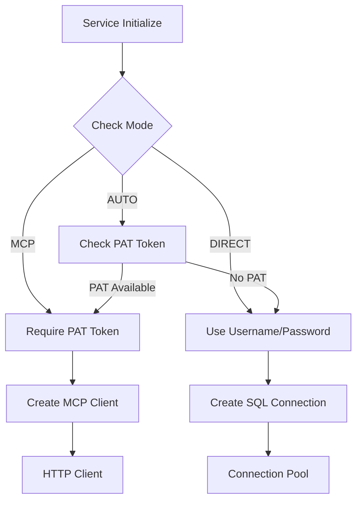

# Lambda GPU Layer Architecture

## Overview

The Lambda GPU layer provides AI and machine learning capabilities directly within Modern Stack, eliminating the need for external LLM calls for many operations. This architecture document details the implementation of the dual-mode Cortex adapter and its integration with the broader Sophia AI platform.

## Architecture Components

### 1. Dual-Mode Adapter

The Cortex adapter supports two operational modes to provide flexibility and compatibility:

```
┌─────────────────────────────────────────────────────────────────┐
│                    Cortex Service Layer                          │
├─────────────────────────────────────────────────────────────────┤
│  ┌─────────────────┐        ┌──────────────────────────────┐   │
│  │   Direct Mode   │        │         MCP Mode             │   │
│  ├─────────────────┤        ├──────────────────────────────┤   │
│  │ • SQL Functions │        │ • RESTful API               │   │
│  │ • Batch Ops     │        │ • Tool Interfaces           │   │
│  │ • Low Latency   │        │ • Enhanced Features         │   │
│  │ • Native Auth   │        │ • PAT Authentication        │   │
│  └─────────────────┘        └──────────────────────────────┘   │
├─────────────────────────────────────────────────────────────────┤
│                    Connection Pool Manager                       │
│                  (8 concurrent connections)                      │
├─────────────────────────────────────────────────────────────────┤
│                      Redis Cache Layer                           │
│                  (Semantic similarity cache)                     │
└─────────────────────────────────────────────────────────────────┘
```

### 2. Task Routing

Different tasks are routed to the optimal mode based on their characteristics:

| Task Type | Preferred Mode | Reasoning |
|-----------|----------------|-----------|
| SQL Generation | DIRECT | Native SQL context |
| Embeddings | DIRECT | Batch processing efficiency |
| Text Completion | MCP | Enhanced model selection |
| Sentiment Analysis | DIRECT | Built-in function |
| Cortex Search | MCP | Only available via MCP |
| Cortex Analyst | MCP | Only available via MCP |

### 3. Authentication Flow



## Implementation Details

### Module Structure

```
shared/utils/snowflake_cortex/
├── __init__.py          # Public API exports
├── service.py           # Main Modern StackCortexService class
├── core.py             # DirectCortexCore for SQL operations
├── mcp_client.py       # Modern StackMCPClient for MCP operations
├── enums.py            # CortexModel, TaskType, MCPMode enums
├── pool.py             # AsyncConnectionPool management
├── cache.py            # CortexCache for result caching
└── errors.py           # Custom exception classes
```

### Key Classes

#### Modern StackCortexService
The main facade that provides a unified interface:
- Automatic mode detection
- Task routing logic
- Metrics collection
- Cache management

#### DirectCortexCore
Handles direct SQL execution:
- Connection pool management
- SQL function wrappers
- Result parsing
- Error handling

#### Modern StackMCPClient
Manages MCP server communication:
- PAT authentication
- HTTP client management
- Tool method implementations
- Response parsing

### Performance Optimizations

1. **Connection Pooling**
   - Maintains 2-8 persistent connections
   - Automatic connection recycling
   - Health checking

2. **Result Caching**
   - Redis-based cache with TTL
   - Semantic similarity matching
   - Cache key generation using SHA256

3. **Async Operations**
   - All I/O operations are async
   - Concurrent request handling
   - Non-blocking execution

## Cortex Functions

### Available in Both Modes

| Function | SQL Function | Description |
|----------|--------------|-------------|
| Embedding | `SNOWFLAKE.CORTEX.EMBED_TEXT()` | Generate text embeddings |
| Completion | `SNOWFLAKE.CORTEX.COMPLETE()` | Text generation |
| Sentiment | `SNOWFLAKE.CORTEX.SENTIMENT()` | Sentiment analysis |
| Summarization | `SNOWFLAKE.CORTEX.SUMMARIZE()` | Text summarization |
| Translation | `SNOWFLAKE.CORTEX.TRANSLATE()` | Language translation |

### MCP Mode Exclusive

| Function | Description |
|----------|-------------|
| Cortex Search | Semantic search across documents |
| Cortex Analyst | Natural language to SQL |
| Model Management | List and configure models |

## Configuration

### Environment Variables

```bash
# Mode selection
CORTEX_MODE=auto|direct|mcp

# MCP Configuration
SNOWFLAKE_MCP_PAT=<your-pat-token>
SNOWFLAKE_MCP_URL=http://snowflake-mcp:9130

# Direct Mode (from Pulumi ESC)
SNOWFLAKE_ACCOUNT=<account>
SNOWFLAKE_USER=<username>
SNOWFLAKE_PASSWORD=<password>
SNOWFLAKE_WAREHOUSE=<warehouse>
SNOWFLAKE_DATABASE=<database>
SNOWFLAKE_SCHEMA=<schema>
```

### Pulumi ESC Integration

The service automatically loads credentials from Pulumi ESC:

```python
# Direct mode credentials
snowflake_user = get_config_value("snowflake_user")
snowflake_password = get_config_value("snowflake_password")

# MCP mode credentials
snowflake_pat = get_config_value("snowflake_mcp_pat")
```

## Usage Examples

### Basic Usage

```python
from shared.utils.snowflake_cortex import Modern StackCortexService

# Auto mode (recommended)
service = Modern StackCortexService()

# Generate embedding
async with service.session():
    embedding = await service.generate_embedding("Hello world")

# Text completion
async with service.session():
    response = await service.complete_text_with_cortex(
        "Write a SQL query to find top customers",
        model=CortexModel.MISTRAL_7B
    )
```

### Advanced Usage

```python
# Force specific mode
service = Modern StackCortexService(mode=MCPMode.MCP)

# Use Cortex Search (MCP only)
async with service.session():
    results = await service.search(
        query="revenue growth strategies",
        service="business_docs",
        columns=["title", "content", "author"]
    )

# Use Cortex Analyst (MCP only)
async with service.session():
    analysis = await service.analyze(
        query="What were our top performing products last quarter?",
        context={"schema": "sales_data"}
    )
```

## Monitoring and Metrics

### Prometheus Metrics

```python
# Request metrics
cortex_requests_total{mode="direct|mcp", task_type="...", model="..."}

# Error metrics
cortex_errors_total{mode="...", task_type="...", error_type="..."}

# Latency metrics
cortex_latency_seconds{mode="...", task_type="..."}

# Cache metrics
cortex_cache_hits_total{task_type="..."}
```

### Health Checks

```python
# Check service health
if service.is_initialized:
    mode = service.current_mode
    print(f"Cortex service healthy in {mode} mode")
```

## Migration Guide

### From Monolithic Service

```python
# Old import (still works via compatibility wrapper)
from shared.utils.snowflake_cortex_service import Modern StackCortexService

# New import (recommended)
from shared.utils.snowflake_cortex import Modern StackCortexService
```

### Adding PAT Support

1. Generate PAT in Modern Stack UI or via SQL
2. Add to GitHub Organization Secrets: `SNOWFLAKE_MCP_PAT_PROD`
3. Sync to Pulumi ESC via GitHub Actions
4. Service auto-detects and uses MCP mode

## Best Practices

1. **Use AUTO mode** unless you have specific requirements
2. **Enable caching** for repeated queries
3. **Monitor metrics** to optimize mode selection
4. **Batch operations** when using DIRECT mode
5. **Handle errors** gracefully with mode fallback

## Security Considerations

1. **PAT Tokens**: Rotate every 90 days
2. **Credential Storage**: Always use Pulumi ESC
3. **Network Security**: MCP server should be internal only
4. **Audit Logging**: All operations are logged
5. **Access Control**: Use minimal required permissions

## Future Enhancements

1. **Intelligent Mode Selection**: ML-based routing
2. **Multi-Region Support**: Geographic distribution
3. **Advanced Caching**: Vector similarity search
4. **Performance Profiling**: Automatic optimization
5. **Extended Models**: Support for new Cortex models
