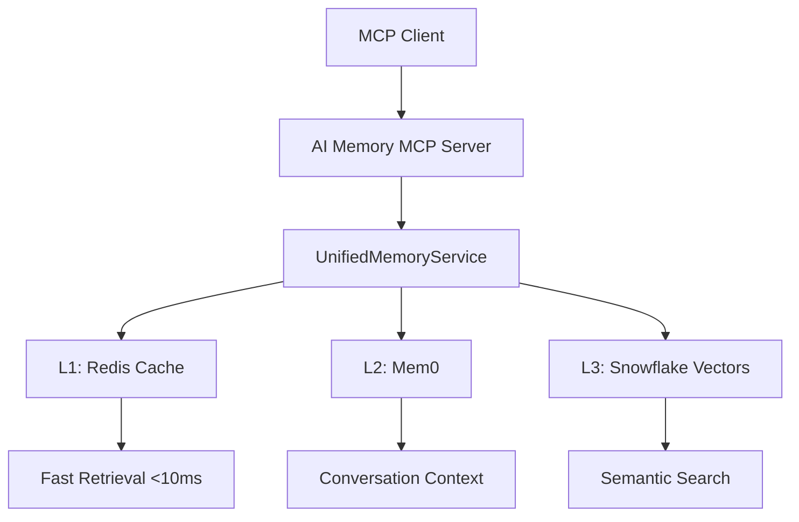

# AI Memory MCP Server v2.0 - Complete Guide

**Version:** 2.0 (Unified Memory Architecture)  
**Status:** Production Ready  
**Port:** 9000  

---

## Overview

The AI Memory MCP Server v2.0 is a complete rewrite that integrates with the Sophia AI Unified Memory Service. It provides a standard MCP interface for memory operations while leveraging the powerful 6-tier memory architecture.

### Key Features
- **Real Embeddings**: Uses Snowflake Cortex for semantic search
- **Multi-Tier Storage**: L1 Redis cache, L2 Mem0 conversations, L3-L5 Snowflake
- **Intelligent Caching**: Automatic result and vector caching
- **Performance Metrics**: Built-in Prometheus monitoring
- **Full MCP Compliance**: Standard tool interface

---

## Architecture



---

## Installation & Setup

### Prerequisites
```bash
# Required services
- Redis 7.0+
- Snowflake account with Cortex enabled
- Python 3.11+
- OpenAI API key (for Mem0 embeddings)
```

### Installation
```bash
# Install dependencies
pip install fastmcp mem0ai redis snowflake-connector-python

# Set environment variables
export SNOWFLAKE_ACCOUNT="your-account"
export SNOWFLAKE_USER="your-user"
export SNOWFLAKE_PASSWORD="your-password"
export OPENAI_API_KEY="your-key"
export REDIS_HOST="localhost"
export REDIS_PORT="6379"
```

### Running the Server
```bash
# Start the server
cd mcp-servers/ai_memory
python server.py

# Server will start on port 9000
# INFO: AI Memory MCP Server v2.0 running on port 9000
```

---

## MCP Tools Reference

### store_memory
Stores information in the unified memory system.

**Parameters:**
- `content` (string, required): The information to store
- `metadata` (object, optional): Additional context
  - `tags` (array): Categorization tags
  - `source` (string): Source of information
  - `importance` (string): Priority level

**Example:**
```json
{
  "tool": "store_memory",
  "arguments": {
    "content": "Q2 revenue exceeded targets by 15%",
    "metadata": {
      "tags": ["revenue", "quarterly"],
      "source": "earnings_report",
      "importance": "high"
    }
  }
}
```

**Response:**
```json
{
  "stored": true,
  "memory_id": "550e8400-e29b-41d4-a716-446655440000",
  "layer": "L3_snowflake",
  "cached": true
}
```

### search_memory
Searches for relevant information using semantic search.

**Parameters:**
- `query` (string, required): Search query
- `limit` (integer, optional): Max results (default: 10)
- `metadata_filter` (object, optional): Filter by metadata

**Example:**
```json
{
  "tool": "search_memory",
  "arguments": {
    "query": "revenue performance",
    "limit": 5,
    "metadata_filter": {
      "tags": ["revenue"],
      "importance": "high"
    }
  }
}
```

**Response:**
```json
{
  "results": [
    {
      "content": "Q2 revenue exceeded targets by 15%",
      "similarity": 0.92,
      "metadata": {
        "tags": ["revenue", "quarterly"],
        "source": "earnings_report"
      },
      "cached": true,
      "retrieval_time_ms": 8
    }
  ],
  "total_results": 1,
  "from_cache": true
}
```

### remember_conversation
Stores conversation context for the current user.

**Parameters:**
- `user_id` (string, required): User identifier
- `messages` (array, required): Conversation messages
  - `role` (string): "user" or "assistant"
  - `content` (string): Message content

**Example:**
```json
{
  "tool": "remember_conversation",
  "arguments": {
    "user_id": "ceo",
    "messages": [
      {
        "role": "user",
        "content": "What was our Q2 performance?"
      },
      {
        "role": "assistant",
        "content": "Q2 revenue exceeded targets by 15%"
      }
    ]
  }
}
```

### get_conversation_context
Retrieves recent conversation history for a user.

**Parameters:**
- `user_id` (string, required): User identifier
- `limit` (integer, optional): Max messages (default: 10)

**Example:**
```json
{
  "tool": "get_conversation_context",
  "arguments": {
    "user_id": "ceo",
    "limit": 5
  }
}
```

### analyze_with_ai
Uses Snowflake Cortex AI for advanced operations.

**Parameters:**
- `text` (string, required): Text to analyze
- `operation` (string, required): One of: SUMMARIZE, SENTIMENT, TRANSLATE, COMPLETE
- `options` (object, optional): Operation-specific options

**Example:**
```json
{
  "tool": "analyze_with_ai",
  "arguments": {
    "text": "Long quarterly report text...",
    "operation": "SUMMARIZE"
  }
}
```

### get_memory_stats
Returns memory system statistics and health.

**Example:**
```json
{
  "tool": "get_memory_stats",
  "arguments": {}
}
```

**Response:**
```json
{
  "layers": {
    "L1_redis": {
      "available": true,
      "cache_hit_rate": 0.82,
      "memory_used_mb": 234,
      "total_keys": 1523
    },
    "L2_mem0": {
      "available": true,
      "total_memories": 4521,
      "active_users": 12
    },
    "L3_snowflake": {
      "available": true,
      "total_vectors": 125430,
      "database_size_gb": 2.4
    }
  },
  "performance": {
    "avg_search_time_ms": 145,
    "cache_hit_rate": 0.82,
    "total_queries_24h": 15234
  }
}
```

---

## Usage Examples

### Cursor/Claude Integration
```typescript
// In cursor_mcp_config.json
{
  "mcpServers": {
    "ai-memory": {
      "command": "python",
      "args": ["/path/to/mcp-servers/ai_memory/server.py"],
      "env": {
        "PORT": "9000"
      }
    }
  }
}
```

### Python Client Example
```python
from mcp import Client

# Connect to server
client = Client("http://localhost:9000")

# Store knowledge
result = await client.call_tool(
    "store_memory",
    content="Important business insight",
    metadata={"importance": "high"}
)

# Search knowledge
results = await client.call_tool(
    "search_memory",
    query="business insights",
    limit=5
)

# Remember conversation
await client.call_tool(
    "remember_conversation",
    user_id="user123",
    messages=[
        {"role": "user", "content": "Tell me about Q2"},
        {"role": "assistant", "content": "Q2 was strong..."}
    ]
)
```

---

## Performance Optimization

### Caching Strategy
1. **Search Results**: Cached for 30 minutes
2. **Vector Embeddings**: Cached for 2 hours
3. **Conversation Context**: Cached for session duration

### Best Practices
```python
# Batch operations for efficiency
memories = [
    "First insight",
    "Second insight",
    "Third insight"
]

for memory in memories:
    await client.call_tool(
        "store_memory",
        content=memory,
        metadata={"batch": "insights"}
    )

# Use metadata filters for faster searches
results = await client.call_tool(
    "search_memory",
    query="revenue",
    metadata_filter={"importance": "high"}
)
```

---

## Monitoring & Debugging

### Health Check
```bash
curl http://localhost:9000/health
```

### Metrics Endpoint
```bash
curl http://localhost:9000/metrics
```

### Debug Mode
```bash
# Start with debug logging
DEBUG=true python server.py
```

### Common Issues

1. **Snowflake Connection**
   - Verify credentials in environment
   - Check network connectivity
   - Ensure Cortex is enabled

2. **Redis Connection**
   - Verify Redis is running
   - Check connection settings
   - Monitor memory usage

3. **Mem0 Issues**
   - Verify OpenAI API key
   - Check embedding model availability
   - Monitor token usage

---

## Migration from v1

### Key Differences
1. **Real Embeddings**: No more random vectors
2. **Persistent Storage**: Snowflake instead of in-memory
3. **Caching Layer**: Redis for performance
4. **Conversation Memory**: Mem0 integration

### Migration Script
```python
# Export from v1 (if needed)
old_memories = load_v1_memories()

# Import to v2
client = Client("http://localhost:9000")
for memory in old_memories:
    await client.call_tool(
        "store_memory",
        content=memory["content"],
        metadata=memory.get("metadata", {})
    )
```

---

## Security Considerations

### Authentication
- API keys stored in environment variables
- Snowflake PAT token for secure access
- Redis password protection

### Data Privacy
- User-specific data isolation
- Encrypted storage at rest
- TLS for data in transit

### Access Control
```python
# User-specific queries
results = await client.call_tool(
    "search_memory",
    query="confidential",
    metadata_filter={"user_id": current_user_id}
)
```

---

## Roadmap

### v2.1 (Q3 2025)
- Streaming responses for large results
- WebSocket support for real-time updates
- Enhanced metadata search

### v2.2 (Q4 2025)
- Multi-modal memory (images, audio)
- Memory versioning
- Advanced analytics

### v3.0 (2026)
- Distributed architecture
- External API access
- Memory marketplace integration

---

## Support & Resources

- **Documentation**: `/docs/06-mcp-servers/`
- **Issues**: GitHub Issues
- **Monitoring**: Grafana dashboards
- **Logs**: `/var/log/mcp/ai-memory/`

---

*Last Updated: July 10, 2025* 