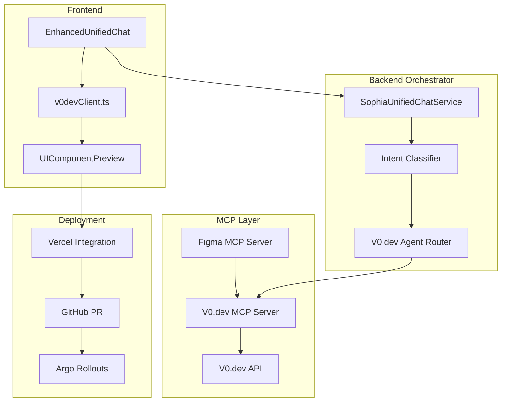

# V0.dev Integration Guide for Sophia AI

## Overview

This guide provides comprehensive instructions for integrating V0.dev's AI-driven UI component generation capabilities into the Sophia AI platform. The integration enables real-time component creation, design-to-code automation, and seamless deployment to Vercel.

## Architecture Overview



## Prerequisites

1. **API Access**
   - V0.dev API key stored in Pulumi ESC as `VERCEL_V0DEV_API_KEY`
   - Vercel project configured for deployment
   - Figma API access for design context

2. **Infrastructure**
   - Docker Swarm on Lambda Labs
   - Kubernetes cluster for MCP servers
   - GitHub Actions with secrets configured

3. **Development Environment**
   - Node.js 18+
   - Python 3.12+
   - Docker Desktop
   - Cursor IDE with MCP support

## Installation Steps

### 1. Configure Pulumi ESC

Add the V0.dev API key to your Pulumi ESC configuration:

```bash
# Set the secret in GitHub Organization
gh secret set VERCEL_V0DEV_API_KEY --org ai-cherry

# Verify sync to Pulumi ESC
pulumi env open scoobyjava-org/default/sophia-ai-production
```

### 2. Deploy the V0.dev MCP Server

```bash
# Build and push Docker image
cd mcp-servers/v0dev
docker build -t scoobyjava15/sophia-ai-v0dev:latest .
docker push scoobyjava15/sophia-ai-v0dev:latest

# Deploy to Lambda Labs
ssh ubuntu@104.171.202.64
docker stack deploy -c docker-compose.cloud.yml sophia-ai

# Verify deployment
docker service ps v0dev-mcp
curl http://104.171.202.64:9030/health
```

### 3. Update Backend Orchestrator

The orchestrator automatically routes UI generation intents to the V0.dev MCP server. Ensure the intent classification includes:

```python
# In SophiaUnifiedChatService
UI_GENERATION_PATTERNS = [
    "generate ui",
    "create component",
    "design component",
    "ui from",
    "component with"
]
```

### 4. Configure Frontend Integration

The frontend components are already created:
- `frontend/src/services/v0devClient.ts` - API client
- `frontend/src/components/UIComponentPreview.tsx` - Preview component

Integrate into your chat interface:

```tsx
import { v0devClient } from '@/services/v0devClient';
import { UIComponentPreview } from '@/components/UIComponentPreview';

// In your chat component
const [generatedComponent, setGeneratedComponent] = useState(null);
const [isGenerating, setIsGenerating] = useState(false);

const handleGenerateComponent = async (prompt: string) => {
  setIsGenerating(true);
  try {
    // Get Figma context if available
    const designContext = await v0devClient.getFigmaContext();
    
    // Generate component
    const component = await v0devClient.generateComponent({
      prompt,
      designContext,
      typescript: true,
      includeTests: true
    });
    
    setGeneratedComponent(component);
  } catch (error) {
    console.error('Failed to generate component:', error);
  } finally {
    setIsGenerating(false);
  }
};
```

## Usage Examples

### Basic Component Generation

```bash
# Via Cursor IDE
@v0dev create a modern dashboard card with title, metrics, and trend indicator

# Via API
curl -X POST http://localhost:9030/api/v1/generate \
  -H "Content-Type: application/json" \
  -d '{
    "prompt": "Create a responsive data table with sorting and filtering",
    "styling": "tailwind",
    "typescript": true
  }'
```

### With Figma Design Context

```typescript
// Fetch current Figma context
const figmaContext = await v0devClient.getFigmaContext('file-id');

// Generate component with design tokens
const component = await v0devClient.generateComponent({
  prompt: "Create a button matching our design system",
  designContext: figmaContext
});
```

### Streaming Generation

```typescript
let componentCode = '';

await v0devClient.streamComponent(
  { prompt: "Create a complex form with validation" },
  (chunk) => {
    componentCode += chunk;
    // Update preview in real-time
  },
  () => console.log('Generation complete'),
  (error) => console.error('Generation failed:', error)
);
```

## N8N Automation Workflow

### Design-to-Code Pipeline

1. **Create N8N Workflow**
   ```json
   {
     "nodes": [
       {
         "name": "Figma Webhook",
         "type": "n8n-nodes-base.webhook",
         "webhookId": "figma-design-update"
       },
       {
         "name": "V0.dev Generate",
         "type": "n8n-nodes-base.httpRequest",
         "url": "http://v0dev-mcp:9030/api/v1/generate",
         "method": "POST"
       },
       {
         "name": "GitHub PR",
         "type": "n8n-nodes-base.github",
         "operation": "createPullRequest"
       }
     ]
   }
   ```

2. **Configure Webhook in Figma**
   - Go to Figma project settings
   - Add webhook URL: `https://n8n.sophia-ai.lambda.cloud/webhook/figma-design-update`
   - Select events: Component created/updated

3. **Automatic PR Creation**
   - Generated components are committed to `feature/ui-components` branch
   - PR includes component code, tests, and preview link
   - Triggers CI/CD pipeline for validation

## Monitoring & Metrics

### Prometheus Metrics

Access metrics at `http://104.171.202.64:9030/metrics`:

- `v0dev_component_generations_total` - Total generations by status
- `v0dev_component_generation_duration_seconds` - Generation time histogram
- `v0dev_api_errors_total` - API errors by type

### Grafana Dashboard

Import the dashboard from `monitoring/dashboards/v0dev-dashboard.json`:

1. Open Grafana: `http://104.171.202.64:3000`
2. Go to Dashboards → Import
3. Upload the JSON file
4. Select Prometheus data source

### Health Monitoring

```bash
# Check service health
curl http://104.171.202.64:9030/health

# Check API connectivity
curl http://104.171.202.64:9030/ready

# View service logs
docker service logs v0dev-mcp --follow
```

## Troubleshooting

### Common Issues

#### 1. API Key Not Found
```bash
# Verify secret in Docker
docker exec $(docker ps -q -f name=v0dev-mcp) env | grep V0DEV

# Check Pulumi ESC
pulumi env get sophia.ai.vercel_v0dev.api_key
```

#### 2. Component Generation Fails
- Check API response in server logs
- Verify prompt doesn't exceed 4000 tokens
- Ensure design context is valid JSON

#### 3. Streaming Not Working
- Verify SSE support in client
- Check for proxy/firewall blocking SSE
- Test with curl: `curl -N http://localhost:9030/api/v1/stream`

#### 4. Deployment Issues
- Verify Docker secret exists: `docker secret ls`
- Check service constraints: `docker service ps v0dev-mcp`
- Review deployment logs: `docker service logs v0dev-mcp`

### Debug Mode

Enable debug logging:

```bash
# Update service with debug logging
docker service update \
  --env-add LOG_LEVEL=DEBUG \
  v0dev-mcp

# View debug logs
docker service logs v0dev-mcp --follow | grep DEBUG
```

## Security Considerations

1. **API Key Protection**
   - Never expose API keys in logs or error messages
   - Use Docker secrets for production
   - Rotate keys regularly

2. **Component Validation**
   - Sanitize generated code before rendering
   - Use iframe sandbox for preview
   - Validate against XSS/injection

3. **Rate Limiting**
   - Implement user-based rate limits
   - Monitor usage per API key
   - Set up alerts for unusual activity

## Best Practices

### 1. Prompt Engineering
- Be specific about component requirements
- Include accessibility requirements
- Specify responsive behavior
- Mention performance considerations

### 2. Design Context
- Keep design tokens up-to-date
- Use consistent naming conventions
- Include component relationships
- Document design decisions

### 3. Testing
- Always generate tests with components
- Validate generated code before deployment
- Run accessibility checks
- Test across browsers

### 4. Deployment
- Use feature branches for generated components
- Review generated code before merging
- Version component library
- Maintain component documentation

## Advanced Features

### Component Library Management

```typescript
// Save to library with metadata
await v0devClient.saveToLibrary(component, {
  name: 'DataTable',
  category: 'Data Display',
  tags: ['table', 'sorting', 'filtering'],
  description: 'Responsive data table with advanced features'
});

// Retrieve from library
const history = await v0devClient.getGenerationHistory(50);
```

### Batch Generation

```typescript
// Generate multiple variations
const variations = await v0devClient.generateVariations(
  'Create a button component',
  ['primary', 'secondary', 'danger', 'success'],
  designContext
);
```

### Custom Styling Systems

```typescript
// Use different styling approaches
const styledComponent = await v0devClient.generateComponent({
  prompt: 'Create a modal dialog',
  styling: 'styled-components',
  designContext: {
    theme: customTheme
  }
});
```

## Roadmap & Future Enhancements

### Phase 1 (Completed)
- ✅ Basic V0.dev MCP server
- ✅ Frontend integration
- ✅ Docker deployment
- ✅ Health monitoring

### Phase 2 (Weeks 3-4)
- [ ] Enhanced Figma integration
- [ ] Component variation generation
- [ ] Advanced preview features
- [ ] Performance optimization

### Phase 3 (Weeks 5-6)
- [ ] N8N workflow automation
- [ ] GitHub PR automation
- [ ] Component library UI
- [ ] Analytics dashboard

### Phase 4 (Weeks 7-8)
- [ ] Multi-framework support (Vue, Svelte)
- [ ] Custom design system integration
- [ ] AI-powered component optimization
- [ ] Production deployment optimization

## Support & Resources

- **Documentation**: `/docs/06-mcp-servers/V0DEV_INTEGRATION_GUIDE.md`
- **API Reference**: `/mcp-servers/v0dev/README.md`
- **Support Channel**: `#v0dev-integration` on Slack
- **Issue Tracking**: GitHub Issues with `v0dev` label

## Conclusion

The V0.dev integration transforms Sophia AI into a powerful UI generation platform, enabling rapid component development with AI assistance. By following this guide, teams can leverage AI-driven design-to-code workflows while maintaining code quality and design consistency. 