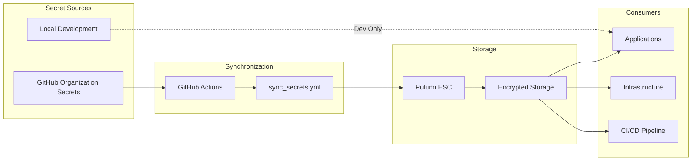

# Secret Management Guide

## Overview

Sophia AI uses a multi-layered secret management system that provides enterprise-grade security, automated synchronization, and zero-downtime rotation capabilities. This guide covers architecture, procedures, and best practices.

## Architecture

### Secret Flow Diagram



### Security Layers

1. **GitHub Organization Secrets**
   - Encrypted at rest
   - Audit logged
   - Role-based access
   - Environment protection

2. **Pulumi ESC (Environment Secrets Configuration)**
   - End-to-end encryption
   - Version history
   - Access policies
   - Audit trail

3. **Application Runtime**
   - Environment variables only
   - No file-based secrets
   - Memory-only access
   - Automatic expiration

## Secret Categories

### AI/ML Services

| Secret Name | Purpose | Rotation |
|-------------|---------|----------|
| OPENAI_API_KEY | OpenAI API access | 90 days |
| ANTHROPIC_API_KEY | Anthropic Claude access | 90 days |
| OPENROUTER_API_KEY | OpenRouter gateway | 90 days |
| PORTKEY_API_KEY | Portkey optimization | 90 days |

### Infrastructure

| Secret Name | Purpose | Rotation |
|-------------|---------|----------|
| LAMBDA_API_KEY | Lambda Labs API | 180 days |
| LAMBDA_SSH_PRIVATE_KEY | SSH access to instances | Annual |
| DOCKER_HUB_ACCESS_TOKEN | Container registry | 90 days |
| PULUMI_ACCESS_TOKEN | Infrastructure state | Annual |

### Data Services

| Secret Name | Purpose | Rotation |
|-------------|---------|----------|
| SNOWFLAKE_PASSWORD | Database access | 60 days |
| POSTGRES_PASSWORD | PostgreSQL access | 90 days |
| REDIS_PASSWORD | Cache access | 90 days |
| PINECONE_API_KEY | Vector database | 180 days |

### Business Intelligence

| Secret Name | Purpose | Rotation |
|-------------|---------|----------|
| GONG_ACCESS_KEY | Call recording access | 90 days |
| HUBSPOT_API_KEY | CRM integration | 180 days |

### Communication

| Secret Name | Purpose | Rotation |
|-------------|---------|----------|
| SLACK_BOT_TOKEN | Slack integration | Annual |
| LINEAR_API_KEY | Project management | 180 days |
| ASANA_API_TOKEN | Task management | 180 days |

## Procedures

### Adding a New Secret

1. **Add to GitHub Organization**
   ```bash
   # Via GitHub UI
   https://github.com/organizations/ai-cherry/settings/secrets/actions/new

   # Or via CLI
   gh secret set SECRET_NAME --org ai-cherry
   ```

2. **Update Secret Map**
   ```yaml
   # config/pulumi/secret_map.yaml
   SECRET_NAME: values.sophia.category.secret_name
   ```

3. **Add to Sync Workflow**
   ```yaml
   # .github/workflows/sync_secrets.yml
   env:
     SECRET_NAME: ${{ secrets.SECRET_NAME }}
   ```

4. **Run Synchronization**
   ```bash
   gh workflow run sync_secrets.yml
   ```

5. **Update Application**
   ```python
   # backend/core/settings.py
   secret_name: str = Field(..., env="SECRET_NAME")
   ```

### Rotating Secrets

#### Automated Rotation

1. **Update in GitHub**
   ```bash
   gh secret set SECRET_NAME --org ai-cherry
   ```

2. **Trigger Sync**
   ```bash
   gh workflow run sync_secrets.yml
   ```

3. **Verify Deployment**
   ```bash
   # Check Pulumi ESC
   pulumi env get ai-cherry/lambda-labs-production | grep secret_name

   # Restart services
   ./scripts/deploy-application.sh
   ```

#### Manual Rotation

1. **Generate New Secret**
   ```bash
   # Example: Generate secure password
   openssl rand -base64 32

   # Example: Generate API key
   uuidgen | sha256sum | cut -d' ' -f1
   ```

2. **Update Source System**
   - Update in provider dashboard
   - Note expiration date

3. **Update GitHub Secret**
   - Use GitHub UI or CLI
   - Document rotation in PR

4. **Deploy Changes**
   - Run sync workflow
   - Monitor application health

### Emergency Secret Rotation

For compromised secrets:

1. **Immediate Actions**
   ```bash
   # Revoke compromised secret at source
   # Update GitHub secret
   gh secret set COMPROMISED_SECRET --org ai-cherry

   # Force sync
   gh workflow run sync_secrets.yml

   # Emergency deployment
   gh workflow run production.yml -f skip_tests=true
   ```

2. **Audit Access**
   ```bash
   # Check recent usage
   grep -r "COMPROMISED_SECRET" /var/log/

   # Review access logs
   ```

3. **Document Incident**
   - Create security incident
   - Document timeline
   - Update rotation schedule

## Access Control

### GitHub Organization

```yaml
# Teams and permissions
ai-cherry-admins:
  - Full secret management
  - Audit log access

ai-cherry-developers:
  - Read secret names
  - Cannot read values

ai-cherry-ci:
  - Workflow secret access
  - Scoped to repositories
```

### Pulumi ESC

```yaml
# Access policies
production:
  admins:
    - create, read, update, delete
  developers:
    - read (masked values)
  services:
    - read (specific paths)
```

### Application Access

```python
# Correct: Use settings object
from backend.core.settings import settings
api_key = settings.openai_api_key

# Incorrect: Direct environment access
import os
api_key = os.environ["OPENAI_API_KEY"]  # Don't do this
```

## Security Best Practices

### 1. Secret Hygiene

- **Never commit secrets** to version control
- **Use strong secrets**: 32+ characters, mixed case, special characters
- **Unique secrets** per environment
- **Document purpose** of each secret
- **Set expiration** reminders

### 2. Rotation Schedule

| Frequency | Secret Types |
|-----------|--------------|
| 30 days | High-risk (payment, PII access) |
| 60 days | Database passwords |
| 90 days | API keys |
| 180 days | Low-risk integrations |
| Annual | Infrastructure keys |

### 3. Access Patterns

```python
# Good: Lazy loading
class ServiceClient:
    def __init__(self):
        self._api_key = None

    @property
    def api_key(self):
        if not self._api_key:
            self._api_key = settings.service_api_key
        return self._api_key

# Bad: Module-level loading
API_KEY = os.environ["SERVICE_API_KEY"]  # Loaded at import
```

### 4. Audit Requirements

- Log all secret access
- Monitor unusual patterns
- Alert on failures
- Regular access reviews

## Local Development

### Setup

1. **Create `.env` file**
   ```bash
   # Copy template
   cp .env.example .env

   # Edit with your values
   # NEVER commit .env file
   ```

2. **Use Pulumi ESC Locally**
   ```bash
   # Login to Pulumi
   pulumi login

   # Get development secrets
   pulumi env open ai-cherry/lambda-labs-development
   ```

3. **Docker Compose Override**
   ```yaml
   # docker-compose.override.yml
   services:
     backend:
       env_file:
         - .env.local
   ```

### Testing with Secrets

```python
# tests/conftest.py
import pytest
from unittest.mock import patch

@pytest.fixture
def mock_secrets():
    with patch.dict(os.environ, {
        "OPENAI_API_KEY": "test-key",
        "SNOWFLAKE_PASSWORD": "test-pass"
    }):
        yield
```

## Monitoring and Alerts

### Secret Usage Metrics

```python
# Prometheus metrics
secret_access_total = Counter(
    'secret_access_total',
    'Total secret access attempts',
    ['secret_name', 'status']
)

secret_rotation_age = Gauge(
    'secret_rotation_age_days',
    'Days since last rotation',
    ['secret_name']
)
```

### Alerts

| Alert | Condition | Action |
|-------|-----------|--------|
| Secret Access Denied | Access failure > 5/min | Check permissions |
| Rotation Overdue | Age > rotation period | Trigger rotation |
| Unusual Access Pattern | Spike in access | Security review |
| Sync Failure | Sync job fails | Manual intervention |

### Dashboards

Grafana dashboard available at: `https://grafana.sophia-intel.ai/d/secrets`

- Secret age histogram
- Access patterns
- Rotation compliance
- Sync status

## Troubleshooting

### Common Issues

#### Secret Not Found

```bash
# Verify in GitHub
gh secret list --org ai-cherry | grep SECRET_NAME

# Check sync status
gh run list --workflow=sync_secrets.yml

# Verify in Pulumi
pulumi env get ai-cherry/lambda-labs-production | grep secret_name

# Check application
curl http://localhost:8000/health/secrets
```

#### Sync Failures

```bash
# Check workflow logs
gh run view <run-id> --log

# Manual sync
python scripts/ci_cd_rehab/sync_secrets.py --dry-run

# Force update
pulumi env set ai-cherry/lambda-labs-production \
  values.sophia.ai.openai_api_key "new-value" --secret
```

#### Access Denied

```bash
# Verify Pulumi auth
pulumi whoami

# Check ESC access
pulumi env open ai-cherry/lambda-labs-production

# Verify application config
python -c "from backend.core.settings import settings; print(settings.model_dump_json(indent=2))"
```

## Compliance

### Audit Log

All secret operations are logged:

```json
{
  "timestamp": "2024-01-15T10:30:00Z",
  "action": "secret_accessed",
  "secret_name": "OPENAI_API_KEY",
  "accessor": "backend-service",
  "source_ip": "10.0.1.5",
  "success": true
}
```

### Compliance Checks

- [ ] Quarterly access review
- [ ] Annual security audit
- [ ] Rotation compliance report
- [ ] Incident response test

### Regulations

- **SOC 2**: Encryption at rest and in transit
- **GDPR**: Data minimization, right to erasure
- **HIPAA**: Access controls, audit logs
- **PCI DSS**: Key rotation, secure storage

## Disaster Recovery

### Backup Strategy

1. **GitHub Secrets**: Backed up via GitHub Enterprise
2. **Pulumi ESC**: Version history maintained
3. **Local Backup**: Encrypted backup for critical secrets

### Recovery Procedure

```bash
# Restore from Pulumi history
pulumi env version history ai-cherry/lambda-labs-production
pulumi env version restore ai-cherry/lambda-labs-production <version>

# Restore from backup
gpg -d secrets-backup.gpg | pulumi env set ai-cherry/lambda-labs-production
```

### Emergency Access

```bash
# Break-glass procedure
# 1. Access emergency vault
# 2. Use recovery codes
# 3. Document access
# 4. Rotate all secrets post-incident
```

## References

- [Pulumi ESC Documentation](https://www.pulumi.com/docs/pulumi-cloud/esc/)
- [GitHub Secrets Documentation](https://docs.github.com/en/actions/security-guides/encrypted-secrets)
- [OWASP Secret Management](https://cheatsheetseries.owasp.org/cheatsheets/Secrets_Management_Cheat_Sheet.html)
- [NIST Key Management](https://nvlpubs.nist.gov/nistpubs/SpecialPublications/NIST.SP.800-57pt1r5.pdf)

---

**Last Updated**: Generated by secret management system
**Classification**: Confidential
**Owner**: Security Team
