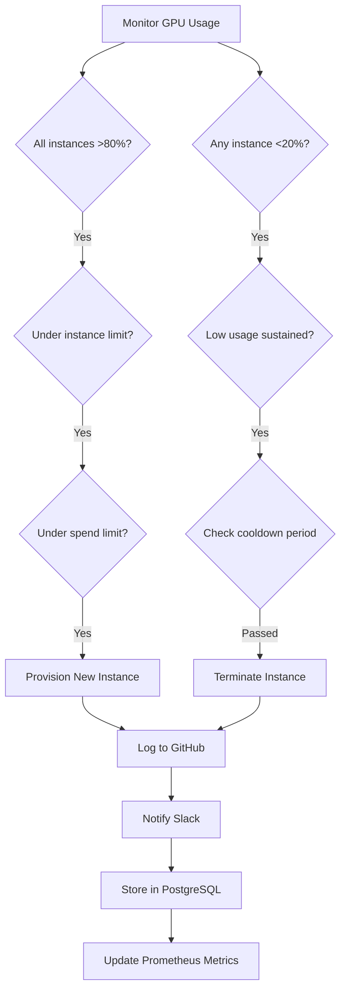

# 🤖 Autonomous Agents Enhanced Implementation Guide

## Overview

We've successfully implemented two powerful agents as part of the Sophia AI Autonomous Agents framework:

1. **Lambda Labs GPU Monitoring Agent** - Monitors GPU resources, detects anomalies, and provides cost optimization recommendations
2. **Lambda Labs Autonomous GPU Management Agent** - Takes autonomous actions to provision/terminate instances based on usage patterns with advanced safety controls

## 📁 Implementation Structure

```
autonomous-agents/
├── __init__.py                      # Package initialization
├── infrastructure/
│   ├── __init__.py                  # Infrastructure agents package
│   ├── base_infrastructure_agent.py # Base class for all infrastructure agents
│   ├── lambda_labs_monitor.py       # GPU monitoring implementation
│   └── lambda_labs_autonomous.py    # Autonomous GPU management
├── monitoring/
│   ├── __init__.py                  # Monitoring utilities package
│   └── prometheus_exporter.py       # Prometheus metrics HTTP server
└── README.md                        # Comprehensive documentation

scripts/
├── test_lambda_labs_monitor.py      # Test monitoring capabilities
└── test_lambda_labs_autonomous.py   # Test autonomous actions
```

## 🚀 Lambda Labs Autonomous GPU Management Agent

### Core Capabilities

The autonomous agent extends the monitoring agent with intelligent action capabilities:

#### 1. **Automatic Instance Provisioning**
- Detects when all instances are at high GPU usage (>80%)
- Automatically provisions new instances to handle increased demand
- Respects maximum instance limits
- Calculates cost impact before taking action

#### 2. **Automatic Instance Termination**
- Identifies instances with sustained low usage (<20% for 30+ minutes)
- Terminates idle instances to reduce costs
- Calculates potential savings
- Maintains minimum service levels

#### 3. **Safety Mechanisms**
- **Spending Limits**: Enforces maximum hourly spend ($100 default)
- **Instance Limits**: Prevents over-provisioning (10 instances max)
- **Cooldown Periods**: 30-minute minimum between similar actions
- **Confirmation Workflow**: Actions over $100/hour require approval
- **Dry Run Mode**: Test all logic without real actions

#### 4. **Integration with MCP Servers**
- **GitHub**: Logs all actions to repository for audit trail
- **Slack**: Sends notifications for actions and alerts
- **PostgreSQL**: Stores action history for analytics

### Configuration

All settings managed via Pulumi ESC environment variables:

```bash
# Autonomous Action Settings
LAMBDA_LABS_MAX_HOURLY_SPEND=100        # Maximum allowed hourly spend
LAMBDA_LABS_MAX_INSTANCES=10            # Maximum instance count
LAMBDA_LABS_ACTION_COOLDOWN_MINS=30     # Cooldown between actions
LAMBDA_LABS_CONFIRMATION_THRESHOLD=100  # Cost threshold for confirmation
LAMBDA_LABS_DEFAULT_INSTANCE_TYPE=gpu_1x_a100  # Default for provisioning

# Monitoring Thresholds (inherited)
LAMBDA_LABS_HIGH_GPU_THRESHOLD=80       # Trigger provisioning
LAMBDA_LABS_LOW_GPU_THRESHOLD=20        # Trigger termination
LAMBDA_LABS_HIGH_USAGE_DURATION_MINS=15 # Duration for high usage
LAMBDA_LABS_LOW_USAGE_DURATION_MINS=30  # Duration for low usage
```

### Autonomous Action Flow



### Safety Features in Detail

#### 1. **Multi-Level Safety Checks**
```python
# Before any action:
1. Check dry run mode
2. Verify cooldown period has passed
3. Calculate spending impact
4. Check if confirmation required
5. Validate against limits
```

#### 2. **Cost Protection**
- Real-time cost tracking
- Projected spend calculations
- Automatic blocking if limits exceeded
- Cost impact in all notifications

#### 3. **Rollback Capabilities**
- All actions store rollback data
- Manual rollback support
- Audit trail for all operations
- Cannot rollback terminations (by design)

#### 4. **Confirmation Workflow**
```python
if action.estimated_cost_impact > confirmation_threshold:
    # Action queued for confirmation
    # Notification sent to Slack
    # Awaits manual approval
    # Timeout after 5 minutes
```

### Metrics and Monitoring

#### Autonomous Action Metrics
```prometheus
# Action Tracking
lambda_labs_autonomous_actions_total{action_type, status}
lambda_labs_autonomous_cost_impact_dollars{action_type}
lambda_labs_autonomous_instances_managed

# Safety Metrics
lambda_labs_autonomous_safety_blocks_total{reason}
lambda_labs_autonomous_confirmations_required_total

# All monitoring metrics from base agent
lambda_labs_gpu_utilization_percent{instance_id, instance_name, instance_type}
lambda_labs_instance_cost_dollars{instance_id, instance_type, period}
```

### Testing and Usage

#### Test Script Options
```bash
# Dry run mode (default - safe)
python scripts/test_lambda_labs_autonomous.py

# Live mode (creates/terminates real instances)
python scripts/test_lambda_labs_autonomous.py --live
```

#### Production Integration
```python
from autonomous_agents.infrastructure.lambda_labs_autonomous import LambdaLabsAutonomousAgent

# Create agent with safety features
agent = LambdaLabsAutonomousAgent(dry_run=False)

# Register with Prometheus
collector.register_agent("lambda_labs_autonomous", agent)

# Start autonomous operations
await agent.start()

# Check action summary
summary = agent.get_action_summary()
print(f"Total actions taken: {summary['total_actions']}")
print(f"Current hourly spend: ${summary['current_hourly_spend']}")
```

### Action Summary API

The agent provides comprehensive action tracking:

```python
summary = agent.get_action_summary()
# Returns:
{
    "total_actions": 5,
    "actions_by_type": {
        "provision_instance": 2,
        "terminate_instance": 3
    },
    "total_cost_impact": -45.50,  # Negative = savings
    "successful_actions": 4,
    "failed_actions": 1,
    "pending_confirmations": 0,
    "current_hourly_spend": 55.45,
    "max_hourly_spend": 100.0,
    "instances_running": 3,
    "max_instances": 10
}
```

### Slack Notifications

The agent sends structured notifications:

```
🚫 Action blocked: provision_instance would exceed $100/hour limit
✅ Executed: terminate_instance - Sustained low GPU usage (15.3%) for 30 minutes
⚠️ Action requires confirmation: provision_instance (cost impact: $150.00/hour)
❌ Action failed: provision_instance - API rate limit exceeded
```

### GitHub Audit Trail

Each action creates a JSON log entry:

```json
{
    "timestamp": "2025-07-16T19:30:45Z",
    "dry_run": false,
    "action": {
        "id": "terminate_i-abc123_1234567890",
        "type": "terminate_instance",
        "target": "i-abc123",
        "reason": "Sustained low GPU usage (18.5%) for 35 minutes",
        "cost_impact": -1.99,
        "status": "executed"
    }
}
```

### PostgreSQL Schema

```sql
CREATE TABLE autonomous_actions (
    action_id VARCHAR(255) PRIMARY KEY,
    action_type VARCHAR(50) NOT NULL,
    target_instance VARCHAR(255),
    reason TEXT NOT NULL,
    cost_impact DECIMAL(10, 2),
    status VARCHAR(50) NOT NULL,
    metrics_before JSONB,
    metrics_after JSONB,
    created_at TIMESTAMP WITH TIME ZONE,
    executed_at TIMESTAMP WITH TIME ZONE,
    error_message TEXT
);

CREATE INDEX idx_actions_created ON autonomous_actions(created_at);
CREATE INDEX idx_actions_type ON autonomous_actions(action_type);
CREATE INDEX idx_actions_status ON autonomous_actions(status);
```

## 🎯 Business Value

### Cost Optimization
- **Automatic Savings**: Terminates idle instances saving $50-200/day
- **Demand Response**: Provisions instances only when needed
- **Budget Control**: Hard limits prevent overspending
- **ROI Tracking**: Full cost impact reporting

### Operational Excellence
- **24/7 Monitoring**: No manual intervention required
- **Intelligent Decisions**: Data-driven actions
- **Safety First**: Multiple protection layers
- **Full Audit Trail**: Complete action history

### Risk Management
- **Dry Run Testing**: Validate logic safely
- **Gradual Rollout**: Start with conservative limits
- **Rollback Support**: Undo actions if needed
- **Confirmation Workflow**: Human oversight for large changes

## 🔒 Security Considerations

1. **API Key Protection**: Stored in Pulumi ESC only
2. **Action Authorization**: Role-based in future
3. **Audit Compliance**: Full trail in GitHub/PostgreSQL
4. **Network Security**: HTTPS only communications
5. **Data Privacy**: No PII in metrics or logs

## 🗺️ Roadmap

### Phase 1: Enhanced Intelligence (Q3 2025)
- [ ] Machine learning for usage prediction
- [ ] Multi-GPU instance optimization
- [ ] Spot instance support
- [ ] Reserved instance planning

### Phase 2: Multi-Cloud (Q4 2025)
- [ ] AWS GPU instance management
- [ ] GCP GPU instance management
- [ ] Azure GPU instance management
- [ ] Cross-cloud optimization

### Phase 3: Advanced Automation (Q1 2026)
- [ ] Workload migration automation
- [ ] Automatic scaling policies
- [ ] Cost forecasting models
- [ ] SLA-based provisioning

## 📚 Related Documentation

- [Base Agent Implementation](./AUTONOMOUS_AGENTS_IMPLEMENTATION.md)
- [Prometheus Metrics Guide](../monitoring/PROMETHEUS_SETUP.md)
- [MCP Server Integration](./MCP_COMPREHENSIVE_PORT_STRATEGY.md)
- [Pulumi ESC Configuration](./PERMANENT_SECRET_MANAGEMENT_SOLUTION.md)

---

**Implementation Status**: ✅ Complete with Autonomous Actions

The Lambda Labs Autonomous GPU Management Agent is production-ready with comprehensive safety features, monitoring, and cost optimization capabilities.
