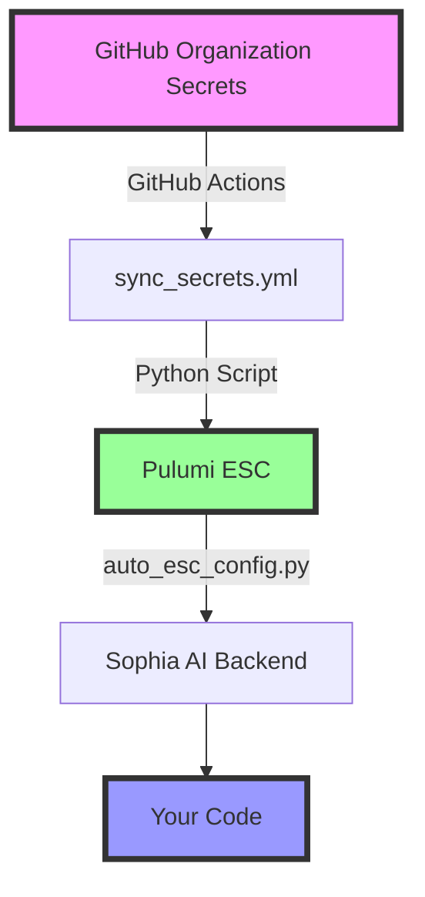

# 🔐 PERMANENT SECRET MANAGEMENT SOLUTION

**STATUS**: ✅ FULLY OPERATIONAL
**LAST UPDATED**: January 2025

## 🚨 CRITICAL: FOR ALL AI CODING AGENTS

**THE DOCKER HUB CREDENTIALS ARE ALREADY IN PULUMI ESC!**

This document is the **SINGLE SOURCE OF TRUTH** for secret management in Sophia AI.

### **Architecture Overview**

```
GitHub Organization Secrets (ai-cherry)
           ↓ (Automated Sync)
    GitHub Actions (.github/workflows/sync_secrets.yml)
           ↓ (Python Script)
    Pulumi ESC (scoobyjava-org/default/sophia-ai-production)
           ↓ (Automatic Loading)
    Sophia AI Backend (backend/core/auto_esc_config.py)
```

### **Docker Hub Credentials**

- **GitHub Secret**: `DOCKER_HUB_ACCESS_TOKEN`
- **Pulumi ESC Path**: `values.sophia.infrastructure.docker.access_token`
- **Backend Access**: `get_config_value("docker_hub_access_token")`
- **Username**: `scoobyjava15` (hardcoded default)

### **How to Use in Code**

```python
from backend.core.auto_esc_config import get_docker_hub_config

# Get Docker Hub credentials
docker_config = get_docker_hub_config()
username = docker_config["username"]          # "scoobyjava15"
token = docker_config["access_token"]         # From Pulumi ESC
registry = docker_config["registry"]          # "docker.io"
```

### **GitHub Actions Usage**

```yaml
- name: Login to Docker Hub
  uses: docker/login-action@v3
  with:
    username: ${{ secrets.DOCKER_HUB_USERNAME }}
    password: ${{ secrets.DOCKER_HUB_ACCESS_TOKEN }}
```

### **Manual Secret Verification**

```bash
# Check if secrets are synced to Pulumi ESC
pulumi env get scoobyjava-org/default/sophia-ai-production --show-secrets | grep docker

# Test backend access
python -c "from backend.core.auto_esc_config import get_docker_hub_config; print(get_docker_hub_config())"
```

### **❌ NEVER DO THESE**

- ❌ Create `.env` files with Docker credentials
- ❌ Ask users for Docker Hub tokens
- ❌ Hardcode credentials in scripts
- ❌ Manual `docker login` commands
- ❌ Create new secret management systems

### **✅ ALWAYS DO THESE**

- ✅ Use `get_docker_hub_config()` for credentials
- ✅ Reference this document when working with secrets
- ✅ Trust that the automation is already in place
- ✅ Use GitHub Organization Secrets for new credentials

## **Common Secrets Reference**

| Service | Function | Secret Name |
|---------|----------|-------------|
| Docker Hub | `get_docker_hub_config()` | `docker_hub_access_token` |
| OpenAI | `get_config_value("openai_api_key")` | `openai_api_key` |
| Snowflake | `get_snowflake_config()` | `snowflake_password` |
| Lambda Labs | `get_lambda_labs_config()` | `lambda_api_key` |
| Slack | `get_integration_config()["slack"]` | `slack_bot_token` |
| HubSpot | `get_integration_config()["hubspot"]` | `hubspot_access_token` |

## **Secret Flow Diagram**



## **Troubleshooting**

### **Secret Not Found?**

1. **Check GitHub Organization Secrets**: https://github.com/ai-cherry
2. **Run sync workflow**: `gh workflow run sync_secrets.yml`
3. **Verify in Pulumi ESC**: `pulumi env get scoobyjava-org/default/sophia-ai-production --show-secrets`
4. **Check mapping**: Ensure key exists in `esc_key_mappings` in `auto_esc_config.py`

### **Sync Not Working?**

1. **Check GitHub Actions**: https://github.com/ai-cherry/sophia-main/actions
2. **Verify Pulumi token**: `PULUMI_ACCESS_TOKEN` must be set in GitHub secrets
3. **Check sync script**: `scripts/unified_secret_sync.py`

### **Need to Add a New Secret?**

1. **Add to GitHub**: Organization settings → Secrets → New secret
2. **Add to sync script**: Update `scripts/unified_secret_sync.py`
3. **Add mapping**: Update `esc_key_mappings` in `backend/core/auto_esc_config.py`
4. **Run sync**: Push changes to trigger GitHub Actions

## **Security Best Practices**

1. **Never commit secrets**: Use pre-commit hooks to scan for secrets
2. **Rotate regularly**: All secrets should be rotated every 90 days
3. **Audit access**: Review who has access to GitHub Organization secrets
4. **Use least privilege**: Only grant necessary permissions
5. **Monitor usage**: Check Pulumi ESC audit logs

## **Related Documentation**

- [Secret Naming Standards](./SECRET_NAMING_STANDARDS.md)
- [Secret Management Cheat Sheet](./SECRET_MANAGEMENT_CHEAT_SHEET.md)
- [GitHub Actions Workflows](.github/workflows/sync_secrets.yml)
- [Backend Configuration](backend/core/auto_esc_config.py) 