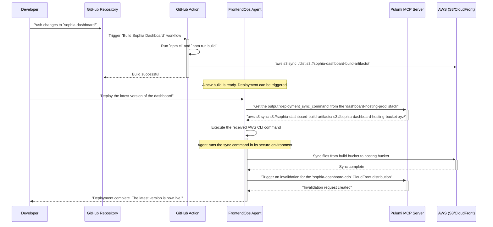

# The AI-Driven Dashboard Deployment Workflow

**Date:** December 20, 2024
**Status:** The Official Continuous Deployment Strategy for the Sophia Dashboard

## 1. The Goal: Zero-Touch, AI-Orchestrated Frontend Deployment

This document describes the modern, AI-driven workflow that replaces manual frontend deployments. The entire process is orchestrated by a specialized AI agent, the **`FrontendOps Agent`**, which uses our standard MCP servers as its tools.

---

## 2. The Workflow Visualized

---

## 3. The Core Components

### The `FrontendOps Agent`
This is an Agno agent with a simple persona: "You are an expert DevOps engineer responsible for the Sophia Dashboard. Your only tools are the `pulumi` and `github` MCP servers."

### The Key Tools (MCP Servers)

The agent needs only two tools to accomplish this entire workflow:

1.  **`pulumi/mcp-server`:**
    *   **To get the sync command:** Before deploying, the agent asks the Pulumi MCP server for the output of the `dashboard-hosting-prod` stack. This is a crucial security step: the agent doesn't need to know the destination bucket name; it just asks Pulumi for the correct, deployed command.
    *   **To trigger a CDN invalidation:** After syncing the files, the agent tells the Pulumi MCP server to run a command that invalidates the CloudFront cache, ensuring users see the latest version immediately.

2.  **`github/mcp-server` (Optional but Recommended):**
    *   Before deploying, the agent can use this server to query for the latest commit hash from the `sophia-dashboard/` directory.
    *   It can then create a git tag for the deployment (e.g., `dashboard-deploy-20241220-1`), providing a perfect audit trail and linking every deployment back to a specific code change.

---

## 4. How It Works in Practice

1.  A developer makes changes to the React components in the `sophia-dashboard` directory and pushes to `main`.
2.  The **GitHub Action** automatically runs, builds the production assets, and places them in the `s3://sophia-dashboard-build-artifacts` bucket.
3.  A release manager (or an automated timer) tells the **`FrontendOps Agent`**: `"Deploy the latest dashboard."`
4.  The agent asks the **Pulumi MCP Server** for the sync command.
5.  The agent executes the command, copying the new files to the live hosting bucket.
6.  The agent tells the **Pulumi MCP Server** to invalidate the CloudFront CDN cache.
7.  The new dashboard is live for all users.

---

## Conclusion

This workflow is the pinnacle of the modern architecture we have built. It is:
-   **Secure:** The agent never needs to know any AWS credentials or bucket names directly. It only uses the high-level tools provided by the Pulumi MCP server.
-   **Auditable:** Every deployment can be traced back to a specific agent request and a specific git commit.
-   **Simple:** The agent's logic is incredibly simple: `get command`, `run command`, `invalidate cache`. All the complexity is handled by the underlying infrastructure.
-   **AI-Driven:** We have fully automated our frontend CI/CD pipeline and put it under the control of a conversational AI agent.

This completes the vision for building and deploying our dashboards. We have all the tools, infrastructure, and the strategic workflow defined to make it a reality.
