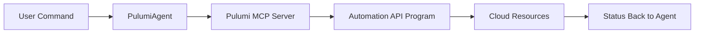

# Sophia AI - Automation API Workflow

This guide explains how Sophia AI orchestrates infrastructure changes through the Pulumi Automation API.
The `PulumiAgent` communicates with the Pulumi MCP server which in turn invokes Automation API programs inside the `iac-toolkit` container.

## Workflow Overview



1. **User Command** – A natural language command like `deploy prod` is issued.
2. **PulumiAgent** – Parses the request and sends an API call to the Pulumi MCP server.
3. **Pulumi MCP Server** – Runs a Pulumi Automation API program within the `iac-toolkit` container.
4. **Cloud Resources** – Infrastructure changes are applied using the authenticated credentials from Pulumi ESC.
5. **Status Back** – Results are returned to the agent and surfaced to the user.

## Example Usage

```python
from backend.agents.pulumi_agent import PulumiAgent

agent = PulumiAgent()
result = await agent.handle_command("deploy staging", session_id="abc")
print(result)
```

## Troubleshooting

- **Stack fails to deploy** – inspect the container logs with `docker-compose logs pulumi-mcp`.
- **Permission errors** – confirm the user or service account has the required role as defined in `config/services/pulumi-mcp.json`.
- **Automation API not found** – ensure the `iac-toolkit` container is running and accessible from the MCP server.

## Maintenance

1. Keep the Pulumi stack configuration files in `infrastructure/` under version control.
2. Update dependencies inside `iac-toolkit` using `poetry update` when upgrading Pulumi.
3. Monitor the audit log specified by `audit_log_path` to track all Automation API actions.
