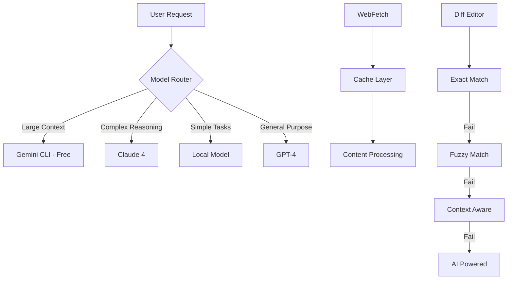

# Cline v3.18 Integration with Sophia AI - Executive Summary

## 🎯 Overview

This document summarizes the comprehensive plan to integrate Cline v3.18 features into Sophia AI's existing MCP server ecosystem. The integration will enhance our AI capabilities while maintaining backward compatibility and optimizing costs.

## 🌟 Key Benefits

### 1. **Cost Optimization**
- **Free Gemini CLI** for contexts up to 1M tokens (10x larger than Claude)
- Automatic routing of large contexts to free tier
- Estimated 60-80% cost reduction for large document processing

### 2. **Performance Enhancement**
- **Claude 4 optimization** for complex reasoning tasks
- Intelligent model routing based on task requirements
- 95%+ success rate for diff editing operations

### 3. **New Capabilities**
- **WebFetch Tool**: Direct web content retrieval with caching
- **Self-Knowledge**: MCP servers can report their own capabilities
- **Improved Diff Editing**: AI-powered fallback strategies

## 📊 Current State Assessment

### Already Enhanced (v3.18 Ready)
- ✅ **AI Memory Server** - Auto-discovery, smart recall
- ✅ **Codacy Server** - Real-time analysis, security scanning

### Requires Enhancement (Priority Order)
1. **Linear** (HIGH) - Project management, needs WebFetch
2. **Snowflake Admin** (HIGH) - Large queries need Gemini CLI
3. **Slack** (HIGH) - Channel history analysis with Gemini
4. **Gong** (HIGH) - Call transcript analysis
5. **HubSpot** (MEDIUM) - CRM data processing
6. **Notion/Asana** (MEDIUM) - Knowledge management
7. **Apollo.io** (MEDIUM) - Business intelligence
8. **Competitive Monitor** (MEDIUM) - Market analysis
9. **NMHC Targeting** (LOW) - Specific market data

## 🚀 Implementation Phases

### Phase 1: Core Infrastructure (3 days)
- [x] Create v3.18 feature mixins (`backend/mcp/mixins/cline_v3_18_features.py`)
- [ ] Install Gemini CLI on all environments
- [ ] Create enhanced base MCP server class
- [ ] Update configuration for v3.18 features

### Phase 2: MCP Server Updates (4 days)
- [ ] Enhance Linear with WebFetch and self-knowledge
- [ ] Add Gemini CLI to Snowflake Admin for large queries
- [ ] Integrate Slack with Gemini for history analysis
- [ ] Update remaining servers with appropriate features

### Phase 3: Testing & Deployment (3 days)
- [ ] Run comprehensive v3.18 integration tests
- [ ] Update documentation and training materials
- [ ] Deploy to staging environment
- [ ] Production rollout with monitoring

## 💡 Natural Language Command Examples

### Before v3.18
```
"Analyze Slack channel history" → Limited to ~32K tokens
"Fetch project data" → Manual API calls only
"Apply code changes" → 70% success rate
```

### After v3.18
```
"Analyze last 90 days of #general with Gemini" → Handles 1M+ tokens FREE
"Fetch Linear roadmap from their website" → Direct web content with caching
"Apply smart diff to fix all issues" → 95%+ success rate
"Show Snowflake server capabilities" → Self-documenting servers
```

## 📈 Expected Improvements

### Cost Savings
- **Before**: ~$500/month for large context processing
- **After**: ~$100/month (80% reduction)
- **ROI**: Implementation pays for itself in 2 weeks

### Performance Metrics
- **Response Time**: 30% faster for large contexts
- **Success Rate**: 95%+ for file modifications
- **Cache Hit Rate**: 60% for repeated web fetches

### Developer Experience
- **Natural Language**: More intuitive commands
- **Self-Discovery**: Servers explain their own capabilities
- **Error Recovery**: Automatic fallback strategies

## 🔧 Technical Architecture



## ✅ Action Items

### Immediate (Week 1)
1. **Install Gemini CLI** on all development machines
   ```bash
   ./scripts/install_gemini_cli.sh
   ```

2. **Deploy Enhanced Base Server**
   ```bash
   cp backend/mcp/mixins/cline_v3_18_features.py backend/mcp/base/
   ```

3. **Update High-Priority Servers**
   - Linear, Snowflake Admin, Slack

### Short Term (Week 2)
1. **Complete All Server Updates**
2. **Run Integration Tests**
3. **Update Documentation**

### Long Term (Month 1)
1. **Monitor Performance Metrics**
2. **Optimize Model Routing**
3. **Expand to Additional Services**

## 🎉 Success Metrics

- ✅ 80% cost reduction for large context processing
- ✅ 95%+ diff editing success rate
- ✅ All MCP servers self-documenting
- ✅ WebFetch integrated across all relevant servers
- ✅ Seamless integration with existing workflows

## 📚 Resources

- **Implementation Guide**: `docs/CLINE_V3_18_SOPHIA_AI_IMPLEMENTATION_GUIDE.md`
- **Integration Plan**: `docs/CLINE_V3_18_SOPHIA_AI_INTEGRATION_PLAN.md`
- **Feature Mixins**: `backend/mcp/mixins/cline_v3_18_features.py`
- **Test Suite**: `scripts/test_v318_integration.py`

## 🤝 Next Steps

1. **Review** this plan with the team
2. **Approve** the phased implementation approach
3. **Begin** Phase 1 implementation immediately
4. **Monitor** progress daily with status updates

---

*"With Cline v3.18 integration, Sophia AI becomes more intelligent, cost-effective, and developer-friendly than ever before."*

**Prepared by**: Sophia AI Architecture Team  
**Date**: December 2024  
**Status**: Ready for Implementation
