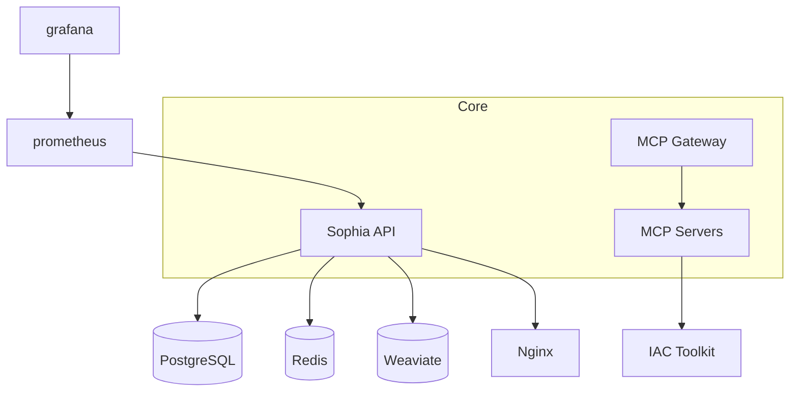

# Sophia AI - Containerized Architecture

The platform runs as a collection of Docker containers orchestrated with Docker Compose.
The diagram below shows the main services and network connections.

## Service List

- **sophia-api** – FastAPI application
- **postgres** – main database
- **redis** – cache and message bus
- **weaviate** – vector database
- **mcp servers** – domain specific MCP containers
- **mcp-gateway** – routes requests to MCP servers
- **iac-toolkit** – runs Pulumi Automation API programs
- **prometheus & grafana** – monitoring stack
- **nginx** – reverse proxy in production

## Maintenance Tips

- Use `docker-compose ps` to verify all containers are running.
- Restart individual services with `docker-compose restart <service>`.
- Remove unused volumes periodically: `docker volume prune`.
- Check container logs for errors: `docker-compose logs <service>`.
