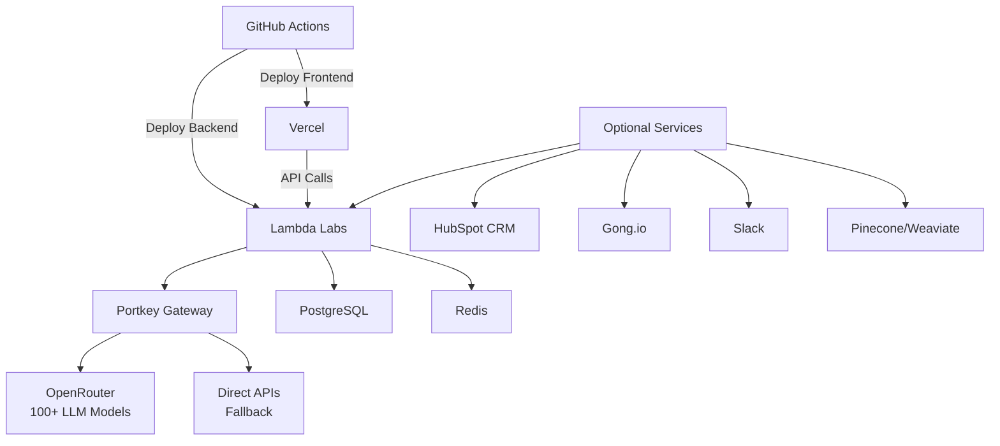

# Sophia AI - Production Deployment Guide

## 🚀 Quick Start

This guide covers deploying Sophia AI to production using GitHub Actions, Vercel (frontend), and Lambda Labs (backend).

## 📋 Prerequisites

### Required API Keys (Minimal Setup)
1. **LLM Gateway** (2 keys for 100+ models):
   - `PORTKEY_API_KEY` - Get from [portkey.ai](https://portkey.ai)
   - `OPENROUTER_API_KEY` - Get from [openrouter.ai](https://openrouter.ai)

2. **Deployment Targets**:
   - `VERCEL_ACCESS_TOKEN` - For frontend deployment
   - `LAMBDA_LABS_API_KEY` - For backend deployment

3. **Security**:
   - `SECRET_KEY` - Generate a random 32+ character string
   - `ADMIN_USERNAME` - Admin dashboard username
   - `ADMIN_PASSWORD` - Strong admin password

### Optional Integrations (Add as Needed)
- **Business**: `HUBSPOT_API_KEY`, `GONG_API_KEY`, `SLACK_BOT_TOKEN`
- **Vector DBs**: `PINECONE_API_KEY`, `WEAVIATE_API_KEY`
- **AI Discovery**: `HUGGINGFACE_API_TOKEN`

## 🔑 Setting Up GitHub Secrets

### Step 1: Add Organization Secrets
Navigate to your GitHub organization settings → Secrets → Actions

Add these secrets:
```yaml
# Core LLM Gateway (Required)
PORTKEY_API_KEY=pk_xxx
OPENROUTER_API_KEY=sk-or-xxx

# Deployment (Required)
VERCEL_ACCESS_TOKEN=xxx
LAMBDA_LABS_API_KEY=xxx

# Security (Required)
SECRET_KEY=<generate-random-32-char-string>
ADMIN_USERNAME=admin
ADMIN_PASSWORD=<strong-password>

# Database (Optional - uses Docker defaults if not set)
POSTGRES_PASSWORD=<strong-db-password>

# Business Integrations (Optional)
HUBSPOT_API_KEY=xxx
GONG_API_KEY=xxx
GONG_API_SECRET=xxx
SLACK_BOT_TOKEN=xoxb-xxx
SLACK_SIGNING_SECRET=xxx

# Vector Databases (Optional)
PINECONE_API_KEY=xxx
WEAVIATE_API_KEY=xxx
```

### Step 2: Verify Secrets
The deployment workflow will automatically report which features are enabled based on available secrets.

## 🏗️ Architecture Overview



## 📦 Deployment Process

### Automatic Deployment (Recommended)
1. Push to `main` branch
2. GitHub Actions automatically:
   - Builds Docker images
   - Deploys frontend to Vercel
   - Deploys backend to Lambda Labs
   - Reports deployment status

### Manual Deployment
```bash
# Frontend
cd frontend
pnpm install
pnpm build
vercel --prod

# Backend
docker build -t sophia-backend .
docker push your-registry/sophia-backend
# Deploy to Lambda Labs via their CLI/API
```

## 🔧 Configuration

### LLM Gateway Setup
Sophia uses Portkey + OpenRouter for unified LLM access:

```python
# Automatically configured in backend/config/settings.py
LLM_GATEWAY=portkey
PORTKEY_API_KEY=your-key
OPENROUTER_API_KEY=your-key

# This gives access to:
# - Claude 3 Opus/Sonnet
# - GPT-4 Turbo
# - Llama 3
# - 100+ other models
```

### Environment Variables
Create `.env` from the minimal template:
```bash
cp env.minimal.example .env
# Add your API keys
```

### Feature Flags
Features auto-enable based on available API keys:
- ✅ AI Chat (if Portkey configured)
- ✅ CRM Sync (if HubSpot configured)
- ✅ Call Analysis (if Gong configured)
- ✅ Notifications (if Slack configured)
- ✅ Vector Search (if Pinecone/Weaviate configured)

## 🚨 Production Checklist

### Security
- [ ] Change default `SECRET_KEY`
- [ ] Set strong `ADMIN_PASSWORD`
- [ ] Enable HTTPS on Lambda Labs
- [ ] Configure CORS origins
- [ ] Review firewall rules

### Performance
- [ ] Enable Redis caching
- [ ] Configure CDN for frontend
- [ ] Set up monitoring (Prometheus/Grafana)
- [ ] Configure rate limiting

### Backup
- [ ] PostgreSQL automated backups
- [ ] Redis persistence enabled
- [ ] Configuration backups

## 📊 Monitoring

### Health Checks
- Frontend: `https://your-app.vercel.app/health`
- Backend: `https://your-api.lambda-labs.com/health`
- API Status: `https://your-api.lambda-labs.com/api/v1/status`

### Logs
- Frontend: Vercel dashboard
- Backend: Lambda Labs console
- Application: `/logs` directory

## 🆘 Troubleshooting

### Deployment Fails
1. Check GitHub Actions logs
2. Verify all required secrets are set
3. Ensure Docker builds locally

### LLM Gateway Issues
1. Verify Portkey and OpenRouter keys
2. Check rate limits
3. Review fallback configuration

### Integration Problems
1. Test API keys individually
2. Check network connectivity
3. Review error logs

## 📞 Support

- Documentation: `/docs`
- Issues: GitHub Issues
- Community: Discord/Slack

## 🔄 Updates

To update Sophia:
1. Pull latest changes
2. Review migration notes
3. Push to main (auto-deploys)

---

**Note**: This guide assumes you're using GitHub organization secrets. For personal repos, add secrets to repository settings instead. 