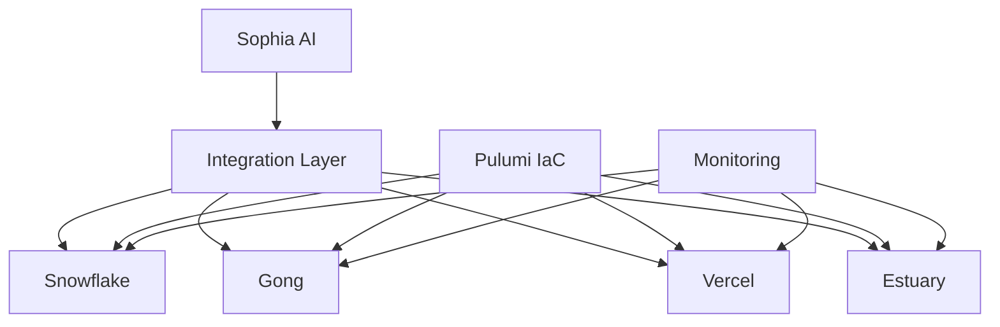

# Sophia AI Integration Management Guide

This guide provides comprehensive instructions for managing integrations with external services in the Sophia AI platform.

## Table of Contents

1. [Overview](#overview)
2. [Integration Architecture](#integration-architecture)
3. [Snowflake Integration](#snowflake-integration)
4. [Gong Integration](#gong-integration)
5. [Vercel Integration](#vercel-integration)
6. [Estuary Integration](#estuary-integration)
7. [Secret Management](#secret-management)
8. [Testing Integrations](#testing-integrations)
9. [Monitoring and Alerting](#monitoring-and-alerting)
10. [Troubleshooting](#troubleshooting)

## Overview

Sophia AI integrates with several external services to provide a comprehensive business intelligence and automation platform for Pay Ready. These integrations are managed using Infrastructure as Code (IaC) with Pulumi, ensuring consistent and reliable deployments across environments.

## Integration Architecture

The integration architecture follows these principles:

1. **Separation of Concerns**: Each integration is implemented as a separate module
2. **Configuration Management**: All configuration is managed through Pulumi ESC
3. **Secret Management**: Secrets are managed securely using Pulumi ESC
4. **Testing**: All integrations have comprehensive tests
5. **Monitoring**: All integrations are monitored for availability and performance

The integration architecture is implemented as follows:



## Snowflake Integration

### Configuration

Snowflake is configured using Pulumi IaC. The configuration includes:

- **Warehouse**: Compute resources for queries
- **Database**: Storage for data
- **Schema**: Organization of tables
- **Role**: Access control

### Usage

To use Snowflake in your code:

```python
import snowflake.connector

def connect_to_snowflake():
    """Connect to Snowflake"""
    conn = snowflake.connector.connect(
        account=os.environ.get("SNOWFLAKE_ACCOUNT"),
        user=os.environ.get("SNOWFLAKE_USER"),
        password=os.environ.get("SNOWFLAKE_PASSWORD"),
        warehouse=os.environ.get("SNOWFLAKE_WAREHOUSE"),
        database=os.environ.get("SNOWFLAKE_DATABASE"),
        schema=os.environ.get("SNOWFLAKE_SCHEMA"),
        role=os.environ.get("SNOWFLAKE_ROLE")
    )
    return conn
```

### Best Practices

1. **Connection Pooling**: Use connection pooling for efficient resource usage
2. **Query Optimization**: Optimize queries for performance
3. **Error Handling**: Implement comprehensive error handling
4. **Monitoring**: Monitor query performance and resource usage

## Gong Integration

### Configuration

Gong is configured using Pulumi IaC. The configuration includes:

- **API Key**: Authentication for API access
- **API Secret**: Authentication for API access
- **Webhook**: Configuration for event notifications

### Usage

To use Gong in your code:

```python
import requests

def get_gong_workspaces():
    """Get Gong workspaces"""
    response = requests.get(
        "https://us-70092.api.gong.io/v2/workspaces",
        auth=(os.environ.get("GONG_API_KEY"), os.environ.get("GONG_API_SECRET"))
    )
    response.raise_for_status()
    return response.json()
```

### Best Practices

1. **Rate Limiting**: Respect API rate limits
2. **Error Handling**: Implement comprehensive error handling
3. **Webhook Validation**: Validate webhook requests
4. **Monitoring**: Monitor API usage and errors

## Vercel Integration

### Configuration

Vercel is configured using Pulumi IaC. The configuration includes:

- **Project**: Configuration for the frontend project
- **Domain**: Configuration for the domain
- **Environment Variables**: Configuration for the frontend environment

### Usage

To use Vercel in your code:

```python
import requests

def get_vercel_deployments():
    """Get Vercel deployments"""
    headers = {
        "Authorization": f"Bearer {os.environ.get('VERCEL_ACCESS_TOKEN')}",
        "Content-Type": "application/json"
    }
    params = {}
    if os.environ.get("VERCEL_TEAM_ID"):
        params["teamId"] = os.environ.get("VERCEL_TEAM_ID")
    
    response = requests.get(
        "https://api.vercel.com/v6/deployments",
        headers=headers,
        params=params
    )
    response.raise_for_status()
    return response.json()
```

### Best Practices

1. **Deployment Strategy**: Use a consistent deployment strategy
2. **Environment Variables**: Manage environment variables securely
3. **Error Handling**: Implement comprehensive error handling
4. **Monitoring**: Monitor deployments and performance

## Estuary Integration

### Configuration

Estuary is configured using Pulumi IaC. The configuration includes:

- **API Key**: Authentication for API access
- **Collection**: Configuration for data collection
- **Flow**: Configuration for data flow

### Usage

To use Estuary in your code:

```python
import requests

def get_estuary_collections():
    """Get Estuary collections"""
    headers = {
        "Authorization": f"Bearer {os.environ.get('ESTUARY_API_KEY')}",
        "Content-Type": "application/json"
    }
    response = requests.get(
        f"{os.environ.get('ESTUARY_API_URL', 'https://api.estuary.tech')}/collections",
        headers=headers
    )
    response.raise_for_status()
    return response.json()
```

### Best Practices

1. **Data Validation**: Validate data before sending to Estuary
2. **Error Handling**: Implement comprehensive error handling
3. **Monitoring**: Monitor data flow and errors
4. **Rate Limiting**: Respect API rate limits

## Secret Management

Secrets are managed using Pulumi ESC. This provides a secure way to manage sensitive information across different environments.

### Adding a New Secret

To add a new secret:

1. Add the secret to the `.env` file
2. Import the secret to Pulumi ESC:

```bash
cd infrastructure
./import_secrets.sh ../.env development
```

### Rotating Secrets

Secrets are rotated automatically every 90 days using GitHub Actions. To manually rotate a secret:

1. Update the secret in the service (e.g., Snowflake, Gong, Vercel, Estuary)
2. Update the secret in the `.env` file
3. Import the secret to Pulumi ESC:

```bash
cd infrastructure
./import_secrets.sh ../.env development
```

## Testing Integrations

Integrations are tested using the unified integration test framework. This ensures that all integrations are working correctly.

### Running Tests

To run all integration tests:

```bash
./test_all_integrations.sh
```

To run specific integration tests:

```bash
./test_all_integrations.sh --snowflake  # Run only Snowflake tests
./test_all_integrations.sh --gong       # Run only Gong tests
./test_all_integrations.sh --vercel     # Run only Vercel tests
./test_all_integrations.sh --estuary    # Run only Estuary tests
```

### Adding Tests

To add a new integration test:

1. Create a new class that inherits from `IntegrationTest` in `unified_integration_test.py`
2. Implement the `_run_tests` method to test the integration
3. Add the new test to the `main` function in `unified_integration_test.py`
4. Update the command-line arguments in `parse_args` to include the new test

## Monitoring and Alerting

Integrations are monitored using a combination of:

- **API Health Checks**: Regular checks of API availability
- **Performance Monitoring**: Monitoring of API performance
- **Error Monitoring**: Monitoring of API errors
- **Usage Monitoring**: Monitoring of API usage

Alerts are sent to Slack when issues are detected.

### Setting Up Monitoring

Monitoring is set up using Pulumi IaC. The configuration includes:

- **Health Checks**: Configuration for API health checks
- **Performance Monitoring**: Configuration for performance monitoring
- **Error Monitoring**: Configuration for error monitoring
- **Usage Monitoring**: Configuration for usage monitoring

### Setting Up Alerting

Alerting is set up using Pulumi IaC. The configuration includes:

- **Alert Thresholds**: Configuration for alert thresholds
- **Alert Routing**: Configuration for alert routing
- **Alert Aggregation**: Configuration for alert aggregation
- **Alert Suppression**: Configuration for alert suppression

## Troubleshooting

### Common Issues

#### Snowflake

- **Connection Issues**: Check network connectivity and credentials
- **Query Performance**: Check query optimization and warehouse size
- **Access Control**: Check role permissions

#### Gong

- **API Rate Limits**: Check API usage and rate limits
- **Authentication**: Check API key and secret
- **Webhook Issues**: Check webhook configuration and validation

#### Vercel

- **Deployment Issues**: Check deployment logs and configuration
- **Domain Issues**: Check domain configuration and DNS
- **Environment Variables**: Check environment variable configuration

#### Estuary

- **API Issues**: Check API connectivity and credentials
- **Data Flow Issues**: Check data flow configuration and validation
- **Collection Issues**: Check collection configuration and permissions

### Getting Help

If you encounter issues that you cannot resolve, contact the Sophia AI team for assistance.
