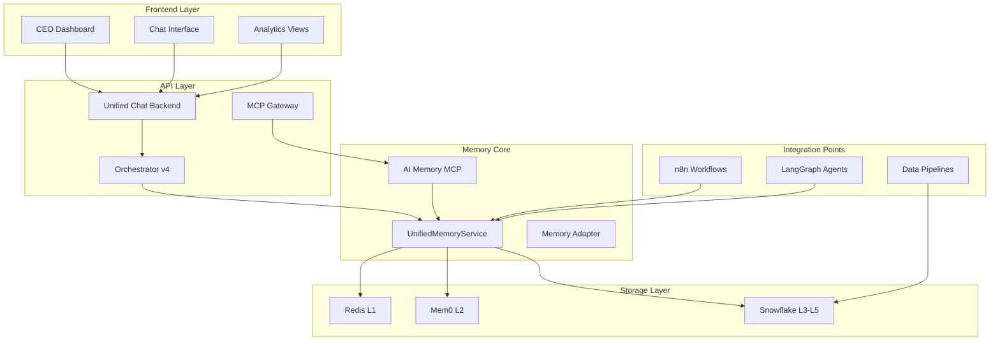

# 🔗 MEMORY ECOSYSTEM INTEGRATION GUIDE

**Version:** 1.0  
**Date:** July 10, 2025  
**Purpose:** Complete integration reference for Sophia AI Memory Ecosystem  

---

## Table of Contents

1. [Integration Overview](#integration-overview)
2. [Service Integrations](#service-integrations)
3. [MCP Server Integration](#mcp-server-integration)
4. [Chat & Orchestration Integration](#chat-orchestration-integration)
5. [Data Pipeline Integration](#data-pipeline-integration)
6. [Frontend Integration](#frontend-integration)
7. [Monitoring & Observability](#monitoring-observability)
8. [Security Integration](#security-integration)

---

## 🌐 Integration Overview

The Unified Memory Service is the central nervous system of Sophia AI, integrating with every major component to provide intelligent memory capabilities across the platform.

### Integration Architecture



---

## 🔌 Service Integrations

### 1. Unified Chat Backend Integration

**Location**: `backend/app/unified_chat_backend.py`

```python
# Automatic memory integration in chat
from backend.services.unified_memory_service import get_unified_memory_service

class UnifiedChatBackend:
    def __init__(self):
        self.memory_service = get_unified_memory_service()
        
    async def process_message(self, user_id: str, message: str):
        # Store conversation
        await self.memory_service.add_conversation_memory(
            user_id=user_id,
            messages=[
                {"role": "user", "content": message}
            ]
        )
        
        # Get context
        context = await self.memory_service.get_conversation_context(
            user_id=user_id,
            limit=5
        )
        
        # Search relevant knowledge
        knowledge = await self.memory_service.search_knowledge(
            query=message,
            limit=3
        )
        
        # Generate response with context...
```

### 2. Sophia Unified Orchestrator Integration

**Location**: `backend/services/sophia_unified_orchestrator.py`

```python
class SophiaUnifiedOrchestrator:
    def __init__(self):
        # Memory service is core dependency
        base_memory = get_unified_memory_service()
        self.memory_service = MemoryServiceAdapter(base_memory)
        
    async def orchestrate_request(self, request: OrchestratorRequest):
        # Automatic memory storage
        await self.memory_service.remember_conversation(
            user_id=request.user_id,
            message=request.message
        )
        
        # Context-aware routing
        if await self._needs_memory_context(request):
            context = await self.memory_service.get_context(
                user_id=request.user_id
            )
            request.context = context
```

### 3. n8n Workflow Integration

**Location**: `backend/services/n8n_workflow_service.py`

```python
class N8nWorkflowService:
    async def create_memory_workflow(self):
        """Create workflow that uses memory"""
        return {
            "name": "Daily Intelligence Brief",
            "nodes": [
                {
                    "type": "memory.search",
                    "parameters": {
                        "query": "daily metrics",
                        "limit": 10
                    }
                },
                {
                    "type": "cortex.summarize",
                    "parameters": {
                        "operation": "SUMMARIZE"
                    }
                },
                {
                    "type": "memory.store",
                    "parameters": {
                        "content": "{{summary}}",
                        "metadata": {"type": "daily_brief"}
                    }
                }
            ]
        }
```

---

## 🤖 MCP Server Integration

### AI Memory MCP Server

**Port**: 9000  
**Config**: `cursor_mcp_config.json`

```json
{
  "ai-memory": {
    "command": "python",
    "args": [
      "/path/to/mcp-servers/ai_memory/server.py"
    ],
    "env": {
      "PORT": "9000",
      "MEMORY_SERVICE": "unified"
    }
  }
}
```

### Other MCP Servers Using Memory

```python
# Gong MCP Server
class GongMCPServer(StandardizedMCPServer):
    async def analyze_call(self, call_id: str):
        # Get call data
        call_data = await self.get_call_data(call_id)
        
        # Store insights in memory
        memory = get_unified_memory_service()
        await memory.add_knowledge(
            content=call_data["insights"],
            source=f"gong_call_{call_id}",
            metadata={
                "type": "call_analysis",
                "sentiment": call_data["sentiment"]
            }
        )

# Slack MCP Server  
class SlackMCPServer(StandardizedMCPServer):
    async def search_context(self, query: str):
        # Search memory for context
        memory = get_unified_memory_service()
        return await memory.search_knowledge(
            query=query,
            metadata_filter={"source": "slack"}
        )
```

---

## 💬 Chat & Orchestration Integration

### Enhanced Chat Service

**Location**: `backend/services/enhanced_unified_chat_service.py`

```python
class EnhancedUnifiedChatService:
    def __init__(self):
        self.memory = get_unified_memory_service()
        self.orchestrator = get_unified_orchestrator()
        
    async def process_chat(
        self,
        user_id: str,
        message: str,
        session_id: str
    ):
        # 1. Get user context from memory
        context = await self.memory.get_conversation_context(
            user_id=user_id,
            limit=10
        )
        
        # 2. Search relevant knowledge
        knowledge = await self.memory.search_knowledge(
            query=message,
            metadata_filter={"user_id": user_id}
        )
        
        # 3. Check cache for similar queries
        cached = await self.memory.get_cached_search_results(message)
        
        # 4. Generate response
        response = await self._generate_response(
            message=message,
            context=context,
            knowledge=knowledge,
            cached=cached
        )
        
        # 5. Store conversation
        await self.memory.add_conversation_memory(
            user_id=user_id,
            messages=[
                {"role": "user", "content": message},
                {"role": "assistant", "content": response}
            ],
            metadata={"session_id": session_id}
        )
        
        return response
```

### LangGraph Integration

```python
from langgraph.graph import StateGraph

def create_memory_graph():
    graph = StateGraph()
    
    # Memory-aware nodes
    graph.add_node("retrieve_context", retrieve_from_memory)
    graph.add_node("process_query", process_with_context)
    graph.add_node("store_result", store_to_memory)
    
    # Memory-driven edges
    graph.add_edge("retrieve_context", "process_query")
    graph.add_edge("process_query", "store_result")
    
    return graph.compile()

async def retrieve_from_memory(state):
    memory = get_unified_memory_service()
    state["context"] = await memory.search_knowledge(
        query=state["query"],
        limit=5
    )
    return state
```

---

## 🔄 Data Pipeline Integration

### Snowflake Data Pipeline

```python
# backend/etl/snowflake_memory_pipeline.py
class SnowflakeMemoryPipeline:
    async def enrich_with_embeddings(self, table: str, text_column: str):
        """Add embeddings to any Snowflake table"""
        
        query = f"""
        CREATE TABLE {table}_ENRICHED AS
        SELECT 
            t.*,
            SNOWFLAKE.CORTEX.EMBED_TEXT_768('e5-base-v2', t.{text_column}) as embedding,
            SNOWFLAKE.CORTEX.SENTIMENT(t.{text_column}) as sentiment
        FROM {table} t
        """
        
        memory = get_unified_memory_service()
        await memory.execute_snowflake_query(query)
```

### Gong Data Integration

```python
# backend/etl/gong_memory_integration.py
class GongMemoryIntegration:
    async def process_calls(self, calls: list[dict]):
        memory = get_unified_memory_service()
        
        for call in calls:
            # Extract insights
            insights = await self._extract_insights(call)
            
            # Store in memory
            await memory.add_knowledge(
                content=insights,
                source=f"gong_call_{call['id']}",
                metadata={
                    "duration": call["duration"],
                    "participants": call["participants"],
                    "sentiment": call["sentiment"],
                    "topics": call["topics"]
                }
            )
```

---

## 🎨 Frontend Integration

### React Dashboard Integration

```typescript
// frontend/src/services/memoryService.ts
export class MemoryService {
  async searchKnowledge(query: string): Promise<SearchResult[]> {
    const response = await fetch('/api/v4/memory/search', {
      method: 'POST',
      headers: {
        'Content-Type': 'application/json',
      },
      body: JSON.stringify({ query, limit: 10 })
    });
    
    return response.json();
  }
  
  async getConversationContext(userId: string): Promise<Message[]> {
    const response = await fetch(`/api/v4/memory/context/${userId}`);
    return response.json();
  }
}

// frontend/src/components/CEODashboard.tsx
export const CEODashboard: React.FC = () => {
  const [insights, setInsights] = useState<Insight[]>([]);
  const memory = new MemoryService();
  
  useEffect(() => {
    // Load personalized insights from memory
    const loadInsights = async () => {
      const results = await memory.searchKnowledge('executive insights');
      setInsights(results);
    };
    
    loadInsights();
  }, []);
  
  return (
    <div>
      <h1>Executive Intelligence</h1>
      <MemoryPoweredInsights insights={insights} />
    </div>
  );
};
```

### WebSocket Real-time Updates

```typescript
// frontend/src/hooks/useMemoryUpdates.ts
export const useMemoryUpdates = (userId: string) => {
  const [updates, setUpdates] = useState<MemoryUpdate[]>([]);
  
  useEffect(() => {
    const ws = new WebSocket(`ws://localhost:8001/ws/memory/${userId}`);
    
    ws.onmessage = (event) => {
      const update = JSON.parse(event.data);
      if (update.type === 'memory_added') {
        setUpdates(prev => [...prev, update]);
      }
    };
    
    return () => ws.close();
  }, [userId]);
  
  return updates;
};
```

---

## 📊 Monitoring & Observability

### Prometheus Metrics

```python
# backend/monitoring/memory_metrics.py
from prometheus_client import Counter, Histogram, Gauge

# Memory operation metrics
memory_operations = Counter(
    'memory_operations_total',
    'Total memory operations',
    ['operation', 'tier']
)

memory_latency = Histogram(
    'memory_operation_duration_seconds',
    'Memory operation latency',
    ['operation', 'tier']
)

cache_hit_ratio = Gauge(
    'memory_cache_hit_ratio',
    'Cache hit ratio',
    ['cache_type']
)

# Integration in UnifiedMemoryService
class UnifiedMemoryService:
    @log_execution_time
    async def search_knowledge(self, query: str, **kwargs):
        memory_operations.labels(
            operation='search',
            tier='L3_snowflake'
        ).inc()
        
        with memory_latency.labels(
            operation='search',
            tier='L3_snowflake'
        ).time():
            # Perform search...
```

### Grafana Dashboards

```json
{
  "dashboard": {
    "title": "Sophia AI Memory Ecosystem",
    "panels": [
      {
        "title": "Memory Operations/sec",
        "targets": [
          {
            "expr": "rate(memory_operations_total[5m])"
          }
        ]
      },
      {
        "title": "Cache Hit Ratio",
        "targets": [
          {
            "expr": "memory_cache_hit_ratio"
          }
        ]
      },
      {
        "title": "Search Latency p95",
        "targets": [
          {
            "expr": "histogram_quantile(0.95, memory_operation_duration_seconds_bucket{operation='search'})"
          }
        ]
      }
    ]
  }
}
```

---

## 🔒 Security Integration

### API Authentication

```python
# backend/api/memory_routes.py
from fastapi import Depends, HTTPException
from backend.security.auth import get_current_user

@router.post("/api/v4/memory/search")
async def search_memory(
    request: SearchRequest,
    current_user: User = Depends(get_current_user)
):
    # User-scoped search
    memory = get_unified_memory_service()
    return await memory.search_knowledge(
        query=request.query,
        user_id=current_user.id,
        metadata_filter=request.filters
    )
```

### Row-Level Security

```sql
-- Snowflake RLS for memory
CREATE ROW ACCESS POLICY memory_access_policy
AS (user_id VARCHAR) RETURNS BOOLEAN ->
  CASE 
    WHEN CURRENT_ROLE() = 'ADMIN' THEN TRUE
    WHEN user_id = CURRENT_USER() THEN TRUE
    ELSE FALSE
  END;

ALTER TABLE AI_MEMORY.VECTORS.KNOWLEDGE_BASE
ADD ROW ACCESS POLICY memory_access_policy ON (metadata:user_id);
```

### Audit Logging

```python
# backend/services/memory_audit_service.py
class MemoryAuditService:
    async def log_memory_access(
        self,
        user_id: str,
        operation: str,
        resource_id: str,
        metadata: dict
    ):
        await self.audit_db.insert({
            "timestamp": datetime.utcnow(),
            "user_id": user_id,
            "operation": operation,
            "resource_id": resource_id,
            "metadata": metadata,
            "ip_address": request.client.host
        })
```

---

## 🚀 Best Practices

### 1. Always Use the Unified Service
```python
# ✅ CORRECT
from backend.services.unified_memory_service import get_unified_memory_service
memory = get_unified_memory_service()

# ❌ WRONG - Never access storage directly
import redis
redis_client = redis.Redis()  # Don't do this!
```

### 2. Leverage Caching
```python
# Check cache before expensive operations
cached = await memory.get_cached_search_results(query)
if cached:
    return cached

# Perform search and cache results
results = await memory.search_knowledge(query)
await memory.cache_search_results(query, results)
```

### 3. Use Metadata Effectively
```python
# Rich metadata enables powerful filtering
await memory.add_knowledge(
    content="Important insight",
    source="quarterly_report",
    metadata={
        "department": "sales",
        "quarter": "Q2",
        "year": 2025,
        "confidence": 0.95,
        "tags": ["revenue", "growth"],
        "user_id": current_user.id
    }
)
```

### 4. Monitor Performance
```python
# Get performance metrics
stats = await memory.get_cache_statistics()
if stats["hit_rate"] < 0.7:
    logger.warning("Low cache hit rate - consider cache warming")
```

---

## 📚 Additional Resources

- [Memory Ecosystem Comprehensive Guide](./MEMORY_ECOSYSTEM_COMPREHENSIVE_GUIDE.md)
- [AI Memory MCP v2 Guide](./06-mcp-servers/AI_MEMORY_MCP_V2_GUIDE.md)
- [System Handbook - Memory Section](./system_handbook/00_SOPHIA_AI_SYSTEM_HANDBOOK.md#memory-architecture)
- [Performance Optimization Guide](./MEMORY_PERFORMANCE_OPTIMIZATION.md)

---

*Last Updated: July 10, 2025*  
*Author: Sophia AI Team* 