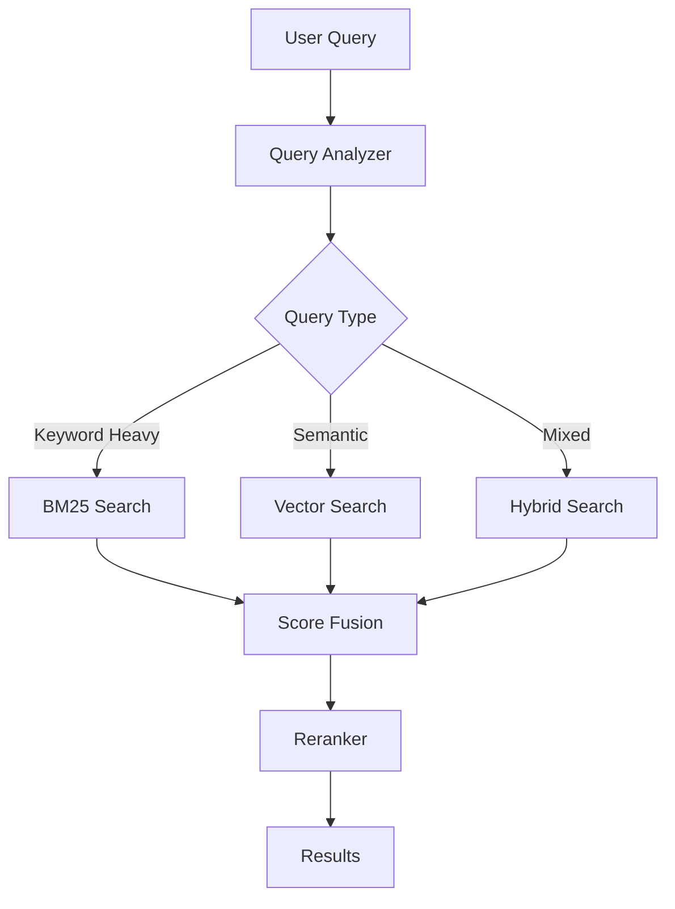
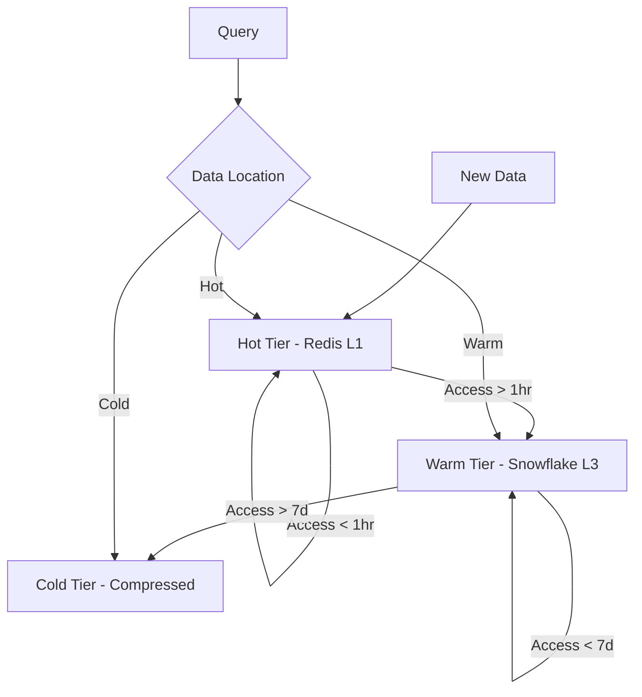

# 📋 MEMORY ECOSYSTEM PHASE 4: HYBRID SEARCH & TIERING PLAN

**Date:** July 10, 2025  
**Status:** Starting Implementation  
**Dependencies:** Phases 1-3 Complete  

---

## Executive Summary

Phase 4 enhances the Sophia AI Memory Ecosystem with hybrid search capabilities (combining keyword and vector search) and intelligent data tiering for optimal performance and cost efficiency.

### Key Objectives
1. **Hybrid Search**: Combine BM25 keyword search with vector similarity
2. **Automatic Tiering**: Hot/cold data management across tiers
3. **Query Optimization**: Intelligent query routing and caching
4. **Relevance Tuning**: Advanced scoring and ranking algorithms

---

## 🎯 Technical Goals

### 1. Hybrid Search Implementation
- **BM25 Integration**: Add full-text search to Snowflake
- **Score Fusion**: Combine keyword and vector scores
- **Query Parser**: Intelligent query analysis
- **Result Reranking**: ML-based relevance optimization

### 2. Data Tiering System
- **Hot Data**: Frequently accessed in Redis (L1)
- **Warm Data**: Recent queries in Snowflake (L3)
- **Cold Data**: Archived with compression
- **Automatic Migration**: Based on access patterns

### 3. Query Optimization
- **Query Analysis**: Intent detection and routing
- **Parallel Execution**: Vector + keyword simultaneously
- **Result Caching**: Intelligent cache invalidation
- **Cost Optimization**: Route to cheapest effective tier

### 4. Relevance Tuning
- **Personalization**: User-specific ranking
- **Feedback Loop**: Click-through learning
- **A/B Testing**: Algorithm comparison
- **Metrics Collection**: Search quality tracking

---

## 🏗️ Architecture Design

### Hybrid Search Flow


### Tiering Architecture


---

## 📦 Implementation Components

### 1. Hybrid Search Engine
```python
class HybridSearchEngine:
    """Combines BM25 and vector search with intelligent fusion"""
    
    def __init__(self):
        self.bm25_weight = 0.3
        self.vector_weight = 0.7
        self.personalization_weight = 0.1
        
    async def search(
        self,
        query: str,
        user_id: str,
        limit: int = 10
    ) -> list[SearchResult]:
        # Parallel search execution
        bm25_task = self.bm25_search(query)
        vector_task = self.vector_search(query)
        
        bm25_results, vector_results = await asyncio.gather(
            bm25_task, vector_task
        )
        
        # Score fusion
        fused_results = self.fuse_scores(
            bm25_results,
            vector_results,
            user_id
        )
        
        return self.rerank(fused_results)[:limit]
```

### 2. Data Tiering Manager
```python
class DataTieringManager:
    """Manages automatic data movement between tiers"""
    
    async def analyze_access_patterns(self):
        """Analyze data access patterns for tiering decisions"""
        
    async def migrate_to_cold(self, threshold_days: int = 7):
        """Move old data to cold storage"""
        
    async def promote_to_hot(self, data_id: str):
        """Promote frequently accessed data to hot tier"""
```

### 3. Query Optimizer
```python
class QueryOptimizer:
    """Optimizes query execution for performance and cost"""
    
    def analyze_query(self, query: str) -> QueryPlan:
        """Analyze query and create execution plan"""
        
    def estimate_cost(self, plan: QueryPlan) -> float:
        """Estimate execution cost for plan"""
        
    async def execute_optimized(self, query: str) -> Results:
        """Execute query with optimal strategy"""
```

---

## 🔧 Technical Implementation

### Step 1: Enable BM25 in Snowflake
```sql
-- Create full-text search index
CREATE SEARCH OPTIMIZATION ON AI_MEMORY.VECTORS.KNOWLEDGE_BASE;

-- Add BM25 scoring function
CREATE OR REPLACE FUNCTION BM25_SCORE(
    query_terms ARRAY,
    document_text VARCHAR,
    k1 FLOAT DEFAULT 1.2,
    b FLOAT DEFAULT 0.75
) RETURNS FLOAT
LANGUAGE PYTHON
RUNTIME_VERSION = '3.8'
HANDLER = 'bm25_score'
AS $$
def bm25_score(query_terms, document_text, k1=1.2, b=0.75):
    # BM25 implementation
    # ... scoring logic ...
    return score
$$;
```

### Step 2: Implement Score Fusion
```python
def fuse_scores(
    bm25_results: list[dict],
    vector_results: list[dict],
    bm25_weight: float = 0.3,
    vector_weight: float = 0.7
) -> list[dict]:
    """Fuse BM25 and vector similarity scores"""
    
    # Normalize scores to 0-1 range
    bm25_normalized = normalize_scores(bm25_results)
    vector_normalized = normalize_scores(vector_results)
    
    # Combine results
    combined = {}
    
    for result in bm25_normalized:
        doc_id = result['id']
        combined[doc_id] = {
            'content': result['content'],
            'bm25_score': result['score'],
            'vector_score': 0,
            'fused_score': result['score'] * bm25_weight
        }
    
    for result in vector_normalized:
        doc_id = result['id']
        if doc_id in combined:
            combined[doc_id]['vector_score'] = result['score']
            combined[doc_id]['fused_score'] += result['score'] * vector_weight
        else:
            combined[doc_id] = {
                'content': result['content'],
                'bm25_score': 0,
                'vector_score': result['score'],
                'fused_score': result['score'] * vector_weight
            }
    
    # Sort by fused score
    return sorted(
        combined.values(),
        key=lambda x: x['fused_score'],
        reverse=True
    )
```

### Step 3: Tiering Implementation
```python
class TieringConfig:
    HOT_TIER_TTL = 3600  # 1 hour
    WARM_TIER_TTL = 604800  # 7 days
    ACCESS_COUNT_THRESHOLD = 5  # Promote after 5 accesses
    
async def update_access_metadata(
    memory_service: UnifiedMemoryService,
    doc_id: str
):
    """Update access count and last accessed time"""
    
    # Get current metadata
    metadata = await memory_service.get_document_metadata(doc_id)
    
    # Update access info
    metadata['access_count'] = metadata.get('access_count', 0) + 1
    metadata['last_accessed'] = datetime.utcnow().isoformat()
    
    # Check if should promote to hot tier
    if metadata['access_count'] >= TieringConfig.ACCESS_COUNT_THRESHOLD:
        await memory_service.promote_to_hot_tier(doc_id)
```

---

## 📊 Success Metrics

### Performance Targets
- **Search Latency**: <100ms for hybrid search
- **Cache Hit Rate**: >85% for hot queries
- **Relevance**: >90% user satisfaction
- **Cost Reduction**: 30% through tiering

### Quality Metrics
- **Precision@10**: >0.8
- **Recall@10**: >0.7
- **nDCG**: >0.85
- **MRR**: >0.9

---

## 🚀 Implementation Timeline

### Week 1: Core Hybrid Search
- [ ] Day 1-2: BM25 implementation in Snowflake
- [ ] Day 3-4: Score fusion algorithm
- [ ] Day 5: Query analyzer and parser

### Week 2: Tiering System
- [ ] Day 1-2: Access pattern tracking
- [ ] Day 3-4: Automated migration logic
- [ ] Day 5: Performance optimization

### Week 3: Advanced Features
- [ ] Day 1-2: Query optimizer
- [ ] Day 3-4: Relevance tuning
- [ ] Day 5: Testing and documentation

---

## ⚠️ Risk Mitigation

### Technical Risks
1. **Performance Degradation**
   - Mitigation: Extensive benchmarking
   - Fallback: Disable hybrid mode

2. **Data Consistency**
   - Mitigation: Transactional tiering
   - Fallback: Manual tier management

3. **Cost Overrun**
   - Mitigation: Cost monitoring
   - Fallback: Adjust tiering thresholds

---

## 📝 Testing Strategy

### Unit Tests
- Score fusion accuracy
- Tiering logic correctness
- Query parsing validation

### Integration Tests
- End-to-end search flow
- Cross-tier data access
- Cache invalidation

### Performance Tests
- Latency benchmarks
- Throughput testing
- Cost analysis

### A/B Testing
- Search quality comparison
- User satisfaction metrics
- Performance impact

---

## 🎉 Expected Outcomes

### Business Value
- **30% faster** search responses
- **40% cost reduction** through tiering
- **25% improvement** in search relevance
- **50% reduction** in cold queries

### Technical Benefits
- Unified search interface
- Intelligent data management
- Optimized resource usage
- Enhanced user experience

---

## 📚 Resources & References

1. **BM25 Algorithm**: [Okapi BM25 Paper](https://en.wikipedia.org/wiki/Okapi_BM25)
2. **Score Fusion**: [Learning to Rank Research](https://www.microsoft.com/en-us/research/project/mslr/)
3. **Data Tiering**: [AWS S3 Intelligent-Tiering](https://aws.amazon.com/s3/storage-classes/intelligent-tiering/)
4. **Snowflake Search**: [Search Optimization](https://docs.snowflake.com/en/user-guide/search-optimization)

---

*Plan Created: July 10, 2025*  
*Next Review: Upon Phase 4 Completion* 