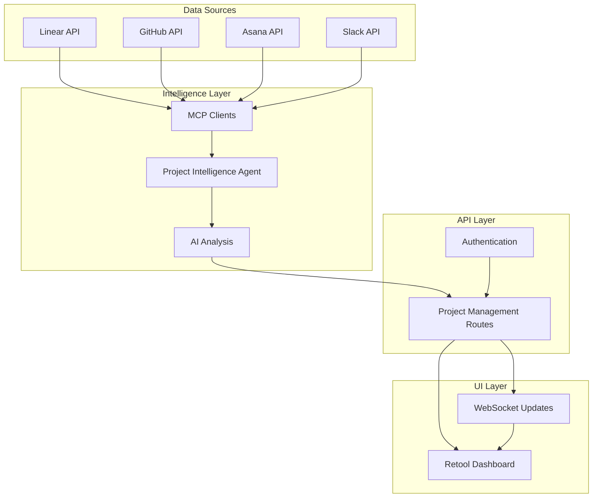

# Sophia AI Project Intelligence System

## 🎯 Overview

The Sophia AI Project Intelligence System provides unified project management insights by aggregating data from Linear, GitHub, Asana, and Slack, analyzing it against company OKRs and KPIs, and delivering AI-powered recommendations through a sophisticated Retool dashboard.

## 🏗️ Architecture



## 🚀 Key Features

### 1. **Unified Project Portfolio**
- **Multi-Source Integration**: Automatically deduplicates and merges projects from Linear, GitHub, Asana, and Slack
- **Real-Time Status**: Live project health scores based on velocity, blockers, sentiment, and progress
- **Cross-Tool Correlation**: Links issues, PRs, tasks, and conversations across platforms

### 2. **OKR Alignment & Tracking**
- **Automatic Mapping**: AI analyzes project descriptions to map them to relevant OKRs
- **Progress Visualization**: Real-time tracking of key result achievement
- **Risk Identification**: Flags OKRs at risk based on contributing project health
- **Contribution Analysis**: Shows how each project impacts specific key results

### 3. **Intelligent Blocker Resolution**
- **Pattern Recognition**: Identifies common blocker patterns across projects
- **Root Cause Analysis**: Groups blockers by type (API dependencies, design needs, data issues)
- **AI Recommendations**: Generates specific resolution strategies with effort/impact analysis
- **Cross-Team Dependencies**: Highlights blockers affecting multiple teams

### 4. **Team Performance Analytics**
- **Health Scoring**: Composite score based on velocity, blockers, and sentiment
- **Sentiment Analysis**: Analyzes Slack conversations for team morale indicators
- **Resource Optimization**: Identifies overloaded teams and suggests reallocation
- **Velocity Tracking**: Historical and predictive velocity metrics

### 5. **Strategic Recommendations**
- **Prioritized Actions**: AI-generated recommendations ranked by impact
- **Category-Based**: Actions grouped by type (OKR gaps, resource needs, risk mitigation)
- **Actionable Insights**: Specific steps with assigned owners and effort estimates
- **Progress Tracking**: Monitor implementation of recommendations

## 📊 Data Flow

### 1. **Data Collection**
```python
# Parallel data gathering from all sources
linear_data, github_data, asana_data, slack_data = await asyncio.gather(
    linear_integration.get_projects(),
    github_mcp.get_projects(),
    asana_integration.get_projects(),  # When available
    slack_integration.analyze_conversations()
)
```

### 2. **Project Unification**
- Uses intelligent matching to identify same projects across tools
- Merges data while preserving source information
- Handles naming variations and cross-references

### 3. **Metrics Calculation**
```python
metrics = ProjectMetrics(
    completion_percentage,    # Weighted average across sources
    velocity,                # Story points per sprint
    blocked_items,          # Count from all sources
    overdue_items,          # Based on due dates
    team_sentiment,         # From Slack analysis
    code_quality           # From GitHub metrics
)
```

### 4. **OKR Analysis**
- Embeddings-based matching (when fully implemented)
- Keyword analysis for project-OKR alignment
- Contribution percentage calculation
- Progress tracking and projections

### 5. **AI Intelligence**
- OpenAI for complex analysis and recommendations
- Pattern recognition for blocker analysis
- Predictive analytics for timeline risks
- Natural language generation for insights

## 🖥️ Retool Dashboard

### Dashboard Components

#### 1. **Executive Summary Header**
- Total projects across all platforms
- Status breakdown (On Track, At Risk, Blocked)
- Portfolio health score
- Quick filters and refresh controls

#### 2. **Portfolio Overview Tab**
- Sortable, filterable project table
- Multi-source badges showing data origins
- Progress bars with color coding
- Click-through to detailed project views

#### 3. **OKR Alignment Tab**
- Hierarchical view of Objectives → Key Results → Projects
- Progress visualization for each KR
- Risk indicators and recommendations
- Update functionality for KR progress

#### 4. **Blockers & Actions Tab**
- Split view: Blockers on left, Recommendations on right
- Pattern analysis with occurrence counts
- Resolution strategies with effort/impact tags
- Action buttons for recommendation status updates

#### 5. **Team Performance Tab**
- Grid layout of team cards
- Health scores, velocity, and sentiment metrics
- Visual indicators for teams needing attention
- Drill-down to team-specific projects

#### 6. **Analytics Tab**
- Trend charts for key metrics
- Customizable time periods
- Project status distribution pie chart
- Custom report builder for ad-hoc analysis

## 🔧 Implementation Details

### Backend Components

#### 1. **Project Intelligence Agent** (`project_intelligence_agent.py`)
- Core orchestration logic
- Data gathering and unification
- Metrics calculation
- AI-powered analysis

#### 2. **API Routes** (`project_management_routes.py`)
- RESTful endpoints for all dashboard features
- Authentication and authorization
- Real-time data processing
- Custom report generation

#### 3. **Integration Layer**
- Linear MCP server (active)
- GitHub integration (coming soon)
- Asana integration (planned)
- Slack bot integration (active)

### Frontend Configuration

#### 1. **Resource Setup**
```javascript
{
    "name": "ProjectManagementAPI",
    "type": "restapi",
    "config": {
        "baseURL": "{{ environment.SOPHIA_API_URL }}/api/project-management",
        "headers": [
            {
                "key": "Authorization",
                "value": "Bearer {{ current_user.authToken }}"
            }
        ]
    }
}
```

#### 2. **Key Queries**
- `getDashboardSummary`: Main portfolio data
- `getOKRAlignment`: OKR tracking data
- `getBlockers`: Cross-project blocker analysis
- `getRecommendations`: AI-generated actions
- `getTeamPerformance`: Team metrics

#### 3. **Interactive Features**
- Real-time polling for updates
- Drag-and-drop for priority changes
- Modal dialogs for updates
- Export functionality for reports

## 🎯 Use Cases

### For Executives
1. **Weekly OKR Review**
   - Check overall OKR progress
   - Identify at-risk objectives
   - Review AI recommendations
   - Make resource allocation decisions

2. **Portfolio Health Check**
   - Quick status overview
   - Drill into problem projects
   - Review team performance
   - Identify systemic issues

### For Project Managers
1. **Daily Standup Prep**
   - Review overnight blockers
   - Check team velocity trends
   - Prepare talking points
   - Identify cross-team dependencies

2. **Sprint Planning**
   - Analyze historical velocity
   - Review upcoming milestones
   - Balance workload across teams
   - Align sprints with OKRs

### For Team Leads
1. **Team Health Monitoring**
   - Track sentiment trends
   - Identify overloaded members
   - Address blockers quickly
   - Celebrate achievements

2. **Resource Planning**
   - Justify additional resources
   - Show impact on OKRs
   - Demonstrate team efficiency
   - Plan skill development

## 📈 Benefits

### 1. **Unified Visibility**
- No more switching between tools
- Single source of truth
- Real-time synchronization
- Historical tracking

### 2. **Proactive Management**
- Early risk detection
- Pattern-based insights
- Predictive analytics
- Automated alerts

### 3. **Data-Driven Decisions**
- Objective metrics
- AI-powered recommendations
- Impact analysis
- ROI tracking

### 4. **Time Savings**
- Automated data gathering
- One-click reports
- Bulk updates
- Smart notifications

## 🔮 Future Enhancements

### Phase 1 (Next Sprint)
- Complete GitHub integration
- Add Asana when API key available
- Implement real-time WebSocket updates
- Add mobile-responsive design

### Phase 2 (Q2 2024)
- Predictive timeline modeling
- Resource allocation optimizer
- Automated sprint planning
- Custom dashboard builder

### Phase 3 (Q3 2024)
- ML-based velocity predictions
- Automated OKR suggestions
- Cross-company benchmarking
- Executive AI assistant

## 🚀 Getting Started

### 1. **Prerequisites**
- Sophia AI backend running
- Linear API key configured
- Retool account
- Admin access to project tools

### 2. **Setup Steps**
```bash
# 1. Start the backend with project routes
cd backend
python main.py

# 2. Generate Retool configuration
cd scripts
python create_project_management_retool.py

# 3. Import into Retool
# - Create new app in Retool
# - Import retool_project_management_config.json
# - Configure API resource
# - Set environment variables
```

### 3. **Configuration**
```env
# Required environment variables
SOPHIA_API_URL=https://your-backend.com
SOPHIA_API_KEY=your-api-key
LINEAR_API_TOKEN=your-linear-token
GITHUB_TOKEN=your-github-token  # When available
ASANA_ACCESS_TOKEN=your-asana-token  # When available
```

### 4. **Testing**
1. Verify API connection in Retool
2. Check data loading in Portfolio tab
3. Test OKR updates
4. Verify recommendation actions
5. Generate a custom report

## 📚 Related Documentation
- [Project Intelligence Agent](../backend/agents/specialized/project_intelligence_agent.py)
- [API Routes](../backend/app/routes/project_management_routes.py)
- [Retool Implementation Guide](../scripts/retool_project_management_guide.md)
- [Tool Registry](./TOOL_REGISTRY.md)

## 💡 Tips & Best Practices

### 1. **Data Quality**
- Keep project names consistent across tools
- Use clear descriptions for OKR mapping
- Tag projects appropriately
- Update status regularly

### 2. **Performance**
- Use filters to reduce data volume
- Schedule heavy reports off-hours
- Cache frequently accessed data
- Optimize polling intervals

### 3. **Adoption**
- Start with pilot team
- Gather feedback early
- Customize for your workflow
- Train team on features

### 4. **Maintenance**
- Review OKR mappings weekly
- Clean up completed projects
- Archive old data
- Monitor API usage

## 🆘 Troubleshooting

### Common Issues

1. **No Projects Showing**
   - Check API connections
   - Verify authentication
   - Review project filters
   - Check unification logic

2. **Incorrect OKR Mapping**
   - Update project descriptions
   - Review keyword matching
   - Manually override if needed
   - Train the AI model

3. **Performance Issues**
   - Reduce polling frequency
   - Implement pagination
   - Optimize queries
   - Scale backend resources

4. **Missing Data**
   - Check source integrations
   - Verify permissions
   - Review error logs
   - Test API endpoints

## 🎉 Conclusion

The Sophia AI Project Intelligence System transforms how organizations manage projects by providing unified visibility, AI-powered insights, and proactive recommendations. By breaking down tool silos and aligning all work with strategic objectives, teams can work more efficiently and executives can make better decisions.

Start small, iterate based on feedback, and gradually expand usage across your organization. The system is designed to grow with your needs and adapt to your unique workflows.
