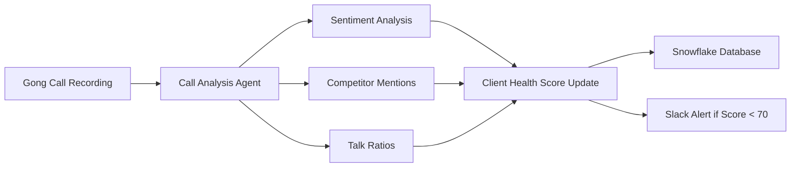
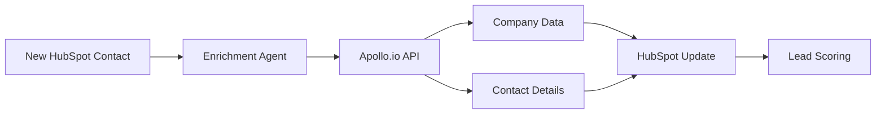
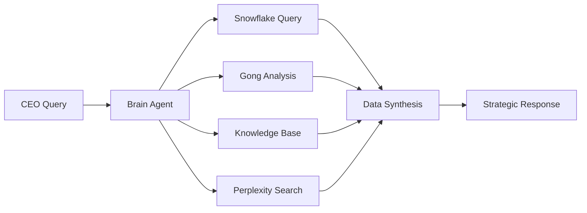
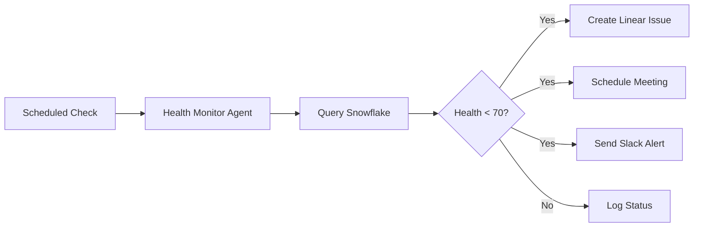
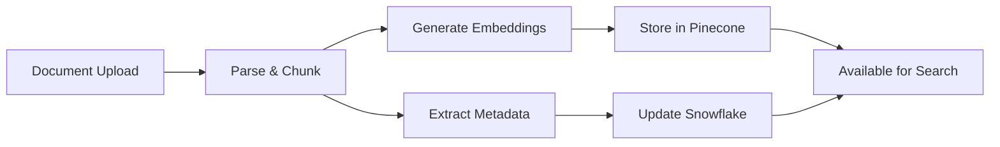
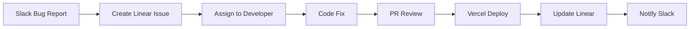

# Sophia AI Workflow Patterns

## 🚀 Overview

This document catalogs all workflow patterns available in Sophia AI, showing how different tools and integrations work together to accomplish complex business tasks.

## 📊 Workflow Categories

### 1. Sales Intelligence Workflows

#### **Gong Call Analysis → Client Health Update**


**Tools Used:**
- Gong.io (call data)
- OpenAI (analysis)
- Snowflake (storage)
- Slack (notifications)

**Example Code:**
```python
# Triggered automatically after each Gong call
async def analyze_call_workflow(call_id: str):
    # Get call data
    call = await gong_client.get_call(call_id)
    transcript = await gong_client.get_transcript(call_id)

    # Analyze with AI
    analysis = await openai_client.analyze_call(transcript)

    # Update client health
    await snowflake_client.update_health_score(
        client_id=call.client_id,
        sentiment=analysis.sentiment,
        risk_factors=analysis.risks
    )

    # Alert if needed
    if analysis.health_score < 70:
        await slack_client.send_alert(
            channel="#client-health",
            message=f"⚠️ {call.client_name} health dropped to {analysis.health_score}"
        )
```

#### **Apollo Enrichment → HubSpot Update**


**Tools Used:**
- HubSpot (CRM)
- Apollo.io (enrichment)
- Bardeen (automation)

### 2. Strategic Intelligence Workflows

#### **CEO Dashboard Query → Multi-Source Analysis**


**Tools Used:**
- Brain Agent (orchestration)
- Snowflake (internal data)
- Gong (call insights)
- Pinecone (knowledge base)
- Perplexity (web intelligence)

**Example Query Flow:**
```python
async def strategic_chat_workflow(query: str):
    # Parse intent
    intent = await brain_agent.analyze_intent(query)

    # Gather data in parallel
    tasks = []

    if intent.needs_client_data:
        tasks.append(snowflake_client.query_clients(intent.filters))

    if intent.needs_call_insights:
        tasks.append(gong_client.search_calls(intent.keywords))

    if intent.needs_market_data:
        tasks.append(perplexity_client.search(intent.market_query))

    if intent.needs_knowledge:
        tasks.append(pinecone_client.search(intent.embedding))

    # Execute all queries
    results = await asyncio.gather(*tasks)

    # Synthesize response
    response = await openai_client.synthesize(
        query=query,
        data_sources=results,
        context=intent.context
    )

    return response
```

### 3. Automated Alert Workflows

#### **Client Health Monitoring → Action Trigger**


**Tools Used:**
- Snowflake (data)
- Linear (issue tracking)
- Bardeen (meeting scheduling)
- Slack (notifications)

### 4. Knowledge Management Workflows

#### **Document Upload → Knowledge Base Update**


**Tools Used:**
- File Processing API
- OpenAI (embeddings)
- Pinecone (vector storage)
- Snowflake (metadata)

### 5. Development Workflows

#### **Bug Report → Fix Deployment**


**Tools Used:**
- Slack (reporting)
- Linear (tracking)
- GitHub (code)
- Vercel (deployment)

## 🔧 Advanced Workflow Patterns

### 1. Predictive Client Churn

```python
async def predict_churn_workflow():
    """Run weekly to identify at-risk clients"""

    # Get client data
    clients = await snowflake_client.get_all_clients()

    # Enrich with external data
    for client in clients:
        client.apollo_data = await apollo_client.enrich(client.domain)
        client.recent_calls = await gong_client.get_recent_calls(client.id)

    # Run prediction model
    predictions = await arize_client.predict_churn(clients)

    # Create action items
    for prediction in predictions:
        if prediction.churn_risk > 0.7:
            # Create Linear issue
            await linear_client.create_issue(
                title=f"High churn risk: {prediction.client_name}",
                priority="urgent",
                assignee="customer_success_team"
            )

            # Schedule intervention
            await bardeen_client.schedule_meeting(
                title=f"Client check-in: {prediction.client_name}",
                attendees=[prediction.csm_email, prediction.client_email]
            )

            # Alert leadership
            await slack_client.send_message(
                channel="#leadership",
                text=f"🚨 {prediction.client_name} has {prediction.churn_risk*100:.0f}% churn risk"
            )
```

### 2. Competitive Intelligence Gathering

```python
async def competitive_intelligence_workflow():
    """Daily workflow to monitor competitors"""

    competitors = ["AppFolio", "Yardi", "RealPage"]

    for competitor in competitors:
        # Web search for news
        news = await tavily_client.search(f"{competitor} news announcements", recency="24h")

        # Check for pricing changes (when Firecrawl is available)
        # pricing = await firecrawl_client.scrape(f"{competitor}.com/pricing")

        # Analyze Gong calls for mentions
        mentions = await gong_client.search_transcripts(competitor)

        # Store insights
        await knowledge_base.add_insight({
            "type": "competitive_intelligence",
            "competitor": competitor,
            "news": news,
            "mentions": mentions,
            "timestamp": datetime.now()
        })

        # Alert if significant
        if news.has_major_announcement or len(mentions) > 5:
            await slack_client.send_message(
                channel="#competitive-intel",
                text=f"📊 New {competitor} intelligence available"
            )
```

### 3. Automated Dashboard Generation

```python
async def create_custom_dashboard_workflow(request: DashboardRequest):
    """Use Retool API to create custom dashboards on demand"""

    # Analyze request
    requirements = await brain_agent.analyze_dashboard_needs(request)

    # Generate Retool configuration
    config = {
        "name": request.name,
        "components": []
    }

    # Add components based on requirements
    if requirements.needs_client_table:
        config["components"].append({
            "type": "table",
            "data_source": "snowflake",
            "query": requirements.client_query
        })

    if requirements.needs_charts:
        config["components"].append({
            "type": "chart",
            "data_source": "snowflake",
            "query": requirements.metrics_query
        })

    if requirements.needs_ai_chat:
        config["components"].append({
            "type": "chat",
            "model": "gpt-4",
            "context": requirements.chat_context
        })

    # Create dashboard
    dashboard_url = await retool_client.create_app(config)

    # Notify requester
    await slack_client.send_message(
        channel=request.slack_channel,
        text=f"✅ Your dashboard is ready: {dashboard_url}"
    )

    return dashboard_url
```

## 🎯 Workflow Best Practices

### 1. **Parallel Execution**
Always execute independent operations in parallel:
```python
# Good - Parallel
results = await asyncio.gather(
    gong_client.get_calls(),
    apollo_client.enrich_companies(),
    snowflake_client.query_metrics()
)

# Bad - Sequential
gong_data = await gong_client.get_calls()
apollo_data = await apollo_client.enrich_companies()
snowflake_data = await snowflake_client.query_metrics()
```

### 2. **Error Handling**
Implement graceful degradation:
```python
async def robust_workflow():
    results = {}

    # Try primary source
    try:
        results['primary'] = await primary_source.get_data()
    except Exception as e:
        logger.warning(f"Primary source failed: {e}")
        # Fall back to cache or alternative
        results['primary'] = await cache.get_last_known_good()

    return results
```

### 3. **Monitoring Integration**
Track all workflows with Arize:
```python
async def monitored_workflow(input_data):
    start_time = time.time()

    try:
        result = await execute_workflow(input_data)

        # Log success
        await arize_client.log_prediction(
            model_id="workflow_executor",
            prediction=result,
            features=input_data,
            latency=time.time() - start_time
        )

        return result
    except Exception as e:
        # Log failure
        await arize_client.log_error(
            model_id="workflow_executor",
            error=str(e),
            features=input_data
        )
        raise
```

### 4. **Caching Strategy**
Use Redis for frequently accessed data:
```python
async def cached_workflow(client_id: str):
    # Check cache first
    cache_key = f"client_health:{client_id}"
    cached = await redis_client.get(cache_key)

    if cached and not is_stale(cached):
        return cached

    # Compute fresh data
    health_data = await compute_client_health(client_id)

    # Cache for 1 hour
    await redis_client.setex(cache_key, 3600, health_data)

    return health_data
```

## 📈 Performance Optimization

### 1. **Batch Processing**
```python
async def batch_enrichment_workflow(company_ids: List[str]):
    # Bad - Individual requests
    # for company_id in company_ids:
    #     await apollo_client.enrich(company_id)

    # Good - Batch request
    enriched_data = await apollo_client.batch_enrich(company_ids)
    return enriched_data
```

### 2. **Smart Scheduling**
```python
# Schedule heavy workflows during off-peak hours
scheduler.add_job(
    competitive_intelligence_workflow,
    'cron',
    hour=2,  # 2 AM
    minute=0
)

# Light workflows can run frequently
scheduler.add_job(
    health_check_workflow,
    'interval',
    minutes=5
)
```

## 🔮 Future Workflow Patterns

### 1. **AI-Generated Workflows**
When Retool MCP is fully integrated:
```python
async def ai_generated_workflow(natural_language_request: str):
    # AI analyzes request
    workflow_spec = await claude_client.design_workflow(natural_language_request)

    # Generate workflow code
    workflow_code = await claude_client.generate_code(workflow_spec)

    # Deploy workflow
    workflow_id = await workflow_engine.deploy(workflow_code)

    # Create UI in Retool
    ui_url = await retool_client.create_workflow_ui(workflow_id)

    return ui_url
```

### 2. **Self-Healing Workflows**
With Arize monitoring:
```python
async def self_healing_workflow():
    # Monitor performance
    metrics = await arize_client.get_workflow_metrics()

    if metrics.error_rate > 0.1:  # 10% error rate
        # Analyze errors
        error_analysis = await claude_client.analyze_errors(metrics.errors)

        # Generate fix
        fix = await claude_client.suggest_fix(error_analysis)

        # Apply fix
        await workflow_engine.apply_patch(fix)

        # Notify team
        await linear_client.create_issue(
            title="Workflow self-healed",
            description=f"Applied fix: {fix.description}"
        )
```

## 🎓 Getting Started

1. **Explore Available Tools:**
   ```bash
   python scripts/explore_sophia_tools.py
   ```

2. **Test a Simple Workflow:**
   ```python
   # scripts/test_basic_workflow.py
   from backend.core.tool_registry import tool_registry

   async def test_workflow():
       # Get Slack tool
       slack = tool_registry.get_tool("slack")

       # Send test message
       await slack_client.send_message(
           channel="#test",
           text="Hello from Sophia AI!"
       )
   ```

3. **Monitor Workflow Performance:**
   - Check Arize dashboard for metrics
   - Review Linear for workflow-related issues
   - Monitor Slack #workflow-alerts channel

## 📚 Additional Resources

- [Tool Registry Documentation](./TOOL_REGISTRY.md)
- [MCP Server Guide](./mcp_server_documentation.md)
- [API Documentation](./API_DOCUMENTATION.md)
- [Infrastructure Guide](./INFRASTRUCTURE_GUIDE.md)
