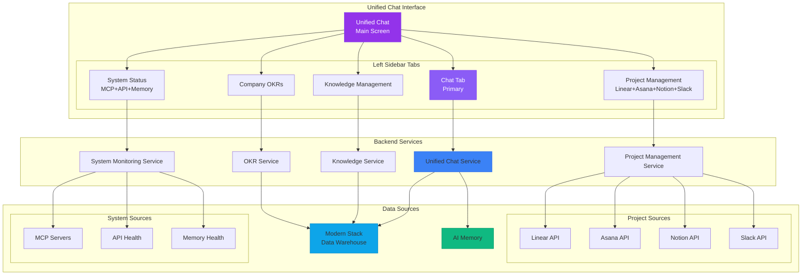

# Sophia AI Unified Chat Architecture

## Overview

The Sophia AI platform has been redesigned with a **chat-first** interface that puts the unified chat/search feature at the center of the user experience. This document outlines the new simplified architecture focused on what matters most.

## Core Principles

1. **Chat is Primary**: The main screen is the chat interface - not buried in tabs
2. **Focused Features**: Only essential features, no CRM data duplication
3. **Unified Intelligence**: Single interface to query across all data sources
4. **Clean Navigation**: Left sidebar with clear, focused tabs

## Architecture

```
┌─────────────────────────────────────────────────────────┐
│                   Sophia AI Platform                     │
├─────────────────┬───────────────────────────────────────┤
│                 │                                       │
│  Left Sidebar   │         Main Content Area            │
│                 │                                       │
│  ┌───────────┐  │  ┌─────────────────────────────────┐ │
│  │ Sophia AI │  │  │                                 │ │
│  └───────────┘  │  │                                 │ │
│                 │  │                                 │ │
│  ▶ Chat        │  │      Unified Chat Interface      │ │
│    Knowledge    │  │                                 │ │
│    Projects     │  │   [Chat messages displayed]     │ │
│    System       │  │                                 │ │
│    OKRs         │  │   [Input box at bottom]        │ │
│                 │  │                                 │ │
│                 │  └─────────────────────────────────┘ │
└─────────────────┴───────────────────────────────────────┘
```

## Tab Structure

### 1. **Unified Chat** (Primary Tab - Always First)
- Main chat interface for all queries
- Natural language understanding
- Cross-source intelligence synthesis
- Citation system showing data sources
- Context-aware responses

### 2. **Knowledge Management**
- Document search and management
- Knowledge base statistics
- Recent documents
- AI-generated insights
- Upload and indexing capabilities

### 3. **Project Management**
Unified view combining:
- **Linear**: Engineering project tracking
- **Asana**: Product management tasks
- **Notion**: CEO tasks and documentation
- **Slack**: Project-related conversations

Key features:
- Active project dashboard
- Cross-platform project health
- Unified task view
- Progress tracking
- Risk assessment

### 4. **System Status**
Real-time monitoring of:
- **MCP Server Health**: Status of all MCP servers
- **API Health**: Endpoint performance and uptime
- **Memory Health**: AI Memory usage and performance
- **System Metrics**: Overall platform health

Key metrics:
- Service uptime percentages
- Response times
- Error rates
- Resource utilization

### 5. **Company OKRs**
- Current quarter objectives
- Key result progress tracking
- Visual progress indicators
- Achievement status
- Executive-only update capabilities

## Data Flow



## API Endpoints

### Unified Chat
- `POST /api/v3/chat/unified` - Main chat endpoint
- Supports context-aware routing based on active tab
- Returns responses with citations

### Knowledge Management
- `GET /api/v3/knowledge/stats` - Knowledge base statistics
- `GET /api/v3/knowledge/recent` - Recent documents
- `POST /api/v3/knowledge/search` - Semantic search

### Project Management
- `GET /api/v3/projects/summary` - Unified project summary
- `GET /api/v3/projects/active` - Active projects across platforms
- `GET /api/v3/projects/health` - Project health metrics

### System Status
- `GET /api/v3/system/health` - Overall system health
- `GET /api/v3/system/mcp-servers` - MCP server status
- `GET /api/v3/system/metrics` - Performance metrics

### OKRs
- `GET /api/v3/okrs/current` - Current quarter OKRs
- `GET /api/v3/okrs/progress` - Progress summary
- `POST /api/v3/okrs/update` - Update key results (admin only)

## Key Features

### 1. **Context-Aware Chat**
The unified chat understands context from:
- Active tab selection
- Previous conversation history
- User role and permissions
- Time of query

### 2. **Intelligent Routing**
Queries are automatically routed to appropriate services:
- Project questions → Project Management Service
- System questions → System Monitoring Service
- Business questions → Unified Intelligence

### 3. **Citation System**
All responses include:
- Data source attribution
- Confidence scores
- Timestamp of source data
- Direct links when applicable

### 4. **Real-Time Updates**
- WebSocket connections for live data
- Automatic refresh of metrics
- Push notifications for critical alerts

## Implementation Status

### ✅ Completed
- Unified Chat Interface component
- Left sidebar navigation
- Tab structure and routing
- Basic panel layouts
- API route definitions

### 🚧 In Progress
- Backend service implementations
- WebSocket real-time updates
- Authentication integration

### 📋 Planned
- Advanced search filters
- Export capabilities
- Mobile responsive design
- Keyboard shortcuts

## Usage Examples

### Chat Queries
- "What's the status of our Q1 projects?"
- "Show me recent customer feedback from Slack"
- "How is our infrastructure performing?"
- "What's our progress on the ARR objective?"

### Natural Language Commands
- "Find all documents about pricing strategy"
- "Show me at-risk projects across all platforms"
- "Check if the AI Memory server is healthy"
- "Update the user acquisition key result to 87"

## Security Considerations

1. **Role-Based Access**
   - CEO: Full access to all features
   - Executives: OKR updates, all data access
   - Managers: Read access to projects and OKRs
   - Employees: Limited to relevant project data

2. **Data Isolation**
   - Queries respect user permissions
   - Sensitive data filtered at service layer
   - Audit logging for all queries

3. **API Security**
   - JWT authentication required
   - Rate limiting per user
   - Request validation

## Performance Targets

- Chat response time: < 200ms
- Search results: < 500ms
- Real-time updates: < 100ms latency
- System status refresh: Every 30 seconds
- 99.9% uptime for critical services

## Future Enhancements

1. **Voice Interface**: Natural language voice queries
2. **Predictive Insights**: AI-generated recommendations
3. **Custom Dashboards**: User-configurable views
4. **Advanced Analytics**: Deeper business intelligence
5. **Mobile App**: Native iOS/Android applications
