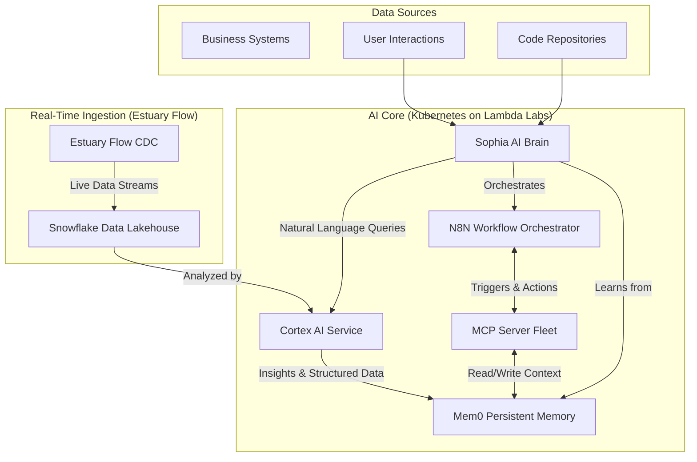

# ENTERPRISE AI ECOSYSTEM PLAN
## Phoenix 1.4: Memory-Augmented, Conversationally-Trained, Real-Time AI Orchestrator

**Version**: Phoenix 1.4
**Status**: AUTHORITATIVE - This supersedes all previous MCP plans.
**Last Updated**: January 2025

---

## 🎯 EXECUTIVE SUMMARY

This document outlines the architecture for the **Sophia AI Enterprise Ecosystem (Phoenix 1.4)**. This plan evolves beyond simple server standardization to create a fully integrated, memory-augmented, and conversationally-trained platform. It leverages four key technologies—**Mem0, Snowflake Cortex AISQL, N8N, and Estuary Flow**—to build a cutting-edge, AI coder-agnostic system deployed entirely on a scalable Kubernetes infrastructure (Lambda Labs).

### Core Architectural Pillars
- **Unified Kubernetes Deployment**: All 27 MCP servers are containerized and deployed via Helm charts on Lambda Labs, eliminating local deployments.
- **Persistent, Shared Memory (Mem0)**: A cross-tool, persistent memory layer enables continuous learning and context preservation.
- **Natural Language Data Interaction (Cortex AISQL)**: Sophia learns to interact with our Snowflake data warehouse using natural language.
- **Event-Driven Orchestration (N8N)**: A robust multi-agent system for automating complex business workflows.
- **Real-Time Data Streaming (Estuary Flow)**: Live data from business systems continuously feeds the AI's learning loop.

---

## 🏗️ UNIFIED ECOSYSTEM ARCHITECTURE

### High-Level Data & Orchestration Flow



### Universal Enterprise MCP Server (Kubernetes-Native)

The `EnterpriseMCPServerBase` is redesigned for a pure Kubernetes environment. Port mapping is now handled by Kubernetes Services, not the application itself.

```python
# backend/core/enterprise_mcp_server_base_v2.py
from abc import ABC, abstractmethod
from typing import Dict, List, Any
from dataclasses import dataclass

@dataclass
class ServerCapabilities:
    """Self-describing server capabilities for AI coder agnostic interaction"""
    name: str
    version: str
    description: str
    api_spec_url: str  # URL to OpenAPI/Swagger spec
    automation_triggers: List[str]
    memory_integration: bool

class EnterpriseMCPServerBaseV2(ABC):
    """
    Universal base class for all Kubernetes-deployed MCP servers.
    Designed for AI coder agnostic, memory-augmented operation.
    """
    def __init__(self, name: str, description: str):
        self.name = name
        self.description = description
        # Memory, N8N, and Estuary clients will be injected
        self.mem0 = None
        self.cortex = None
        self.n8n_client = None
        self.estuary_consumer = None
        self.setup_metrics()

    @abstractmethod
    def define_capabilities(self) -> ServerCapabilities:
        """Define server capabilities for self-description."""
        pass

    async def health_check(self) -> Dict[str, Any]:
        """Comprehensive health check, including dependent services."""
        # ... implementation to check connections to Mem0, N8N, etc.
        pass

    # ... other standardized methods like webfetch, metrics, etc.
```

---

## 🚀 COMPREHENSIVE IMPLEMENTATION PLAN (6 Weeks)

### Phase 1: Kubernetes Foundation & Real-Time Ingestion (Weeks 1-2)

**1.1. Unified Kubernetes Deployment**
- **Action**: Create standardized Helm charts for all 27 MCP servers.
- **Goal**: Automate deployment, scaling, and management of all servers on Lambda Labs.
- **Example (`infrastructure/kubernetes/helm/mcp-server/templates/deployment.yaml`):**
  ```yaml
  apiVersion: apps/v1
  kind: Deployment
  metadata:
    name: {{ .Values.name }}
  spec:
    replicas: {{ .Values.replicaCount }}
    template:
      spec:
        containers:
          - name: {{ .Values.name }}
            image: "{{ .Values.image.repository }}:{{ .Values.image.tag }}"
            ports:
              - containerPort: 80
            envFrom:
              - secretRef:
                  name: pulumi-esc-secrets
  ```

**1.2. Estuary Flow & N8N Deployment**
- **Action**: Deploy Estuary Flow and N8N into the Kubernetes cluster.
- **Goal**: Establish the backbone for real-time data streaming and workflow orchestration.
- **Example (`infrastructure/estuary/flow-config.yaml`):**
  ```yaml
  collections:
    - source: hubspot_cdc
      destination: snowflake_hubspot_raw
      schedule: real-time
  ```
- **Example (`infrastructure/n8n/mcp-workflow.json`):**
  ```json
  {
    "nodes": [
      {
        "parameters": { "channel": "github_commit" },
        "name": "On GitHub Commit",
        "type": "n8n-nodes-base.mcpTrigger"
      },
      {
        "parameters": { "server": "codacy", "action": "analyze_code" },
        "name": "Analyze Code",
        "type": "n8n-nodes-base.mcpClient"
      }
    ],
    "connections": { ... }
  }
  ```

### Phase 2: Core Intelligence & Persistent Memory (Weeks 3-4)

**2.1. Deploy Mem0 MCP Server**
- **Action**: Deploy the OpenMemory MCP server within the K8s cluster, backed by a persistent volume.
- **Goal**: Create the shared, persistent memory layer for the entire ecosystem.

**2.2. Enhance Snowflake with Cortex AI Service**
- **Action**: Refactor the `Snowflake_Unified` server into a powerful `Cortex_AI_Service`.
- **Goal**: Enable natural language to SQL, sentiment analysis, and other AI functions directly on our data warehouse.
- **Example (`backend/services/cortex_ai_service.py`):**
  ```python
  class CortexAIService:
      async def natural_language_to_sql(self, question: str) -> str:
          # Uses Snowflake's AI_COMPLETE or similar functionality
          prompt = f"Given our schema, translate this question to SQL: {question}"
          response = await self.snowflake_cortex.complete(prompt)
          return response
  ```

**2.3. Integrate All Servers with Memory**
- **Action**: Update the base class of all 27 MCP servers to connect to the Mem0 server.
- **Goal**: Ensure all actions, triggers, and results are recorded for continuous learning.

### Phase 3: Intelligent Orchestration & Automation (Weeks 5-6)

**3.1. Implement N8N Multi-Agent Workflows**
- **Action**: Design and build N8N workflows that orchestrate multiple MCP servers.
- **Goal**: Automate complex business processes like sales pipeline analysis or new employee onboarding.
- **Pattern**: Supervisor-worker agent model. An N8N "supervisor" workflow receives a high-level task (e.g., "analyze last week's sales calls") and triggers specialized "worker" MCP servers (Gong, HubSpot, AI Memory) to collect, analyze, and synthesize the information.

**3.2. Activate Conversational Training Loop**
- **Action**: Connect user feedback from the Unified Dashboard to an N8N workflow.
- **Goal**: Implement Reinforcement Learning from Human Feedback (RLHF). Feedback is stored in Mem0 and used to refine future AI responses and actions.

**3.3. Update System Handbook**
- **Action**: Create a new "Enterprise AI Ecosystem" section in the handbook.
- **Goal**: Document the new architecture, deployment procedures, and developer guidelines.

---

## 🎯 SUCCESS METRICS

- **Technical Excellence**: >99.9% uptime, unified Helm-based deployment for all servers.
- **AI Coder Agnostic**: Any tool can interact with servers via standard Kubernetes services and OpenAPI specs.
- **Memory & Learning**: >90% context preservation across sessions; measurable improvement in task success rate.
- **Business Impact**: 60% faster development velocity; 40% reduction in manual data analysis tasks.

---

## 🚀 DEPLOYMENT COMMANDS

```bash
# Deploy/Update the entire ecosystem to Lambda Labs Kubernetes
pulumi up -C infrastructure/

# Manually trigger an N8N orchestration workflow
python scripts/trigger_n8n_workflow.py --workflow="sales_pipeline_analysis"

# Validate the health of all deployed MCP servers
python scripts/validate_k8s_mcp_ecosystem.py
```

---

This **Phoenix 1.4** plan represents a paradigm shift from a collection of servers to a deeply integrated, self-learning AI ecosystem. It embraces modern, open standards and positions Sophia AI for unparalleled growth and intelligence.
