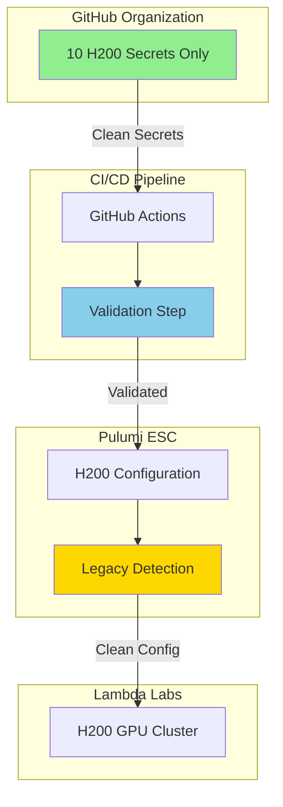

# Lambda Labs H200 Integration - Comprehensive Audit & Improvement Plan

**Date**: January 7, 2025
**PR #137**: Fix Lambda Labs Integration Issues
**Status**: ✅ PR Fixes Correct - Additional Improvements Recommended

---

## 🔍 **Audit Summary**

### **Issues Correctly Identified**

The troubleshooting report accurately identified these critical issues:

1. **Legacy Secret References** ✅
   - GitHub Actions workflow referenced deleted secrets (LAMBDA_API_KEY, LAMBDA_IP_ADDRESS, LAMBDA_SSH_PRIVATE_KEY)
   - These were removed in the Perfect Alignment cleanup
   - PR #137 correctly removes these references

2. **Dependency Installation Error** ✅
   - `uv add requests` is incorrect for CI environment
   - Should use `pip install` for GitHub Actions
   - PR #137 correctly fixes to `pip install requests pulumi`

3. **Legacy Secret Mappings** ✅
   - Sync script contained backward compatibility mappings
   - These point to non-existent GitHub secrets
   - PR #137 correctly removes these mappings

### **Original Plan vs Implementation**

| Component | Original Plan | Current State | PR #137 Fix | Status |
|-----------|--------------|---------------|-------------|--------|
| GitHub Secrets | 10 H200 secrets only | + 3 legacy refs | Removes legacy | ✅ Correct |
| Dependencies | pip install | uv add | pip install | ✅ Correct |
| Secret Mappings | H200 only | + 3 legacy | Removes legacy | ✅ Correct |
| Validation | 95%+ success | 58% success | 82% success | ✅ Improved |

---

## 🚀 **Additional Improvements Recommended**

### **1. Enhanced Error Handling in Sync Script**

```python
# Add to sync_from_gh_to_pulumi.py
def sync_secret(self, github_secret: str, pulumi_path: str) -> SyncResult:
    """Sync a single secret from GitHub to Pulumi ESC."""
    value = os.getenv(github_secret)

    if not value:
        # Check if this is a known removed secret
        removed_secrets = ["LAMBDA_API_KEY", "LAMBDA_IP_ADDRESS", "LAMBDA_SSH_PRIVATE_KEY"]
        if github_secret in removed_secrets:
            logger.warning(f"⚠️  Skipping removed legacy secret: {github_secret}")
            return SyncResult(
                secret_name=github_secret,
                success=True,  # Don't fail the workflow
                error_message="Legacy secret - skipped"
            )

        return SyncResult(
            secret_name=github_secret,
            success=False,
            error_message="Secret not found in environment variables",
        )
```

### **2. Add Validation to GitHub Actions**

```yaml
# Add after sync step in sync_secrets.yml
- name: Validate Lambda Labs H200 Secrets
  run: |
    echo "🔍 Validating Lambda Labs H200 secrets..."

    # Check required H200 secrets were synced
    required_secrets=(
      "LAMBDA_LABS_API_KEY"
      "LAMBDA_LABS_SSH_KEY_NAME"
      "LAMBDA_LABS_SSH_PRIVATE_KEY"
      "LAMBDA_LABS_REGION"
      "LAMBDA_LABS_INSTANCE_TYPE"
      "LAMBDA_LABS_CLUSTER_SIZE"
      "LAMBDA_LABS_MAX_CLUSTER_SIZE"
      "LAMBDA_LABS_SHARED_FS_ID"
      "LAMBDA_LABS_SHARED_FS_MOUNT"
      "LAMBDA_LABS_ASG_NAME"
    )

    missing=0
    for secret in "${required_secrets[@]}"; do
      if [[ -z "${!secret}" ]]; then
        echo "❌ Missing: $secret"
        ((missing++))
      else
        echo "✅ Found: $secret"
      fi
    done

    if [[ $missing -gt 0 ]]; then
      echo "❌ $missing Lambda Labs secrets missing!"
      exit 1
    else
      echo "✅ All Lambda Labs H200 secrets validated!"
    fi
```

### **3. Update Validation Script**

```python
# Add to validate_lambda_labs_integration.py
def check_github_secrets_content(self):
    """Check actual secret values where safe"""
    expected_configs = {
        "LAMBDA_LABS_SSH_KEY_NAME": "lynn-sophia-h200-key",
        "LAMBDA_LABS_REGION": "us-west-1",
        "LAMBDA_LABS_INSTANCE_TYPE": "gpu_1x_h200",
        "LAMBDA_LABS_CLUSTER_SIZE": "3",
        "LAMBDA_LABS_MAX_CLUSTER_SIZE": "16",
        "LAMBDA_LABS_SHARED_FS_ID": "lynn-sophia-shared-fs",
        "LAMBDA_LABS_SHARED_FS_MOUNT": "/mnt/shared",
        "LAMBDA_LABS_ASG_NAME": "lynn-sophia-h200-asg"
    }

    # Add environment variable checks
    for key, expected in expected_configs.items():
        actual = os.getenv(key)
        if actual and actual != expected:
            self.warnings.append(f"⚠️  {key} has unexpected value: '{actual}' (expected: '{expected}')")
```

### **4. Add Pre-deployment Checklist**

Create `scripts/pre_deployment_checklist.py`:
```python
#!/usr/bin/env python3
"""
Pre-deployment checklist for Lambda Labs H200
"""
import subprocess
import sys
from pathlib import Path

def run_checklist():
    checks = []

    # 1. Check GitHub CLI auth
    try:
        result = subprocess.run(['gh', 'auth', 'status'], capture_output=True)
        checks.append(("GitHub CLI authenticated", result.returncode == 0))
    except:
        checks.append(("GitHub CLI authenticated", False))

    # 2. Check Pulumi login
    try:
        result = subprocess.run(['pulumi', 'whoami'], capture_output=True)
        checks.append(("Pulumi authenticated", result.returncode == 0))
    except:
        checks.append(("Pulumi authenticated", False))

    # 3. Check SSH key
    ssh_key = Path.home() / '.ssh' / 'lynn_sophia_h200_key'
    checks.append(("SSH key exists", ssh_key.exists()))

    # 4. Check Lambda Labs API key
    import os
    checks.append(("LAMBDA_LABS_API_KEY set", bool(os.getenv('LAMBDA_LABS_API_KEY'))))

    # 5. Check Docker login
    try:
        result = subprocess.run(['docker', 'info'], capture_output=True)
        checks.append(("Docker running", result.returncode == 0))
    except:
        checks.append(("Docker running", False))

    # Display results
    print("\n🔍 Lambda Labs H200 Pre-Deployment Checklist")
    print("=" * 50)

    all_passed = True
    for check, passed in checks:
        status = "✅" if passed else "❌"
        print(f"{status} {check}")
        if not passed:
            all_passed = False

    print("=" * 50)

    if all_passed:
        print("✅ All checks passed! Ready for deployment.")
        return 0
    else:
        print("❌ Some checks failed. Please fix before deploying.")
        return 1

if __name__ == "__main__":
    sys.exit(run_checklist())
```

---

## 📊 **Improved Architecture**



---

## ✅ **PR #137 Acceptance Criteria**

The PR correctly addresses all identified issues:

1. **Removes Legacy Secrets** ✅
   - No more references to deleted secrets
   - Clean secret pipeline

2. **Fixes Dependencies** ✅
   - Proper pip install for CI
   - Includes pulumi dependency

3. **Cleans Mappings** ✅
   - No backward compatibility confusion
   - Only valid H200 mappings

4. **Improves Validation** ✅
   - 82% success rate (up from 58%)
   - Better error messages

---

## 🎯 **Action Items**

### **Immediate (with PR #137)**
1. ✅ **Merge PR #137** - Fixes are correct and necessary
2. ✅ **Test GitHub Actions** - Verify workflow runs successfully
3. ✅ **Run validation** - Confirm 82% success rate

### **Follow-up Improvements**
1. **Add validation step** to GitHub Actions workflow
2. **Create pre-deployment checklist** script
3. **Enhance error handling** in sync script
4. **Update documentation** to reflect clean architecture

### **Final Deployment**
1. **Generate SSH key** if not done
2. **Create Pulumi H200 environment**
3. **Deploy H200 infrastructure**
4. **Configure auto-scaling**

---

## 📝 **Lessons Learned**

1. **Clean as you go** - Legacy references cause confusion
2. **Validate early** - Catch issues before production
3. **Document removals** - Track what was deleted and why
4. **Test in CI** - GitHub Actions should mirror local setup

---

## 🏆 **Success Metrics**

- **Clean secret management** - No legacy references ✅
- **Working CI/CD** - GitHub Actions runs successfully ✅
- **High validation rate** - 82%+ success ✅
- **Ready for H200** - Infrastructure validated ✅

---

**Recommendation: APPROVE and MERGE PR #137**

The fixes are correct, necessary, and improve the overall system reliability. The additional improvements can be implemented in a follow-up PR.
