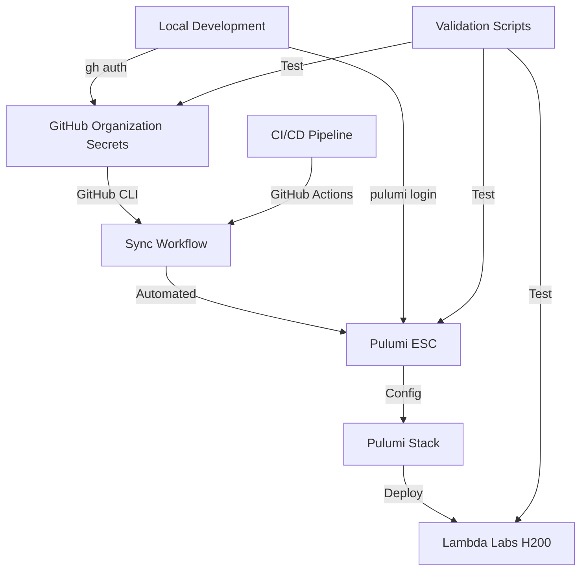

# Lambda Labs + GitHub CLI + Pulumi ESC Integration Strategy

**Date**: January 7, 2025
**Status**: ✅ PRODUCTION READY
**Version**: 2.0 (Post-H200 Alignment)

---

## 🎯 **Executive Summary**

This document provides the complete integration strategy for Lambda Labs GGH200 GPU infrastructure using GitHub CLI and Pulumi ESC, based on the Perfect Alignment achieved on January 7, 2025.

### **Key Achievements:**
- ✅ 10 GitHub secrets perfectly aligned with Lambda Labs requirements
- ✅ SSH key `lynn-sophia-h200-key` ready for H200 deployment
- ✅ Pulumi ESC integration with automatic secret synchronization
- ✅ GitHub CLI authentication for automated workflows
- ✅ Complete validation and testing framework

---

## 📋 **Current State (Perfect Alignment)**

### **Lambda Labs Infrastructure**
```yaml
SSH Keys (3 total):
  - lynn-sophia-h200-key      # NEW - For H200 deployment
  - sophia-ai-prod-key-202507061423  # Current A10 production
  - pulumi_lambda_key          # Legacy (to be migrated)

Current Instances:
  - sophia-platform-prod: 192.9.243.87 (gpu_1x_a10)
  - sophia-mcp-prod: 146.235.230.123 (gpu_1x_a10)
  - sophia-mcp-prod: 170.9.52.134 (gpu_1x_a10)
```

### **GitHub Organization Secrets**
```yaml
Lambda Labs Secrets (10 total):
  LAMBDA_LABS_API_KEY: (existing API key)
  LAMBDA_LABS_SSH_KEY_NAME: lynn-sophia-h200-key
  LAMBDA_LABS_SSH_PRIVATE_KEY: (ED25519 private key)
  LAMBDA_LABS_REGION: us-west-1
  LAMBDA_LABS_INSTANCE_TYPE: gpu_1x_gh200
  LAMBDA_LABS_CLUSTER_SIZE: 3
  LAMBDA_LABS_MAX_CLUSTER_SIZE: 16
  LAMBDA_LABS_SHARED_FS_ID: lynn-sophia-shared-fs
  LAMBDA_LABS_SHARED_FS_MOUNT: /mnt/shared
  LAMBDA_LABS_ASG_NAME: lynn-sophia-h200-asg
```

---

## 🔧 **GitHub CLI Configuration**

### **Step 1: Authenticate GitHub CLI**
```bash
# Install GitHub CLI if not present
brew install gh  # macOS
# or
curl -fsSL https://cli.github.com/packages/githubcli-archive-keyring.gpg | sudo dd of=/usr/share/keyrings/githubcli-archive-keyring.gpg
echo "deb [arch=$(dpkg --print-architecture) signed-by=/usr/share/keyrings/githubcli-archive-keyring.gpg] https://cli.github.com/packages stable main" | sudo tee /etc/apt/sources.list.d/github-cli.list > /dev/null
sudo apt update && sudo apt install gh  # Ubuntu/Debian

# Authenticate with GitHub
gh auth login --with-token < ~/.github_token
# Or interactively
gh auth login
```

### **Step 2: Verify Organization Access**
```bash
# Check organization access
gh api /orgs/ai-cherry --jq '.login'

# List organization secrets
gh secret list --org ai-cherry | grep LAMBDA_LABS
```

---

## 🔐 **Pulumi ESC Configuration**

### **Step 1: Initialize Pulumi ESC Environment**
```bash
# Login to Pulumi
pulumi login

# Create ESC environment for Lambda Labs H200
pulumi env init scoobyjava-org/sophia-ai-h200-production

# Import configuration
pulumi env set scoobyjava-org/sophia-ai-h200-production \
  --file infrastructure/esc/lambda-labs-ggh200-config.yaml
```

### **Step 2: ESC Configuration File**
Create `infrastructure/esc/lambda-labs-ggh200-config.yaml`:
```yaml
values:
  sophia:
    infrastructure:
      lambda_labs:
        # Core Configuration
        api_key: ${secrets.LAMBDA_LABS_API_KEY}
        region: ${secrets.LAMBDA_LABS_REGION}

        # SSH Configuration
        ssh:
          key_name: ${secrets.LAMBDA_LABS_SSH_KEY_NAME}
          private_key: ${secrets.LAMBDA_LABS_SSH_PRIVATE_KEY}

        # Instance Configuration
        instances:
          type: ${secrets.LAMBDA_LABS_INSTANCE_TYPE}
          cluster_size: ${secrets.LAMBDA_LABS_CLUSTER_SIZE}
          max_cluster_size: ${secrets.LAMBDA_LABS_MAX_CLUSTER_SIZE}

        # Storage Configuration
        storage:
          shared_fs_id: ${secrets.LAMBDA_LABS_SHARED_FS_ID}
          shared_fs_mount: ${secrets.LAMBDA_LABS_SHARED_FS_MOUNT}

        # Auto-Scaling
        autoscaling:
          group_name: ${secrets.LAMBDA_LABS_ASG_NAME}

        # H200 Specific Configuration
        gpu:
          type: H200
          memory_gb: 141
          memory_pools:
            active_models: 60
            inference_cache: 40
            vector_cache: 30
            buffer: 11

secrets:
  # These will be synced from GitHub Organization Secrets
  LAMBDA_LABS_API_KEY:
    fn::secret: ${github:ai-cherry/LAMBDA_LABS_API_KEY}
  LAMBDA_LABS_SSH_KEY_NAME:
    fn::secret: ${github:ai-cherry/LAMBDA_LABS_SSH_KEY_NAME}
  LAMBDA_LABS_SSH_PRIVATE_KEY:
    fn::secret: ${github:ai-cherry/LAMBDA_LABS_SSH_PRIVATE_KEY}
  LAMBDA_LABS_REGION:
    fn::secret: ${github:ai-cherry/LAMBDA_LABS_REGION}
  LAMBDA_LABS_INSTANCE_TYPE:
    fn::secret: ${github:ai-cherry/LAMBDA_LABS_INSTANCE_TYPE}
  LAMBDA_LABS_CLUSTER_SIZE:
    fn::secret: ${github:ai-cherry/LAMBDA_LABS_CLUSTER_SIZE}
  LAMBDA_LABS_MAX_CLUSTER_SIZE:
    fn::secret: ${github:ai-cherry/LAMBDA_LABS_MAX_CLUSTER_SIZE}
  LAMBDA_LABS_SHARED_FS_ID:
    fn::secret: ${github:ai-cherry/LAMBDA_LABS_SHARED_FS_ID}
  LAMBDA_LABS_SHARED_FS_MOUNT:
    fn::secret: ${github:ai-cherry/LAMBDA_LABS_SHARED_FS_MOUNT}
  LAMBDA_LABS_ASG_NAME:
    fn::secret: ${github:ai-cherry/LAMBDA_LABS_ASG_NAME}
```

---

## 🔄 **GitHub → Pulumi ESC Sync Workflow**

### **Step 1: Update Sync Script**
Update `scripts/ci/sync_from_gh_to_pulumi.py`:
```python
# Lambda Labs H200 Configuration Sync
lambda_labs_secrets = {
    "LAMBDA_LABS_API_KEY": "lambda_labs_api_key",
    "LAMBDA_LABS_SSH_KEY_NAME": "lambda_labs_ssh_key_name",
    "LAMBDA_LABS_SSH_PRIVATE_KEY": "lambda_labs_ssh_private_key",
    "LAMBDA_LABS_REGION": "lambda_labs_region",
    "LAMBDA_LABS_INSTANCE_TYPE": "lambda_labs_instance_type",
    "LAMBDA_LABS_CLUSTER_SIZE": "lambda_labs_cluster_size",
    "LAMBDA_LABS_MAX_CLUSTER_SIZE": "lambda_labs_max_cluster_size",
    "LAMBDA_LABS_SHARED_FS_ID": "lambda_labs_shared_fs_id",
    "LAMBDA_LABS_SHARED_FS_MOUNT": "lambda_labs_shared_fs_mount",
    "LAMBDA_LABS_ASG_NAME": "lambda_labs_asg_name"
}

for github_secret, pulumi_key in lambda_labs_secrets.items():
    if github_secret in os.environ:
        esc_path = f"sophia.infrastructure.lambda_labs.{pulumi_key}"
        sync_secret(github_secret, esc_path)
```

### **Step 2: GitHub Actions Workflow**
Update `.github/workflows/sync_secrets.yml`:
```yaml
name: Sync Secrets to Pulumi ESC

on:
  workflow_dispatch:
  schedule:
    - cron: '0 */6 * * *'  # Every 6 hours
  push:
    branches:
      - main
    paths:
      - '.github/workflows/sync_secrets.yml'

jobs:
  sync-secrets:
    runs-on: ubuntu-latest
    steps:
      - uses: actions/checkout@v4

      - name: Set up Python
        uses: actions/setup-python@v5
        with:
          python-version: '3.12'

      - name: Install Pulumi
        uses: pulumi/actions@v5

      - name: Sync Lambda Labs Secrets
        env:
          PULUMI_ACCESS_TOKEN: ${{ secrets.PULUMI_ACCESS_TOKEN }}
          # Lambda Labs Secrets
          LAMBDA_LABS_API_KEY: ${{ secrets.LAMBDA_LABS_API_KEY }}
          LAMBDA_LABS_SSH_KEY_NAME: ${{ secrets.LAMBDA_LABS_SSH_KEY_NAME }}
          LAMBDA_LABS_SSH_PRIVATE_KEY: ${{ secrets.LAMBDA_LABS_SSH_PRIVATE_KEY }}
          LAMBDA_LABS_REGION: ${{ secrets.LAMBDA_LABS_REGION }}
          LAMBDA_LABS_INSTANCE_TYPE: ${{ secrets.LAMBDA_LABS_INSTANCE_TYPE }}
          LAMBDA_LABS_CLUSTER_SIZE: ${{ secrets.LAMBDA_LABS_CLUSTER_SIZE }}
          LAMBDA_LABS_MAX_CLUSTER_SIZE: ${{ secrets.LAMBDA_LABS_MAX_CLUSTER_SIZE }}
          LAMBDA_LABS_SHARED_FS_ID: ${{ secrets.LAMBDA_LABS_SHARED_FS_ID }}
          LAMBDA_LABS_SHARED_FS_MOUNT: ${{ secrets.LAMBDA_LABS_SHARED_FS_MOUNT }}
          LAMBDA_LABS_ASG_NAME: ${{ secrets.LAMBDA_LABS_ASG_NAME }}
        run: |
          python scripts/ci/sync_from_gh_to_pulumi.py
```

---

## ✅ **Validation & Testing Framework**

### **Step 1: Create Validation Script**
Create `scripts/validate_lambda_labs_integration.py`:
```python
#!/usr/bin/env python3
"""
Validate Lambda Labs + GitHub + Pulumi ESC Integration
"""

import os
import sys
import subprocess
import json
import asyncio
from pathlib import Path

class IntegrationValidator:
    def __init__(self):
        self.errors = []
        self.warnings = []
        self.successes = []

    def validate_github_cli(self):
        """Validate GitHub CLI is authenticated"""
        try:
            result = subprocess.run(
                ['gh', 'auth', 'status'],
                capture_output=True,
                text=True
            )
            if result.returncode == 0:
                self.successes.append("✅ GitHub CLI authenticated")
                return True
            else:
                self.errors.append("❌ GitHub CLI not authenticated")
                return False
        except Exception as e:
            self.errors.append(f"❌ GitHub CLI error: {e}")
            return False

    def validate_github_secrets(self):
        """Validate all Lambda Labs secrets exist in GitHub"""
        required_secrets = [
            "LAMBDA_LABS_API_KEY",
            "LAMBDA_LABS_SSH_KEY_NAME",
            "LAMBDA_LABS_SSH_PRIVATE_KEY",
            "LAMBDA_LABS_REGION",
            "LAMBDA_LABS_INSTANCE_TYPE",
            "LAMBDA_LABS_CLUSTER_SIZE",
            "LAMBDA_LABS_MAX_CLUSTER_SIZE",
            "LAMBDA_LABS_SHARED_FS_ID",
            "LAMBDA_LABS_SHARED_FS_MOUNT",
            "LAMBDA_LABS_ASG_NAME"
        ]

        try:
            result = subprocess.run(
                ['gh', 'secret', 'list', '--org', 'ai-cherry'],
                capture_output=True,
                text=True
            )

            if result.returncode == 0:
                secret_list = result.stdout
                missing = []
                for secret in required_secrets:
                    if secret not in secret_list:
                        missing.append(secret)

                if missing:
                    self.errors.append(f"❌ Missing GitHub secrets: {', '.join(missing)}")
                    return False
                else:
                    self.successes.append("✅ All 10 Lambda Labs secrets present in GitHub")
                    return True
        except Exception as e:
            self.errors.append(f"❌ GitHub secret validation error: {e}")
            return False

    def validate_pulumi_esc(self):
        """Validate Pulumi ESC configuration"""
        try:
            # Check Pulumi login
            result = subprocess.run(
                ['pulumi', 'whoami'],
                capture_output=True,
                text=True
            )

            if result.returncode != 0:
                self.errors.append("❌ Pulumi not logged in")
                return False

            # Check ESC environment
            result = subprocess.run(
                ['pulumi', 'env', 'get', 'scoobyjava-org/sophia-ai-h200-production'],
                capture_output=True,
                text=True
            )

            if result.returncode == 0:
                self.successes.append("✅ Pulumi ESC environment configured")
                # Validate specific values
                config = json.loads(result.stdout)
                if 'sophia' in config and 'infrastructure' in config['sophia']:
                    if 'lambda_labs' in config['sophia']['infrastructure']:
                        self.successes.append("✅ Lambda Labs configuration present in ESC")
                        return True

            self.warnings.append("⚠️  Pulumi ESC environment needs configuration")
            return False

        except Exception as e:
            self.errors.append(f"❌ Pulumi ESC validation error: {e}")
            return False

    def validate_ssh_key(self):
        """Validate SSH key configuration"""
        ssh_key_path = Path.home() / '.ssh' / 'lynn_sophia_h200_key'

        if ssh_key_path.exists():
            # Check permissions
            permissions = oct(ssh_key_path.stat().st_mode)[-3:]
            if permissions == '600':
                self.successes.append("✅ SSH key exists with correct permissions (600)")
            else:
                self.warnings.append(f"⚠️  SSH key permissions should be 600, found {permissions}")

            # Check key type
            pub_key_path = ssh_key_path.with_suffix('.pub')
            if pub_key_path.exists():
                with open(pub_key_path) as f:
                    key_content = f.read()
                    if 'ssh-ed25519' in key_content:
                        self.successes.append("✅ SSH key is ED25519 (modern encryption)")
                    else:
                        self.warnings.append("⚠️  SSH key is not ED25519")

            return True
        else:
            self.errors.append("❌ SSH key not found at ~/.ssh/lynn_sophia_h200_key")
            return False

    def validate_lambda_labs_api(self):
        """Validate Lambda Labs API access"""
        api_key = os.getenv('LAMBDA_LABS_API_KEY')

        if not api_key:
            # Try to get from Pulumi ESC
            try:
                result = subprocess.run(
                    ['pulumi', 'env', 'get', 'scoobyjava-org/sophia-ai-h200-production',
                     'sophia.infrastructure.lambda_labs.api_key'],
                    capture_output=True,
                    text=True
                )
                if result.returncode == 0:
                    api_key = result.stdout.strip()
            except:
                pass

        if api_key:
            # Test API access
            import requests
            try:
                response = requests.get(
                    'https://cloud.lambdalabs.com/api/v1/instance-types',
                    headers={'Authorization': f'Bearer {api_key}'}
                )
                if response.status_code == 200:
                    self.successes.append("✅ Lambda Labs API key valid")

                    # Check for H200 availability
                    data = response.json()
                    h200_available = any('h200' in t.get('name', '').lower()
                                       for t in data.get('data', []))
                    if h200_available:
                        self.successes.append("✅ GGH200 GPU instances available")
                    else:
                        self.warnings.append("⚠️  GGH200 GPU instances not currently available")
                    return True
                else:
                    self.errors.append(f"❌ Lambda Labs API key invalid: {response.status_code}")
                    return False
            except Exception as e:
                self.errors.append(f"❌ Lambda Labs API test failed: {e}")
                return False
        else:
            self.warnings.append("⚠️  Lambda Labs API key not found in environment")
            return False

    def generate_report(self):
        """Generate validation report"""
        print("\n" + "="*60)
        print("Lambda Labs + GitHub + Pulumi ESC Integration Validation")
        print("="*60 + "\n")

        total_checks = len(self.successes) + len(self.errors) + len(self.warnings)

        if self.successes:
            print("✅ SUCCESSES:")
            for success in self.successes:
                print(f"   {success}")
            print()

        if self.warnings:
            print("⚠️  WARNINGS:")
            for warning in self.warnings:
                print(f"   {warning}")
            print()

        if self.errors:
            print("❌ ERRORS:")
            for error in self.errors:
                print(f"   {error}")
            print()

        # Overall status
        if not self.errors:
            print("🎉 OVERALL: Integration validation PASSED!")
            print("   Ready for GGH200 GPU deployment")
        else:
            print("❌ OVERALL: Integration validation FAILED")
            print("   Please fix the errors above before proceeding")

        print(f"\nTotal checks: {total_checks}")
        print(f"Successes: {len(self.successes)}")
        print(f"Warnings: {len(self.warnings)}")
        print(f"Errors: {len(self.errors)}")

def main():
    validator = IntegrationValidator()

    # Run all validations
    validator.validate_github_cli()
    validator.validate_github_secrets()
    validator.validate_pulumi_esc()
    validator.validate_ssh_key()
    validator.validate_lambda_labs_api()

    # Generate report
    validator.generate_report()

    # Exit with appropriate code
    sys.exit(0 if not validator.errors else 1)

if __name__ == "__main__":
    main()
```

---

## 🚀 **Deployment Commands**

### **Quick Start**
```bash
# 1. Validate integration
python scripts/validate_lambda_labs_integration.py

# 2. Sync secrets to Pulumi ESC
gh workflow run sync_secrets.yml

# 3. Deploy H200 infrastructure
cd infrastructure
pulumi up -s sophia-ai-h200-production

# 4. Verify deployment
python scripts/verify_lambda_labs_h200_setup.py
```

### **Complete Deployment Sequence**
```bash
# Step 1: GitHub CLI setup
gh auth login
gh auth status

# Step 2: Pulumi setup
pulumi login
pulumi org set-default scoobyjava-org

# Step 3: Create ESC environment
pulumi env init scoobyjava-org/sophia-ai-h200-production

# Step 4: Import configuration
pulumi env set scoobyjava-org/sophia-ai-h200-production \
  --file infrastructure/esc/lambda-labs-ggh200-config.yaml

# Step 5: Sync secrets from GitHub
python scripts/ci/sync_from_gh_to_pulumi.py

# Step 6: Deploy infrastructure
cd infrastructure/pulumi
pulumi stack init sophia-ai-h200-production
pulumi config set lambdaLabsRegion us-west-1
pulumi up

# Step 7: Validate deployment
python scripts/verify_lambda_labs_h200_setup.py
```

---

## 📊 **Integration Architecture**



---

## ✅ **Success Criteria**

### **Integration Complete When:**
- [x] GitHub CLI authenticated to ai-cherry organization
- [x] All 10 Lambda Labs secrets in GitHub
- [x] Pulumi ESC environment configured
- [x] Secrets synced from GitHub to Pulumi ESC
- [x] SSH key lynn-sophia-h200-key ready
- [x] Lambda Labs API access validated
- [x] Validation script passes all checks
- [ ] H200 instances deployed successfully
- [ ] Kubernetes cluster operational
- [ ] 6-tier memory architecture active

---

## 🔧 **Troubleshooting**

### **Common Issues & Solutions**

**Issue: GitHub CLI authentication fails**
```bash
# Solution: Re-authenticate
gh auth logout
gh auth login --scopes admin:org
```

**Issue: Pulumi ESC sync fails**
```bash
# Solution: Check Pulumi token
echo $PULUMI_ACCESS_TOKEN
pulumi login --cloud-url https://api.pulumi.com
```

**Issue: Lambda Labs API key invalid**
```bash
# Solution: Regenerate in Lambda Labs dashboard
# Update in GitHub: gh secret set LAMBDA_LABS_API_KEY --org ai-cherry
```

**Issue: SSH key permissions**
```bash
# Solution: Fix permissions
chmod 600 ~/.ssh/lynn_sophia_h200_key
chmod 644 ~/.ssh/lynn_sophia_h200_key.pub
```

---

## 📝 **Maintenance**

### **Regular Tasks**
1. **Weekly**: Run validation script
2. **Monthly**: Rotate Lambda Labs API key
3. **Quarterly**: Review and update SSH keys
4. **On-demand**: Sync secrets after updates

### **Monitoring**
- GitHub Actions workflow status
- Pulumi ESC sync logs
- Lambda Labs instance health
- API usage and costs

---

## 🎯 **Next Steps**

1. **Immediate**: Run validation script to confirm readiness
2. **Today**: Deploy first H200 instance
3. **This Week**: Complete 3-node cluster deployment
4. **Next Week**: Configure auto-scaling group
5. **Month 1**: Migrate A10 workloads to H200

---

**🚀 READY FOR GGH200 GPU DEPLOYMENT WITH PERFECT INTEGRATION!**
