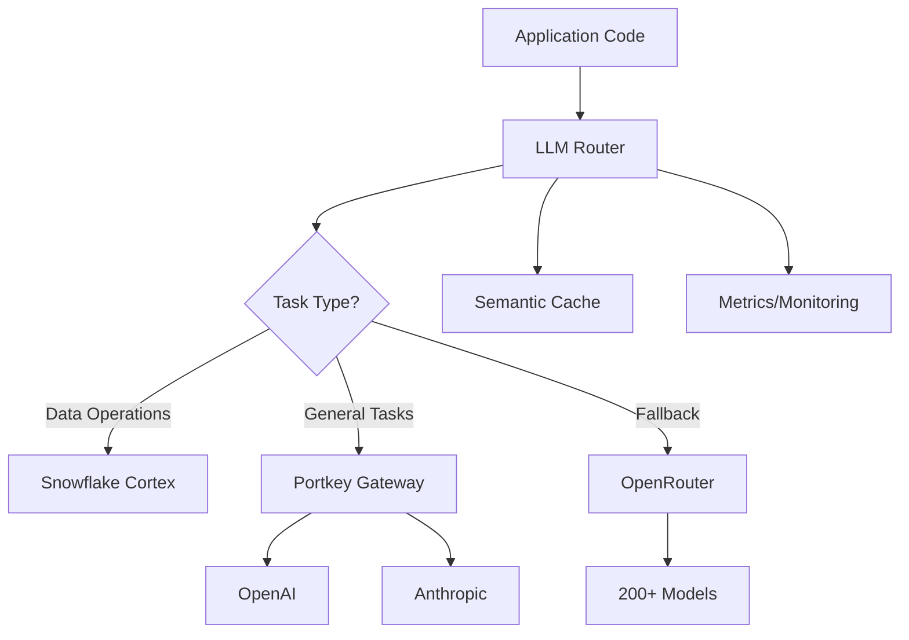

# LLM Router Migration Guide

## Overview

This guide explains how to migrate from fragmented LLM client usage to the unified LLM Router, which provides:
- **Single interface** for all LLM operations
- **Intelligent routing** based on task type and complexity
- **Cost optimization** through model selection and caching
- **Built-in resilience** with fallback chains
- **Comprehensive observability** via Prometheus metrics

## Architecture



## Quick Start

### 1. Import the Router

```python
# Old way (DEPRECATED)
from openai import AsyncOpenAI
client = AsyncOpenAI(api_key="...")

# New way
from infrastructure.services.llm_router import llm_router, TaskType, TaskComplexity
```

### 2. Basic Usage

```python
# Simple completion
async for chunk in llm_router.complete(
    prompt="Write a Python function to calculate fibonacci",
    task=TaskType.CODE_GENERATION,
    complexity=TaskComplexity.SIMPLE
):
    print(chunk, end="")

# Non-streaming response
response = ""
async for chunk in llm_router.complete(
    prompt="Explain the architecture",
    task=TaskType.ARCHITECTURE_DESIGN,
    complexity=TaskComplexity.COMPLEX,
    stream=False
):
    response += chunk
```

### 3. Task Types

Choose the appropriate task type for optimal routing:

```python
# Data operations (routes to Snowflake Cortex - FREE)
TaskType.SQL_GENERATION      # Generate SQL queries
TaskType.DATA_ANALYSIS       # Analyze data patterns
TaskType.EMBEDDINGS          # Generate embeddings

# Code operations (routes to specialized models)
TaskType.CODE_GENERATION     # Generate new code
TaskType.CODE_REVIEW         # Review existing code
TaskType.CODE_ANALYSIS       # Analyze code patterns
TaskType.ARCHITECTURE_DESIGN # Design system architecture

# Business operations
TaskType.BUSINESS_INTELLIGENCE # Business insights
TaskType.DOCUMENT_SUMMARY      # Summarize documents
TaskType.RESEARCH              # Research topics

# Conversational
TaskType.CHAT_CONVERSATION   # General chat
TaskType.SIMPLE_QUERY        # Simple Q&A

# Creative
TaskType.CREATIVE_WRITING    # Creative content
TaskType.MARKETING_CONTENT   # Marketing copy
```

### 4. Complexity Levels

Set complexity to influence model selection:

```python
TaskComplexity.SIMPLE        # Quick, cost-effective models
TaskComplexity.MODERATE      # Balanced performance/cost
TaskComplexity.COMPLEX       # Premium models for hard tasks
TaskComplexity.ARCHITECTURE  # Top-tier models for system design
```

## Migration Patterns

### Pattern 1: Direct OpenAI Replacement

```python
# Old
import openai
response = await openai.ChatCompletion.create(
    model="gpt-4",
    messages=[{"role": "user", "content": prompt}],
    temperature=0.7
)
result = response.choices[0].message.content

# New
result = ""
async for chunk in llm_router.complete(
    prompt=prompt,
    task=TaskType.CODE_GENERATION,
    complexity=TaskComplexity.MODERATE,
    temperature=0.7
):
    result += chunk
```

### Pattern 2: Portkey Migration

```python
# Old
from portkey_ai import AsyncPortkey
portkey = AsyncPortkey(api_key="...")
response = await portkey.chat.completions.create(
    model="claude-3-opus",
    messages=[{"role": "user", "content": prompt}]
)

# New
async for chunk in llm_router.complete(
    prompt=prompt,
    task=TaskType.ARCHITECTURE_DESIGN,
    complexity=TaskComplexity.ARCHITECTURE,
    model_override="claude-3-opus"  # Optional override
):
    print(chunk, end="")
```

### Pattern 3: Snowflake Cortex Operations

```python
# Old
conn = snowflake.connector.connect(...)
cursor = conn.cursor()
cursor.execute(f"SELECT SNOWFLAKE.CORTEX.COMPLETE('mistral-large', '{prompt}')")

# New
async for sql in llm_router.complete(
    prompt=prompt,
    task=TaskType.SQL_GENERATION  # Automatically routes to Cortex
):
    print(sql)
```

## Advanced Features

### 1. Model Override

```python
# Force specific model
async for chunk in llm_router.complete(
    prompt="Complex analysis",
    task=TaskType.BUSINESS_INTELLIGENCE,
    model_override="claude-3-5-sonnet"  # Override routing logic
):
    print(chunk, end="")
```

### 2. Cost Estimation

```python
# Estimate cost before making request
estimate = await llm_router.estimate_cost(
    prompt="Long document to analyze...",
    task=TaskType.DOCUMENT_SUMMARY,
    complexity=TaskComplexity.MODERATE
)
print(f"Estimated cost: ${estimate['estimated_cost']:.4f}")
print(f"Selected model: {estimate['model']}")
```

### 3. Custom Parameters

```python
# Pass provider-specific parameters
async for chunk in llm_router.complete(
    prompt="Generate creative content",
    task=TaskType.CREATIVE_WRITING,
    temperature=0.9,
    max_tokens=4000,
    top_p=0.95,  # Provider-specific
    frequency_penalty=0.5  # Provider-specific
):
    print(chunk, end="")
```

### 4. Metadata Tracking

```python
# Add metadata for tracking
async for chunk in llm_router.complete(
    prompt="Analyze customer data",
    task=TaskType.DATA_ANALYSIS,
    metadata={
        "user_id": "user123",
        "session_id": "sess456",
        "feature": "customer_insights"
    }
):
    print(chunk, end="")
```

## Configuration

### 1. Environment Variables

```bash
# Required
export OPENAI_API_KEY="sk-..."
export ANTHROPIC_API_KEY="sk-ant-..."
export PORTKEY_API_KEY="..."
export OPENROUTER_API_KEY="..."

# Snowflake (for data operations)
export SNOWFLAKE_USER="..."
export SNOWFLAKE_PASSWORD="..."
export SNOWFLAKE_ACCOUNT="..."

# Optional
export LLM_ROUTER_CACHE_ENABLED="true"
export LLM_ROUTER_BUDGET_PER_DAY="100.0"
```

### 2. Configuration File

Edit `config/llm_router.json` to customize:
- Model definitions and costs
- Routing rules by task/complexity
- Cache settings
- Budget limits

### 3. Monitoring

Access metrics at `/metrics` endpoint:
- `llm_requests_total` - Total requests by provider/model
- `llm_request_duration_seconds` - Request latency
- `llm_cost_usd_total` - Cumulative costs
- `llm_cache_hit_rate` - Cache effectiveness
- `llm_fallback_attempts_total` - Resilience metrics

## Migration Tools

### 1. Automated Codemod

Replace direct LLM client usage automatically:

```bash
# Dry run (see what would change)
python scripts/codemod/replace_llm_clients.py --dry-run

# Apply changes
python scripts/codemod/replace_llm_clients.py --write
```

### 2. Validation Script

Check migration status:

```bash
python scripts/migration/validate_llm_migration.py
```

Output shows:
- Files with direct LLM client usage
- Hardcoded API keys (critical)
- Migration progress percentage
- Recommendations

### 3. Backward Compatibility

During migration, the old `unified_llm_service` redirects to the router:

```python
# This still works but shows deprecation warning
from infrastructure.services.unified_llm_service import get_unified_llm_service
service = await get_unified_llm_service()
```

## Best Practices

### 1. Task Selection

Choose the most specific task type:
```python
# ❌ Too generic
task=TaskType.CHAT_CONVERSATION

# ✅ Specific
task=TaskType.CODE_GENERATION
```

### 2. Complexity Mapping

Map your use cases to complexity:
- **SIMPLE**: Summaries, translations, simple Q&A
- **MODERATE**: Code generation, analysis, reports
- **COMPLEX**: Architecture design, deep analysis
- **ARCHITECTURE**: System design, strategic planning

### 3. Error Handling

```python
try:
    async for chunk in llm_router.complete(...):
        process(chunk)
except Exception as e:
    logger.error(f"LLM error: {e}")
    # Router already attempted fallbacks
```

### 4. Cost Optimization

- Use `TaskType.SQL_GENERATION` for SQL (free via Cortex)
- Set appropriate complexity (don't over-provision)
- Enable caching for repeated queries
- Monitor costs via metrics

## Troubleshooting

### Issue: "Provider not available"
- Check API keys in environment
- Verify provider health: `await llm_router.health_check()`

### Issue: High latency
- Check complexity setting (may be too high)
- Review selected model in metrics
- Consider enabling cache

### Issue: Unexpected model selection
- Check routing rules in `config/llm_router.json`
- Use `model_override` for explicit control
- Review task type mapping

### Issue: Cache not working
- Verify Redis connection
- Check `stream=False` (cache only works for non-streaming)
- Review cache hit metrics

## Migration Checklist

- [ ] Install required packages: `uv add portkey-ai openai anthropic`
- [ ] Set environment variables for API keys
- [ ] Run validation script to find direct usage
- [ ] Apply codemod to migrate automatically
- [ ] Update remaining manual cases
- [ ] Test critical paths with new router
- [ ] Monitor metrics for performance
- [ ] Remove old client initializations
- [ ] Update documentation

## Support

For issues or questions:
1. Check the validation script output
2. Review error logs with correlation IDs
3. Monitor Prometheus metrics
4. Check provider health status

The LLM Router is designed to be a drop-in replacement with better performance, cost optimization, and reliability. The migration can be done incrementally, with backward compatibility ensuring no disruption to existing functionality.
