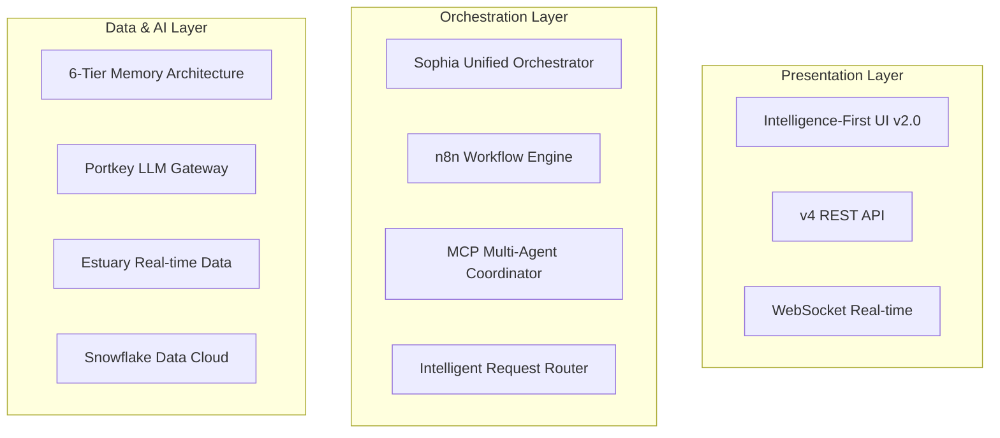

# 🎯 SOPHIA AI SYSTEM HANDBOOK

**The Authoritative Guide to the Sophia AI Platform**

*Version: 3.4 (Memory Modernization Phase 2: MCP Refactoring Complete)*  
*Last Updated: July 10, 2025*  
*Status: Production Ready*

---

## 📑 Table of Contents

1. [System Overview](#system-overview)
2. [Core Architecture](#core-architecture)
3. [Unified Memory Architecture](#unified-memory-architecture)
4. [MCP Server Ecosystem](#mcp-server-ecosystem)
5. [Deployment Infrastructure](#deployment-infrastructure)
6. [Security & Compliance](#security--compliance)
7. [Development Standards](#development-standards)
8. [UV Dependency Governance](#uv-dependency-governance) **[NEW]**
9. [LLM Strategy & Routing](#llm-strategy--routing) **[NEW]**
10. [Workflow Automation](#workflow-automation) **[NEW]**
11. [User Interface Architecture](#user-interface-architecture) **[NEW v2.0]**
12. [Operational Procedures](#operational-procedures)

---

## 🎯 System Overview

Sophia AI is an enterprise-grade AI orchestration platform that serves as the "brain" for Pay Ready operations, providing:

- **Unified Intelligence**: Single point of access for all business insights
- **Intelligence-First Interface**: Natural language as the primary interaction paradigm **[v2.0]**
- **Real-Time Processing**: Event-driven architecture with < 200ms response times
- **Multi-Agent Coordination**: 16+ specialized MCP servers working in harmony
- **Autonomous Operations**: Self-managing through n8n workflows and intelligent routing
- **SOTA AI Access**: Always using the latest and best AI models via Portkey + OpenRouter

### Key Metrics
- **Uptime**: 99.9% availability
- **Response Time**: p95 < 2s for all operations
- **Model Currency**: New models available within 72h of release
- **Automation Rate**: 80% of routine tasks automated
- **Build Speed**: < 35s with UV package manager
- **Natural Language Usage**: > 80% of interactions via chat **[v2.0]**

---

## 🏗️ Core Architecture

### Three-Layer Architecture



### Component Responsibilities

1. **Intelligence-First UI** - Natural language interaction with rich visualizations **[v2.0]**
2. **v4 Orchestrator** - Intelligent request handling and routing
3. **MCP Ecosystem** - Specialized agents for domain tasks
4. **Memory Architecture** - Hierarchical storage with graceful degradation
5. **LLM Gateway** - High-performance model routing
6. **Data Fabric** - Real-time synchronization via Estuary

---

## 🧠 Unified Memory Architecture

### 6-Tier Hierarchy

| Tier | Component | Purpose | Latency | Status |
|------|-----------|---------|---------|--------|
| L0 | GPU Cache | Lambda Labs GPU memory | < 1ms | Auto |
| L1 | Redis | Session & ephemeral data | < 10ms | ✅ |
| L2 | Mem0 | Agent conversational memory | < 50ms | Optional |
| L3 | Snowflake Cortex | Vector embeddings | < 100ms | ✅ |
| L4 | Snowflake Tables | Structured data | < 200ms | ✅ |
| L5 | Snowflake AI | Intelligence layer | < 500ms | ✅ |

### Graceful Degradation
- System operates without Snowflake in degraded mode
- L1 Redis provides basic functionality
- Automatic fallback with capability reporting

---

## 🤖 MCP Server Ecosystem

### Production Servers (16 Active)

#### Core Infrastructure
- **Snowflake Unified** (9010) - Data operations & AI
- **Estuary Flow** (9012) - Real-time data pipelines
- **Lambda Labs CLI** (9020) - Infrastructure management
- **Portkey Admin** (9013) - LLM gateway control

#### Business Intelligence
- **HubSpot** (9006) - CRM integration
- **Gong** (9007) - Call intelligence
- **Slack** (9101) - Team communication
- **Linear** (9004) - Project management

#### Development Tools
- **GitHub** (9003) - Source control
- **Codacy** (3008) - Code quality
- **Figma** (9001) - Design integration
- **Postgres** (9014) - Database operations

#### AI Enhancement
- **AI Memory** (9000) - Persistent context
- **OpenRouter Search** (9015) - Model discovery
- **Notion** (9011) - Knowledge base
- **Asana** (9006) - Task management

### Multi-Agent Coordination
```python
# Capability-based routing
capabilities_map = {
    "data_analysis": ["snowflake", "postgres"],
    "code_review": ["github", "codacy"],
    "project_status": ["linear", "asana", "notion"],
    "customer_intel": ["hubspot", "gong", "slack"],
    "ai_operations": ["portkey", "openrouter", "ai_memory"]
}
```

---

## 🚀 Deployment Infrastructure

### Lambda Labs K3s Cluster
- **Control Plane**: 192.222.58.232
- **GPU Nodes**: 5 active instances
- **Monthly Cost**: $3,000-5,000
- **Deployment**: GitHub Actions → K3s

### Container Strategy
```yaml
# K3s deployment pattern
apiVersion: apps/v1
kind: Deployment
metadata:
  name: sophia-mcp-server
  namespace: mcp-servers
spec:
  replicas: 3
  strategy:
    type: RollingUpdate
  template:
    spec:
      containers:
      - name: mcp-server
        image: scoobyjava15/sophia-mcp:latest
        resources:
          requests:
            memory: "256Mi"
            cpu: "100m"
          limits:
            memory: "1Gi"
            cpu: "1000m"
```

---

## 🔒 Security & Compliance

### Secret Management Pipeline
```
GitHub Organization Secrets
    ↓ (GitHub Actions)
Pulumi ESC 
    ↓ (auto_esc_config.py)
Application Runtime
```

### Security Layers
1. **Zero Trust** - Every request authenticated
2. **RBAC** - Role-based access control
3. **Audit Trail** - Complete operation logging
4. **Encryption** - At rest and in transit
5. **Compliance** - SOC2 Type II ready

---

## 📋 Development Standards

### Code Quality Requirements
- **Type Coverage**: 100% for public APIs
- **Test Coverage**: > 80% for business logic
- **Lint Score**: 0 errors, < 10 warnings
- **Documentation**: All public functions documented
- **Performance**: p95 < 200ms for endpoints

### Git Workflow
```bash
# Feature development
git checkout -b feature/description
# Make changes with micro-commits
git commit -m "feat: specific change"
# Push and create PR
git push origin feature/description
```

---

## 📦 UV Dependency Governance **[NEW]**

### Core Principles
1. **Single Lock File**: `uv.lock` is the source of truth
2. **Group Isolation**: Dependencies organized by function
3. **SemVer Pinning**: All direct deps use exact versions
4. **Zero Unvetted Wheels**: Only PyPI or approved sources
5. **Automated Auditing**: Daily security and license scans

### Dependency Groups
```toml
[tool.uv.dependency-groups]
core = ["fastapi==0.111.0", "redis==5.0.4"]
mcp-servers = ["anthropic-mcp-python-sdk==1.2.4"]
ai-enhanced = ["openai==1.30.0", "anthropic==0.25.6"]
automation = ["n8n-python-client==0.2.0"]
dev = ["pytest==8.2.2", "ruff==0.4.4"]
```

### UV Workflow
```bash
# Add dependency
uv add package==1.0.0 --group core

# Sync environment
uv sync --strict

# Run with UV
uv run pytest

# Audit dependencies
uv audit --format json
```

### Continuous Hygiene
- **Pre-commit**: `uv sync --check`
- **CI/CD**: Security scanning on every PR
- **Renovate**: Weekly dependency updates
- **Metrics**: Vulnerability count to Prometheus

---

## 🚀 LLM Strategy & Routing **[NEW]**

### High-Performance Gateway Architecture
```
Request → Portkey Gateway → Policy Engine → OpenRouter → Best Model
             ↓                    ↓              ↓
         Trace/Metrics      Scoring Logic   200+ Models
```

### Model Selection Policy
| Criterion | Weight | Scoring Logic |
|-----------|--------|---------------|
| Freshness | 40% | < 90 days = full points |
| Latency | 25% | p95 < 800ms = full points |
| Quality | 25% | Benchmark percentile rank |
| Cost | 10% | Only penalize if > $0.01/1k |

### Routing Examples
```python
# Fast response needed
response = await portkey.invoke_llm(
    prompt="Quick classification task",
    preferences={"prefer_fast": True}
)

# Quality critical
response = await portkey.invoke_llm(
    prompt="Complex analysis requiring accuracy",
    preferences={"prefer_quality": True}
)
```

### Performance Targets
- **First Token**: < 150ms with streaming
- **Total Latency**: p95 < 2s
- **Availability**: > 99.5% with failover
- **Model Currency**: < 72h for new models

---

## 🔄 Workflow Automation **[NEW]**

### n8n Integration Pattern
```typescript
// Workflow triggers
triggers = {
    schedule: "0 9 * * *",          // Daily reports
    webhook: "/api/n8n/webhook",    // External events
    event: "gong.call_completed",   // System events
    manual: "user_initiated"        // On-demand
}

// Node types
nodes = {
    data: ["snowflake_query", "api_fetch"],
    ai: ["llm_analysis", "embedding_generation"],
    action: ["slack_notify", "linear_create_task"],
    condition: ["if_threshold", "switch_sentiment"]
}
```

### Pre-built Workflows
1. **Daily Business Intelligence**
   - Snowflake metrics query
   - AI analysis and insights
   - Executive summary to Slack

2. **Customer Health Monitoring**
   - Gong sentiment analysis
   - HubSpot deal tracking
   - Automated task creation

3. **Code Quality Gates**
   - PR trigger from GitHub
   - Codacy security scan
   - AI review and recommendations

### Custom Workflow Creation
```yaml
# config/workflows/custom_workflow.yaml
name: Revenue Anomaly Detection
schedule: "*/30 * * * *"  # Every 30 minutes
nodes:
  - id: query_revenue
    type: snowflake
    query: SELECT * FROM revenue_metrics WHERE...
  - id: detect_anomaly
    type: ai_analysis
    model: gpt-4
    prompt: "Identify anomalies in: {query_revenue.result}"
  - id: alert_if_found
    type: conditional
    condition: "{detect_anomaly.has_anomaly}"
    true_path: slack_alert
    false_path: log_normal
```

### 5.3 Automation & Workflows

#### n8n Workflow Automation (NEW - Phase 2 Week 2)
- Natural language workflow creation
- Pre-built templates for common tasks
- Real-time execution and scheduling
- Deep integration with all data sources
- See: `/docs/N8N_WORKFLOW_INTEGRATION.md`

#### Temporal Workflow Engine
- Long-running process orchestration
- Distributed task management
- Fault-tolerant execution

#### GitHub Actions Integration
- CI/CD pipeline automation
- Deployment workflows
- Automated testing

---

## 🎨 User Interface Architecture **[NEW v2.0]**

### Intelligence-First Design

The v2.0 interface represents a paradigm shift from traditional dashboard navigation to an **intelligence-first approach** where natural language is the primary interaction method.

### Core Principles
- **"Ask First, Click Second"**: Every feature accessible via natural language
- **Rich Responses**: Visualizations, citations, and actions in responses
- **Context Awareness**: UI adapts based on conversation context
- **Predictive Assistance**: Sophia anticipates user needs
- **Live Intelligence**: Real-time system health always visible

### Component Architecture
```
SophiaIntelligence (Root)
├── Sidebar (Collapsible Navigation)
│   ├── Chat & Search (Primary)
│   ├── Projects Hub (Linear + Asana + Notion)
│   ├── Agent Factory
│   └── System Intelligence
├── IntelligenceCanvas (Main Area)
│   ├── Conversational Interface
│   ├── Rich Response Renderer
│   └── Live System Monitoring
└── Context Controls
    ├── System Context Selector
    └── Persona Management
```

### Natural Language Commands
```typescript
// Everything accessible via chat
"Show me projects at risk" → Opens filtered project view
"Create monitoring agent" → Opens agent factory with context
"Deploy staging to prod" → Executes with confirmation
"Why is revenue down?" → Multi-source analysis with charts
```

### Design System
- **Dark Theme**: Midnight Intelligence palette
- **Glass Morphism**: Semi-transparent surfaces with blur
- **Typography**: Inter for UI, JetBrains Mono for code
- **Animation**: Smooth transitions with Framer Motion

For complete details, see [11_UI_ARCHITECTURE.md](./11_UI_ARCHITECTURE.md)

---

## 🛠️ Operational Procedures

### System Startup Sequence
```bash
# 1. Verify environment
export PULUMI_ORG=scoobyjava-org
export ENVIRONMENT=prod

# 2. Start core services
docker-compose -f docker-compose.cloud.yml up -d

# 3. Verify health
curl http://localhost:8000/health

# 4. Start MCP servers
kubectl apply -k k3s-manifests/

# 5. Verify orchestration
python scripts/test_v4_orchestrator_integration.py
```

### Monitoring & Alerting
- **Prometheus**: Metrics collection
- **Grafana**: Dashboards at :3001
- **Health Checks**: Every service exposes `/health`
- **Alerts**: PagerDuty integration for critical issues

### Troubleshooting Guide
| Issue | Check | Resolution |
|-------|-------|------------|
| No Snowflake | Connection logs | System runs in degraded mode |
| MCP timeout | Server health endpoint | Restart specific server |
| High latency | Portkey metrics | Check model routing policy |
| Build failure | UV audit results | Fix security vulnerabilities |

---

## 📚 Related Documents

- [01_PHOENIX_PLAN_ARCHITECTURE.md](01_PHOENIX_PLAN_ARCHITECTURE.md) - Detailed architecture
- [02_MCP_SERVER_ORCHESTRATION.md](02_MCP_SERVER_ORCHESTRATION.md) - MCP patterns
- [03_MEMORY_ARCHITECTURE_DEEP_DIVE.md](03_MEMORY_ARCHITECTURE_DEEP_DIVE.md) - Memory tiers
- [04_ENTITY_RESOLUTION_SYSTEM.md](04_ENTITY_RESOLUTION_SYSTEM.md) - Entity handling
- [05_DEPLOYMENT_ORCHESTRATION.md](05_DEPLOYMENT_ORCHESTRATION.md) - CI/CD pipeline
- [06_TROUBLESHOOTING_GUIDE.md](06_TROUBLESHOOTING_GUIDE.md) - Common issues
- [07_PERFORMANCE_OPTIMIZATION.md](07_PERFORMANCE_OPTIMIZATION.md) - Tuning guide
- [08_MEMORY_AUGMENTED_ARCHITECTURE.md](08_MEMORY_AUGMENTED_ARCHITECTURE.md) - Learning system
- [09_AI_SQL_CORTEX_AGENT_LIFECYCLE.md](09_AI_SQL_CORTEX_AGENT_LIFECYCLE.md) - Query lifecycle
- [10_PORTKEY_LLM_GATEWAY.md](10_PORTKEY_LLM_GATEWAY.md) - LLM routing **[Create if missing]**
- [11_UI_ARCHITECTURE.md](11_UI_ARCHITECTURE.md) - Intelligence-First UI **[NEW v2.0]**

---

**Remember**: This is a living document. Update it whenever the architecture changes!
