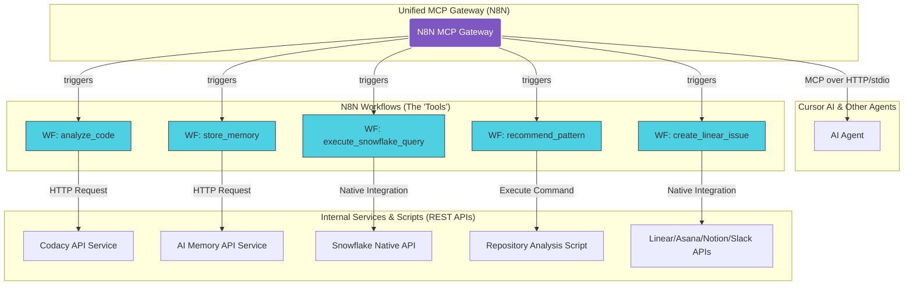

# Sophia AI: The Unified System Handbook

> **Version:** 1.0  
> **Status:** In Development  
> **Last Updated:** 2024-07-02 by Sophia AI  
> **Owner:** CAIO / CTO  

---

## 1. Project Overview & Vision

### 1.1. Mission Statement
Sophia AI is the central "Pay Ready Brain," an AI-native orchestration platform designed to drive business intelligence, automate complex workflows, and provide a seamless, intelligent interface for all company operations.

### 1.2. Core Business Objectives
- **Automate & Scale:** Dramatically reduce manual overhead in sales, project management, and operations.
- **Synthesize Intelligence:** Break down data silos by unifying information from HubSpot, Gong, Snowflake, Linear, Asana, and more into a single queryable interface.
- **Empower the Team:** Provide every team member, from the CEO to developers, with a powerful AI assistant that understands their role and context.
- **Accelerate Development:** Leverage AI to enforce best practices, automate testing, and provide world-class coding assistance.

### 1.3. Key Stakeholders & Use Cases
- **CEO & Executive Team:** Real-time business intelligence dashboards, strategic planning via Notion, and cross-functional performance analysis.
- **Sales & Account Management:** AI-powered call analysis (Gong), CRM automation (HubSpot), and intelligent communication workflows (Slack).
- **Product & Engineering:** Unified project tracking (Linear/Asana), automated code quality enforcement, and AI-assisted development.

---

## 2. The Sophia AI Tech Stack & Tools

### 2.1. Core Technologies
- **Orchestration Engine:** **N8N** - The central nervous system of our platform. *Chosen for its enterprise-grade reliability, visual workflow design, and native support for AI and MCP, allowing us to rapidly integrate any tool or service.*
- **Infrastructure as Code:** **Pulumi** - Manages our entire cloud infrastructure with TypeScript. *Chosen for its use of real programming languages, which enables superior logic, abstraction, and testability over YAML-based solutions.*
- **Dependency Management:** **UV** - A next-generation Python package manager written in Rust. *Chosen for its incredible speed (10-100x faster than pip/conda), which dramatically accelerates development setup, Docker builds, and CI/CD pipelines.*
- **Backend Framework:** **FastAPI** - The foundation for all our internal services. *Chosen for its high performance, native async support, and automatic data validation via Pydantic.*

### 2.2. Data & AI Stack
- **Data Warehouse:** **Snowflake**
- **Vector Search & Embeddings:** **Snowflake Cortex, Pinecone, Weaviate**
- **AI Models:** **OpenAI, Anthropic, OpenRouter Gateway**
- **In-Memory Cache:** **Redis**
- **Database:** **PostgreSQL**

---

## 3. The Sophia AI Architecture

### 3.1. High-Level Data Flow
*(A detailed diagram and explanation of the end-to-end data flow will be added here.)*

### 3.2. MCP Structure: The Phoenix Plan

**The Core Principle:** **Orchestration over brittle, custom integration.**

Instead of maintaining dozens of individual, protocol-sensitive servers, we now use **N8N** as a central, enterprise-grade orchestration engine.

#### **Architecture Diagram: N8N Gateway**

#### **How It Works:**

1.  **Single Entry Point:** All AI agents connect to a single, robust MCP server: the `n8n_mcp_gateway.py`. This is the only component that needs to speak the MCP protocol perfectly.
2.  **Tools as Workflows:** Each "tool" available to the AI (e.g., `analyze_code`, `execute_snowflake_query`) is actually a dedicated N8N workflow.
3.  **Orchestrated Execution:** When the gateway receives a tool request, it triggers the corresponding N8N workflow via a simple webhook.
4.  **Flexible Backend:** The N8N workflow then performs the actual task. It can call an internal REST API (like our Codacy server), execute a Python script (like our repository analyzer), or use N8N's powerful native integrations to talk directly to services like Snowflake, Linear, or Slack.

#### **Strategic Strengths of This Approach:**

-   **Unmatched Agility:** We can add, remove, or modify complex tools without ever touching the core MCP gateway. We simply create or update an N8N workflow.
-   **Ultimate Reliability:** We leverage N8N's production-ready, enterprise-grade engine for queuing, error handling, and monitoring, which is vastly superior to maintaining custom code.
-   **Infinite Extensibility:** With over 400 native integrations, N8N allows us to connect to virtually any service in minutes, making the Sophia AI platform instantly more powerful.
-   **Problem Solved:** This architecture completely resolves the original protocol mismatch and makes our entire ecosystem available to AI agents.

### 3.3. AI Agent & LangGraph Structure
*(Detailed explanation of how agents collaborate to solve complex tasks to be added)*

### 3.4. Contextualized Memory Architecture
*(Full explanation in [Contextualized Memory Architecture](./03_4_Contextual_Memory_Architecture.md))*

---

## 4. Platform Deep Dive

### 4.1. Dashboard & Universal Chat Interface
*(Description of the UI, role-based access, and the central chat experience to be added)*

### 4.2. AI Training & Curation Dashboard

The platform includes a dedicated, CEO-controlled dashboard for managing the AI's intelligence. This interface is the command center for our **Interactive Training Loop**.

**Access:** This dashboard tab is only visible to users with a high `training_impact_score` (e.g., > 0.7), ensuring that only authorized curators can shape the AI's core knowledge.

**Key Components:**
1.  **Live Knowledge Feed:** A real-time view of all authoritative knowledge being submitted to the system, showing the content, the source user, and their impact score.
2.  **User Impact Management:** An interface for the CEO to view and directly edit the `training_impact_score` (from 0.0 to 1.0) for every user on the platform.
3.  **Knowledge Gap Analysis:** An automated tool that analyzes user queries to identify important topics where the AI lacks authoritative knowledge, presenting them as a prioritized list for a curator to define.
4.  **Topic Explorer:** A searchable and editable view of the entire `authoritative_knowledge` database, allowing for direct management of the AI's learned facts.

This dashboard transforms AI training from a backend developer task into a strategic business function controlled by the company's leadership.

### 4.3. Business Intelligence & Analytics
*(How we leverage the data stack to provide insights to be added)*

### 4.4. Project Management Ecosystem
*(How Linear, Asana, Notion, and Slack are unified to be added)*

### 4.5. Code Quality & Security Automation

#### **The Automated Guardian: Codacy Tool**

When a developer or an AI agent calls the `analyze_code` tool, it triggers our N8N workflow which invokes our internal Codacy service. This service performs a multi-point inspection:

1.  **Security Vulnerability Scanning:**
    -   It actively scans for common, high-risk security vulnerabilities directly within the development environment.
    -   **Current Checks Include:**
        -   `eval()` and `exec()` usage (remote code execution risk)
        -   `os.system()` and `shell=True` usage (shell injection risk)
        -   Hardcoded secrets (`password = "..."`, `api_key = "..."`)

2.  **Complexity Analysis:**
    -   The service calculates a complexity score based on elements like functions, classes, conditionals, and loops.
    -   This helps identify monolithic functions or overly complex classes that are candidates for refactoring, improving long-term maintainability.

3.  **Overall Quality Scoring:**
    -   It generates a simple, out-of-100 **Quality Score** based on the number of issues found.
    -   It provides plain-language **Recommendations** for improvement (e.g., "Consider breaking down complex functions," "Fix 2 security issues").

#### **How It's Used in Practice:**

-   **AI-Assisted Refactoring:** A developer can highlight a function and ask, `"@sophia analyze this code and suggest improvements."` The AI will use the `analyze_code` tool and provide instant feedback on security and complexity.
-   **Pre-Commit Checks:** This tool is the foundation for a future pre-commit hook. Before code is even committed to the repository, it can be automatically scanned for critical issues, preventing bugs and security flaws from entering the main branch.
-   **Enforcing Best Practices:** By providing immediate, automated feedback, this system trains both human developers and AI agents on the project's quality and security standards.

---

This automated system is a critical component of our strategy to accelerate development while simultaneously increasing the quality and security of our codebase.

---

## 5. Operations & Development

### 5.1. GitHub Repository Structure
*(Full explanation in [GitHub Strategy & Operations](./05_1_GitHub_Strategy.md))*

### 5.2. Commit & Deployment Strategy
*(Our branch strategy, commit message conventions, and CI/CD pipeline are detailed in the [GitHub Strategy & Operations](./05_1_GitHub_Strategy.md) document.)*

### 5.3. Backup & Recovery Plan
*(Our strategy for backing up critical data and infrastructure to be added)*

---

## 6. Strategic Integrations

### 6.1. Current Integrations
- HubSpot, Gong, Slack, Linear, Asana, Notion, etc.

### 6.2. Salesforce to Intercom/HubSpot Migration Plan
*(Full explanation in [Salesforce to Intercom/HubSpot Migration Plan](./06_1_Salesforce_Migration_Plan.md))*

---

## 7. AI-Assisted Development Framework

### 7.1. Current State & Strengths
*(Summary of what is real and working today, highlighting our pivot to the N8N architecture as a major strength).*

### 7.2. Identified Gaps & Weaknesses
*(Honest assessment of what still needs work, e.g., completing Phase 4 of the Phoenix Plan).*

### 7.3. The Roadmap
*(A detailed implementation roadmap is available at [Implementation Roadmap](./08_1_Implementation_Roadmap.md))**

## 8. Project Roadmap & Future Vision

### 8.1. Current State & Strengths
*(Summary of what is real and working today, highlighting our pivot to the N8N architecture as a major strength).*

### 8.2. Identified Gaps & Weaknesses
*(Honest assessment of what still needs work, e.g., completing Phase 4 of the Phoenix Plan).*

### 8.3. The Roadmap
*(A detailed implementation roadmap is available at [Implementation Roadmap](./08_1_Implementation_Roadmap.md))**

