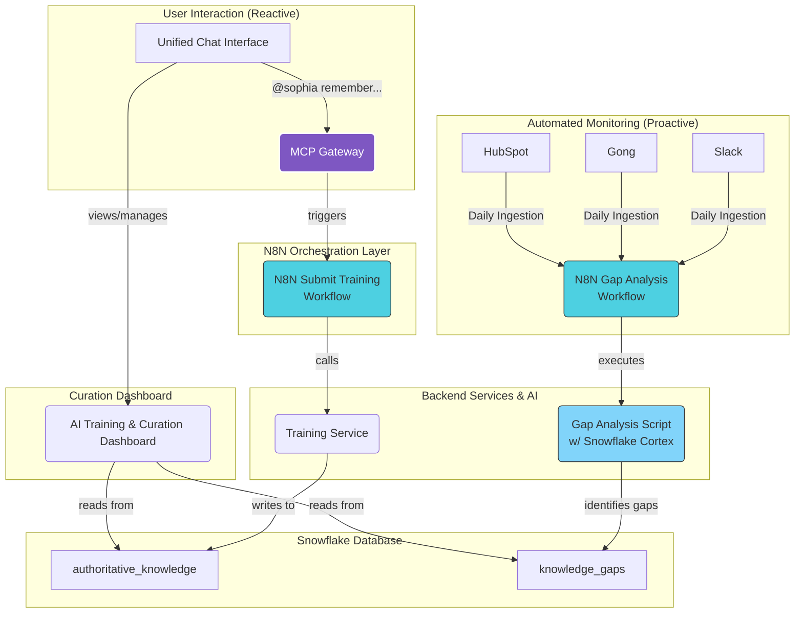

# Deep Dive: Contextualized Memory Architecture

> **Version:** 1.0
> **Status:** In Development
> **Parent:** [SOPHIA_AI_SYSTEM_HANDBOOK.md](./00_SOPHIA_AI_SYSTEM_HANDBOOK.md)

---

## 1. Overview

This document details the end-to-end data flow and architecture of Sophia AI's contextualized memory system. The system is designed to understand user queries in their full context, leveraging multiple layers of memory and data sources to provide the most accurate and relevant responses possible.

The core principle is a **tiered memory system**, progressing from fast, ephemeral session memory to deep, semantic knowledge stored in our data warehouse.

## 2. Architecture & Data Flow Diagram

This diagram illustrates the journey of a user's query through the Sophia AI platform.

```mermaid
graph TD
    subgraph User Interface
        A[Unified Chat Interface]
    end

    subgraph N8N MCP Gateway
        B(N8N Gateway)
        B -- Receives Query --> C{Intent & Entity<br>Detection}
    end

    subgraph Memory & Cache Layer
        D[L1: Session Cache<br>(Redis)]
        E[L2: AI Memory Service<br>(FastAPI/Postgres)]
    end

    subgraph Deep Knowledge Layer
        F[Vector Search<br>(Pinecone/Weaviate)]
        G[Structured Data<br>(Snowflake)]
        H[AI SQL Generation<br>(Snowflake Cortex)]
    end

    subgraph AI Model Layer
        I[LLM Orchestrator<br>(OpenRouter)]
        J[Final Synthesis<br>(GPT/Claude)]
    end

    A -- 1. User Query --> B
    C -- 2. Check Session Cache --> D
    D -- 3. Cache Miss --> E
    C -- 4. Keyword/Vector Search --> F
    C -- 5. Structured Data Query --> G
    G -- 6. Generate AI SQL --> H

    subgraph Synthesis
        K(Synthesizer)
        D -- Context --> K
        E -- Context --> K
        F -- Context --> K
        H -- Context --> K
    end

    K -- 7. Build Prompt --> I
    I -- 8. Route to Best LLM --> J
    J -- 9. Final Response --> A

    J -- 10. Store new knowledge --> E

    style A fill:#C5E1A5,stroke:#333,stroke-width:2px
    style B fill:#7E57C2,stroke:#FFF,stroke-width:2px,color:#FFF
    style D fill:#FFCC80,stroke:#333
    style E fill:#FFAB91,stroke:#333
    style F fill:#90CAF9,stroke:#333
    style G fill:#81D4FA,stroke:#333
    style H fill:#4FC3F7,stroke:#333
    style I fill:#CE93D8,stroke:#333
    style J fill:#BA68C8,stroke:#333
```

## 3. Step-by-Step Data Flow

1.  **User Query:** A user types a message (e.g., `"What was the outcome of our last call with ACME Corp?"`) into the **Unified Chat Interface**.

2.  **Intent Detection (Gateway):** The query is sent to our central **N8N MCP Gateway**. The first step is an N8N workflow that performs initial Natural Language Understanding (NLU) to detect user intent (e.g., `recall_memory`, `query_snowflake`) and key entities (e.g., `"ACME Corp"`).

3.  **L1 Cache Check (Redis):** The system first checks a high-speed Redis cache for an identical or very similar query from the current user's session. If a valid, recent result exists (cache hit), it is returned immediately for maximum performance.

4.  **L2 AI Memory Recall:** On a cache miss, the gateway calls the `recall_memory` tool. Our **AI Memory Service** (the FastAPI server) searches its PostgreSQL database for memories, conversation history, and documents explicitly tagged with `"ACME Corp"`.

5.  **L3 Vector Search (Pinecone/Weaviate):** Concurrently, the entity `"ACME Corp"` is used to perform a vector search across our deep knowledge bases in Pinecone/Weaviate. This finds semantically similar concepts, such as call transcripts where ACME's new product line was discussed, even if the exact company name wasn't tagged.

6.  **L4 Structured Data Search (Snowflake Cortex):** The system recognizes that "call outcome" and "ACME Corp" relate to structured data. It uses **Snowflake Cortex** to translate the natural language query into an optimized SQL query (e.g., `SELECT call_summary, sentiment FROM gong_calls WHERE company_name = 'ACME Corp' ORDER BY call_date DESC LIMIT 1;`). This AI-SQL query is executed against our structured data warehouse.

7.  **Context Synthesis:** The results from all layers (L2, L3, L4) are collected. A synthesizer service compiles these disparate pieces of information—tagged memories, semantically related text chunks, and structured query results—into a rich, comprehensive context.

8.  **LLM Prompting & Orchestration:** This rich context is formatted into a sophisticated prompt and sent to our **LLM Orchestrator (OpenRouter)**. The orchestrator selects the best model for the task (e.g., Claude for long-context synthesis, GPT-4 for data analysis).

9.  **Final Response Generation:** The chosen LLM generates a final, human-readable answer that synthesizes all the retrieved information (e.g., `"Our last call with ACME Corp, held on Tuesday, had a positive sentiment. Key outcomes included their agreement to a trial of our new module, and we have an action item to send them pricing by Friday. I've attached the full call summary from Gong."`). This response is streamed back to the user.

10. **Learning Loop:** The final synthesized answer, along with the original query, is passed to the `store_memory` tool. This ensures that the next time a similar question is asked, the answer is already cached in our L2 AI Memory, making the system smarter and faster over time.

---

## 4. Ingestion Methods: How Knowledge Enters the System

Knowledge is not static; it is constantly ingested into the Sophia AI ecosystem from multiple sources.

### 4.1. Interactive Ingestion via Unified Chat
-   **Mechanism:** Authorized users (especially those with high training impact) can directly teach Sophia.
-   **Example Command:** `> @sophia ingest and index this document for our Q3 planning: [link]`
-   **Process:** The AI uses a WebFetch tool to retrieve the content, then automatically triggers the chunking, meta-tagging, and embedding pipeline.

### 4.2. UI-Based Ingestion via Knowledge Base Tab
-   **Mechanism:** A dedicated "Knowledge Base" tab in the dashboard will provide a user-friendly interface for uploading files (PDFs, DOCX, etc.).
-   **Process:** Uploading a file will trigger the same robust ingestion pipeline, making the document's contents available for semantic search.

### 4.3. Automated Ingestion via Integrations
-   **Mechanism:** N8N workflows run on schedules to automatically pull data from our key platforms.
-   **Examples:**
    -   **Gong:** Ingests new call transcripts daily.
    -   **Slack:** Ingests conversations from key channels (e.g., `#sales-wins`, `#product-feedback`).
    -   **Linear/Asana:** Ingests completed tasks and project summaries weekly.

## 5. The Ingestion Pipeline: From Raw Data to Actionable Intelligence

Once data is ingested, it goes through a sophisticated processing pipeline to make it useful.

1.  **Chunking:** Large documents and conversations are broken down into smaller, semantically coherent chunks. We use a content-aware chunking strategy that respects paragraphs, lists, and tables to maintain context.
2.  **Meta-Tagging:** Each chunk is automatically tagged with rich metadata, including:
    -   `source`: (e.g., "Gong", "Slack", "Manual Upload")
    -   `author`: The user who created the content or uploaded the document.
    -   `timestamp`: The original creation date.
    -   `security_level`: (e.g., "Public", "Internal", "Confidential", "Unified-Only")
    -   `document_id`: A unique ID to group all chunks from the same source.
3.  **Embedding & Semantic Search:** Each chunk is converted into a vector embedding using state-of-the-art models and stored in our vector database (Pinecone/Weaviate) for fast, accurate semantic search.

## 6. The Training Loop: Interactive & Weighted Fine-Tuning

This is a revolutionary feature that allows Sophia AI to be continuously trained and corrected by its users, with a system of weighted impact ensuring that expert knowledge is prioritized.

### 6.1. Natural Language Interaction
-   **Mechanism:** An authorized user can correct or teach Sophia directly within the Unified Chat Interface.
-   **Correction Example:** `> @sophia that's not quite right. The lead for 'Project Titan' is actually Maria, not Michael.`
-   **Teaching Example:** `> @sophia let's establish a core definition. 'Customer Health Score' is a metric from 0-100 calculated based on product usage, NPS, and support ticket volume.`

### 6.2. The Weighting System
-   **Unified-Controlled User Impact:** In the user setup, the Unified can assign a **Training Impact Score (0.0 to 1.0)** to each user.
    -   `Unified`: 1.0 (100% impact)
    -   `Department Head`: 0.8 (80% impact)
    -   `Customer Service Rep`: 0.1 (10% impact)
-   **How it Works:** When a user provides a correction or definition, the "truth" of that statement is recorded with a confidence score equal to their Training Impact Score. When conflicting information exists, the information from the user with the highest impact score is prioritized by the LLM during prompt synthesis.
-   **Future Vision (By Business Area):** This system is designed to evolve. In the future, a user's Training Impact can be scoped to specific business areas. For example, the Head of Sales would have a 1.0 impact score on sales-related topics, but a lower score on engineering topics.

### 6.3. How Training Data is Used
-   **Priority Context:** When Sophia synthesizes a prompt for the LLM, it will explicitly include a section called `<AuthoritativeKnowledge>` containing any user-provided definitions or corrections relevant to the query, noting the impact score.
-   **Example Prompt Snippet:**
    ```
    ...
    <AuthoritativeKnowledge>
    - Definition for 'Customer Health Score' provided by Unified (Impact: 1.0): [Definition Here]
    - Correction for 'Project Titan' lead provided by Engineering Lead (Impact: 0.9): [Correction Here]
    </AuthoritativeKnowledge>
    ...
    ```
-   **Continuous Improvement:** This creates a powerful, self-correcting feedback loop that makes the entire platform smarter and more accurate with every user interaction.

## 7. Management & Curation

The entire interactive training process, including the management of `authoritative_knowledge` and user `training_impact_score` values, is overseen through the **AI Training & Curation Dashboard**. This provides a dedicated, Unified-controlled interface to ensure the quality and integrity of the AI's learned knowledge base.

---

## 8. The Sophia AI Learning Loop: Proactive & Reactive Training

The intelligence of the Sophia AI platform is not static; it is a dynamic system designed for continuous improvement. This is achieved through a two-pronged learning architecture that combines direct user instruction (Reactive) with automated discovery (Proactive).



### 8.1. The Reactive Loop (User-Driven Training)
- **Trigger:** An authorized user provides an explicit instruction, such as `@sophia remember: [definition]` or `@sophia correct: [correction]`.
- **Flow:** The command is routed through the MCP Gateway to the "Submit Training" N8N workflow. This workflow calls our internal `InteractiveTrainingService`, which validates the user's impact score and writes the information to the `authoritative_knowledge` table in Snowflake.
- **Purpose:** To capture explicit, high-value knowledge directly from trusted human experts.

### 8.2. The Proactive Loop (AI-Driven Discovery)
- **Trigger:** A scheduled N8N workflow (`proactive_knowledge_gap_analysis`) runs automatically every night.
- **Flow:**
    1. **Ingest:** The workflow pulls raw conversational data from key platforms (Gong, Slack, HubSpot).
    2. **Analyze:** It executes our `analyze_knowledge_gaps.py` script. This script leverages Snowflake Cortex AI functions to perform topic modeling and entity extraction on the raw text, identifying recurring themes.
    3. **Compare & Identify:** For each theme, the script checks if a corresponding entry exists in the `authoritative_knowledge` table. If not, it's flagged as a "knowledge gap."
    4. **Store & Alert:** The prioritized list of gaps is stored in the `knowledge_gaps` table and a summary notification is sent to a dedicated Slack channel.
- **Purpose:** To autonomously discover the "unknown unknowns"—the questions and topics that are important to the business but that no one has explicitly taught the AI yet. This allows curators to focus their training efforts on the most impactful areas.

---

## 8. The Sophia AI Learning Loop: Proactive & Reactive Training

The intelligence of the Sophia AI platform is not static; it is a dynamic system designed for continuous improvement. This is achieved through a two-pronged learning architecture that combines direct user instruction (Reactive) with automated discovery (Proactive).


### 8.1. The Reactive Loop (User-Driven Training)
- **Trigger:** An authorized user provides an explicit instruction, such as `@sophia remember: [definition]` or `@sophia correct: [correction]`.
- **Flow:** The command is routed through the MCP Gateway to the "Submit Training" N8N workflow. This workflow calls our internal `InteractiveTrainingService`, which validates the user's impact score and writes the information to the `authoritative_knowledge` table in Snowflake.
- **Purpose:** To capture explicit, high-value knowledge directly from trusted human experts.

### 8.2. The Proactive Loop (AI-Driven Discovery)
- **Trigger:** A scheduled N8N workflow (`proactive_knowledge_gap_analysis`) runs automatically every night.
- **Flow:**
    1. **Ingest:** The workflow pulls raw conversational data from key platforms (Gong, Slack, HubSpot).
    2. **Analyze:** It executes our `analyze_knowledge_gaps.py` script. This script leverages Snowflake Cortex AI functions to perform topic modeling and entity extraction on the raw text, identifying recurring themes.
    3. **Compare & Identify:** For each theme, the script checks if a corresponding entry exists in the `authoritative_knowledge` table. If not, it's flagged as a "knowledge gap."
    4. **Store & Alert:** The prioritized list of gaps is stored in the `knowledge_gaps` table and a summary notification is sent to a dedicated Slack channel.
- **Purpose:** To autonomously discover the "unknown unknowns"—the questions and topics that are important to the business but that no one has explicitly taught the AI yet. This allows curators to focus their training efforts on the most impactful areas.
