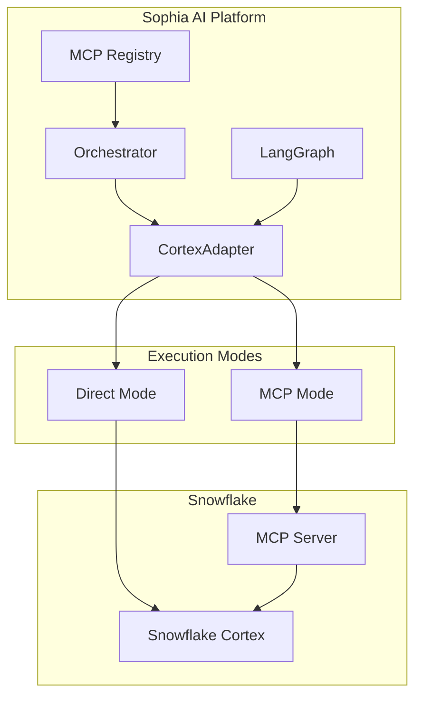

# Snowflake Cortex MCP Deep-Dive Integration Blueprint

**Version**: 1.0.0
**Status**: Implementation Ready
**Last Updated**: 2025-01-08
**Owner**: Sophia AI Platform Team

## Executive Summary

This document provides the complete engineering blueprint for integrating Snowflake Cortex AI capabilities through a dual-mode adapter supporting both direct connections and MCP (Model Context Protocol) server communication. The integration enables seamless AI operations with automatic fallback, comprehensive monitoring, and enterprise-grade security.

## Table of Contents

1. [Architecture Overview](#architecture-overview)
2. [Phase 1: Dual-Path CortexAdapter](#phase-1-dual-path-cortexadapter)
3. [Phase 2: MCP Registry & Orchestration](#phase-2-mcp-registry--orchestration)
4. [Phase 3: LangGraph Integration](#phase-3-langgraph-integration)
5. [Phase 4: Performance Optimization](#phase-4-performance-optimization)
6. [Phase 5: Monitoring & Observability](#phase-5-monitoring--observability)
7. [Security & Compliance](#security--compliance)
8. [Testing Strategy](#testing-strategy)
9. [Deployment & Rollout](#deployment--rollout)
10. [Risk Management](#risk-management)

## Architecture Overview



## Phase 1: Dual-Path CortexAdapter

### 1.1 Core Implementation

The CortexAdapter provides seamless switching between direct Snowflake connections and MCP server communication with automatic fallback capabilities.

#### Key Components:
- **ExecutionMode Enum**: Controls routing between DIRECT and MCP modes
- **CortexQuery Dataclass**: Encapsulates query parameters with retry configuration
- **Automatic Fallback**: Transparent failover from MCP to DIRECT mode
- **Connection Pooling**: Separate pools for direct and MCP connections

### 1.2 Implementation Details

```python
# File: backend/core/services/snowflake_cortex_adapter.py
from enum import Enum
from dataclasses import dataclass, field
from typing import Optional, Union
import asyncio
from prometheus_client import Counter, Histogram

class ExecutionMode(Enum):
    DIRECT = "direct"
    MCP = "mcp"
    AUTO = "auto"  # Intelligent mode selection

@dataclass
class RetryConfig:
    max_attempts: int = 3
    initial_delay: float = 0.5
    max_delay: float = 5.0
    exponential_base: float = 2.0

@dataclass
class CortexTask:
    type: str  # "complete", "search", "analyst"
    model: str = "snowflake-arctic"
    temperature: float = 0.7
    max_tokens: int = 2048

@dataclass
class CortexQuery:
    text: str
    task: CortexTask
    timeout_s: int = 120
    retry: RetryConfig = field(default_factory=RetryConfig)
    metadata: dict = field(default_factory=dict)

@dataclass
class CortexResult:
    response: str
    usage: dict
    latency_ms: float
    execution_mode: ExecutionMode
    trace_id: str
```

### 1.3 Connection Pool Management

```python
# File: backend/core/services/snowflake_pool.py
class SnowflakePoolManager:
    """Manages connection pools for both direct and MCP modes"""

    def __init__(self, config: PoolConfig):
        self.direct_pool = asyncio.Queue(maxsize=config.direct_pool_size)
        self.mcp_pool = asyncio.Queue(maxsize=config.mcp_pool_size)
        self.metrics = PoolMetrics()

    async def acquire(self, mode: ExecutionMode) -> Union[SnowflakeConnection, MCPSession]:
        """Acquire connection with wait time tracking"""
        start_time = time.time()
        pool = self.direct_pool if mode == ExecutionMode.DIRECT else self.mcp_pool

        try:
            connection = await asyncio.wait_for(
                pool.get(),
                timeout=self.config.acquire_timeout
            )
            self.metrics.record_acquisition(time.time() - start_time, mode)
            return connection
        except asyncio.TimeoutError:
            self.metrics.record_timeout(mode)
            raise PoolExhaustedError(f"No available connections in {mode} pool")
```

## Phase 2: MCP Registry & Orchestration

### 2.1 Registry Configuration

The MCP Registry provides centralized management of all MCP servers with tier-based routing and health monitoring.

```yaml
# File: config/mcp/registry.yaml
version: "2.0"
servers:
  - id: snowflake-cortex-primary
    host: https://mcp-snowflake.${CLUSTER_FQDN}
    tier: PRIMARY
    auth: PAT
    capabilities:
      cortexSearch:
        version: "1.0"
        features: ["semantic", "hybrid", "vector"]
      cortexAnalyst:
        version: "1.0"
        features: ["sql_generation", "query_optimization"]
      cortexComplete:
        version: "1.0"
        models: ["arctic", "mistral-large", "llama2-70b"]
    healthEndpoint: /health/live
    metricsEndpoint: /metrics
    timeout_ms: 5000

  - id: snowflake-cortex-secondary
    host: https://mcp-snowflake-dr.${CLUSTER_FQDN}
    tier: SECONDARY
    auth: PAT
    capabilities:
      cortexComplete:
        version: "1.0"
        models: ["arctic"]
    healthEndpoint: /health/live
```

### 2.2 Orchestration Service Enhancement

```python
# File: backend/services/mcp_orchestration_service.py
class MCPOrchestrationService:
    """Enhanced orchestration with Snowflake Cortex support"""

    async def route_cortex_request(
        self,
        query: CortexQuery,
        preferred_tier: str = "PRIMARY"
    ) -> MCPServer:
        """Intelligent routing with capability matching"""

        # Find servers with required capabilities
        capable_servers = self.registry.find_servers_with_capability(
            f"cortex{query.task.type.capitalize()}"
        )

        if not capable_servers:
            raise MCPRouteError(
                f"No MCP servers available for task {query.task.type}"
            )

        # Sort by tier and health score
        sorted_servers = sorted(
            capable_servers,
            key=lambda s: (
                self.tier_priority[s.tier],
                -s.health_score,
                s.latency_p95
            )
        )

        selected = sorted_servers[0]
        self.metrics.record_routing_decision(selected, query.task.type)

        return selected
```

## Phase 3: LangGraph Integration

### 3.1 Workflow State Enhancement

```python
# File: backend/workflows/langgraph_state.py
from pydantic import BaseModel, Field
from typing import List, Optional, Dict, Any

class CortexAnalysisRequest(BaseModel):
    query: str
    context: Dict[str, Any]
    required_capabilities: List[str]
    priority: str = "normal"

class WorkflowState(BaseModel):
    """Enhanced workflow state with Cortex integration"""

    # Existing fields
    messages: List[Message] = Field(default_factory=list)
    context: Dict[str, Any] = Field(default_factory=dict)

    # Cortex-specific fields
    requires_cortex_analysis: bool = False
    cortex_requests: List[CortexAnalysisRequest] = Field(default_factory=list)
    cortex_results: Dict[str, CortexResult] = Field(default_factory=dict)

    # Performance tracking
    cortex_latency_ms: Optional[float] = None
    execution_mode_used: Optional[str] = None
```

### 3.2 Dynamic Graph Construction

```python
# File: backend/workflows/graph_builder.py
class DynamicGraphBuilder:
    """Builds LangGraph with conditional Cortex nodes"""

    def build_with_cortex(self, initial_state: WorkflowState) -> StateGraph:
        graph = StateGraph(WorkflowState)

        # Standard nodes
        graph.add_node("input_processor", InputProcessorNode())
        graph.add_node("intent_classifier", IntentClassifierNode())

        # Conditional Cortex integration
        if self._requires_cortex_analysis(initial_state):
            cortex_node = SnowflakeCortexNode(
                adapter=self.cortex_adapter,
                streaming_callback=self.streaming_callback
            )
            graph.add_node("snowflake_cortex", cortex_node)

            # Dynamic routing based on intent
            graph.add_conditional_edges(
                "intent_classifier",
                self._route_to_cortex,
                {
                    "needs_analysis": "snowflake_cortex",
                    "direct_response": "response_generator"
                }
            )

            # Cortex output routing
            graph.add_edge("snowflake_cortex", "response_generator")

        return graph.compile()
```

## Phase 4: Performance Optimization

### 4.1 Semantic Cache Interface

```python
# File: backend/core/interfaces/semantic_cache.py
from typing import Protocol, Optional, TypeVar
from abc import abstractmethod

T = TypeVar('T')

class SemanticCache(Protocol):
    """Protocol for semantic similarity caching"""

    @abstractmethod
    async def get(
        self,
        key: str,
        embedding: Optional[List[float]] = None,
        similarity_threshold: float = 0.95
    ) -> Optional[T]:
        """Retrieve cached result by semantic similarity"""
        ...

    @abstractmethod
    async def set(
        self,
        key: str,
        value: T,
        embedding: Optional[List[float]] = None,
        ttl_s: int = 3600
    ) -> None:
        """Cache result with optional embedding"""
        ...

    @abstractmethod
    async def invalidate_similar(
        self,
        embedding: List[float],
        threshold: float = 0.8
    ) -> int:
        """Invalidate semantically similar entries"""
        ...
```

### 4.2 Connection Pool Autoscaling

```python
# File: backend/core/services/pool_autoscaler.py
class PoolAutoscaler:
    """Intelligent pool size management"""

    def __init__(self, pool_manager: SnowflakePoolManager):
        self.pool_manager = pool_manager
        self.metrics_window = deque(maxlen=10)
        self.scaling_decisions = []

    async def evaluate_and_scale(self):
        """Periodic evaluation of pool performance"""
        current_metrics = self.pool_manager.get_metrics()
        self.metrics_window.append(current_metrics)

        # Check if scaling needed
        if self._should_scale_up(current_metrics):
            await self._scale_up()
        elif self._should_scale_down(current_metrics):
            await self._scale_down()

    def _should_scale_up(self, metrics: PoolMetrics) -> bool:
        """Scale up if wait time exceeds threshold consistently"""
        if len(self.metrics_window) < 3:
            return False

        recent_waits = [m.avg_wait_ms for m in list(self.metrics_window)[-3:]]
        return all(wait > 100 for wait in recent_waits)
```

## Phase 5: Monitoring & Observability

### 5.1 Comprehensive Metrics

```python
# File: backend/monitoring/cortex_metrics.py
from prometheus_client import Counter, Histogram, Gauge, Info

# Execution metrics
cortex_calls_total = Counter(
    'cortex_calls_total',
    'Total Cortex API calls',
    ['mode', 'task', 'status', 'model']
)

cortex_latency_seconds = Histogram(
    'cortex_latency_seconds',
    'Cortex call latency',
    ['mode', 'task', 'model'],
    buckets=[0.1, 0.25, 0.5, 1.0, 2.5, 5.0, 10.0]
)

# Pool metrics
snowflake_pool_size = Gauge(
    'snowflake_pool_size',
    'Current pool size',
    ['mode']
)

snowflake_pool_in_use = Gauge(
    'snowflake_pool_in_use',
    'Connections currently in use',
    ['mode']
)

# MCP health metrics
mcp_server_health_score = Gauge(
    'mcp_server_health_score',
    'MCP server health score (0-1)',
    ['server_id', 'tier']
)

# Cost tracking
cortex_credits_used = Counter(
    'cortex_credits_used',
    'Snowflake credits consumed',
    ['task', 'model']
)
```

### 5.2 Grafana Dashboard Configuration

```json
{
  "dashboard": {
    "title": "Snowflake Cortex MCP Integration",
    "panels": [
      {
        "title": "Request Rate by Mode",
        "targets": [{
          "expr": "rate(cortex_calls_total[5m])",
          "legendFormat": "{{mode}} - {{task}}"
        }]
      },
      {
        "title": "Latency P95 by Task",
        "targets": [{
          "expr": "histogram_quantile(0.95, rate(cortex_latency_seconds_bucket[5m]))",
          "legendFormat": "{{task}} - {{mode}}"
        }]
      },
      {
        "title": "Pool Utilization",
        "targets": [{
          "expr": "snowflake_pool_in_use / snowflake_pool_size",
          "legendFormat": "{{mode}} pool"
        }]
      },
      {
        "title": "MCP Failover Rate",
        "targets": [{
          "expr": "rate(cortex_calls_total{status=\"fallback\"}[5m])"
        }]
      }
    ]
  }
}
```

## Security & Compliance

### 6.1 PAT Management

```python
# File: backend/security/pat_manager.py
class SnowflakePATManager:
    """Secure PAT lifecycle management"""

    def __init__(self, esc_client: PulumiESCClient):
        self.esc_client = esc_client
        self.rotation_days = 90
        self.alert_days_before = 7

    async def get_current_pat(self, environment: str) -> str:
        """Retrieve current PAT with validation"""
        pat_key = f"snowflake_pat_{environment.lower()}"
        pat = await self.esc_client.get_secret(
            f"values.sophia.infrastructure.snowflake.{pat_key}"
        )

        if not pat:
            raise SecurityError(f"No PAT configured for {environment}")

        # Validate PAT format
        if not self._validate_pat_format(pat):
            raise SecurityError("Invalid PAT format")

        return pat

    async def check_rotation_needed(self) -> List[RotationAlert]:
        """Check all PATs for rotation requirements"""
        alerts = []

        for env in ["prod", "staging"]:
            pat_metadata = await self._get_pat_metadata(env)
            days_until_expiry = (pat_metadata.expires_at - datetime.now()).days

            if days_until_expiry <= self.alert_days_before:
                alerts.append(RotationAlert(
                    environment=env,
                    days_remaining=days_until_expiry,
                    severity="HIGH" if days_until_expiry <= 1 else "MEDIUM"
                ))

        return alerts
```

### 6.2 Audit Middleware

```python
# File: backend/security/audit_middleware.py
class SnowflakeAuditMiddleware:
    """Comprehensive audit trail for Snowflake operations"""

    async def __call__(self, request: Request, call_next):
        # Generate trace ID
        trace_id = f"sophia-{uuid.uuid4().hex[:16]}"

        # Inject into request context
        request.state.trace_id = trace_id

        # Log request details (sanitized)
        audit_entry = {
            "trace_id": trace_id,
            "timestamp": datetime.utcnow().isoformat(),
            "user_id": getattr(request.state, "user_id", "anonymous"),
            "endpoint": request.url.path,
            "method": request.method,
            "snowflake_operation": self._extract_operation(request)
        }

        # Execute request
        response = await call_next(request)

        # Log response
        audit_entry.update({
            "status_code": response.status_code,
            "duration_ms": (time.time() - start_time) * 1000,
            "credits_used": response.headers.get("X-Snowflake-Credits", "0")
        })

        await self.audit_logger.log(audit_entry)

        # Add trace ID to response
        response.headers["X-Sophia-Trace-ID"] = trace_id

        return response
```

## Testing Strategy

### 7.1 Unit Test Suite

```python
# File: backend/tests/services/test_snowflake_cortex_adapter.py
import pytest
from unittest.mock import AsyncMock, patch
from httpx import AsyncClient, Response
import httpx_mock

@pytest.mark.asyncio
class TestCortexAdapter:
    """Comprehensive test coverage for CortexAdapter"""

    @pytest.fixture
    def adapter(self):
        return CortexAdapter(
            execution_mode=ExecutionMode.AUTO,
            mcp_client=AsyncMock(spec=SnowflakeMCPClient)
        )

    @pytest.mark.parametrize("task_type,mode", [
        ("complete", ExecutionMode.DIRECT),
        ("complete", ExecutionMode.MCP),
        ("search", ExecutionMode.DIRECT),
        ("search", ExecutionMode.MCP),
        ("analyst", ExecutionMode.DIRECT),
        ("analyst", ExecutionMode.MCP),
    ])
    async def test_execution_modes(self, adapter, task_type, mode):
        """Test all task types in both execution modes"""
        query = CortexQuery(
            text="Test query",
            task=CortexTask(type=task_type),
            timeout_s=30
        )

        # Mock appropriate response
        if mode == ExecutionMode.DIRECT:
            adapter._snowflake_conn = AsyncMock()
            adapter._snowflake_conn.execute.return_value = {
                "response": "Test response",
                "usage": {"tokens": 100}
            }
        else:
            adapter.mcp_client.execute_cortex.return_value = {
                "response": "Test response",
                "usage": {"tokens": 100}
            }

        # Execute
        adapter.execution_mode = mode
        result = await adapter.run(query)

        # Verify
        assert result.response == "Test response"
        assert result.execution_mode == mode
        assert result.usage["tokens"] == 100

    async def test_automatic_fallback(self, adapter, httpx_mock):
        """Test fallback from MCP to DIRECT mode"""
        # Configure MCP to fail
        adapter.mcp_client.execute_cortex.side_effect = ConnectionError("MCP unavailable")

        # Configure direct mode to succeed
        adapter._snowflake_conn = AsyncMock()
        adapter._snowflake_conn.execute.return_value = {
            "response": "Fallback response"
        }

        # Execute
        query = CortexQuery(
            text="Test query",
            task=CortexTask(type="complete")
        )
        result = await adapter.run(query)

        # Verify fallback occurred
        assert result.response == "Fallback response"
        assert result.execution_mode == ExecutionMode.DIRECT

        # Check metrics
        with patch('backend.monitoring.cortex_metrics.cortex_calls_total') as mock_counter:
            mock_counter.labels.assert_called_with(
                mode="direct",
                task="complete",
                status="fallback",
                model="snowflake-arctic"
            )
```

### 7.2 Integration Tests

```python
# File: backend/tests/integration/test_cortex_e2e.py
@pytest.mark.e2e
@pytest.mark.snowflake
class TestCortexE2E:
    """End-to-end tests with real Snowflake connection"""

    async def test_call_transcript_analysis(self, test_db, cortex_adapter):
        """Test analyzing call transcripts"""
        # Insert test transcript
        transcript = await test_db.insert_transcript({
            "text": "Customer discussing pricing concerns...",
            "duration_seconds": 1800
        })

        # Analyze with Cortex
        query = CortexQuery(
            text=f"Analyze sentiment and extract key topics from: {transcript.text}",
            task=CortexTask(type="complete", model="arctic")
        )

        result = await cortex_adapter.run(query)

        # Verify analysis
        assert "sentiment" in result.response.lower()
        assert result.latency_ms < 2000  # Performance SLA
        assert result.usage["tokens"] < 1000  # Cost control

    async def test_cross_tool_orchestration(self, langgraph_runtime):
        """Test LangGraph orchestration with Cortex"""
        # Create workflow requiring Cortex
        state = WorkflowState(
            messages=[Message(content="Generate SQL for top customers by revenue")],
            requires_cortex_analysis=True
        )

        # Execute workflow
        final_state = await langgraph_runtime.run(state)

        # Verify Cortex was called
        assert final_state.cortex_results
        assert "analyst" in final_state.cortex_results
        assert final_state.cortex_latency_ms < 5000
```

### 7.3 Load Testing

```python
# File: backend/tests/load/locustfile_sf_mcp.py
from locust import HttpUser, task, between
import json

class SnowflakeMCPUser(HttpUser):
    wait_time = between(1, 3)

    @task(weight=3)
    def cortex_complete(self):
        """Test Cortex complete endpoint"""
        payload = {
            "query": {
                "text": "Summarize the latest market trends",
                "task": {
                    "type": "complete",
                    "model": "arctic",
                    "max_tokens": 500
                }
            }
        }

        with self.client.post(
            "/api/v1/cortex/complete",
            json=payload,
            catch_response=True
        ) as response:
            if response.elapsed.total_seconds() > 0.4:  # 400ms SLA
                response.failure(f"Response too slow: {response.elapsed.total_seconds()}s")
            elif response.status_code != 200:
                response.failure(f"Status code: {response.status_code}")
            else:
                response.success()

    @task(weight=1)
    def cortex_search(self):
        """Test Cortex search endpoint"""
        payload = {
            "query": {
                "text": "Find deals closing this quarter",
                "task": {
                    "type": "search",
                    "model": "arctic"
                }
            }
        }

        self.client.post("/api/v1/cortex/search", json=payload)
```

## Deployment & Rollout

### 8.1 CI/CD Pipeline Integration

```yaml
# File: .github/workflows/sophia-production-deployment.yml
name: Sophia Production Deployment

on:
  push:
    branches: [main]

env:
  SNOWFLAKE_PAT: ${{ secrets.SNOWFLAKE_PAT_PROD }}

jobs:
  deploy:
    runs-on: ubuntu-latest
    steps:
      - name: Validate Snowflake PAT
        run: |
          if [ -z "$SNOWFLAKE_PAT" ]; then
            echo "::error::SNOWFLAKE_PAT_PROD secret not configured"
            exit 1
          fi

      - name: Build with PAT
        run: |
          docker build \
            --build-arg SNOWFLAKE_PAT="${SNOWFLAKE_PAT}" \
            --target production \
            -t sophia-ai:${{ github.sha }} .

      - name: Run Snowflake MCP Smoke Tests
        run: |
          docker run --rm \
            -e SNOWFLAKE_PAT="${SNOWFLAKE_PAT}" \
            sophia-ai:${{ github.sha }} \
            python backend/scripts/smoke_test_snowflake_mcp.py
```

### 8.2 Rollout Runbook

```markdown
# File: docs/runbooks/SNOWFLAKE_MCP_ROLLOUT.md

## Pre-Deployment Checklist
- [ ] SNOWFLAKE_PAT_PROD secret configured in GitHub
- [ ] Pulumi ESC sync completed
- [ ] MCP server endpoints verified
- [ ] Load test baseline captured

## Deployment Steps

1. **Feature Branch Testing**
   ```bash
   git checkout -b feat/snowflake-mcp-integration
   pytest -m "unit and snowflake"
   ```

2. **Preview Environment**
   ```bash
   pulumi stack select sophia-ai-mcp-pr-$PR_NUMBER
   pulumi up
   ```

3. **E2E Validation**
   ```bash
   pytest -m "e2e and snowflake" --env=preview
   ```

4. **Staging Deployment**
   - Merge to develop
   - Monitor staging metrics for 2 hours
   - Run load test: `locust -f locustfile_sf_mcp.py --host=https://staging.sophia-ai.com`

5. **Production Deployment**
   - Create release tag
   - Merge to main
   - Monitor Grafana dashboard "Snowflake Cortex MCP"

## Rollback Procedure
1. Set environment variable: `MCP_SNOWFLAKE_ENABLED=false`
2. Restart services: `kubectl rollout restart deployment/sophia-backend`
3. Verify fallback to DIRECT mode in metrics
```

## Risk Management

### 9.1 Risk Matrix

| Risk | Probability | Impact | Mitigation |
|------|------------|--------|------------|
| MCP server latency spike | Medium | High | Automatic fallback to DIRECT mode |
| PAT expiration | Low | Critical | 7-day advance alerts, rotation runbook |
| Cost overrun | Medium | Medium | Daily credit limits, usage alerts |
| Connection pool exhaustion | Low | High | Auto-scaling, queue timeout alerts |

### 9.2 Circuit Breaker Configuration

```python
# File: backend/core/services/cortex_circuit_breaker.py
class CortexCircuitBreaker:
    """Circuit breaker for Cortex operations"""

    def __init__(self):
        self.failure_threshold = 5
        self.recovery_timeout = 60  # seconds
        self.half_open_requests = 3

        self.states = {
            ExecutionMode.MCP: CircuitState.CLOSED,
            ExecutionMode.DIRECT: CircuitState.CLOSED
        }

        self.failure_counts = defaultdict(int)
        self.last_failure_time = {}

    async def call(self, mode: ExecutionMode, operation):
        """Execute operation with circuit breaker protection"""
        state = self.states[mode]

        if state == CircuitState.OPEN:
            if self._should_attempt_reset(mode):
                state = CircuitState.HALF_OPEN
            else:
                raise CircuitOpenError(f"{mode} circuit is OPEN")

        try:
            result = await operation()
            self._on_success(mode)
            return result
        except Exception as e:
            self._on_failure(mode)
            raise
```

## Next Sprint Backlog

### BACKLOG-01: Redis MCP Semantic Cache
- Implement Redis-based semantic similarity cache
- Integration with Snowflake embeddings
- Cache warming strategies

### BACKLOG-02: Estuary Flow Streaming
- Real-time data ingestion from Snowflake
- Change data capture integration
- Stream processing with Cortex

### BACKLOG-03: Pulumi MCP Infrastructure
- Infrastructure as Code for MCP servers
- Automated provisioning and scaling
- Cost optimization rules

### BACKLOG-04: Multi-Region Strategy
- Lambda Labs multi-region deployment
- Snowflake region affinity
- Latency-based routing

## Conclusion

This comprehensive integration blueprint provides a production-ready implementation of Snowflake Cortex capabilities within the Sophia AI platform. The dual-mode architecture ensures reliability, the monitoring stack provides observability, and the security measures maintain compliance. The phased rollout approach minimizes risk while the extensive testing strategy ensures quality.

The implementation follows Sophia AI's quality-first principles, reuses existing infrastructure where possible, and provides clear extension points for future enhancements.
