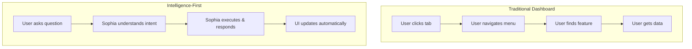

# 📱 Deep Dive: UI Architecture - Intelligence-First Interface

> **Version:** 2.0  
> **Status:** Authoritative Design  
> **Parent:** [00_SOPHIA_AI_SYSTEM_HANDBOOK.md](./00_SOPHIA_AI_SYSTEM_HANDBOOK.md)

---

## 1. Overview

This document defines the authoritative UI architecture for Sophia AI v2.0, representing a paradigm shift from traditional dashboard-centric design to an **intelligence-first interface** where natural language is the primary interaction method.

### Core Principle: "Ask First, Click Second"

Every system capability must be accessible through natural language, with visual UI elements serving as confirmations and alternatives rather than primary interaction methods.

---

## 2. Architectural Philosophy

### 2.1 Intelligence-First Design



### 2.2 Natural Language as Primary Interface

- **Every feature** accessible via conversation
- **Context-aware** responses based on current state
- **Predictive assistance** based on patterns
- **Multi-modal input** (text, voice, files)
- **Rich responses** with visualizations and actions

---

## 3. Component Architecture

### 3.1 High-Level Structure

```
SophiaIntelligence (Root Component)
├── Sidebar (Collapsible Navigation)
│   ├── SophiaIdentity (Avatar & Status)
│   ├── NavigationTabs
│   │   ├── Chat & Search
│   │   ├── Projects Hub
│   │   ├── Agent Factory
│   │   ├── Business Intelligence
│   │   └── System Command
│   └── QuickActions
├── IntelligenceCanvas (Main Area)
│   ├── ConversationArea
│   │   ├── MessageList
│   │   ├── RichResponseRenderer
│   │   └── CitationSystem
│   ├── InputBar
│   │   ├── NaturalLanguageInput
│   │   ├── VoiceInput
│   │   ├── FileUpload
│   │   └── SmartSuggestions
│   ├── ContextBar
│   │   ├── SystemContextSelector
│   │   ├── PersonaSelector
│   │   └── TemperatureControl
│   └── LiveIntelligence
│       ├── SystemHealthMonitor
│       ├── AlertStream
│       └── PredictiveInsights
└── GlobalOverlays
    ├── CommandPalette
    ├── NotificationCenter
    └── FullScreenModals
```

### 3.2 Component Responsibilities

| Component | Responsibility | Key Features |
|-----------|---------------|--------------|
| **SophiaIdentity** | System persona & status | Avatar animation, health indicator, version info |
| **ConversationArea** | Main chat interface | Rich formatting, citations, visualizations |
| **InputBar** | User input handling | Multi-modal, suggestions, voice |
| **ContextBar** | Context management | System/persona switching, parameters |
| **LiveIntelligence** | Real-time monitoring | Health, alerts, predictions |

---

## 4. Design System

### 4.1 Visual Language

```scss
// Core Design Tokens
:root {
  // Brand Colors
  --sophia-primary: #8B5CF6;
  --sophia-primary-dark: #7C3AED;
  --sophia-primary-light: #A78BFA;
  
  // Background Hierarchy
  --bg-canvas: #0A0A0B;
  --bg-surface: #111113;
  --bg-elevated: #1A1A1D;
  --bg-overlay: #232327;
  
  // Glass Morphism
  --glass-bg: rgba(255, 255, 255, 0.05);
  --glass-border: rgba(255, 255, 255, 0.1);
  --glass-blur: 32px;
  
  // Semantic Colors
  --color-success: #10B981;
  --color-warning: #F59E0B;
  --color-error: #EF4444;
  --color-info: #3B82F6;
  
  // Typography Scale
  --text-xs: 0.75rem;
  --text-sm: 0.875rem;
  --text-base: 1rem;
  --text-lg: 1.125rem;
  --text-xl: 1.25rem;
  --text-2xl: 1.5rem;
  --text-3xl: 1.875rem;
  
  // Spacing Scale
  --space-1: 0.25rem;
  --space-2: 0.5rem;
  --space-3: 0.75rem;
  --space-4: 1rem;
  --space-6: 1.5rem;
  --space-8: 2rem;
  --space-12: 3rem;
  
  // Animation
  --transition-fast: 150ms ease;
  --transition-base: 250ms ease;
  --transition-slow: 350ms ease;
}
```

### 4.2 Glass Morphism Implementation

```scss
.glass-surface {
  background: var(--glass-bg);
  backdrop-filter: blur(var(--glass-blur));
  border: 1px solid var(--glass-border);
  box-shadow: 
    0 8px 32px 0 rgba(139, 92, 246, 0.2),
    inset 0 1px 0 0 rgba(255, 255, 255, 0.1);
  transition: all var(--transition-base);
  
  &:hover {
    background: rgba(255, 255, 255, 0.08);
    border-color: rgba(255, 255, 255, 0.15);
    transform: translateY(-1px);
  }
}
```

---

## 5. Natural Language Integration

### 5.1 Command Patterns

```typescript
interface CommandPattern {
  // Navigation commands
  navigation: [
    "Show me projects",
    "Open agent factory",
    "Go to system status"
  ];
  
  // Query commands
  queries: [
    "What needs my attention?",
    "How is revenue this month?",
    "Show me at-risk projects"
  ];
  
  // Action commands
  actions: [
    "Create a task in Linear",
    "Deploy staging to production",
    "Schedule a review meeting"
  ];
  
  // System commands
  system: [
    "Increase response detail",
    "Switch to technical mode",
    "Show me the logs"
  ];
}
```

### 5.2 Context-Aware Processing

```typescript
class ContextProcessor {
  processCommand(command: string, context: SystemContext): ProcessedCommand {
    // Detect intent based on command and current context
    const intent = this.detectIntent(command, context);
    
    // Enhance with context
    if (context.view === 'projects' && command.includes('risk')) {
      intent.filters.add('status:at-risk');
    }
    
    // Add temporal context
    if (this.isMorning() && command === 'status') {
      intent.additions.add('overnight-alerts');
    }
    
    return intent;
  }
}
```

---

## 6. Rich Response System

### 6.1 Response Types

```typescript
enum ResponseType {
  TEXT = 'text',              // Simple text response
  INSIGHT = 'insight',        // Structured insights with actions
  VISUALIZATION = 'viz',      // Charts, graphs, tables
  ACTION_RESULT = 'action',   // Result of executed action
  ERROR = 'error',           // Error with recovery options
  STREAM = 'stream'          // Real-time streaming response
}
```

### 6.2 Response Components

#### Insight Cards
```tsx
<InsightCard severity="high" icon="TrendingUp">
  <InsightHeader>Revenue Opportunity Detected</InsightHeader>
  <InsightBody>
    3 enterprise deals worth $450K are stalled in negotiation.
    Engaging now could close them this quarter.
  </InsightBody>
  <InsightActions>
    <Action onClick={viewDeals}>View Deals</Action>
    <Action onClick={scheduleCalls}>Schedule Calls</Action>
  </InsightActions>
  <InsightSource>HubSpot CRM + Gong Analysis</InsightSource>
</InsightCard>
```

#### Interactive Visualizations
```tsx
<VisualizationCard type="chart">
  <ChartHeader>Revenue Trend - Q3 2025</ChartHeader>
  <InteractiveChart
    type="line"
    data={revenueData}
    onPointClick={handleDrillDown}
    darkTheme={true}
  />
  <ChartInsights>
    <Insight>15% below forecast</Insight>
    <Insight>Enterprise segment lagging</Insight>
  </ChartInsights>
</VisualizationCard>
```

---

## 7. State Management

### 7.1 Global State Structure

```typescript
interface SophiaState {
  // Conversation State
  conversation: {
    messages: Message[];
    activeThread: string;
    context: ConversationContext;
  };
  
  // System State
  system: {
    health: SystemHealth;
    activeAgents: Agent[];
    mcpServers: MCPServer[];
  };
  
  // UI State
  ui: {
    sidebarCollapsed: boolean;
    activeView: ViewType;
    theme: ThemeConfig;
    preferences: UserPreferences;
  };
  
  // Business Data
  business: {
    projects: UnifiedProjects;
    metrics: BusinessMetrics;
    alerts: Alert[];
  };
}
```

### 7.2 State Updates

```typescript
// Zustand store with proper typing
const useSophiaStore = create<SophiaState>((set, get) => ({
  // State
  conversation: { messages: [], activeThread: 'main', context: {} },
  
  // Actions
  sendMessage: async (text: string) => {
    const message = createUserMessage(text);
    set(state => ({
      conversation: {
        ...state.conversation,
        messages: [...state.conversation.messages, message]
      }
    }));
    
    // Process with orchestrator
    const response = await sophiaClient.query(text, get().conversation.context);
    
    // Update UI based on response
    if (response.navigateTo) {
      set(state => ({ ui: { ...state.ui, activeView: response.navigateTo }}));
    }
    
    // Add response
    set(state => ({
      conversation: {
        ...state.conversation,
        messages: [...state.conversation.messages, response.message]
      }
    }));
  }
}));
```

---

## 8. Real-Time Updates

### 8.1 WebSocket Architecture

```typescript
class SophiaWebSocket {
  private ws: WebSocket;
  private reconnectAttempts = 0;
  
  connect() {
    this.ws = new WebSocket(process.env.REACT_APP_WS_URL);
    
    this.ws.on('system_health', (data) => {
      useSophiaStore.setState({ 
        system: { ...get().system, health: data }
      });
    });
    
    this.ws.on('alert', (alert) => {
      // Show notification
      notificationSystem.show(alert);
      
      // Update store
      useSophiaStore.setState(state => ({
        business: {
          ...state.business,
          alerts: [...state.business.alerts, alert]
        }
      }));
    });
  }
}
```

### 8.2 Subscription Management

```typescript
// Subscribe to specific data streams
sophiaWS.subscribe('projects', (update) => {
  // Update only changed projects
  projectStore.patch(update);
});

sophiaWS.subscribe('mcp_health', (health) => {
  // Update MCP server status
  systemStore.updateMCPHealth(health);
});
```

---

## 9. Performance Optimization

### 9.1 Code Splitting

```typescript
// Lazy load heavy components
const ProjectHub = lazy(() => import('./components/projects/ProjectHub'));
const AgentFactory = lazy(() => import('./components/agents/AgentFactory'));
const SystemIntelligence = lazy(() => import('./components/system/SystemIntelligence'));

// Route-based splitting
const routes = [
  { path: '/', component: SophiaIntelligence },
  { path: '/projects', component: ProjectHub },
  { path: '/agents', component: AgentFactory },
  { path: '/system', component: SystemIntelligence }
];
```

### 9.2 Virtualization

```typescript
// Virtual scrolling for message list
<VirtualList
  height={window.innerHeight - 200}
  itemCount={messages.length}
  itemSize={getMessageHeight}
  overscan={5}
>
  {({ index, style }) => (
    <MessageComponent
      key={messages[index].id}
      message={messages[index]}
      style={style}
    />
  )}
</VirtualList>
```

---

## 10. Accessibility

### 10.1 ARIA Implementation

```tsx
<div
  role="main"
  aria-label="Sophia AI Intelligence Canvas"
>
  <div
    role="log"
    aria-live="polite"
    aria-label="Conversation with Sophia"
  >
    {messages.map(msg => (
      <div
        role="article"
        aria-label={`${msg.role} message`}
      >
        {msg.content}
      </div>
    ))}
  </div>
  
  <input
    role="textbox"
    aria-label="Ask Sophia anything"
    aria-describedby="input-hints"
  />
</div>
```

### 10.2 Keyboard Navigation

```typescript
// Global keyboard shortcuts
useKeyboardShortcuts({
  'cmd+k': () => openCommandPalette(),
  'cmd+/': () => focusInput(),
  'cmd+1': () => navigateTo('chat'),
  'cmd+2': () => navigateTo('projects'),
  'cmd+3': () => navigateTo('agents'),
  'escape': () => closeActiveModal()
});
```

---

## 11. Mobile Responsiveness

### 11.1 Responsive Layouts

```scss
// Mobile-first approach
.sophia-intelligence {
  display: grid;
  grid-template-columns: 1fr;
  
  @media (min-width: 768px) {
    grid-template-columns: 256px 1fr;
  }
  
  @media (min-width: 1280px) {
    grid-template-columns: 256px 1fr 320px;
  }
}

// Bottom navigation on mobile
.sidebar {
  position: fixed;
  bottom: 0;
  left: 0;
  right: 0;
  height: 64px;
  
  @media (min-width: 768px) {
    position: relative;
    bottom: auto;
    height: 100vh;
    width: 256px;
  }
}
```

### 11.2 Touch Optimizations

```typescript
// Touch-friendly interactions
const TouchOptimizedInput = () => {
  const [showVoiceInput, setShowVoiceInput] = useState(false);
  
  return (
    <InputContainer>
      <TextInput
        onFocus={() => {
          // Scroll into view on mobile
          if (isMobile()) {
            scrollToInput();
          }
        }}
      />
      
      <TouchButton
        size="large"
        onPress={() => setShowVoiceInput(true)}
      >
        <MicrophoneIcon />
      </TouchButton>
    </InputContainer>
  );
};
```

---

## 12. Integration Points

### 12.1 Backend API Integration

```typescript
// Unified API client
class SophiaAPIClient {
  constructor(private baseURL: string) {}
  
  // Natural language endpoint
  async query(text: string, context?: Context): Promise<SophiaResponse> {
    return this.post('/api/v4/orchestrate', { query: text, context });
  }
  
  // Structured endpoints
  async getProjects(filters?: ProjectFilters): Promise<UnifiedProjects> {
    return this.get('/api/v4/projects', { params: filters });
  }
  
  // WebSocket connection
  connectWebSocket(): SophiaWebSocket {
    return new SophiaWebSocket(`${this.baseURL.replace(/^http/, 'ws')}/ws`);
  }
}
```

### 12.2 MCP Server Integration

```typescript
// Direct MCP server queries through Sophia
const queryMCPServer = async (server: string, method: string, params: any) => {
  return sophiaClient.query(
    `Execute ${method} on ${server} with params: ${JSON.stringify(params)}`,
    { directMCP: true }
  );
};
```

---

## 13. Security Considerations

### 13.1 Input Sanitization

```typescript
// Sanitize user input before processing
const sanitizeInput = (input: string): string => {
  return input
    .replace(/<script[^>]*>.*?<\/script>/gi, '')
    .replace(/javascript:/gi, '')
    .trim();
};
```

### 13.2 Authentication

```typescript
// Secure WebSocket authentication
const authenticateWebSocket = async () => {
  const token = await getAuthToken();
  
  sophiaWS.connect({
    headers: {
      'Authorization': `Bearer ${token}`
    }
  });
};
```

---

## 14. Error Handling

### 14.1 Graceful Degradation

```typescript
// Handle API failures gracefully
const QueryWithFallback: React.FC = () => {
  const [error, setError] = useState<Error | null>(null);
  
  if (error) {
    return (
      <FallbackUI>
        <ErrorMessage>{error.message}</ErrorMessage>
        <RetryButton onClick={() => setError(null)}>
          Try Again
        </RetryButton>
        <OfflineMode>
          Continue with limited functionality
        </OfflineMode>
      </FallbackUI>
    );
  }
  
  return <SophiaIntelligence />;
};
```

### 14.2 Error Recovery

```typescript
// Automatic error recovery
const errorRecovery = {
  networkError: () => {
    // Switch to offline mode
    enableOfflineMode();
    // Queue messages for later
    queueMessagesForSync();
  },
  
  serverError: () => {
    // Fallback to cached responses
    useCachedResponses();
    // Show degraded mode indicator
    showDegradedModeNotification();
  }
};
```

---

## 15. Future Enhancements

### 15.1 Planned Features

1. **Voice-First Mode**: Complete voice interaction
2. **AR/VR Support**: Spatial computing interface
3. **Advanced Visualizations**: 3D data representations
4. **Collaborative Mode**: Multi-user sessions
5. **Offline Intelligence**: Local AI processing

### 15.2 Extensibility Points

```typescript
// Plugin system for custom components
interface SophiaPlugin {
  name: string;
  version: string;
  components?: Record<string, React.Component>;
  commands?: CommandHandler[];
  visualizations?: VisualizationRenderer[];
}

// Register custom plugins
sophiaPluginRegistry.register({
  name: 'custom-analytics',
  components: {
    'CustomChart': CustomChartComponent
  },
  commands: [
    {
      pattern: /custom analysis/,
      handler: customAnalysisHandler
    }
  ]
});
```

---

## 16. Conclusion

The Sophia AI v2.0 UI Architecture represents a fundamental shift in how enterprise software interfaces are designed. By putting natural language at the center and building intelligence into every interaction, we create an interface that is not just more efficient, but fundamentally more aligned with how humans think and communicate.

This architecture is designed to grow and evolve with the platform, maintaining flexibility while ensuring consistency and performance.

---

**Remember**: This is the authoritative source for UI architecture decisions. Any changes must be reflected here first. 