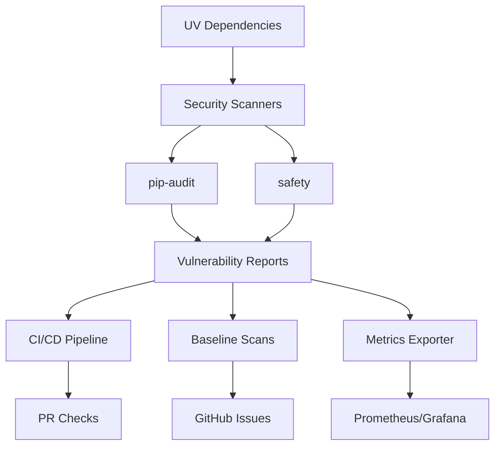

# Dependency Security Audit System

The Sophia AI platform includes a comprehensive dependency security audit system that continuously monitors and reports on vulnerabilities in Python dependencies.

## Overview

The security audit system integrates seamlessly with UV package management to provide:

- **Continuous vulnerability scanning** using pip-audit and safety
- **Automated CI/CD integration** with GitHub Actions
- **Nightly baseline scans** with trend analysis
- **Security metrics** exposed via Prometheus
- **Developer-friendly tools** for local scanning
- **Vulnerability lifecycle management** with allowlisting

## Architecture



## CI/CD Integration

### Pull Request Checks

Every pull request automatically runs security scans:

1. **pip-audit** scan for known vulnerabilities
2. **safety** check for additional security issues
3. Automatic PR comments with scan results
4. Blocks merge if HIGH/CRITICAL vulnerabilities found

### Configuration

The security job in `.github/workflows/uv-ci-cd.yml`:

```yaml
security:
  name: Security Vulnerability Scan
  runs-on: ubuntu-latest
  needs: [lint, test]
  steps:
    # Runs pip-audit and safety
    # Generates JSON and Markdown reports
    # Comments on PRs with results
    # Fails if critical issues found
```

## Nightly Baseline Scans

### Schedule

Automated scans run nightly at 2 AM UTC via `.github/workflows/security-baseline-scan.yml`:

- Comprehensive scan of all dependency groups
- Comparison with previous baseline
- Automatic GitHub issue creation for new vulnerabilities
- Slack/Teams notifications for critical issues

### Baseline Management

```bash
# Baseline comparison flow
Current Scan → Compare with Baseline → Identify New/Resolved → Update Baseline
```

## Local Developer Tools

### Quick Security Audit

Run a quick security audit locally:

```bash
# Basic scan
./scripts/audit-deps.sh

# Save reports
./scripts/audit-deps.sh --save

# Include license checks
./scripts/audit-deps.sh --check-licenses

# JSON output
./scripts/audit-deps.sh --format json
```

### Command Options

- `--severity <level>`: Set threshold (critical, high, medium, low)
- `--format <format>`: Output format (human, json, markdown)
- `--save`: Save reports to `security/reports/`
- `--check-licenses`: Include license compliance checks

## Vulnerability Management

### Allowlist Configuration

Manage known/accepted vulnerabilities in `security/vulnerability-allowlist.yaml`:

```yaml
allowlist:
  - id: "CVE-2023-12345"
    package: "example-package"
    severity: "medium"
    reason: "False positive - not applicable to our usage"
    reviewed_by: "security-team"
    review_date: "2024-01-15"
    review_deadline: "2024-04-15"
```

### Vulnerability Lifecycle

1. **Discovery**: Automated scans detect vulnerability
2. **Triage**: Security team reviews and categorizes
3. **Remediation**: Assign to development team
4. **Tracking**: Monitor progress in allowlist
5. **Resolution**: Update dependencies or accept risk

## Security Metrics

### Prometheus Exporter

The security metrics exporter runs on port 9092:

```bash
# Start metrics exporter
python backend/monitoring/security_metrics_exporter.py

# Access metrics
curl http://localhost:9092/metrics
```

### Available Metrics

- `sophia_vulnerabilities_total`: Total vulnerability count
- `sophia_vulnerabilities_by_severity`: Count by severity level
- `sophia_vulnerabilities_new`: New vulnerabilities in latest scan
- `sophia_vulnerabilities_resolved`: Recently resolved vulnerabilities
- `sophia_vulnerabilities_allowlisted`: Accepted vulnerabilities
- `sophia_security_critical_threshold_exceeded`: Alert indicator

### Grafana Dashboard

Import the security dashboard for visualization:

1. Access Grafana at http://localhost:3000
2. Import dashboard from `config/grafana/dashboards/security-vulnerabilities.json`
3. Configure alerts for critical thresholds

## Dependency Update Workflow

### Using UV for Updates

When vulnerabilities are detected:

```bash
# Update specific package
uv add package-name@latest

# Update all packages
uv update

# Update within constraints
uv update --upgrade-package vulnerable-package
```

### Automated Updates

Configure dependabot or renovate for automated dependency updates:

```yaml
# .github/dependabot.yml
version: 2
updates:
  - package-ecosystem: "pip"
    directory: "/"
    schedule:
      interval: "weekly"
    allow:
      - dependency-type: "all"
```

## Best Practices

### 1. Regular Scanning

- Run `./scripts/audit-deps.sh` before opening PRs
- Review nightly scan reports weekly
- Update dependencies promptly

### 2. Severity Guidelines

- **CRITICAL**: Fix immediately, blocks deployment
- **HIGH**: Fix within 7 days
- **MEDIUM**: Fix within 30 days
- **LOW**: Fix in next release cycle

### 3. Allowlist Management

- Document all allowlist decisions
- Set review deadlines
- Re-evaluate quarterly

### 4. Development Workflow

```bash
# Before starting work
git pull main
uv sync
./scripts/audit-deps.sh

# Before committing
./scripts/audit-deps.sh --save
git add security/reports/

# After fixing vulnerabilities
uv update vulnerable-package
./scripts/audit-deps.sh
```

## Troubleshooting

### Common Issues

**pip-audit fails to run**
```bash
# Ensure UV and dependencies are installed
uv sync --group dev
```

**False positives**
```yaml
# Add to allowlist with justification
- id: "CVE-XXXX-YYYY"
  reason: "Not applicable - we don't use affected functionality"
```

**Scan takes too long**
```bash
# Use cached database
uv run pip-audit --cache-dir ~/.cache/pip-audit
```

## Integration with UV

The security system is fully integrated with UV:

1. **Dependency Resolution**: UV's lock file ensures consistent scans
2. **Group Scanning**: Scan dev, test, and production dependencies separately
3. **Virtual Environment**: Isolated scanning environment
4. **Performance**: UV's fast resolution speeds up security checks

## Continuous Improvement

### Quarterly Reviews

1. Analyze vulnerability trends
2. Review and update allowlist
3. Evaluate new scanning tools
4. Update security policies

### Metrics Analysis

Monitor trends in Grafana:
- Vulnerability discovery rate
- Time to resolution
- Package risk scores
- Dependency update frequency

### Tool Evaluation

Consider additional tools:
- **Bandit**: Python code security linter
- **Trivy**: Container vulnerability scanner
- **Grype**: Software supply chain security

## References

- [pip-audit Documentation](https://pypi.org/project/pip-audit/)
- [Safety Documentation](https://pyup.io/safety/)
- [UV Documentation](https://github.com/astral-sh/uv)
- [OWASP Dependency Check](https://owasp.org/www-project-dependency-check/)
