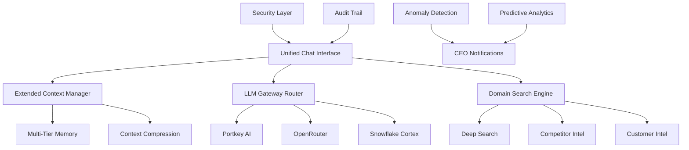

# Unified Chat Architecture Implementation Plan

## Executive Summary

This plan outlines the implementation of comprehensive enhancements to the Sophia AI Unified Chat system, focusing on extended context handling, domain-specific search capabilities, and quality-first LLM gateway architecture. The implementation will transform Sophia AI into a world-class CEO-level AI orchestration platform specialized for the apartment technology and payments industry.

## Implementation Overview

### Phase 1: Foundation Enhancement (Week 1-2)
- Extended context window management (up to 16M tokens)
- Quality-first LLM gateway integration
- Security framework implementation
- Performance optimization baseline

### Phase 2: Domain Intelligence (Week 3-4)
- Apartment industry search engine
- Advanced search capabilities
- Competitive intelligence framework
- Regulatory monitoring system

### Phase 3: Proactive Intelligence (Week 5-6)
- Business anomaly detection
- Market intelligence automation
- Predictive analytics implementation
- CEO notification system

## Detailed Implementation Plan

### Phase 1: Foundation Enhancement

#### 1.1 Extended Context Window Management

**Objective**: Implement multi-tier memory architecture supporting up to 16M tokens for strategic decisions

**Tasks**:

1. **Create Extended Context Manager**
   ```python
   # File: backend/services/extended_context_manager.py
   - Implement multi-tier context storage (session → strategic)
   - Add semantic similarity search across memory tiers
   - Create hierarchical context compression algorithms
   - Implement quality-based retention policies
   ```

2. **Implement High-Performance Memory Architecture**
   ```python
   # File: backend/services/memory/high_performance_memory.py
   - Create vector indices for each memory layer
   - Implement performance targets (<50ms for immediate retrieval)
   - Add optimization strategies (compression, deduplication)
   - Create business entity preservation logic
   ```

3. **Database Schema Updates**
   ```sql
   -- File: backend/snowflake_setup/extended_context_schema.sql
   - Create EXTENDED_CONTEXT_MEMORY table
   - Add vector embeddings columns (VECTOR(FLOAT, 1536))
   - Create performance indices
   - Implement partitioning for time-based data
   ```

#### 1.2 Quality-First LLM Gateway Architecture

**Objective**: Implement intelligent routing prioritizing quality over cost

**Tasks**:

1. **Portkey AI Integration**
   ```python
   # File: backend/services/llm_gateway/portkey_integration.py
   - Configure Portkey client with quality-first routing
   - Implement intelligent caching (0.88 similarity threshold)
   - Add response quality validation
   - Create fallback handling mechanisms
   ```

2. **OpenRouter Integration**
   ```python
   # File: backend/services/llm_gateway/openrouter_integration.py
   - Connect to 200+ model catalog
   - Implement model selection based on task type
   - Add apartment industry fine-tuned model support
   - Create quality benchmarking tools
   ```

3. **Snowflake Cortex Enhancement**
   ```python
   # File: backend/services/llm_gateway/snowflake_cortex_enhanced.py
   - Implement CORTEX_COMPLETE for business analysis
   - Add CORTEX_SEARCH for vector operations
   - Create data-local processing pipelines
   - Implement cost tracking (dashboard only)
   ```

#### 1.3 Security and Audit Framework

**Objective**: Implement enterprise-grade security for C-level usage

**Tasks**:

1. **Role-Based Access Control**
   ```python
   # File: backend/security/rbac_implementation.py
   - Create user roles (CEO, Executive, Manager, Employee)
   - Implement permission matrices
   - Add data access controls
   - Create audit trail logging
   ```

2. **Encryption and Privacy**
   ```python
   # File: backend/security/encryption_service.py
   - Implement end-to-end encryption for sensitive data
   - Add field-level encryption for PII
   - Create secure key management
   - Implement data retention policies
   ```

### Phase 2: Domain Intelligence Implementation

#### 2.1 Apartment Technology Search Engine

**Objective**: Build specialized search engine for apartment industry intelligence

**Tasks**:

1. **Domain Knowledge Base**
   ```python
   # File: backend/services/search/apartment_domain_engine.py
   - Create apartment technology taxonomy
   - Implement Pay Ready competitive positioning
   - Add property management system integrations
   - Create payment processing knowledge base
   ```

2. **Multi-Source Search Integration**
   ```python
   # File: backend/services/search/multi_source_aggregator.py
   - Connect to industry databases (NMHC, NAA)
   - Implement PropTech database connectors
   - Add patent search capabilities
   - Create regulatory source monitoring
   ```

#### 2.2 Advanced Search Capabilities

**Objective**: Implement specialized search types for competitive intelligence

**Tasks**:

1. **Deep Search Implementation**
   ```python
   # File: backend/services/search/deep_search_engine.py
   - Academic database connectors
   - Patent search integration
   - Industry report aggregation
   - Government database access
   ```

2. **Competitor Intelligence**
   ```python
   # File: backend/services/search/competitor_intelligence.py
   - Company analysis tools
   - Pricing intelligence scrapers
   - Technology monitoring
   - Customer acquisition tracking
   ```

3. **Customer Intelligence**
   ```python
   # File: backend/services/search/customer_intelligence.py
   - Sentiment analysis implementation
   - Behavior pattern analysis
   - Satisfaction monitoring
   - Churn risk prediction
   ```

### Phase 3: Proactive Intelligence

#### 3.1 Business Anomaly Detection

**Objective**: Implement automated detection and CEO notifications

**Tasks**:

1. **Anomaly Detection Engine**
   ```python
   # File: backend/services/intelligence/anomaly_detection.py
   - Revenue anomaly detection
   - Pipeline health monitoring
   - Customer churn alerts
   - Market opportunity identification
   ```

2. **CEO Notification System**
   ```python
   # File: backend/services/notifications/ceo_alerts.py
   - Priority-based alerting
   - Natural language summaries
   - Actionable recommendations
   - Mobile push notifications
   ```

#### 3.2 Predictive Analytics

**Objective**: Implement forward-looking business intelligence

**Tasks**:

1. **Predictive Models**
   ```python
   # File: backend/services/analytics/predictive_models.py
   - Customer behavior prediction
   - Market trend forecasting
   - Revenue projection models
   - Risk assessment algorithms
   ```

## Technical Architecture

### System Components



### Performance Targets

| Component | Target | Measurement |
|-----------|--------|-------------|
| Immediate Context | <50ms | 32K tokens |
| Strategic Context | <1000ms | 4M tokens |
| Ultra-long Context | <5000ms | 16M tokens |
| LLM Response | <3s | 90% accuracy |
| Search Results | <2s | 75% relevance |

### Quality Metrics

| Metric | Target | Priority |
|--------|--------|----------|
| Response Accuracy | >90% | Critical |
| Context Preservation | >85% | High |
| Search Relevance | >75% | High |
| Anomaly Detection | >80% | Medium |
| User Satisfaction | >85% | Critical |

## Implementation Timeline

### Week 1-2: Foundation
- [ ] Extended context manager implementation
- [ ] LLM gateway integration (Portkey, OpenRouter, Cortex)
- [ ] Security framework deployment
- [ ] Performance baseline establishment

### Week 3-4: Domain Intelligence
- [ ] Apartment search engine development
- [ ] Advanced search capabilities
- [ ] Competitive intelligence tools
- [ ] Regulatory monitoring setup

### Week 5-6: Proactive Intelligence
- [ ] Anomaly detection engine
- [ ] CEO notification system
- [ ] Predictive analytics models
- [ ] Integration testing

## Resource Requirements

### Technical Resources
- 3 Senior Backend Engineers
- 1 ML Engineer
- 1 Security Engineer
- 1 DevOps Engineer

### Infrastructure
- Snowflake compute (LARGE warehouse)
- GPU resources for embeddings
- Redis cluster for caching
- Monitoring infrastructure

### External Services
- Portkey AI subscription
- OpenRouter API access
- Industry database subscriptions
- Patent search access

## Risk Mitigation

### Technical Risks
1. **Context window performance**: Implement progressive loading
2. **LLM costs**: Dashboard monitoring with alerts
3. **Search accuracy**: Multi-source validation
4. **Security vulnerabilities**: Regular audits

### Business Risks
1. **User adoption**: Phased rollout with training
2. **Data privacy**: Compliance framework
3. **Integration complexity**: Modular architecture
4. **Cost overruns**: Budget monitoring

## Success Criteria

### Technical Success
- [ ] 16M token context handling operational
- [ ] <50ms immediate retrieval performance
- [ ] 90%+ response accuracy
- [ ] 99.9% uptime

### Business Success
- [ ] 80%+ CEO daily usage
- [ ] 25-40% quality improvement
- [ ] 60-80% cost savings via Cortex
- [ ] Measurable decision speed improvement

## Next Steps

1. **Immediate Actions**:
   - Set up development environment
   - Create database schemas
   - Configure LLM gateways
   - Begin context manager implementation

2. **Week 1 Deliverables**:
   - Extended context manager prototype
   - LLM gateway integration
   - Security framework design
   - Performance testing framework

3. **Stakeholder Communication**:
   - Weekly progress updates
   - Demo sessions
   - Performance dashboards
   - Risk assessments

---

*This implementation plan provides a structured approach to transforming Sophia AI into a world-class executive AI assistant with specialized capabilities for the apartment technology and payments industry.*
